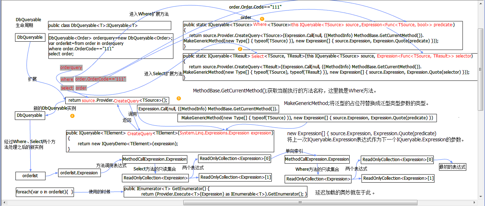

# [NET深入解析LINQ框架（五：IQueryable、IQueryProvider接口详解)](https://www.cnblogs.com/jasonwb/articles/3505195.html)

## 1】. 环路执行对象模型、碎片化执行模型(假递归式调用)

这个主题扯的可能有点远，但是它关系着整个LINQ框架的设计结构，至少在我还没有搞懂LINQ的本意之前，在我脑海里一直频频出现这样的模型，这些模型帮助我理解LINQ的设计原理。其实在最早接触环路模型和碎片化模型是在前两个月，那个时候有幸接触企业应用架构方面的知识，里面就有很多业务碎片化的设计技巧。其实理解这些所谓的设计模型后将大大开阔我们的眼界，毕竟研究框架是要研究它的设计原理，它的存在必然是为了解决某一类问题，问题驱动它的设计模型。所以我们在研究这样的模型的时候其实已经在不知不觉的理解问题的本质。

> 到底环路执行模型是什么？它与碎片化之间是什么关系？假递归式调用又是什么奥秘？这些种种问题我们必须都要把它解决了才能畅通无阻的去研究下面的东西。其实环路执行、碎片化、假递归式都是问题的不同角度的称呼，就好比我们经常会用依赖倒置、控制反转、依赖注入这些词汇去形容设计原则、设计方法一样，他们都是为了解决某种问题而存在，通过巧妙的设计来达到很完美的效果。这里其实也是如此，我们来一一的分解说明。

想必没有人不了解递归的原理，对递归的使用也是很常见的，通过递归算法我们可以解决一下无法解决的大问题，通过将大问题分解成多个同样数据结构的小问题然后让计算机重复的去计算就行了。最为常见的就是遍历树形结构的对象，如：XML，它的每个节点都是一样的对象，所以递归调用的方法也是同一个方法，只不过不断的调用将产生多个调用栈，最后在按照调用顺序的反向出栈就得出一个完整的数据结构。

那么在LINQ中来说，我们无法通过一个方法多次调用来产生我们想要的表达式树，一个Where查询表达式扩展方法可能不仅仅是被LINQ查询表达式所使用，还有可能被ORM的入口方法所使用，比如Update更新的时候就需要Where给出更新的条件，Delete也同样如此。(当然我们这里讨论是LINQ背后的设计原理不单单针对LINQ的技术，而是某一类问题的通用设计模式。)那么我们如何构造出一个类似递归但不是递归的算法结构，方法1可能被方法2调用，方法2也可能被方法1所调用，这样的方法很多，N个方法分别表达不同的语义，具体的构造看使用者的需求，所以这里就出现碎片化的概念了，只有碎片化后才能最大程度的重组，既然能重组了就形成了环路的执行模型。非常完美，看似简单却深不见底的模型我们只了解到冰山一角而已，在企业架构、领域驱动设计方向都已经有着很多成功的案例，要不然也不会被称为设计模式了更为强大的称呼是企业应用架构模式才对。用文字的方式讲解计算机程序问题似乎有点吃力，用代码+图形分析的方式来讲解最适合我们程序员的思维习惯了。下面我用一个简单的例子再附上一些简单的图示来跟大家分享一下这几个模式语言的关系。

大家肯定都知道每逢过年过节都会有很多礼品摆放在超市里商场里买，但是我们都知道一个潜规则，就是这些商品的包装花费了很多功夫，一层套一层，其实里面的东西可能很不起眼，这也是一种营销手段吧。我们暂且不管这里面是什么东西，我们现在要设计一个能够任意进行N层次包装的模型出来，一件商品左一层右一层的反复包装，包装几次我们不管，我们提供能进行N层包装的方法出来就行了。

[](javascript:void(0);)


[](javascript:void(0);)

```
/// <summary> 
   /// 商品抽象类 
   /// </summary> 
   public abstract class Merchandise 
   { 
       /// <summary> 
       /// 商品名 
       /// </summary> 
       public string MerchandiseName { get; protected set; } 
       /// <summary> 
       /// 单价 
       /// </summary> 
       public int UnitPrice { get; protected set; } 
       /// <summary> 
       /// 数量 
       /// </summary> 
       public int Number { get; protected set; } 

   } 
   /// <summary> 
   /// 苹果 
   /// </summary> 
   public class Apple : Merchandise 
   { 
       public Apple() { } 
       private void Init() 
       { 
           base.MerchandiseName = "进口泰国苹果"; 
           base.UnitPrice = 8;//8块钱一个 
           base.Number = 3;//3个一篮装 
       } 
   } 
   /// <summary> 
   /// 香蕉 
   /// </summary> 
   public class Banana : Merchandise 
   { 
       public Banana() { } 
       private void Init() 
       { 
           base.MerchandiseName = "云南绿色香蕉"; 
           base.UnitPrice = 3;//3块钱一根 
           base.Number = 10;//10根一篮装 
       } 
   } 

   /// <summary> 
   /// 商品包装类 
   /// </summary> 
   public static class MerchandisePack 
   { 
       /// <summary> 
       /// 贴一个商标 
       /// </summary> 
       public static Merchandise PackLogo(this Merchandise mer) 
       { 
           return mer; 
       } 
       /// <summary> 
       /// 包装一个红色的盒子 
       /// </summary> 
       public static Merchandise PackRedBox(this Merchandise mer) 
       { 
           return mer; 
       } 
       /// <summary> 
       /// 包装一个蓝色的盒子 
       /// </summary> 
       public static Merchandise PackBlueBox(this Merchandise mer) 
       { 
           return mer; 
       }
```

[](javascript:void(0);)

[](javascript:void(0);)

这么简单的代码我就不一一解释了，这里只是为了演示而用没有添加没用的代码，免得耽误大家时间。

我们看关键部分的代码:


```
Apple apple = new Apple(); 
           apple.PackLogo().PackBlueBox().PackRedBox().PackLogo(); 

           Banana banana = new Banana(); 
           banana.PackRedBox().PackBlueBox().PackLogo();
```

这段代码我想完全可以说服我们，碎片化后体现出来的扩展性是多么的灵活。apple在一开始的时候都是需要在上面贴一个小logo的，我们吃苹果的都知道的。由于现在是特殊节日，我们为了给接收礼品的人一点小小的Surprise，所以商家要求商品都统一的套了几层包装，有了这个模型确实方便了很多。

完全实现了独立扩展的能力，不会将包装的方法牵扯到领域对象中去，很干净明了。


[(注：查看大图)](http://pic002.cnblogs.com/images/2012/202205/2012121410015649.gif)

通过这种架构模式进行系统开发后，我们一目了然的就知道系统的每一个逻辑的过程，更像一种工作流的执行方式，先是什么然后是什么。不像在IF  ELSE里面充斥乱七八糟的逻辑，很难维护。不愧为企业应用架构模式的一种啊。当然LINQ中只有Linq to  Object才会出现重复的使用一到两个方法来完成功能，像Linq to Entity  几乎不会出现这种情况。一般针对查询的化只是关键字存在于不同的查询上下文中，这里是为了讲解它的背后设计原理。

## 2】.N层对象执行模型(纵横向对比链式扩展方法)

其实本来不打算加这一小节的，但是考虑到肯定有部分朋友不是很理解多个对象如何协调的去解决某类问题的。IQueryable<T>接口貌似是一个对象，但是它们都属于一个完整的IQueryable<T>中的一员。N层对象体现在哪里？从一开始的IQueryable被扩展方法所处理就已经开始第一层的对象处理，重复性的环路假递归似的调用就形成N层对象模型。在LINQ中的查询表达式与查询方法其实是一一对应的，扩展方法是纵向的概念，而LINQ查询表达式是横向的，其实两者属于对应关系。详情可以参见本人的“[NET深入解析LINQ框架（四：IQueryable、IQueryProvider接口详解)](http://www.cnblogs.com/wangiqngpei557/archive/2012/12/11/2813490.html)”一文；

## 3】.LINQ查询表达式和链式查询方法其实都是空壳子

LINQ的真正意图是在方便我们构建表达式树(ExpressionTree)，手动构建过表达式树的朋友都会觉得很麻烦(对动态表达式有兴趣的可以参见本人的“[.NET深入解析LINQ框架（三：LINQ优雅的前奏）](http://www.cnblogs.com/wangiqngpei557/archive/2012/12/04/2801181.html)”一文)，所以我们可以通过直接编写Lambda的方式调用扩展方法，由于LambdaExpression也是来自于Expression，而Expression<T>又是来自LambdaExpression，别被这些搞晕，Expression<T>其实是简化我们使用表达式的方式。对于Expression<T>的编译方式是编辑器帮我们生成好的，在运行时我们只管获取ExpressionTree就行了。LINQ的查询表达式是通过扩展方法横向支撑的，你不用LINQ也一样可以直接使用各个扩展方法，但是那样会很麻烦，开发速度会很慢，最大的问题不在于此，而是没有统一的查询方式来查询所有的数据源。LINQ的本意和初衷是提供统一的方式来供我们查询所有的数据源，这点很重要。

## 4】详细的对象结构图(对象的执行原理)

这篇文章的重点就在这一节了，上面说了那么多的话如果朋友能懂还好不懂的话还真是头疼。这一节我将给出LINQ的核心的执行图，我们将很清楚的看见LINQ的最终表达式树的对象结构，它是如何构建一棵完整的树形结构的，IQueryable接口是怎么和IQueryProvider接口配合的，为什么IQueryable具备延迟加载的能力。文章的最后将给出一个完整的Linq  to Provider的小例子，喜欢扩展LINQ的朋友肯定会喜欢的。



[(注：查看大图)](http://pic002.cnblogs.com/images/2012/202205/2012121410053376.gif)

上图看上去可能会很乱，但是静下心来看还是能理解的，按照DbQueryable生命周期来看，之上而下，如果有问题可以回复评论进一步探讨。

## 5】.IQueryable<T>与IQueryProvider一对一的关系能否改成一对多的关系

IQueryable对象都有一个配套的IQueryProvider对象，在频繁的创建IQueryable的时候都会重新创建IQueryProvider对象，毕竟是一种浪费。我们可以适当的修改实现IQueryable类的内部结构，让每次创建IQueryable之后能重用上一次的IQueryProvider的对象，毕竟IQueryProvider对象没有任何的中间状态的数据，只是CreateQuery、  Execute两个方法。这里只是本人的一点小小的改进想法，不一定需要考虑这些。

# 6】.完整的自定义查询

LINQ的分析接近尾声了，这篇文章将是深入分析LINQ的最后一篇。既然已经结束了LINQ的全部分析，那么我们动手写一个小例子，作为想扩展LINQ的小雏形。该例子不会涉及到对表达式树的分析，毕竟表达式树的分析并非易事，后面会有专本的文章来剖析表达式树的完整结构，这里只是全盘的IQueryable和IQueryProvider的实现。

ORM一直是我们比较喜欢去写的框架，这里就使用自定义的IQueryable来查询相应的对象实体。首先我们需要继承IQueryable<T>接口来让LINQ能查询我们自己的数据上下文。

[](javascript:void(0);)


[](javascript:void(0);)

```
public class DbQuery<T> : IQueryable<T>, IDisposable 
    { 
        public DbQuery() 
        { 
            Provider = new DbQueryProvider(); 
            Expression = Expression.Constant(this);//最后一个表达式将是第一IQueryable对象的引用。 
        } 
        public DbQuery(Expression expression) 
        { 
            Provider = new DbQueryProvider(); 
            Expression = expression; 
        } 

        public Type ElementType 
        { 
            get { return typeof(T); } 
            private set { ElementType = value; } 
        } 

        public System.Linq.Expressions.Expression Expression 
        { 
            get; 
            private set; 
        } 

        public IQueryProvider Provider 
        { 
            get; 
            private set; 
        } 

        public IEnumerator<T> GetEnumerator() 
        { 
            return (Provider.Execute<T>(Expression) as IEnumerable<T>).GetEnumerator(); 
        } 

        System.Collections.IEnumerator System.Collections.IEnumerable.GetEnumerator() 
        { 
            return (Provider.Execute(Expression) as IEnumerable).GetEnumerator(); 
        } 

        public void Dispose() 
        { 

        } 
    }
```

[](javascript:void(0);)

[](javascript:void(0);)

下面需要实现提供程序:

[](javascript:void(0);)


[](javascript:void(0);)

```
 public class DbQueryProvider : IQueryProvider
    {
        public IQueryable<TElement> CreateQuery<TElement>(System.Linq.Expressions.Expression expression)
        {
            return new DbQuery<TElement>();
        }

        public IQueryable CreateQuery(System.Linq.Expressions.Expression expression)
        {
            //这里牵扯到对表达式树的分析，就不多说了。
            throw new NotImplementedException();
        }

        public TResult Execute<TResult>(System.Linq.Expressions.Expression expression)
        {
            return default(TResult);//强类型数据集
        }

        public object Execute(System.Linq.Expressions.Expression expression)
        {
            return new List<object>();//弱类型数据集
        }
    }
```

[](javascript:void(0);)

[](javascript:void(0);)

我们看看如何使用；

[](javascript:void(0);)


[](javascript:void(0);)

```
using (DbQuery<Order> dbquery = new DbQuery<Order>()) 
           { 
               var OrderList = from order in dbquery where order.OrderName == "111" select order; 
               OrderList.Provider.Execute<List<Order>>(OrderList.Expression);//立即执行 
               foreach (var o in OrderList) 
               { 
                   //延迟执行 
               } 
           }
```

[](javascript:void(0);)

[](javascript:void(0);)

喜欢编写ORM框架的朋友完全值得花点时间搞一套自己的LINQ TO ORM，这里只是让你高兴一下