# 如何在 Entity Framework Core 使用 Migration ? (PostgreSQL)

透過 [PostgreSQL](https://www.colabug.com/tag/postgresql/) 官方提供的 Npgsql EF Core Provider，[Entity Framework](https://www.colabug.com/tag/entity-framework/) Core 也能簡單地存取 PostgreSQL。

本文將使用 Code First 方式對 PostgreSQL 建立 database schema，並解釋 Migration 背後運作原理。

## Version

macOS High Sierra 10.13.4

Docker for Mac 18.03-ce-mac65 (24312)

.NET Core 2.1

Entity Framework 2.1

PostgreSQL 10.3

Npgsql EF Core Provider 2.1

VS Code 1.24.0

DataGrip 2018.1.4

## Code First

#### Code First

 會先在 code 建立 `DbContext` 與 `Entity` ，然後透過 Migration 在 database 建立 schema 


傳統都會使用視覺化工具建立 database schema，這種方式雖然直覺，但有以下缺點：

- Schema 建立步驟無法透過 Git 版控
- 無法很簡單的同步 development / lab / stage / production 各 server 環境的 database schema

EF Core 提供以下解決方案：

```
dotnet ef database update
```

## 建立 Console App

```
$ dotnet new console -o EFCoreMigration
```


 使用 `dotnet new` 建立 .NET Core App。 

-  **new** ：建立 project 
-  **console** ：建立 console 類型 project 
-  **-o** ：以 `EFCorePostgres` 為專案名稱並建立目錄 

 [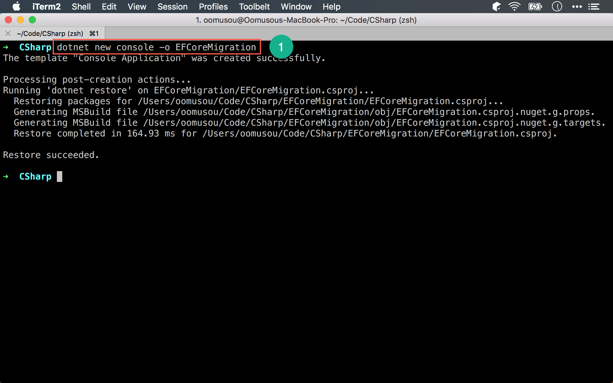](https://img.colabug.com/2018/06/f5575c710969f825de1bd442f49aba7b.png) 

## 以 VS Code 開啟

```
$ cd EFCoreMigration
~/EFCorrMigration $ code .
```


進入專案目錄，呼叫 VS Code 開啟。

 [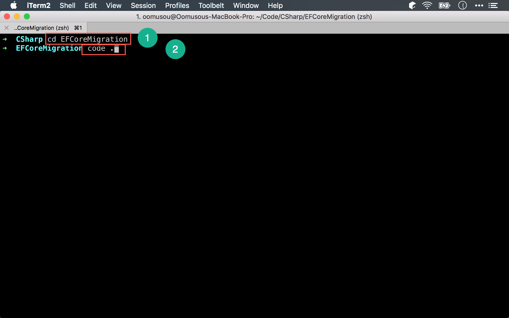](https://img.colabug.com/2018/06/4ea8eb7360ec184d040b3e1be91f1624.png) 

 [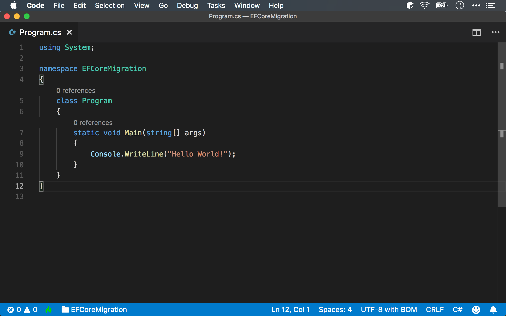](https://img.colabug.com/2018/06/193746ba24e80e9bbec68f8d7efebdfa.png) 

## 安裝 EF Core Package

```
~/EFCoreMigration $ dotnet add package Microsoft.EntityFrameworkCore.Design
```


 將來會在 CLI 執行 migration，而 `dotnet ef` 必須透過 `Microsoft.EntityFrameworkCore.Design` 才能存取 Entity 與 DbContext，所以必須另外安裝 package。 

 [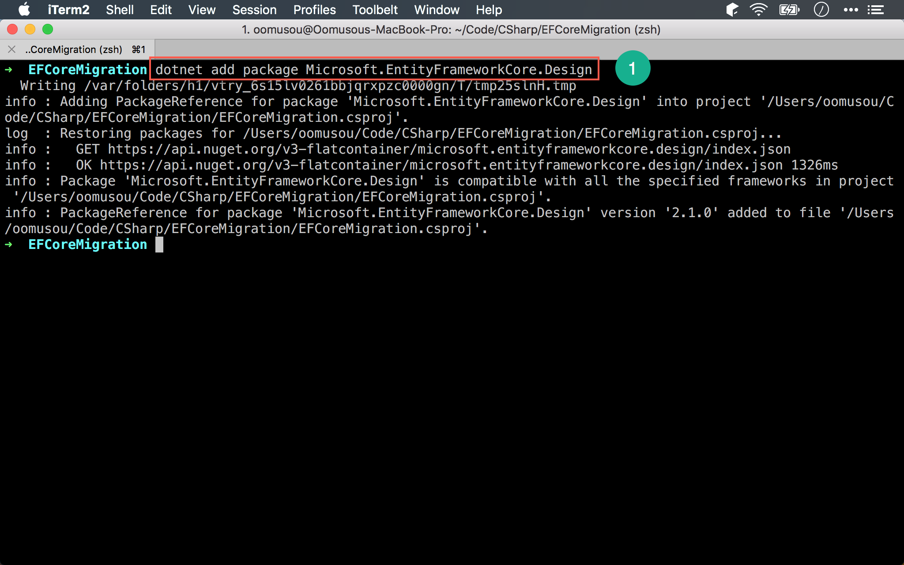](https://img.colabug.com/2018/06/ff786fe2e27c9159df804789cb03bb9a.png) 

1.  輸入 `dotnet add package Microsoft.EntityFrameworkCore.Design` 安裝 package 

 [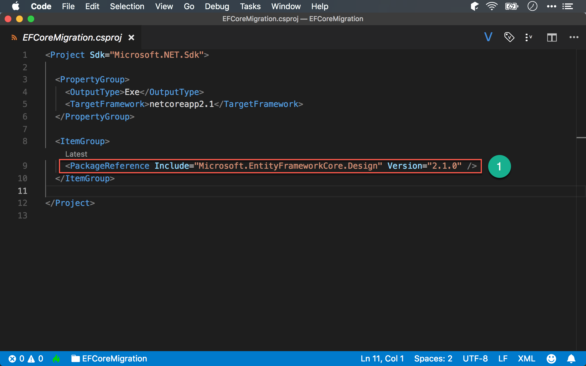](https://img.colabug.com/2018/06/85fc8088eabe615c7754157a4bc1aa0f.png) 

1.  安裝完 package 會在 `.csproj` 會增加新的 `` 

## 安裝 PostgreSQL Database Provider

```
~/EFCoreMigration $ dotnet add package Npgsql.EntityFrameworkCore.PostgreSQL
```


EF Core 預設提供了 MSSQL、SQLite 與 InMemory 3 個 Database Provider，其餘的 provider 則由原廠 vendor 提供。

其中 Npgsql 為 PostgreSQL 所提供的 EFCore Database Provider。

 [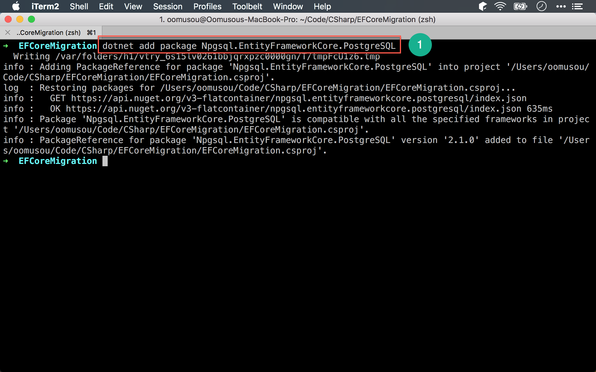](https://img.colabug.com/2018/06/01af35324a22943e404368ad70a3943f.png) 

1.  使用 `dotnet add package` 安裝 `Npgsql.EntityFrameworkCore.PostgreSQL` package。 

 [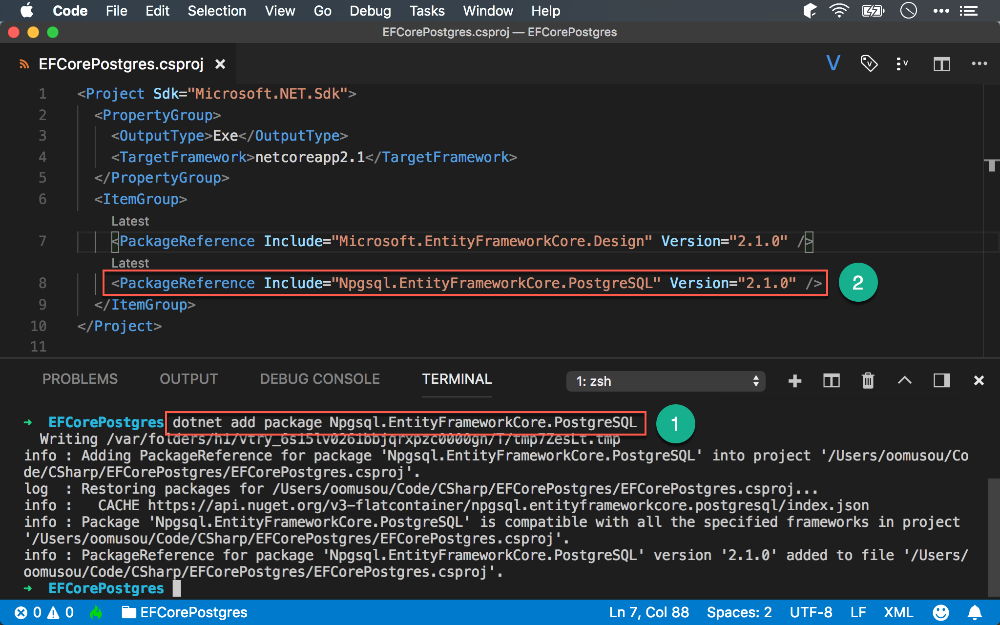](https://img.colabug.com/2018/06/1a501d84e0ac030d1916a2bd5be006ba.png) 

1.  安裝完 package 會在 `.csproj` 會增加新的 `` 

 目前在 `.csproj` 一共會看到 `Microsoft.EntityFrameworkCore.Design` 與 `Npgsql.EntityFrameworkCore.PostgreSQL` 兩個 package 

## EF Core

在 EF Core，database 在 ORM 中都有相對應的物件：

-  **Database** ：EF Core 的 `DbContext` 
-  **Table** ：EF Core 的 `Entity` 
-  **Column** ：EF Core 的 `Property` 

我們即將在 PostgreSQL 建立 :

-  **Database** : `eflab` 

-  **Table** ： `Customers` 

- Column

   ： 

  ```
  CustomerID
  Name
  ```

## Code First

 建立 DbContext 

 `DbContext` 在 EF Core 中代表 database，我們將繼承 `DbContext` 建立自己的 database context。 

 其中 `EFLabDbContext` DbContext 代表 `eflab` database。 

#### EFLabDbContext.cs

```
using Microsoft.EntityFrameworkCore;

namespace EFCoreMigration
{
    public class EFLabDbContext: DbContext
    {
        public DbSet Customers { get; set; }
        private const string DbConnectionString = "Host=localhost;Port=5432;Database=eflab;Username=admin;Password=12345";

        protected override void OnConfiguring(DbContextOptionsBuilder optionsBuilder)
        {
            optionsBuilder.UseNpgsql(DbConnectionString);
        }
    }
}
```


第 5 行

```
public class EFLabDbContext: DbContext
```


 建立自己的 `EFLabDbContext` ，繼承自 `DbContext` 。 

第 7 行

```
public DbSet Customers { get; set; }
```


 使用 property 宣告 table，其型別為 `DbSet` ，這表示其在 EF Core 為 `Customer` entity，而在 database 為 `Customers` table。 

 Entity 名稱為 `單數` ，而 table 名稱為 `複數` 

第 8 行

```
private const string DbConnectionString = "Host=localhost;Port=5432;Database=eflab;Username=admin;Password=12345";
```


連接 database server 需要基本的資訊，統稱為 database connection string，包含以下資料：

-  **Host** : 設定 PostgreSQL server 的名稱 
-  **Port** : 設定 PostgreSQL 對外的 port 
-  **Database** : 設定要連接的 database 
-  **Username** : 設定 user name 
-  **Password** : 設定 password 

 這些資訊在建立 PostgreSQL 的 `docker-compose.yml` 時，都已經在 `.env` 建立 

第 10 行

```
protected override void OnConfiguring(DbContextOptionsBuilder optionsBuilder)
{
    optionsBuilder.UseNpgsql(DbConnectionString);
}
```


 Override `OnConfiguring()` 設定 database。 

 EF Core 會傳入 `DbContextOptionBuider` ，因為我們要連接的是 PostgreSQL，其 database provider 為 `Npgsql` ， 所以將 connection string 傳入 `OptionBuilder.UseNpgsql()` 。 

 [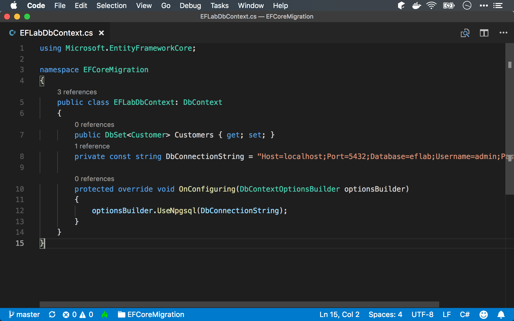](https://img.colabug.com/2018/06/9f01cbcf0f2fe79828631a9dea9fdc91.png) 

#### 建立 Entity

 `Entity` 在 EF Core 中代表 table，我們將建立自己的 Entity。 

 其中 `Customer` entity 代表 `Customers` table。 

 Entity 名稱為 `單數` ，而 table 名稱為 `複數` 

#### Customer.cs

```
namespace EFCoreMigration
{
    public class Customer
    {
        public int CustomerID { get; set; }
        public string Name { get; set; }
    }
}
```


第 3 行 

```
public class Customer
```


 Entity 為 `單數` ，所以使用單數的 `Customer` 。 

第 5 行

```
public int CustomerID { get; set; }
public string Name { get; set; }
```


Column 以 property 呈現。

第 5 行

```
public int CustomerID { get; set; }
```


 Table 的 PK，EF Core 規定要以 `table name` + `ID` 表示，則 migration 時會自動將該欄位建立成 PK，不需要額外 attribute。 

 [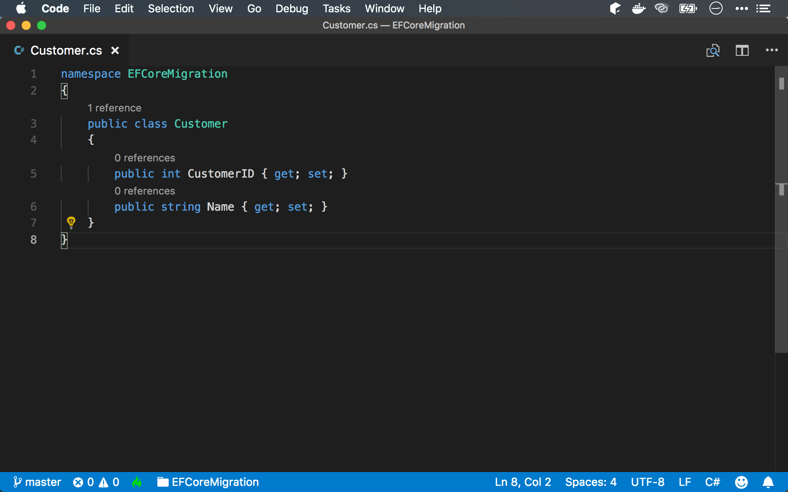](https://img.colabug.com/2018/06/67196238634db5d5ddf66f91b5c0f7e5.png) 

## Migration

Migration 分兩個階段：

- 建立 Migration
- 執行 Migration

#### 建立 Migration

```
~/EFCoreMigration $ dotnet ef migrations add Migration00
```


 輸入 `dotnet ef migrations add` 建立 Migration，其中 `Migration00` 為 Migration 名稱，請自行建立不重複的名稱。 

 [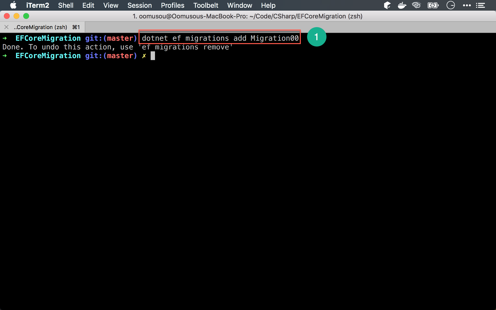](https://img.colabug.com/2018/06/ccbe5e280a13b149f98a4a7d5d4ec9e3.png) 

 [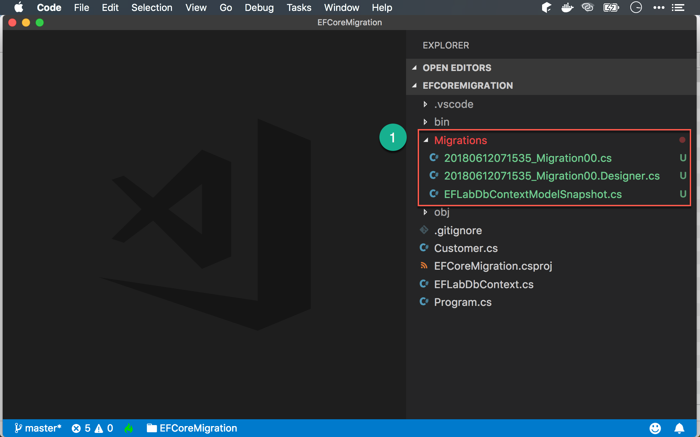](https://img.colabug.com/2018/06/5af1bcfe70c239a4e264c48d1197066e.png) 

1.  執行完 `dotnet ef migrations add Migration00` ，會發現新增了 `Migrations` 目錄，並增加了 `3` 個檔案 

Q : 為什麼需要這 3 個 Migration 檔案 ?

 A : 稍後在 `Migration 工作原理` 會一併並解釋。 

#### 執行 Migration

```
~/EFCoreMigration $ dotnet ef database update
```


 輸入 `dotnet ef database update` 執行 Migration。 

 EF Core 將根據剛剛在 `Migrations` 所建立的 3 個檔案，與 `DbContext.OnConfiguration()` 的設定，對 PostgreSQL 進行 Migration 

 [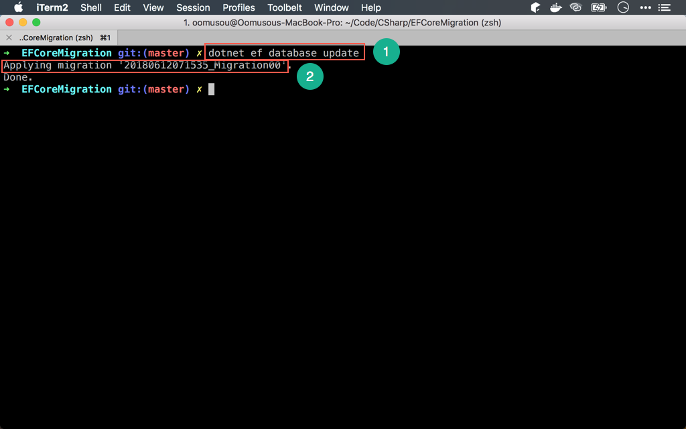](https://img.colabug.com/2018/06/7db07702c3d73949276f80c7a2bb396d.png) 

1.  執行了 `Migration00` 

 確認 Database Schema 

  [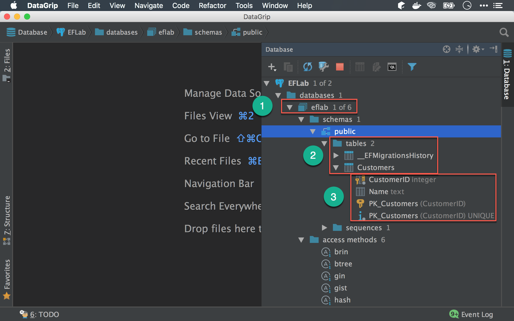](https://img.colabug.com/2018/06/95d142147619fb2e213a11d0f98066bc.png)  

1.  展開 `eflab` database 
2.  EF Core 的 Migration 在 `eflab` 建立了 `__EFMigrationHistory` 與 `Customers` 兩個 table 
3.  `Customers` 則建立 `CustomerID` 與 `Name` 兩個 column，並有 `PK_Customers` 

若 Migration 沒有建立成功，請確認 Docker 與 PostgreSQL container 已經正常執行

 Q : 為什麼會多了 `__EFMigrationHistory` table 呢 ? 

 A : 稍後在 `Migration 工作原理` 會一併並解釋。 

## Code First Again

#### 新增 Field

若只是單純將 Entity 建立成 table，還顯不出 Migration 的威力。

實務上因為需求的變動，我們會想在 table 新增 column，我們只要繼續在 Entity 新增 property 即可。

#### Customer.cs

```
namespace EFCoreMigration
{
    public class Customer
    {
        public int CustomerID { get; set; }
        public string Name { get; set; }
        public int Age { get; set; }
    }
}
```


第 7 行

```
public int Age { get; set; }
```


 新增 `Age` property。 

 [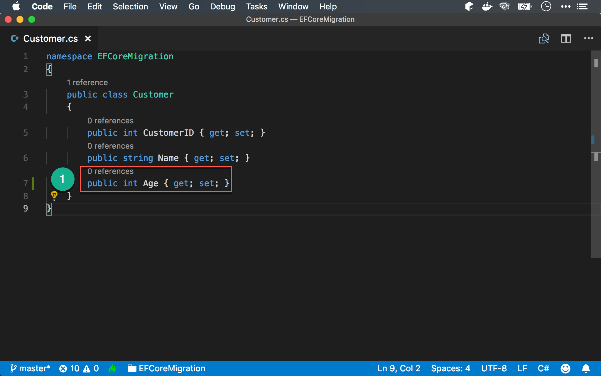](https://img.colabug.com/2018/06/612779dceec98801f998c4e3f40a2ca3.png) 

## Migration Again

#### 建立 Migration

```
~/EFCoreMigration $ dotnet ef migrations add Migration01
```


 輸入 `dotnet ef migrations add` 建立 Migration，其中 `Migration01` 為 Migration 名稱，有別於剛剛建立的 `Migration00` 。 

 [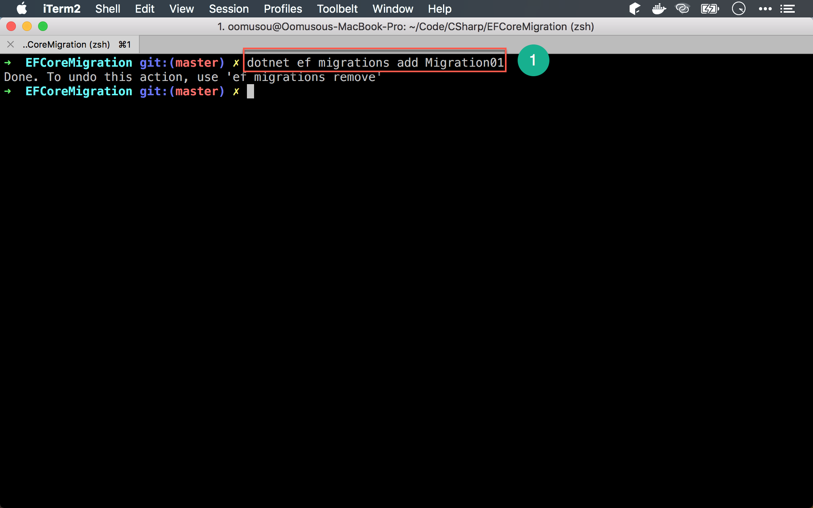](https://img.colabug.com/2018/06/9e9c5b05374d6894f7debcf1bedad407.png) 

 [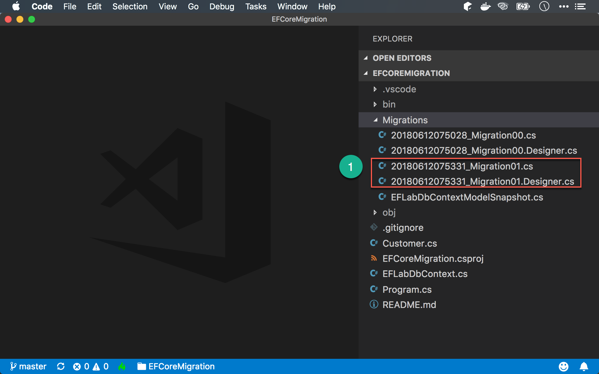](https://img.colabug.com/2018/06/cb5bcbcb2fe7d9a57f15151937b9f542.png) 

1. 新增兩個 Migration 檔案

Q : 為什麼第二次 Migration 只有兩個檔案 ?

 A : 稍後在 `Migration 工作原理` 會一併並解釋。 

#### 執行 Migration

```
~/EFCoreMigration $ dotnet ef database update
```


 輸入 `dotnet ef database update` 執行 Migration。 

 [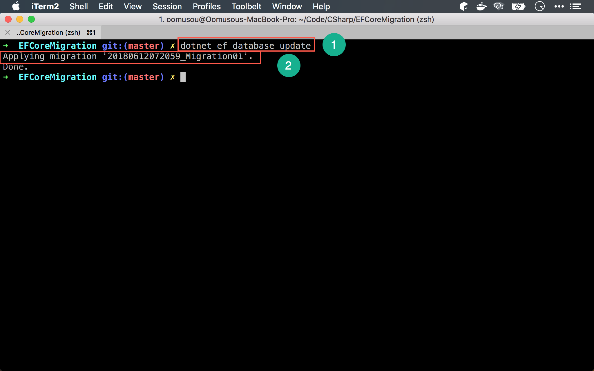](https://img.colabug.com/2018/06/72714ef220aa2cffe58f8e715c9c08fd.png) 

1.  只執行了 `Migration01` ，並沒有執行 `Migration00` 

Q : 為什麼 EF Core 知道只執行新的 Migration，而不是全部 Migration 重跑一次 ?

 A : 稍後在 `Migration 工作原理` 會一併並解釋。 

#### 再次確認 Database Schema

 [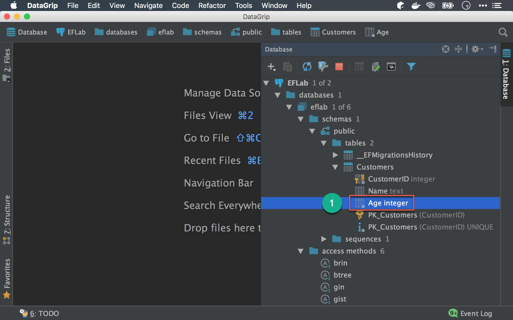](https://img.colabug.com/2018/06/05df1709a53e2f0778b8d428a9ac961a.png) 

1.  `Customers` 只新增了 `Age` column 

## Migration 工作原理

目前 Migration 已經正常執行，Table 與 Column 也都如預期建立在 PostgreSQL，但我們累積了很多疑問：

```
__EFMigrationHistory
```

這些都是 Migration 的黑魔法，我們必須從 EF Core 的 Migration 工作原理談起。

#### 建立 Migration

```
$ dotnet ef migrations add
```


 [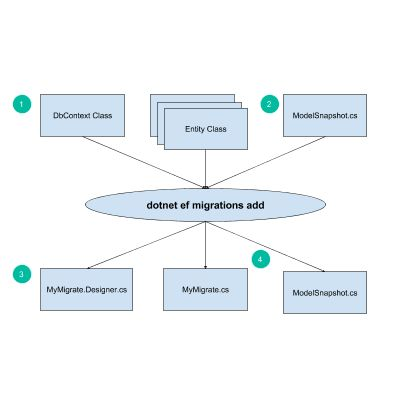](https://img.colabug.com/2018/06/86bc5e66cd49fa659f44d76cced726de.jpg) 

1.  根據 `DbContext` 與 `Entity` 蒐集要建立 Migration 的資訊 
2.  比對 `ModelSnapshot.cs` 與 `DbContext` 與 `Entity` 的差異，決定 Migration 檔案要如何建立 
3.  `MyMigrate.Designer.cs` 與 `MyMigrate.cs` 就是實際的 Migration 檔案 
4.  將新增異動的 schema 寫入 `ModelSnapshot.cs` 

#### ModelSnapshot.cs

```
// 
using EFCoreMigration;
using Microsoft.EntityFrameworkCore;
using Microsoft.EntityFrameworkCore.Infrastructure;
using Microsoft.EntityFrameworkCore.Storage.ValueConversion;
using Npgsql.EntityFrameworkCore.PostgreSQL.Metadata;

namespace EFCoreMigration.Migrations
{
    [DbContext(typeof(EFLabDbContext))]
    partial class EFLabDbContextModelSnapshot : ModelSnapshot
    {
        protected override void BuildModel(ModelBuilder modelBuilder)
        {
#pragma warning disable 612, 618
            modelBuilder
                .HasAnnotation("Npgsql:ValueGenerationStrategy", NpgsqlValueGenerationStrategy.SerialColumn)
                .HasAnnotation("ProductVersion", "2.1.0-rtm-30799")
                .HasAnnotation("Relational:MaxIdentifierLength", 63);

            modelBuilder.Entity("EFCoreMigration.Customer", b =>
                {
                    b.Property("CustomerID")
                        .ValueGeneratedOnAdd();

                    b.Property("Name");

                    b.HasKey("CustomerID");

                    b.ToTable("Customers");
                });
#pragma warning restore 612, 618
        }
    }
}
```


描述了 database schema 該有哪些 table 與 column。

 `ModelSnapshot.cs` 可視為前一次 Migration 所產生 database schema 的 golden sample，因此可用目前的 `DbContext` 、 `Entity` 與 `ModelSnapshot` 做比對，產生新的 Migration 檔案 

#### MyMigrate.Designer.cs

```
// 
using EFCoreMigration;
using Microsoft.EntityFrameworkCore;
using Microsoft.EntityFrameworkCore.Infrastructure;
using Microsoft.EntityFrameworkCore.Migrations;
using Microsoft.EntityFrameworkCore.Storage.ValueConversion;
using Npgsql.EntityFrameworkCore.PostgreSQL.Metadata;

namespace EFCoreMigration.Migrations
{
    [DbContext(typeof(EFLabDbContext))]
    [Migration("20180612075028_Migration00")]
    partial class Migration00
    {
        protected override void BuildTargetModel(ModelBuilder modelBuilder)
        {
#pragma warning disable 612, 618
            modelBuilder
                .HasAnnotation("Npgsql:ValueGenerationStrategy", NpgsqlValueGenerationStrategy.SerialColumn)
                .HasAnnotation("ProductVersion", "2.1.0-rtm-30799")
                .HasAnnotation("Relational:MaxIdentifierLength", 63);

            modelBuilder.Entity("EFCoreMigration.Customer", b =>
                {
                    b.Property("CustomerID")
                        .ValueGeneratedOnAdd();

                    b.Property("Name");

                    b.HasKey("CustomerID");

                    b.ToTable("Customers");
                });
#pragma warning restore 612, 618
        }
    }
}
```


描述了這次 Migration 需要建立哪些 database schema。

#### MyMigrate.cs

```
using Microsoft.EntityFrameworkCore.Migrations;
using Npgsql.EntityFrameworkCore.PostgreSQL.Metadata;

namespace EFCoreMigration.Migrations
{
    public partial class Migration00 : Migration
    {
        protected override void Up(MigrationBuilder migrationBuilder)
        {
            migrationBuilder.CreateTable(
                name: "Customers",
                columns: table => new
                {
                    CustomerID = table.Column(nullable: false)
                        .Annotation("Npgsql:ValueGenerationStrategy", NpgsqlValueGenerationStrategy.SerialColumn),
                    Name = table.Column(nullable: true)
                },
                constraints: table =>
                {
                    table.PrimaryKey("PK_Customers", x => x.CustomerID);
                });
        }

        protected override void Down(MigrationBuilder migrationBuilder)
        {
            migrationBuilder.DropTable(
                name: "Customers");
        }
    }
}
```


 描述了 `dotnet ef database update` 與 `dotnet ef migrations remove` 要執行的動作。 

第 8 行

```
protected override void Up(MigrationBuilder migrationBuilder)
{
    migrationBuilder.CreateTable(
        name: "Customers",
        columns: table => new
        {
            CustomerID = table.Column(nullable: false)
                .Annotation("Npgsql:ValueGenerationStrategy",             NpgsqlValueGenerationStrategy.SerialColumn),
            Name = table.Column(nullable: true)
        },
        constraints: table =>
        {
           table.PrimaryKey("PK_Customers", x => x.CustomerID);
        });
}
```


 當執行 `dotnet ef datebase update` 時，就會執行 `Up()` ，包含如何建立 database schema。 

24 行

```
protected override void Down(MigrationBuilder migrationBuilder)
{
    migrationBuilder.DropTable(
        name: "Customers");
}
```


 當執行 `dotnet ef migrations remove` 時，就會執行 `Down()` ，包含如何還原此次 Migration 所需要的動作。 

 由於 `MyMigrate.Designer.cs` 與 `MyMigrate.cs` 都是 C# 檔案，因此可以進入 Git 版控，可藉由 Migration 檔案的變化，得知 database schema 變化的歷程，且若真的 Migration 錯誤，還可以透過 `dotnet ef migrations remove` 還原 Migration 所變動的 database schema 