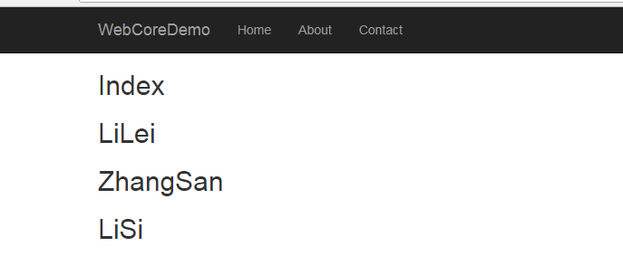
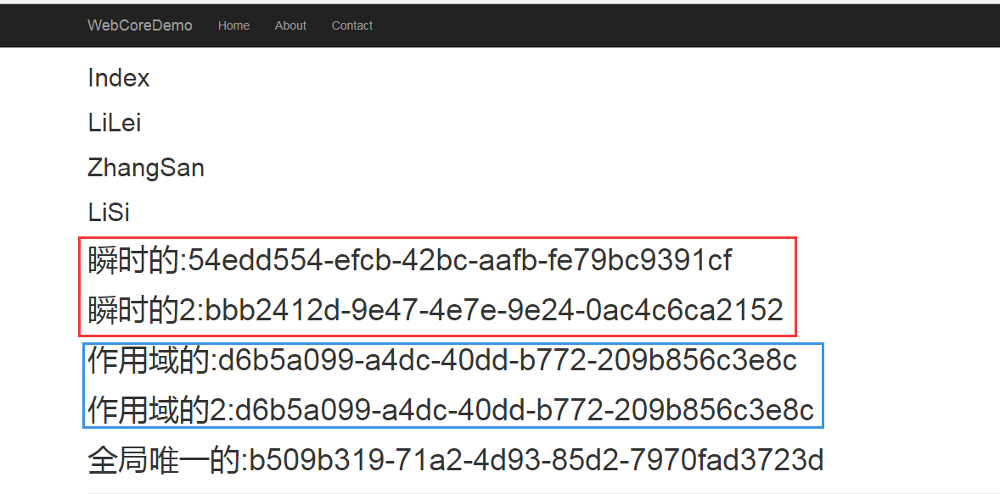
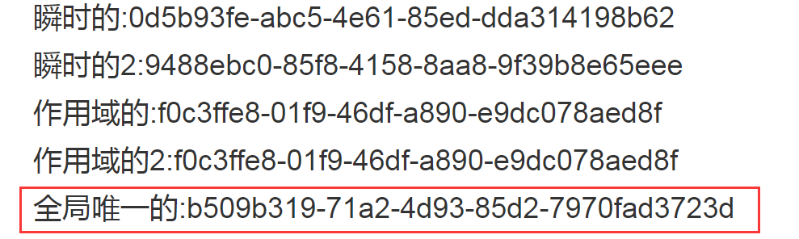

#  [ASP.NET Core中使用IOC三部曲(一.使用ASP.NET Core自带的IOC容器)](https://www.cnblogs.com/GuZhenYin/p/8297145.html) 		


前言

本文主要是详解一下在ASP.NET Core中,自带的IOC容器相关的使用方式和注入类型的生命周期.

这里就不详细的赘述IOC是什么 以及DI是什么了.. emm..不懂的可以自行百度.

## 目录

[ASP.NET Core中使用IOC三部曲(一.使用ASP.NET Core自带的IOC容器)](http://www.cnblogs.com/GuZhenYin/p/8297145.html)

[ASP.NET Core中使用IOC三部曲(二.采用Autofac来替换IOC容器,并实现属性注入)](https://www.cnblogs.com/GuZhenYin/p/8301500.html)

[ASP.NET Core中使用IOC三部曲(三.采用替换后的Autofac来实现AOP拦截)](http://www.cnblogs.com/GuZhenYin/p/8309645.html)

 

正文

今天我们主要讲讲如何使用自带IOC容器,emm..虽然自带的功能不是那么强大,但是胜在轻量级..而且..不用引用别的库..

在新的ASP.NET Core中,大量的采用了依赖注入的方式来编写代码.

比如,在我们的Startup类中的ConfigureServices里,就可以看到:

AddMvc  AddDbContext  包括我们之前目录游览用到的AddDirectoryBrowser..

都是**框架提供好的服务**,我们直接注入就可以使用了.

 

## 1.**如何注入自己的服务**

下面我们就来讲讲**如何注入自己的服务.**

首先,我们编写我们自己的测试服务如下:

[](javascript:void(0);)

```
    public class TestService: ITestService
    {
        public TestService()
        {
            MyProperty = Guid.NewGuid();
        }
        public Guid MyProperty { get; set; }
        public List<string> GetList(string a)
        {
            return new List<string>() { "LiLei", "ZhangSan", "LiSi" };
        }
    }
```

[](javascript:void(0);)

编写对应的接口代码如下:

```
    public interface ITestService
    {
        Guid MyProperty { get; }
        List<string> GetList(string a);
    }
```

 

然后,我们要在Startup类引用 Microsoft.Extensions.DependencyInjection(ps,这命名已经很直白了..微软..扩展...依赖注入 - - ,)

修改ConfigureServices方法,如下:

[](javascript:void(0);)

```
        public void ConfigureServices(IServiceCollection services)
        {
            services.AddMvc();
            services.AddDbContext<BloggingContext>();
             //这里就是注入服务
            services.AddTransient<ITestService, TestService>();
            services.AddDirectoryBrowser();
        }
```

[](javascript:void(0);)

**AddTransient**就是注入的方法之一,泛型参数,前面一个是你服务的接口,第二个是服务的实现类..

这样,我们就完成了初步的注入操作.

**那么我们如何使用我们注入的服务呢?**

我们到控制器,编写代码如下:

[](javascript:void(0);)

```
 public class DITestController : Controller
    {
            private readonly ITestService _testService;
            public DITestController(ITestService testService)
            {
                   _testService = testService;
             }
             public IActionResult Index()
            {
                ViewBag.date = _testService.GetList("");
                return View();
             }
    }
```

[](javascript:void(0);)

注入的方式一般有三种,构造函数注入, 方法注入,属性注入..微软自带的这个IOC容器,默认采用了构造函数注入的方式**(不支持属性注入,不过可以用第三方容器替换来实现,下篇讲)**

我们编写我们的index视图如下:

[](javascript:void(0);)

```
@{
    ViewData["Title"] = "Index";
}

<h2>Index</h2>
@foreach (var item in ViewBag.date)
{

    <h2>@item</h2>
}
```

[](javascript:void(0);)

最终效果如下:



## 2.**注入服务的生命周期**

微软给自行注入的服务,提供了3种生命周期.

**Transient(瞬时的)**

 **每次请求时都会创建的瞬时生命周期服务。这个生命周期最适合轻量级，无状态的服务。**

**Scoped(作用域的)**

**在同作用域,服务每个请求只创建一次。**

**Singleton(唯一的)**

**全局只创建一次,第一次被请求的时候被创建,然后就一直使用这一个.**

如何使用这三种生命周期呢?.我们直接在注入的时候用不同的方法就行了,代码如下:

```
 services.AddTransient<ITestService, TestService>();
 services.AddScoped<ITestService2, TestService2>();
 services.AddSingleton<ITestService3, TestService3>();
```

 

**下面,我们就来测试一下这三种生命周期的具体生成情况**

我们编写三个不同名称的接口如下:

[](javascript:void(0);)

```
    public interface ITestService
    {
        Guid MyProperty { get; }
        List<string> GetList(string a);
    }
    public interface ITestService2
    {
        Guid MyProperty { get; }
        List<string> GetList();
    }
    public interface ITestService3
    {
        Guid MyProperty { get; }
        List<string> GetList();
    }
```

[](javascript:void(0);)

 

然后用3个类来分别实现他们.

[](javascript:void(0);)

```
public class TestService: ITestService
    {
        public TestService()
        {
            MyProperty = Guid.NewGuid();
        }
        public Guid MyProperty { get; set; }
        public List<string> GetList(string a)
        {
            return new List<string>() { "LiLei", "ZhangSan", "LiSi" };
        }
    }

    public class TestService2 : ITestService2
    {
        public TestService2()
        {
            MyProperty = Guid.NewGuid();
        }
        public Guid MyProperty { get; set; }
        public List<string> GetList()
        {
            return new List<string>() { "LiLei", "ZhangSan", "LiSi" };
        }
    }
    public class TestService3 : ITestService3
    {

        public TestService3()
        {
            MyProperty = Guid.NewGuid();
        }
        public Guid MyProperty { get; set; }
        public List<string> GetList()
        {
            return new List<string>() { "LiLei", "ZhangSan", "LiSi" };
        }
    }
```

[](javascript:void(0);)

 

 **每个实现类的构造函数中,我们都产生了一个新的guid,通过这个GUID,我们可以判断这个类到底重新执行过构造函数没有.**

**我们编写注入代码如下:**

[](javascript:void(0);)

```
        public void ConfigureServices(IServiceCollection services)
        {
            services.AddMvc();
            services.AddDbContext<BloggingContext>();
            services.AddTransient<ITestService, TestService>();
            services.AddScoped<ITestService2, TestService2>();
            services.AddSingleton<ITestService3, TestService3>();
            services.AddDirectoryBrowser();
        }
```

[](javascript:void(0);)

我们修改控制器如下:

[](javascript:void(0);)

```
    public class DITestController : Controller
    {

        private readonly ITestService _testService;
        private readonly ITestService2 _testService2;
        private readonly ITestService3 _testService3;
        public DITestController(ITestService testService, ITestService2 testService2, ITestService3 testService3)
        {
            _testService = testService;
            _testService2 = testService2;
            _testService3 = testService3;
        }
        //这里采用了Action注入的方法
        public IActionResult Index([FromServices]ITestService testService11, [FromServices]ITestService2 testService22)
        {
            ViewBag.date = _testService.GetList("");
            ViewBag.guid = _testService.MyProperty;
            ViewBag.guid11 = testService11.MyProperty;
            ViewBag.guid2 = _testService2.MyProperty;
            ViewBag.guid22 = testService22.MyProperty;
            ViewBag.guid3 = _testService3.MyProperty;
            return View();
        }
}
```

[](javascript:void(0);)

**这里说明一下,我们采用了Action注入的方法,新注入了一个ITestService2 ,来保证2个ITestService2 在同一个作用域.**

 

 

我们编写相关的index页面,来展示这些信息如下:

[](javascript:void(0);)

```
@{
    ViewData["Title"] = "Index";
}

<h2>Index</h2>
@foreach (var item in ViewBag.date)
{

    <h2>@item</h2>
}

<h1>瞬时的:@ViewBag.guid</h1>
<h1>瞬时的2:@ViewBag.guid11</h1>
<h1>作用域的:@ViewBag.guid2</h1>
<h1>作用域的2:@ViewBag.guid22</h1>
<h1>全局唯一的:@ViewBag.guid3</h1>
```

[](javascript:void(0);)

我们运行代码,第一次访问,效果如下:



 

**我们发现瞬时生命周期的,2次生成的GUID都不一致,说明对象不是同一个.**

**然而作用域生命周期的,因为在同一个作用域下,2次使用服务的GUID都是一致的,说明用的同一个对象.**

我们直接刷新页面进行第二次访问.

效果如下:



瞬时的和作用域的,都继续符合我们的预期,

**全局唯一生命周期的和上面第一次访问的GUID保持一致.说明2次访问,都使用的同一个对象.也符合我们的预期.**

 

 

 

写在最后

本篇到此就结束了,下篇我们讲解,如何使用第三方的Autofac来替换我们默认的IOC容器,并且使用Autofac的属性注入,来注入我们的服务.  喜欢的请点个推荐和关注,~有问题也希望各位批评指正~.

作者：顾振印 出处：http://www.cnblogs.com/GuZhenYin/ 如果您觉得阅读本文对您有帮助，请点一下“推荐”按钮，您的“推荐”将是我最大的写作动力！本文版权归作者和博客园共有，欢迎转载，但未经作者同意必须保留此段声明，且在文章页面