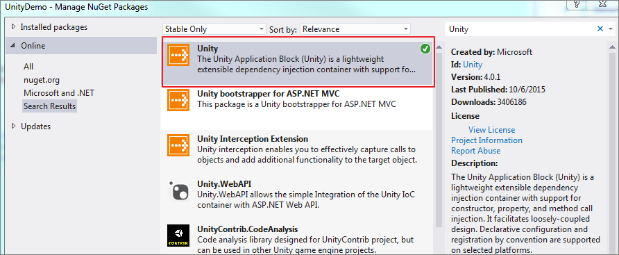

# [控制反转(Ioc)和依赖注入(DI)](https://www.cnblogs.com/Dlonghow/p/5415421.html)

控制反转IOC, 全称 “Inversion of Control”。依赖注入DI, 全称 “Dependency Injection”。

面向的问题：软件开发中，为了降低模块间、类间的耦合度，提倡基于接口的开发，那么在实现中必须面临最终是有“谁”提供实体类的问题。（将各层的对象以松耦合的方式组织起来，各层对象的调用面向接口。）

当一个类的实例需要另一个类的实例协助时，在传统的程序设计过程中，通常有调用者来创建被调用者的实例。

然后，采用依赖注入原则，创建被调用者的实例的工作不再由调用者完成，而是由IOC容器来完成，这就是“控制反转”的意思，然后，将其注入调用者，因此也称为 “依赖注入”。

Martin Fowler，在其著名的文章《Inversion of Control Containers and the Dependency Injection pattern》中将具体依赖注入划分为三种形式，即构造器注入、属性（设置）注入和接口注入。

习惯将其划分为一种（类型）匹配和三种注入：

- 类型匹配（Type Matching）：虽然我们通过接口（或者抽象类）来进行服务调用，但是服务本身还是实现在某个具体的服务类型中，这就需要某个类型注册机制来解决服务接口和服务类型之间的匹配关系；
- 构造器注入（Constructor Injection）：IoC容器会智能地选择选择和调用适合的构造函数以创建依赖的对象。如果被选择的构造函数具有相应的参数，IoC容器在调用构造函数之前解析注册的依赖关系并自行获得相应参数对象；
- 属性注入（Property Injection）：如果需要使用到被依赖对象的某个属性，在被依赖对象被创建之后，IoC容器会自动初始化该属性；
- 方法注入（Method Injection）：如果被依赖对象需要调用某个方法进行相应的初始化，在该对象创建之后，IoC容器会自动调用该方法

创建一个控制台程序，定义如下几个接口（IA、IB、IC和ID）和它们的实现类（A、B、C、D）。在类型A中定义了三个属性B、C和D，其参数类型分别为IB、IC和ID。

其中，

属性B作为构函数的参数，认为它会以**构造器注入**的方式被初始化 （？？）；

属性C应用了DependencyAttribute特性，意味着这是一个需要以**属性注入**方式被初始化的依赖属性；

属性D则通过方法Initialize初始化，该方法上应用了特性InjectionMethodAttribute, 意味着这是一个**方法注入，**在A对象被Ioc容器创建的时候，D会被自动调用。

 

Microsoft有一个轻量级的IoC框架Unity, 支持构造器注入，属性注入，方法注入。对于C#语言，由于语法元素上本身较其他语言丰富许多，如何实施注入还有些技巧和特色之处。

下面介绍如下：

测试类：

分别体现了接口注入、构造器注入（属性B）、属性注入（属性C）和方法注入（属性D）。