## 	Kestrel	服务器

###	ASP.NET Core应用程序

其本质上是**一个独立的控制台应用**，它并不是必需在IIS内部托管且并不需要IIS来启动运行（而这正是ASP.NET Core跨平台的基石）。ASP.NET Core应用程序拥有一个内置的**Self-Hosted（自托管）**的**Web Server（Web服务器）**，用来处理外部请求。

不管是托管还是自托管，都离不开**Host（宿主）**。在ASP.NET Core应用中通过配置并启动一个Host来完成应用程序的启动和其生命周期的管理


### 进程内托管模型

ASP.NET Core 模块：

- 执行应用初始化。
  - 加载 [CoreCLR](https://docs.microsoft.com/zh-cn/dotnet/standard/glossary#coreclr)。
  - 调用 `Program.Main`。
- 处理 IIS 本机请求的生存期。

定目标到 .NET Framework 的 ASP.NET Core 应用不支持进程内托管模型。

下图说明了 IIS、ASP.NET Core 模块和进程内托管的应用之间的关系：

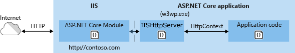

### 进程外托管模型

由于 ASP.NET Core 应用在独立于 IIS 工作进程的进程中运行，因此该模块会处理进程管理。 该模块在第一个请求到达时启动 ASP.NET Core 应用的进程，并在应用关闭或崩溃时重新启动该应用。 这基本上与在 [Windows 进程激活服务 (WAS)](https://docs.microsoft.com/zh-cn/iis/manage/provisioning-and-managing-iis/features-of-the-windows-process-activation-service-was) 托管的进程内运行的应用中出现的行为相同。

下图说明了 IIS、ASP.NET Core 模块和进程外托管的应用之间的关系：

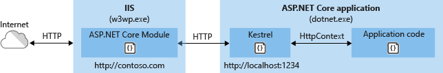


Kestrel 是 ASP.NET Core 项目模板中包括的默认 Web 服务器。

Kestrel 的使用方式如下：

- 本身作为边缘服务器，处理直接来自网络（包括 Internet）的请求。

  

- 与反向代理服务器（如 [Internet Information Services (IIS)](https://www.iis.net/)、[Nginx](http://nginx.org) 或 [Apache](https://httpd.apache.org/)）结合使用。 反向代理服务器接收来自 Internet 的 HTTP 请求，并将这些请求转发到 Kestrel。

  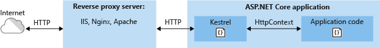


###	Host职责

Host的主要的职责就是Web Server的配置和**Pilpeline（请求处理管道）**的构建。


所有的ASP.NET托管库都是从`Program`开始执行

故而.NET工具链[可同时用于.NET Core控制台和ASP.NET Core应用程序](https://www.jianshu.com/p/2d825a728af9)

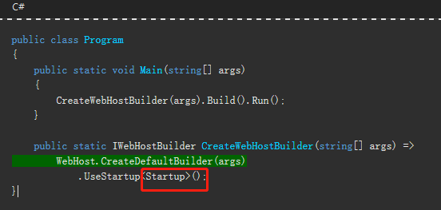

从`Program`类中开始执行，然后再找到`UseStartup<Startup>`中找到配置的`Startup`的类；在`Startup`中必须定义`Configure`方法，而`ConfigureServices`方法则是可选的，也可以在此初始化所需中间件。

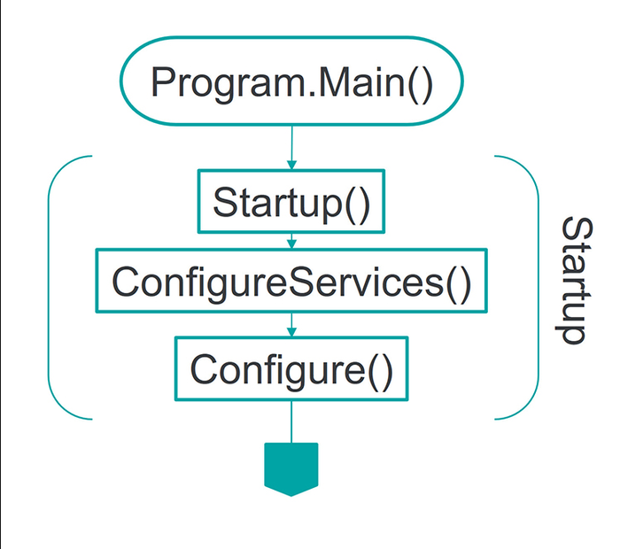


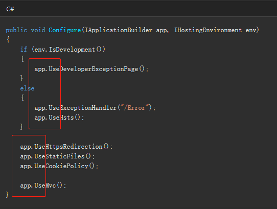


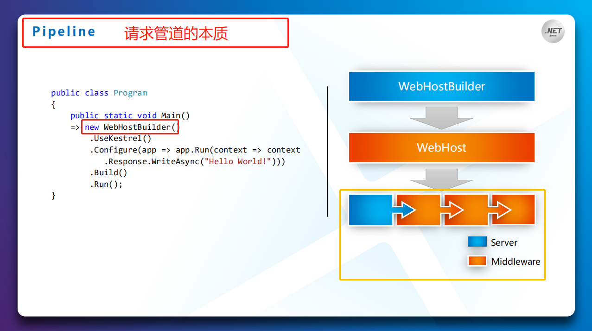


##	HttpContext	&	RequestDelegate

###	HttpContext	

对于由**一个服务器**和**多个中间件构建**的管道来说，

面向传输层的服务器**负责请求的监听、接收和最终的响应**


> **Pipeline** = Server + Middlewares

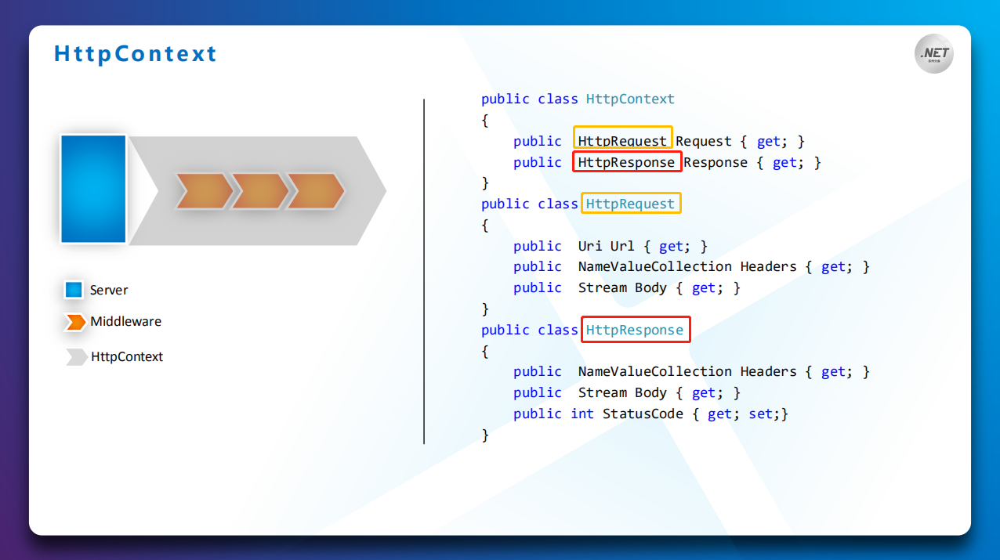


![clip_image008[6]](assets/19327-20190128080828604-2024821875.jpg)

将请求分发给后续的中间件。请求在服务器与中间件之间，以及在中间件之间的分发是通过共享上下文的方式实现的。

HttpHandler=Func<**HttpContext**，**Task**>

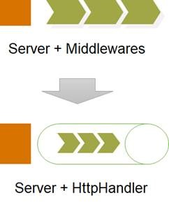


###	RequestDelegate

> **Pilpeline（请求处理管道）**：一连串的**RequestDelegate**请求委托的衔接
>
> Func<**RequestDelegate**, **RequestDelegate**>


一旦有请求抵达，**服务器**的**StartAsync启动**服务器

会根据该请求创建出代表上下文的**HttpContext**对象，并将该上下文作为输入调用由所有注册中间件构建而成的**RequestDelegate**对象。

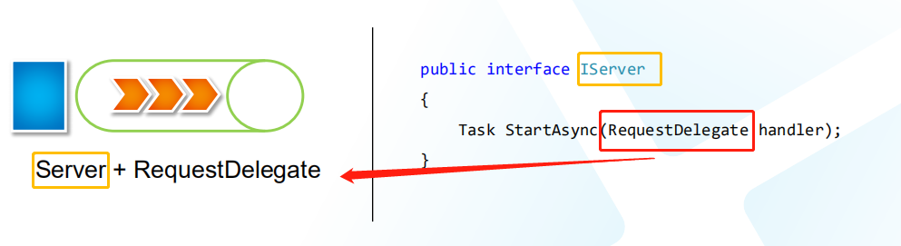

HttpContext对象是对请求和响应的封装，但是请求最初来源于服务器

### Server	后续介绍


## ASP.NET Core 中间件


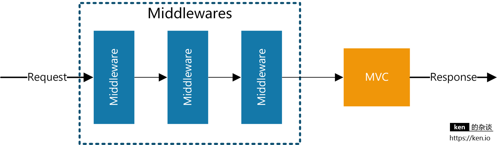


使用 [Run](https://docs.microsoft.com/dotnet/api/microsoft.aspnetcore.builder.runextensions.run)[Map](https://docs.microsoft.com/dotnet/api/microsoft.aspnetcore.builder.mapextensions.map) 和 [Use](https://docs.microsoft.com/dotnet/api/microsoft.aspnetcore.builder.useextensions.use) 扩展方法来配置请求委托。 

可将一个单独的请求委托并行指定为匿名方法（称为并行中间件）

或在可重用的类中对其进行定义。 

这些可重用的类和并行匿名方法即为中间件，也叫中间件组件。


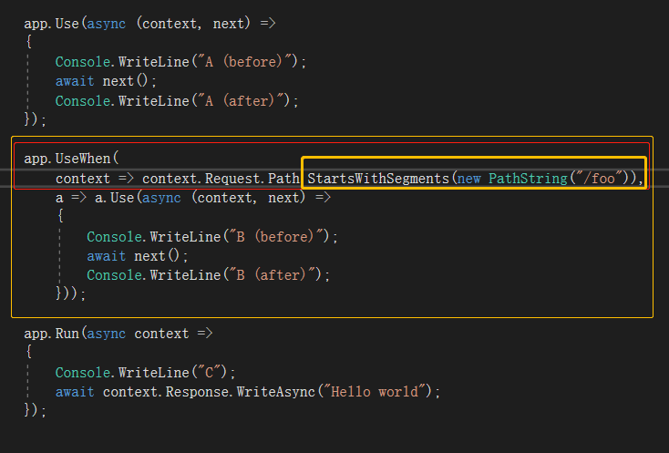


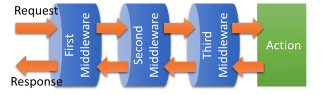

[Request 流程如下图：](https://www.jianshu.com/p/33a2ef8bb9fc)

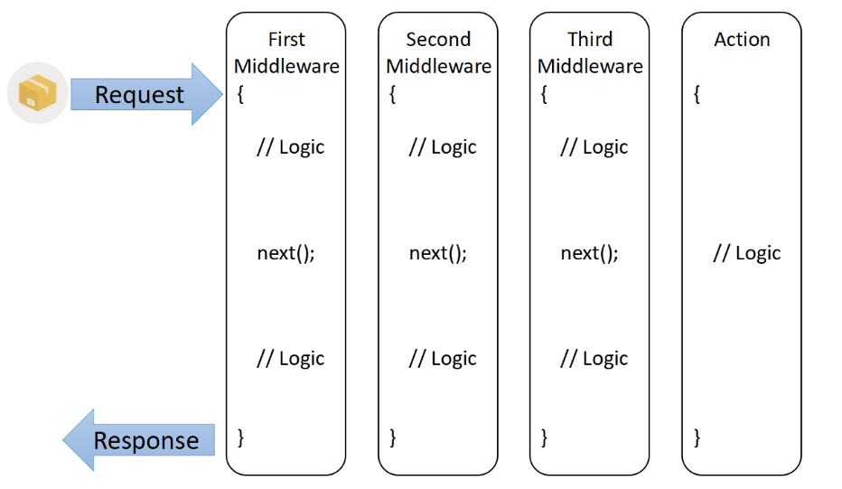


| 请求不是以 " /foo " 开头 | 请求是以 " /foo " 开头 |
| ------------------------ | ---------------------- |
| A (before)               | A (before)             |
| C                        | **B (before) **        |
| A (after)                | C                      |
|                          | **B (after)**          |
|                          | A (after)              |

> **B (before)** 	操作**前**	Log日志记录
>
> **B (after)**		操作**后**	Log日志记录

[可以同时访问 - **传入请求和传出响应**](https://www.jianshu.com/p/c5369d749cc6)

> 会话(Session)

**可以处理请求, 并决定不调用管道中的下一个中间件**

> 跨域资源共享(**CORS**)	身份验证(**Authentication**)

**可以通过传入的HTTP请求来响应HTTP请求**

> 路由(Routing)

**可以处理传出响应**	日志记录中间件组件	


```csharp

public void Configure(IApplicationBuilder app)
{
    app.Use(async (context, next) =>
    {
        Console.WriteLine("A (before)");
        await next();
        Console.WriteLine("A (after)");
    });

    app.UseWhen(
        context => context.Request.Path.StartsWithSegments(new PathString("/foo")),
        a => a.Use(async (context, next) =>
        {
            Console.WriteLine("B (before)");
            await next();
            Console.WriteLine("B (after)");
        }));

    app.Run(async context =>
    {
        Console.WriteLine("C");
        await context.Response.WriteAsync("Hello world");
    });
}


```


### 使用 IApplicationBuilder 创建中间件管道

既然它被命名为**ApplicationBuilder**，意味着由它构建的就是一个Application

构建的一个**RequestDelegate**的Application对象


> **Pilpeline（请求处理管道）**：一连串的**RequestDelegate**请求委托的衔接


一系列请求委托，依次调用

双向队列结构


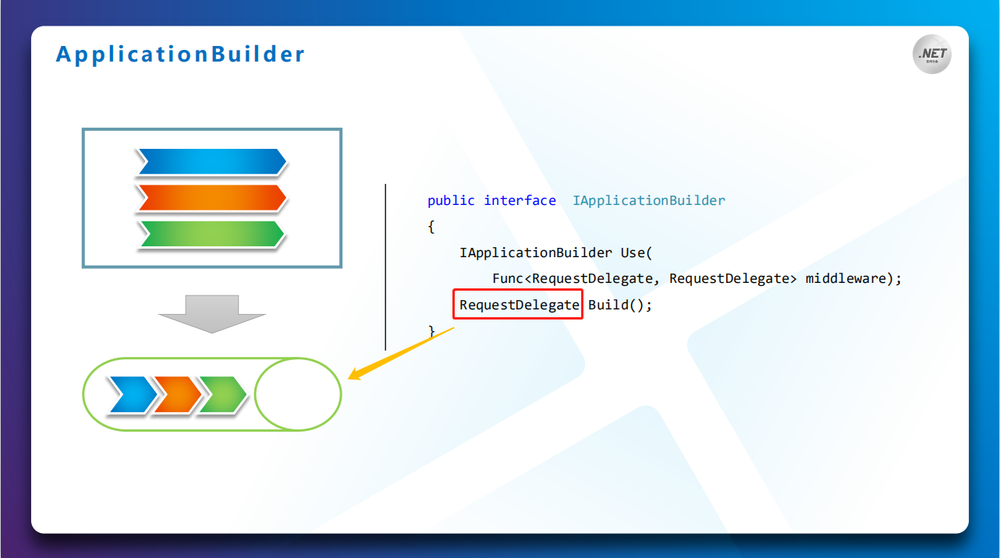


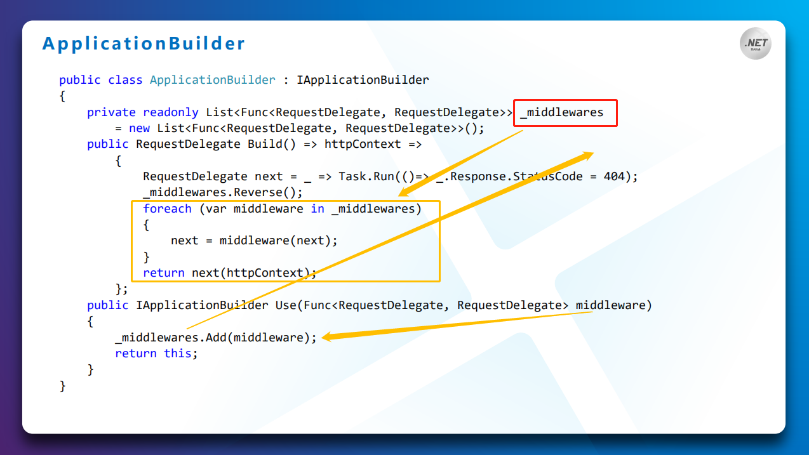


泳道-流程	中间件管道

>  **Pilpeline（请求处理管道）**：一连串的**RequestDelegate**请求委托的衔接
>
>  **Middleware**=Func<**RequestDelegate**, ***RequestDelegate***>

![clip_image014[6]](assets/19327-20190128080841607-556751951.jpg)


[重述 HTTP 模块和处理程序的工作原理：](https://docs.microsoft.com/zh-cn/aspnet/core/migration/http-modules?view=aspnetcore-2.2)

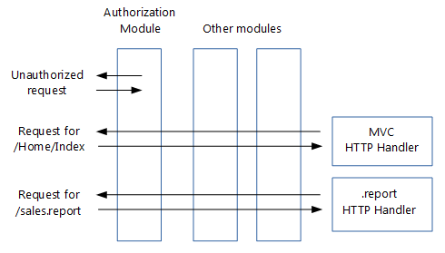

顺序定义了针对请求调用这些组件的顺序，以及响应的相反顺序。 此排序对于安全性、性能和功能至关重要。


##	HttpContext和Server间


![clip_image008[6]](assets/19327-20190128080828604-2024821875.jpg)


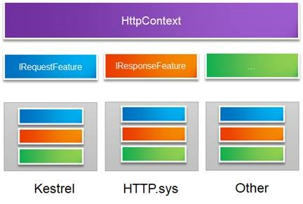

同一个**HttpContext**类型与**不同服务器**类型之间的**适配**问题也可可以通过添加一个抽象层来解决，我们定义在该层的对象称为Feature

###	Feature

`Microsoft.AspNetCore.Http.Features` 中定义了许多 HTTP 功能接口，服务器使用这些接口来标识其支持的功能。 [一系列功能接口处理请求并返回响应：](https://docs.microsoft.com/zh-cn/aspnet/core/fundamentals/request-features?view=aspnetcore-2.2)

也就是说：Feature接口来为HttpContext提供上下文信息


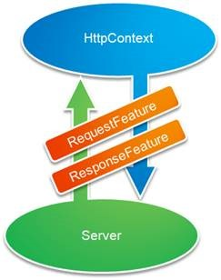

Feature故而	包含	IHttp**Request**Feature	与	IHttp**Response**Feature

与HttpRequest和HttpResponse完全一致的成员定义。

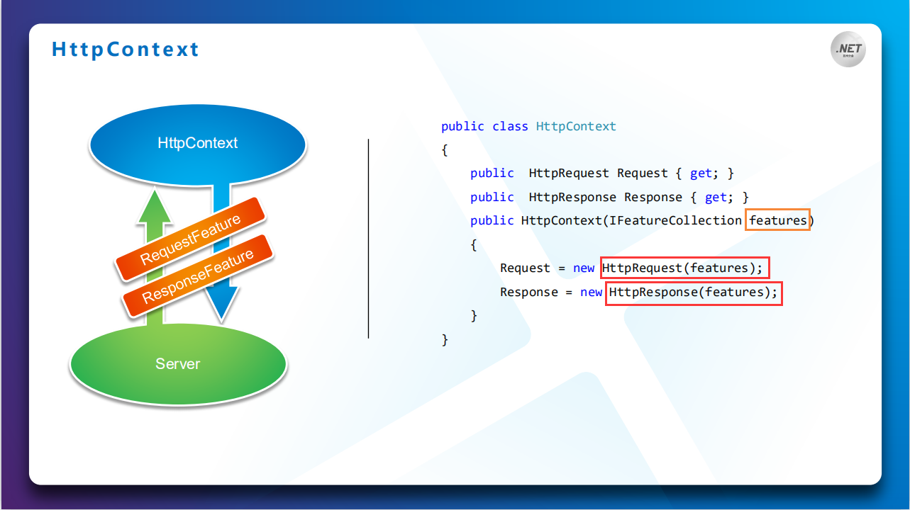

`HttpContext` 的 `Features` 属性为获取和设置当前请求的可用 **HTTP 功能提供了一个接口**。 由于功能集合即使在请求的上下文中也是可变的，所以可使用中间件来修改集合并添加对其他功能的支持。

虽然服务器负责创建功能集合，但中间件既可以**添加到该集合**中，也可以**使用集合中的功能**。中间件**甚至可以取代现有的功能**，以便增加服务器的功能。

通过结合自定义服务器实现和特定的中间件增强功能，**可构造**应用程序所需的**精确功能集**。 这样一来，无需更改服务器即可添加缺少的功能，并确保只公开最少的功能，从而限制攻击外围应用并提高性能。


###		HttpListenerServer

HttpListener作为监听器的服务器类型，可以提供一组监听地址

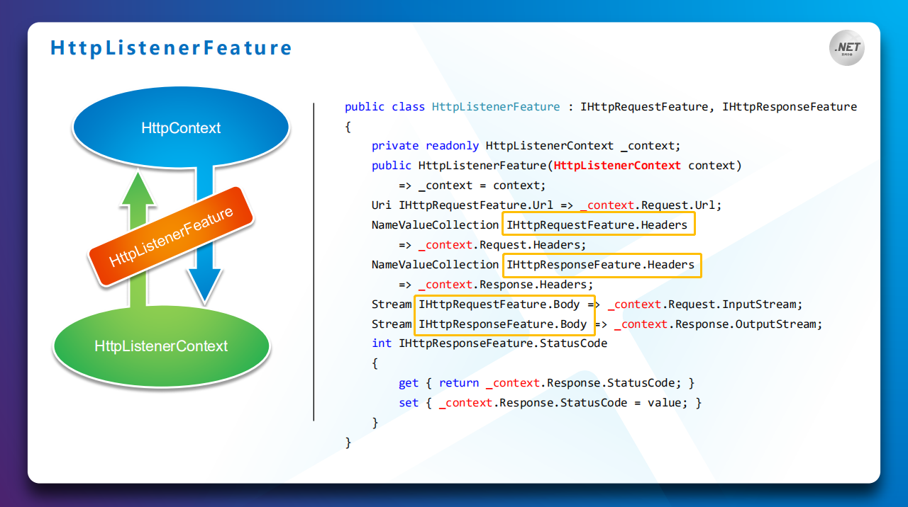


注册到创建**FeatureCollection集合**上【即**feature**】

利用这个**集合对象**创建出代表上下文的**HttpContext**

由所有中间件**共同构建**的**RequestDelegate**

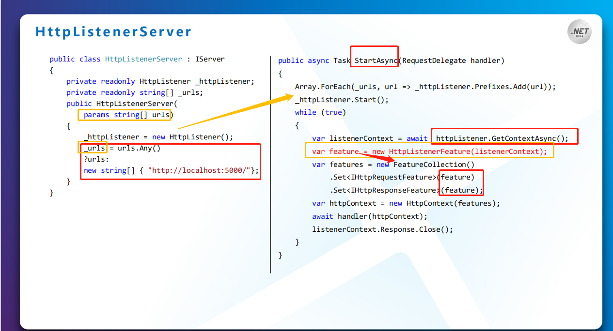


中间件在管道内

> **Pilpeline（请求处理管道）**：一连串的**RequestDelegate**请求委托的衔接
>
> **Middleware**=Func<**RequestDelegate**, ***RequestDelegate***>

![clip_image014[6]](../Middleware%E4%B8%AD%E9%97%B4%E4%BB%B6/assets/19327-20190128080841607-556751951.jpg)


##	宿主WebHost


###	WebHost

Host的主要的职责就是Web Server的配置和**Pilpeline（请求处理管道）**的构建。


 ASP.NET Core[启动流程调用堆栈](https://www.jianshu.com/p/caa1a1a68611)


> 其核心主要在于WebHost的创建，又可以划分为三个部分：
>
> 1. 构建依赖注入容器，初始通用服务的注册：BuildCommonService();
> 2. 实例化WebHost：var host = new WebHost(...);
> 3. 初始化WebHost，也就是构建由中间件组成的请求处理管道：host.Initialize();


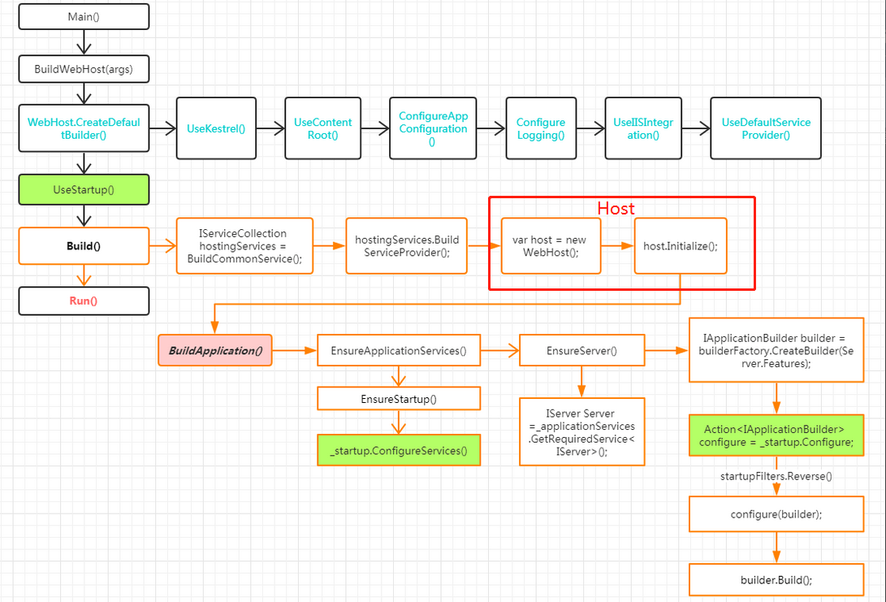

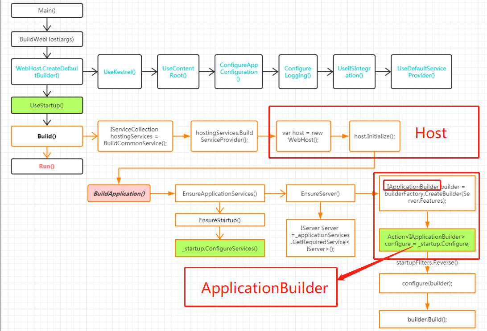

### 构建请求处理管道

请求管道的构建，主要是中间件之间的衔接处理。

> 而请求处理管道的构建，又包含三个主要部分：
>
> 1. 注册Startup中绑定的服务；
> 2. 配置IServer；
> 3. 构建管道


请求管道的构建主要是借助于`IApplicationBuilder`，相关类图如下：
 

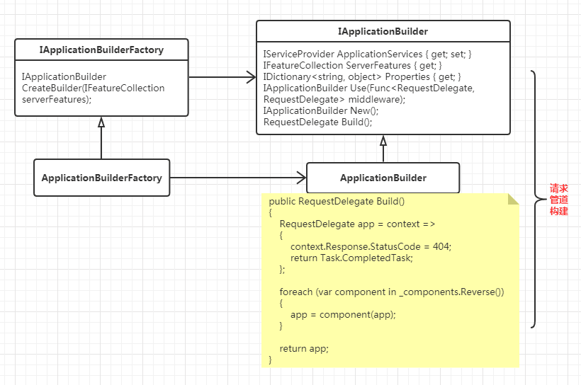


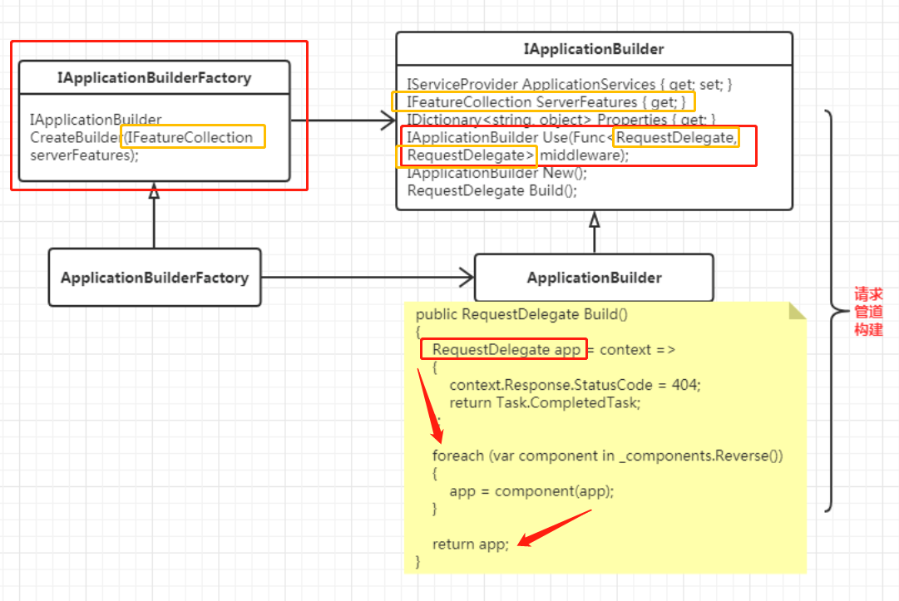


与我们上面所讲WebHost的构建环节具有相同的调用堆栈。

而最终返回的正是由**中间件衔接**而成的`RequestDelegate`类型代表的请求管道。


**Pilpeline（请求处理管道）**：一连串的**RequestDelegate**请求委托的衔接


## Scope

特征设置范围

全局-租户-个人


## 将 HTTP 处理程序和模块[迁移到 ASP.NET Core 中间件](https://docs.microsoft.com/zh-cn/aspnet/core/migration/http-modules?view=aspnetcore-2.2)

如前面所述，没有任何应用程序生命周期中 ASP.NET Core，中间件处理响应的顺序不同于使用模块的顺序。 这可能使你订购的决策更具挑战性。

如果排序将为问题，无法将你的模块[[写入自定义 ASP.NET Core 中间件](https://docs.microsoft.com/zh-cn/aspnet/core/fundamentals/middleware/write?view=aspnetcore-2.2)]分为多个中间件组件可单独进行排序。


所有中间件都是在这个HttpContext上下文中处理请求的


## 依赖关系反转

应用程序中的依赖关系方向应该是抽象的方向，而不是实现详细信息的方向。 大部分应用程序都是这样编写的，以便编译时依赖关系顺着运行时执行的方向流动。 这将产生一个直接依赖项关系图。 也就是说，如果模块 A 调用模块 B 中的函数，而模块 B 又调用模块 C 中的函数，则编译时 A 取决于 B，而 B 又取决于 C，如图 4-1 中所示。


**图 4-1**。 直接依赖项关系图。

应用依赖关系反转原则后，A 可以调用 B 实现的抽象上的方法，让 A 可以在运行时调用 B，而 B 又在编译时依赖于 A 控制的接口（因此，典型的编译时依赖项发生反转）。 运行时，程序执行的流程保持不变，但接口引入意味着可以轻松插入这些接口的不同实现。


**图 4-2**。 反转依赖项关系图。

依赖项反转是生成松散耦合应用程序的关键一环，因为可以将实现详细信息编写为依赖并实现更高级别的抽象，而不是相反。 因此，生成的应用程序的可测试性、模块化程度以及可维护性更高。 遵循依赖关系反转原则可实现依赖关系注入。


##	出站请求中间件

**`IHttpClientFactory`** 可以轻松定义处理程序并应用于每个命名客户端。 它支持注册和链接多个处理程序，以生成出站请求中间件管道。 每个处理程序都可以在出站请求前后执行工作。 此模式类似于 ASP.NET Core 中的入站中间件管道。 此模式提供了一种用于管理围绕 HTTP 请求的**横切关注点**的机制，包括缓存、错误处理、序列化以及日志记录。

##	使用基于 Polly 的处理程序[熔断]

`IHttpClientFactory` 与一个名为 [Polly](https://github.com/App-vNext/Polly) 的热门第三方库集成。 Polly 是适用于 .NET 的全面恢复和临时故障处理库。 开发人员通过它可以表达策略，例如以流畅且线程安全的方式处理重试、断路器、超时、Bulkhead 隔离和回退。

## 在 [Docker 容器中托管](https://docs.microsoft.com/zh-cn/aspnet/core/host-and-deploy/docker/?view=aspnetcore-2.1) ASP.NET Core


