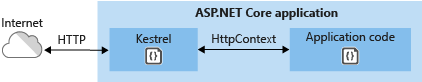
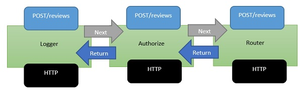
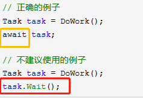
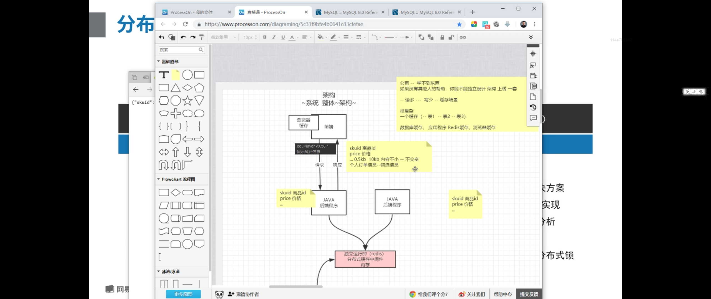
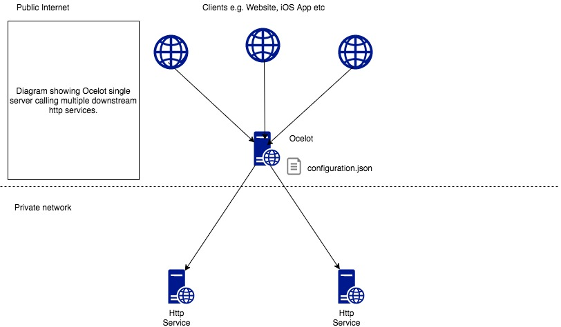

##	为什么


***ASP.NET Core和ASP.NET之间的性能差异是几个数量级***。大部分的ASP.NET被传统的System.Web库所限制。.NET Framework支持旧版本的ASP.NET项目，而且这个约束限制了ASP.NET的发展。微软决定重写整个架构。这意味着打破变化，但结果是值得的。


#	启动与运行机制

##	ASP.NET Core应用程序	运行机制

其本质上是**一个独立的控制台应用**，它并不是必需在IIS内部托管且并不需要IIS来启动运行（而这正是ASP.NET Core跨平台的基石）。ASP.NET Core应用程序拥有一个内置的**Self-Hosted（自托管）**的**Web Server（Web服务器）**，用来处理外部请求。

不管是托管还是自托管，都离不开**Host（宿主）**。在ASP.NET Core应用中通过配置并启动一个Host来完成应用程序的启动和其生命周期的管理


Kestrel 是 ASP.NET Core 项目模板中包括的默认 Web 服务器。

Kestrel 的使用方式如下：

- 本身作为边缘服务器，处理直接来自网络（包括 Internet）的请求。

  

- 与反向代理服务器（如 [Internet Information Services (IIS)](https://www.iis.net/)、[Nginx](http://nginx.org) 或 [Apache](https://httpd.apache.org/)）结合使用。 反向代理服务器接收来自 Internet 的 HTTP 请求，并将这些请求转发到 Kestrel。

  


###	Host职责

Host的主要的职责就是Web Server的配置和**Pilpeline（请求处理管道）**的构建。


所有的ASP.NET托管库都是从`Program`开始执行

故而.NET工具链[可同时用于.NET Core控制台和ASP.NET Core应用程序](https://www.jianshu.com/p/2d825a728af9)


从`Program`类中开始执行，然后再找到`UseStartup<Startup>`中找到配置的`Startup`的类；在`Startup`中必须定义`Configure`方法，而`ConfigureServices`方法则是可选的，也可以在此初始化所需中间件。


##	HttpContext	&	RequestDelegate

###	HttpContext

对于由**一个服务器**和**多个中间件构建**的管道来说，

面向传输层的服务器**负责请求的监听、接收和最终的响应**

接受过请求，并自身完成了处理，继续分发给后续中间件进行处理。

请求在*服务器与中间件之间*，以及在*中间件之间*的分发是通过**共享上下文**的方式实现的。

#####	基本的要素

我们知道一个HTTP事务（Transaction）具有非常清晰的界定，即**接收请求、发送响应**，

所以**请求**和**响应**是两个基本的要素，也是HttpContext承载的最核心的上下文信息


###	RequestDelegate


#####	本质

一个委托（Delegate）对象

> **Pilpeline（请求处理管道）**：一连串的**RequestDelegate**请求委托的衔接
>
> Func<**RequestDelegate**, **RequestDelegate**>
>
> > **Pipeline** = Server + **Middleware**s	【从**管道的角度**才能充分理解】
> >
> > **Pipeline** =Server + **HttpHandler**


![clip_image008[6]](assets/19327-20190128080828604-2024821875.jpg)

> HttpHandler=Func<**HttpContext**，**Task**>
>
> **Task对象**	表示一个同步或者异步**操作**


### Server	后续介绍

一旦有请求抵达，**服务器**的**StartAsync启动**服务器

会根据该请求创建出代表上下文的**HttpContext**对象，并将该上下文作为输入调用由所有注册中间件构建而成的**RequestDelegate**对象。


HttpContext对象是对请求和响应的封装，但是请求最初来源于服务器


## ASP.NET Core 中间件


使用 [Run](https://docs.microsoft.com/dotnet/api/microsoft.aspnetcore.builder.runextensions.run)[Map](https://docs.microsoft.com/dotnet/api/microsoft.aspnetcore.builder.mapextensions.map) 和 [Use](https://docs.microsoft.com/dotnet/api/microsoft.aspnetcore.builder.useextensions.use) 扩展方法来配置请求委托。 

可将一个单独的请求委托并行指定为匿名方法（称为并行中间件）

或在可重用的类中对其进行定义。 

这些可重用的类和并行匿名方法即为中间件，也叫中间件组件。


[Request 流程如下图：](https://www.jianshu.com/p/33a2ef8bb9fc)


| 请求不是以 " /foo " 开头 | 请求是以 " /foo " 开头 |
| ------------------------ | ---------------------- |
| A (before)               | A (before)             |
| C                        | **B (before) **        |
| A (after)                | C                      |
|                          | **B (after)**          |
|                          | A (after)              |

> **B (before)** 	操作**前**	Log日志记录
>
> **B (after)**		操作**后**	Log日志记录

[可以同时访问 - **传入请求和传出响应**](https://www.jianshu.com/p/c5369d749cc6)

> 会话(Session)

**可以处理请求, 并决定不调用管道中的下一个中间件**

> 跨域资源共享(**CORS**)	身份验证(**Authentication**)

**可以通过传入的HTTP请求来响应HTTP请求**

> 路由(Routing)

**可以处理传出响应**	日志记录中间件组件	




```csharp

public void Configure(IApplicationBuilder app)
{
    app.Use(async (context, next) =>
    {
        Console.WriteLine("A (before)");
        await next();
        Console.WriteLine("A (after)");
    });

    app.UseWhen(
        context => context.Request.Path.StartsWithSegments(new PathString("/foo")),
        a => a.Use(async (context, next) =>
        {
            Console.WriteLine("B (before)");
            await next();
            Console.WriteLine("B (after)");
        }));

    app.Run(async context =>
    {
        Console.WriteLine("C");
        await context.Response.WriteAsync("Hello world");
    });
}


```


### 使用 IApplicationBuilder 创建中间件管道

既然它被命名为**ApplicationBuilder**，意味着由它构建的就是一个Application

构建的一个**RequestDelegate**的Application对象


> **Pilpeline（请求处理管道）**：一连串的**RequestDelegate**请求委托的衔接


一系列请求委托，依次调用

双向队列结构


泳道-流程	中间件管道

>  **Pilpeline（请求处理管道）**：一连串的**RequestDelegate**请求委托的衔接
>
>  **Middleware**=Func<**RequestDelegate**, ***RequestDelegate***>

![clip_image014[6]](assets/19327-20190128080841607-556751951.jpg)


[重述 HTTP 模块和处理程序的工作原理：](https://docs.microsoft.com/zh-cn/aspnet/core/migration/http-modules?view=aspnetcore-2.2)


顺序定义了针对请求调用这些组件的顺序，以及响应的相反顺序。 此排序对于安全性、性能和功能至关重要。


##	HttpContext和Server间


![clip_image008[6]](assets/19327-20190128080828604-2024821875.jpg)

要支持不同的服务器，则不同的服务器都要提供HttpContext，这样有了新的难题：**服务器和HttpContext之间的适配** 。
现阶段的HttpContext包含HttpRequest和HttpResponse,请求和响应的数据都是要服务器(Server)提供的。


同一个**HttpContext**类型与**不同服务器**类型之间的**适配**问题也可可以通过添加一个抽象层来解决，我们定义在该层的对象称为Feature

###	Feature

`Microsoft.AspNetCore.Http.Features` 中定义了许多 HTTP 功能接口，服务器使用这些接口来标识其支持的功能。 [一系列功能接口处理请求并返回响应：](https://docs.microsoft.com/zh-cn/aspnet/core/fundamentals/request-features?view=aspnetcore-2.2)

也就是说：Feature接口来为HttpContext提供上下文信息


Feature故而	包含	IHttp**Request**Feature	与	IHttp**Response**Feature

与HttpRequest和HttpResponse完全一致的成员定义。


`HttpContext` 的 `Features` 属性为获取和设置当前请求的可用 **HTTP 功能提供了一个接口**。 由于功能集合即使在请求的上下文中也是可变的，所以可使用中间件来修改集合并添加对其他功能的支持。

虽然服务器负责创建功能集合，但中间件既可以**添加到该集合**中，也可以**使用集合中的功能**。中间件**甚至可以取代现有的功能**，以便增加服务器的功能。

通过结合自定义服务器实现和特定的中间件增强功能，**可构造**应用程序所需的**精确功能集**。 这样一来，无需更改服务器即可添加缺少的功能，并确保只公开最少的功能，从而限制攻击外围应用并提高性能。


###		HttpListenerServer

HttpListener作为监听器的服务器类型，可以提供一组监听地址


注册到创建**FeatureCollection集合**上【即**feature**】

利用这个**集合对象**创建出代表上下文的**HttpContext**

由所有中间件**共同构建**的**RequestDelegate**


中间件在管道内

> **Pilpeline（请求处理管道）**：一连串的**RequestDelegate**请求委托的衔接
>
> **Middleware**=Func<**RequestDelegate**, ***RequestDelegate***>

![clip_image014[6]](../Middleware%E4%B8%AD%E9%97%B4%E4%BB%B6/assets/19327-20190128080841607-556751951.jpg)


##	宿主WebHost


###	WebHost

Host的主要的职责就是Web Server的配置和**Pilpeline（请求处理管道）**的构建。


 ASP.NET Core[启动流程调用堆栈](https://www.jianshu.com/p/caa1a1a68611)


> 其核心主要在于WebHost的创建，又可以划分为三个部分：
>
> 1. 构建依赖注入容器，初始通用服务的注册：BuildCommonService();
> 2. 实例化WebHost：var host = new WebHost(...);
> 3. 初始化WebHost，也就是构建由中间件组成的请求处理管道：host.Initialize();


### 构建请求处理管道

请求管道的构建，主要是中间件之间的衔接处理。

> 而请求处理管道的构建，又包含三个主要部分：
>
> 1. 注册Startup中绑定的服务；
> 2. 配置IServer；
> 3. 构建管道


请求管道的构建主要是借助于`IApplicationBuilder`，相关类图如下：


与我们上面所讲WebHost的构建环节具有相同的调用堆栈。

而最终返回的正是由**中间件衔接**而成的`RequestDelegate`类型代表的请求管道。


**Pilpeline（请求处理管道）**：一连串的**RequestDelegate**请求委托的衔接


#	 Web 应用服务器	+	扩展


## ASP.NET Core运行机制

其本质上是**一个独立的控制台应用**，它并不是必需在IIS内部托管且并不需要IIS来启动运行（而这正是ASP.NET Core跨平台的基石）。ASP.NET Core应用程序拥有一个内置的**Self-Hosted（自托管）**的**Web Server（Web服务器）**，用来处理外部请求。

不管是托管还是自托管，都离不开**Host（宿主）**。在ASP.NET Core应用中通过配置并启动一个Host来完成应用程序的启动和其生命周期的管理


### 进程内托管模型

ASP.NET Core 模块：

- 执行应用初始化。
  - 加载 [CoreCLR](https://docs.microsoft.com/zh-cn/dotnet/standard/glossary#coreclr)。
  - 调用 `Program.Main`。
- 处理 IIS 本机请求的生存期。

定目标到 .NET Framework 的 ASP.NET Core 应用不支持进程内托管模型。

下图说明了 IIS、ASP.NET Core 模块和进程内托管的应用之间的关系：


### 进程外托管模型

由于 ASP.NET Core 应用在独立于 IIS 工作进程的进程中运行，因此该模块会处理进程管理。 该模块在第一个请求到达时启动 ASP.NET Core 应用的进程，并在应用关闭或崩溃时重新启动该应用。 这基本上与在 [Windows 进程激活服务 (WAS)](https://docs.microsoft.com/zh-cn/iis/manage/provisioning-and-managing-iis/features-of-the-windows-process-activation-service-was) 托管的进程内运行的应用中出现的行为相同。

下图说明了 IIS、ASP.NET Core 模块和进程外托管的应用之间的关系：


Kestrel 是 ASP.NET Core 项目模板中包括的默认 Web 服务器。

Kestrel 的使用方式如下：

- 本身作为边缘服务器，处理直接来自网络（包括 Internet）的请求。

  

- 与反向代理服务器（如 [Internet Information Services (IIS)](https://www.iis.net/)、[Nginx](http://nginx.org) 或 [Apache](https://httpd.apache.org/)）结合使用。 反向代理服务器接收来自 Internet 的 HTTP 请求，并将这些请求转发到 Kestrel。

  

## 服务器


从概念上讲：[Web服务器是提供WWW服务的程序；Web容器是提供给开发者的框架](https://www.cnblogs.com/vipyoumay/p/7455431.html)；Web应用程序服务器内容丰富得多，既可用各厂商通常遵循一定的工业标准并自定义扩展功能而成，也可以利用开源组件轻量级拼装打造；反向代理服务器在企业级应用中表现突出，具有解决集中式安全，负载均衡等等优点。如今这四个概念的边界越来模糊，看看这个表就知道了：

| 软件名词  | 是否Web服务器 | 是否Web容器 | 是否Web应用服务器 | 是否能反向代理 |
| :-------- | :------------ | :---------- | :---------------- | :------------- |
| IIS       | 是            | 是          |                   | 是             |
| Nginx     | 是            |             |                   | 是             |
| Apache    | 是            |             |                   | 是             |
| Tomcat    | 是            | 是          |                   |                |
| Jetty     | 是            | 是          |                   |                |
| WebSphere | 是            | 是          | 是                |                |
| WebLogic  | 是            | 是          | 是                |                |
| Kerstrel  | 是            | **是？**    |                   |                |
| Http.sys  | 是            |             |                   | 是             |

**关于Kerstrel是否web容器，有两种观点：** 

*1. 由于Kerstrel不提供编写应用的框架，所以它不是容器；asp.net core才是容器，因为它提供了开发应用的框架并提供web应用（MVC,Web API)运行环境。*

*2. Kerstrel提供了运行环境。*

[*非常欢迎大家提出自己的有力观点，帮助我们清晰化这个asp.net core容器概念。*](


## 依赖关系反转	&	IOC


 软件设计原则中有一个依赖倒置原则（DIP）讲的是要依赖于抽象，不要依赖于具体,高层模块不应该依赖于低层模块,  二者应该依赖于抽象。简单的说就是为了更好的解耦。[而控制反转(Ioc)就是这样的原则的其中一个实现思路,  这个思路的其中一种实现方式就是依赖注入(DI)。](https://www.cnblogs.com/FlyLolo/p/ASPNETCore2_6.html)

​      感觉有点绕, 举个栗子:老李是一个维修工, 现在要出任务去维修, 得先去申领个扳手。

　　

​                              　　　　图一

​      老李: "请给我一把可以可以拧7mm大小的六角螺丝的扳手.", 然后库管老张就从仓库里拿了一把这样的大力牌扳手给老李。

​      在这个例子中, 维修工老李只要告诉库管我要一个 "可以拧7mm大小的六角螺丝"的扳手即可,  他不用关心扳手的品牌和样式, 也不用采购扳手,更不用关心这个扳手是怎么来的.而对于库管, 他只需提供满足这样规则的一个扳手即可,  不用去关心老李拿着这个扳手之后去干什么。所以老李和老张都只是关心"可以拧7mm大小的六角螺丝的"这个规则即可, 也就是说,  如果后期仓库里不再提供大力牌扳手, 而是提供了这样的大牛牌扳手,  无论换了什么牌子和样式, 只要仍满足这个规则, 老李仍然可以正常工作.它们定义了一个规则(比如接口IWrench7mm),  二者都依赖于这个规则, 然后仓库无论提供大力牌(WrenchDaLi : IWrench7mm)还是大牛牌(WrenchDaNiu :  IWrench7mm), 都不影响正常工作.

　　这就是**依赖倒置原则(DIP)**,  不依赖于具体(牌子),  高层模块(老李)不应该依赖于低层模块(大力牌扳手),  二者应该依赖于抽象(IWrench7mm:可以拧7mm大小的六角螺丝)。如果直接由老李去获取(new)大力牌扳手,  那么当业务改变要求采用大牛牌的时候, 我们就要去修改老李的代码.为了解耦,  在本例中我们只要在配置中让仓库由原来的提供大力牌改为提供大牛牌即可。老李要使用的时候, **可以通过注入(构造器、属性、方法)的方式,  将仓库提供的扳手实例提供给老李使用。**


### Scope

特征设置范围

全局-租户-个人

　　**ServiceLifetime**是一个枚举, 上文说的AddSingleton、AddScoped和AddTransient就是对应这个枚举, 分别为:

　　　　**Singleton**: 单例, 例子中的卡车, 全单位只有一辆, 谁调用都是返回这个实例。

　　　　**Scoped**: 区域内单例, 例子中的傻瓜相机, 每小组一台, 小组内谁要都是同一台, 不同小组的相机不同。

　　　　**Transient**: 临时的   例子中的扳手和锤子, 谁要都给一把新的, 所有人的都不是同一把。


应用程序中的依赖关系方向应该是抽象的方向，而不是实现详细信息的方向。 大部分应用程序都是这样编写的，以便编译时依赖关系顺着运行时执行的方向流动。 这将产生一个直接依赖项关系图。 也就是说，如果模块 A 调用模块 B 中的函数，而模块 B 又调用模块 C 中的函数，则编译时 A 取决于 B，而 B 又取决于 C，如图 4-1 中所示。


**图 4-1**。 直接依赖项关系图。

应用依赖关系反转原则后，A 可以调用 B 实现的抽象上的方法，让 A 可以在运行时调用 B，而 B 又在编译时依赖于 A 控制的接口（因此，典型的编译时依赖项发生反转）。 运行时，程序执行的流程保持不变，但接口引入意味着可以轻松插入这些接口的不同实现。


**图 4-2**。 反转依赖项关系图。

依赖项反转是生成松散耦合应用程序的关键一环，因为可以将实现详细信息编写为依赖并实现更高级别的抽象，而不是相反。 因此，生成的应用程序的可测试性、模块化程度以及可维护性更高。 遵循依赖关系反转原则可实现依赖关系注入。


##	自定义化中间件

`HttpContext` 的 `Features` 属性为获取和设置当前请求的可用 **HTTP 功能提供了一个接口**。 由于功能集合即使在请求的上下文中也是可变的，所以可使用中间件来修改集合并添加对其他功能的支持。

虽然服务器负责创建功能集合，但中间件既可以**添加到该集合**中，也可以**使用集合中的功能**。中间件**甚至可以取代现有的功能**，以便增加服务器的功能。

通过结合自定义服务器实现和特定的中间件增强功能，**可构造**应用程序所需的**精确功能集**。 这样一来，无需更改服务器即可添加缺少的功能，并确保只公开最少的功能，从而限制攻击外围应用并提高性能。


### 将 HTTP 处理程序和模块[迁移到 ASP.NET Core 中间件](https://docs.microsoft.com/zh-cn/aspnet/core/migration/http-modules?view=aspnetcore-2.2)

如前面所述，没有任何应用程序生命周期中 ASP.NET Core，中间件处理响应的顺序不同于使用模块的顺序。 这可能使你订购的决策更具挑战性。

如果排序将为问题，无法将你的模块[[写入自定义 ASP.NET Core 中间件](https://docs.microsoft.com/zh-cn/aspnet/core/fundamentals/middleware/write?view=aspnetcore-2.2)]分为多个中间件组件可单独进行排序。

所有中间件都是在这个HttpContext上下文中处理请求的

###	出站请求中间件

**`IHttpClientFactory`** 可以轻松定义处理程序并应用于每个命名客户端。 它支持注册和链接多个处理程序，以生成出站请求中间件管道。 每个处理程序都可以在出站请求前后执行工作。 此模式类似于 ASP.NET Core 中的入站中间件管道。 此模式提供了一种用于管理围绕 HTTP 请求的**横切关注点**的机制，包括缓存、错误处理、序列化以及日志记录。


###	【IOC】	DI Containers 

- [Microsoft.Extensions.DependencyInjection](https://docs.microsoft.com/en-us/aspnet/core/fundamentals/dependency-injection?view=aspnetcore-2.2)
- [AutoFac](https://autofaccn.readthedocs.io/en/latest/integration/aspnetcore.html)
- [Castle Windsor](https://github.com/castleproject/Windsor)
- Unity
- [Ninject](http://www.ninject.org/)
- [StructureMap](https://github.com/structuremap/structuremap)

### 集成第三方日志


Logging

1. Log Frameworks 
   - [Serilog](https://github.com/serilog/serilog)
   - [NLog](https://github.com/NLog/NLog)
   - [Elmah](https://elmah.github.io/)
2. Log Management System 
   - [Sentry.io](http://sentry.io)
   - [Loggly.com](https://loggly.com)
   - [Elmah.io](http://elmah.io)

###	Caching

1. Entity Framework 2nd Level Cache 
   1. [EFSecondLevelCache.Core](https://github.com/VahidN/EFSecondLevelCache.Core)
   2. [EntityFrameworkCore.Cacheable](https://github.com/SteffenMangold/EntityFrameworkCore.Cacheable)
2. Distributed Cache
   1. [Redis](https://redis.io/)
   2. [Memcached](https://memcached.org/)
3. [Memory Cache](https://docs.microsoft.com/en-us/aspnet/core/performance/caching/memory?view=aspnetcore-2.2)


##	API Clients

1. REST 
   - [OData](https://blogs.msdn.microsoft.com/odatateam/2018/07/03/asp-net-core-odata-now-available/)
   - [Sieve](https://github.com/Biarity/Sieve)
2. GraphQL 
   - [GraphQL-dotnet](https://github.com/graphql-dotnet/graphql-dotnet)


##	全局业务ID

业务系统对ID号的要求有哪些呢？

1. 全局唯一性：不能出现重复的ID号，既然是唯一标识，这是最基本的要求。
2. 趋势递增：在MySQL InnoDB引擎中使用的是聚集索引，由于多数RDBMS使用B-tree的数据结构来存储索引数据，在主键的选择上面我们应该尽量使用有序的主键保证写入性能。
3. 单调递增：保证下一个ID一定大于上一个ID，例如事务版本号、IM增量消息、排序等特殊需求。
4. 信息安全：如果ID是连续的，恶意用户的扒取工作就非常容易做了，直接按照顺序下载指定URL即可；如果是订单号就更危险了，竞对可以直接知道我们一天的单量。所以在一些应用场景下，会需要ID无规则、不规则。

上述123对应三类不同的场景，3和4需求还是互斥的，无法使用同一个方案满足。


### UUID

UUID(Universally Unique Identifier)的标准型式包含32个16进制数字，以连字号分为五段，形式为8-4-4-4-12的36个字符，示例：`550e8400-e29b-41d4-a716-446655440000`，到目前为止业界一共有5种方式生成UUID，详情见IETF发布的UUID规范 [A Universally Unique IDentifier (UUID) URN Namespace](http://www.ietf.org/rfc/rfc4122.txt)。

优点：

- 性能非常高：本地生成，没有网络消耗。

缺点：

- 不易于存储：UUID太长，16字节128位，通常以36长度的字符串表示，很多场景不适用。

- **信息不安全**：基于MAC地址生成UUID的算法可能会造成MAC地址泄露，这个漏洞曾被用于寻找梅丽莎病毒的制作者位置。

- ID作为主键时在特定的环境会存在一些问题，比如做DB主键的场景下，UUID就非常不适用：

  ① MySQL官方有明确的建议主键要尽量越短越好[4]，36个字符长度的UUID不符合要求。

### 类snowflake方案

这种方案大致来说是一种以划分命名空间（UUID也算，由于比较常见，所以单独分析）来生成ID的一种算法，这种方案把64-bit分别划分成多段，分开来标示机器、时间等，比如在snowflake中的64-bit分别表示如下图（图片来自网络）所示：


强依赖机器时钟，如果机器上时钟回拨，会导致发号重复或者服务会处于不可用状态。

### 应用SnowFlake举例Mongdb objectID

[MongoDB官方文档 ObjectID](https://docs.mongodb.com/manual/reference/method/ObjectId/#description)可以算作是和snowflake类似方法，通过“时间+机器码+pid+inc”共12个字节，通过4+3+2+3的方式最终标识成一个24长度的十六进制字符。

### 数据库increment生成

以MySQL举例，利用给字段设置`auto_increment_increment`和`auto_increment_offset`来保证ID自增，每次业务使用下列SQL读写MySQL得到ID号。

- 强依赖DB，当DB异常时整个系统不可用，属于致命问题。配置主从复制可以尽可能的增加可用性，但是**数据一致性在特殊情况**下难以保证。主从切换时的不一致可能会导致重复发号。
- ID发号性能瓶颈限制在**单台MySQL的读写性能**。


### Leaf-segment数据库方案

双buffer优化


即当号段消费到某个点时就异步的把下一个号段加载到内存中。而不需要等到号段用尽的时候才去更新号段。这样做就可以很大程度上的降低系统的TP999指标。详细实现如下图所示：


### Leaf-snowflake方案

沿用snowflake方案的bit位设计，即是“1+41+10+12”的方式组装ID号。对于workerID的分配，当服务集群数量较小的情况下，完全可以手动配置。Leaf服务规模较大，动手配置成本太高。所以使用Zookeeper**持久顺序节点**的特性自动对snowflake节点配置wokerID。


- 第1位置为0。
- 第2-42位是相对时间戳，通过当前时间戳减去一个固定的历史时间戳生成。
- 第43-52位是机器号workerID，每个Server的机器ID不同。
- 第53-64位是自增ID。

Leaf在第一次从ZooKeeper拿取workerID后，会在本机文件系统上缓存一个workerID文件。即使ZooKeeper出现问题，同时恰好机器也在重启，也能保证服务的正常运行。这样做到了对第三方组件的弱依赖，一定程度上提高了[SLA](https://blog.csdn.net/chdhust/article/details/74087871)*([服务等级约定](http://xueshu.baidu.com/usercenter/paper/show?paperid=b62816510535a8e2a2df1962cee1df17&site=xueshu_se)。


##	用户会话Session

###	Session概要

　　Session 是用于保持状态的基于 Web 服务器的方法，在 Web 服务器上保持用户的状态信息供在任何时间从任何页访问。Session 允许通过将对象存储在 Web 服务器的内存中在**整个用户会话过程中保持任何对象**。当我们使用用户名和密码登陆网站，系统会首先验证当前登陆用户是否合法，当合法后**将用户名等相关信息保存在Session** 中。登陆后点击进入某功能页面时，**系统也会去判断当前你是否有访问权限**，判断的方式是验证Session 中的内容是否正确。

> Session是客户端与服务器端建立的会话，总是放在服务器上的，服务器会**为每次会话建立一个sessionId**，每个客户会跟一个**sessionID**对应。并不是关闭浏览器就结束了本次会话，通常是用户执行“退出”操作或者会话超时时才会结束。
>
> session代表的是一个回话，在WEB开发中，服务器可以为每个用户浏览器创建一个会话对象（session对象），**注意：一个浏览器独占一个session对象(默认情况下)**。因此，在需要保存用户数据时，服务器程序可以把用户数据写到用户浏览器独占的session中，当用户使用浏览器访问其它程序时，其它程序可以从用户的session中取出该用户的数据，为用户服务。  
> 作者：fengchao2016 
> 来源：CSDN 
> 原文：https://blog.csdn.net/fengchao2016/article/details/80454821 
> 版权声明：本文为博主原创文章，转载请附上博文链接！


### Session[有什么问题](https://www.jianshu.com/p/50606c5cfff9)

- IIS中由于有进程回收机制，系统繁忙的话会导致`Session`会丢失，IIS 重启也会造成`Session`丢失。
- 这并不是Bug，而是`In-Proc`方式存储`Session`的缺陷，缺陷是和 Bug 不一样的，In-Proc 方式存储`Session`会由服务器来决定什么时候释放`Session`。

作者：墨弄笔

链接：https://www.jianshu.com/p/50606c5cfff9

来源：简书

简书著作权归作者所有，任何形式的转载都请联系作者获得授权并注明出处。

###	用什么方法加以解决？

**保证session一致性**的架构设计常见方法：

- **session同步法**：多台web-server相互同步数据
- **客户端存储法：**一个用户只存储自己的数据
- **反向代理hash一致性：**四层hash和七层hash都可以做，保证一个用户的请求落在一台web-server上
- **后端统一存储：**web-server重启和扩容，session也不会丢失


对于方案3和方案4，个人建议推荐后者：

### 后端统一集中存储

 

**思路**：将session存储在web-server后端的存储层，数据库或者缓存


- **web层、service层无状态是大规模分布式系统设计原则之一**，session属于状态，不宜放在web层
- **让专业的软件做专业的事情**，web-server存session？还是让cache去做这样的事情吧。

## 定时调度【后台任务】

###	集成 Quartz

Quartz 是一个开源作业调度框架, quartznet的详细信息请参考 <http://www.quartz-scheduler.net/> , 集成 Quartz 可以帮助提供比只使用定时器更强大的功能.


### [基于Generic Host来实现后台任务](https://www.cnblogs.com/catcher1994/p/9961228.html)


#	性能


## 尽量异步执行I/O操作

在执行I/O操作时，您应该异步执行它们，这样就不会影响其他进程。I/O操作意味着对文件执行一些操作，比如上传或检索文件。它可以是任何操作如：图像上传，文件上传或其他任何操作。如果您试图以同步的方式完成它，那么它会阻塞主线程并停止其他后台执行，直到I/O完成为止。因此，从提升性能上来说，您在对I/O进行操作时应该始终进行异步执行。

我们有很多异步方法可用于I/O操作，如ReadAsync、WriteAsync、FlushAysnc等

Task<>


## 使用异步编程避免TASK.WAIT或TAST.RESULT

在使用异步编程时，我建议您避免使用Task.Wait和Task.Result并尝试使用WAIT【await关键字】，原因如下：

1. 它们阻塞线程直到任务完成，并等待任务完成。等待同步阻塞线程，直到任务完成。
2. Wait 和 Task.Result 在AggregateException中包含所有类型的异常，并在在执行异常处理时增加复杂性。如果您使用的是等待await 而不是 Task.Wait和Task.Result的话，那么您就不必担心异常的处理了。
3. 有时，它们都会阻塞当前线程并创建死锁。
4. 只有在并行任务执行正在进行时才能使用Wait 和Task.Result 。我们建议您不要在异步编程中使用它。





## 尽量使用异步编程(ASYNC-AWAIT)

异步编程模型是在C#5.0中引入的，并变得非常流行。ASP.NET Core使用相同的异步编程范例来使应用程序更可靠、更快和更稳定。

```csharp
var posts = await postRepository.GetPosts();//Controller调用

public async Task<List<PostViewModel>> GetPosts(){//Repository 
    return await (from p in db.Post
					from c in db.Category
						where p.CategoryId == c.Id
}
```


## 优化自定义代码

除了业务逻辑和数据访问代码之外，应用程序中可能还有一些自定义代码。确保此代码也是优化的。这里有一些建议：

1. 应该优化对每个请求执行的**自定义日志记录**、**身份验证**或某些自定义处理程序的代码。
2. 不要在**业务逻辑层或中间件中执行长时间运行**的代码，它会**阻塞到服务器的请求**，从而导致应用程序需要很长时间才能获得数据。您应该在客户端或数据库端为此进行优化代码。
3. 始终检查长期运行的任务**是否应该异步执行**，而不影响其他进程。
4. 您可以使用实时客户端-服务器通信框架，如：**Netty**   SignalR，来**进行异步**工作。

> **gRPC模板。**与谷歌一起构建的gRPC是一种流行的远程过程调用（RPC）框架。此版本的ASP.NET Core在ASP.NET Core上引入了第一等的gRPC支持。

## EF Core 查询	与项目优化

有一些技巧来提高性能。

1. 在获取只是用来只读显示的数据时不使用跟踪。它提高了性能。
2. 尝试在数据库端过滤数据，不要使用查询获取整个数据，然后在您的末尾进行筛选。您可以使用EF Core中的一些可用功能，可以帮助您在数据库端筛选数据的操作，如：WHERE，Select等。
3. 万不得已不要使用[ORM延迟加载(Lazy Loading)](https://blog.csdn.net/lovingprince/article/details/5089823)【[延迟加载技术]()】
4. 使用Take和Skip来获取我们所必须要显示的数量的记录。这里可以举一个分页的例子，在这个例子中，您可以在单击页码的同时使用Take和Skip来获取当前页面的数据。

1. 编写**优化和测试代码**。您还可以使用来自专业高级开发者的代码示例，包括产品文档。产品团队编写的代码(如C#团队)通常是优化的、现代化的，并且遵循最佳实践。
2. 使用**经过优化和良好测试的API和库**。例如，在某些情况下，ADO.NET可能是比 Entity Framework 或其他ORM库更好的选择。
3. 如果您需要下载一个很大的文件的话，您可能需要考虑使用**压缩算法**。这里有几个内置的压缩库，如Gzip和Brotli。

## 优化数据访问

我们还可以通过优化数据访问逻辑、数据库表和查询来提高应用程序的性能。众所周知，大多数应用程序都使用某种数据库，每次从数据库获取数据时，都会影响应用程序的性能。如果数据库加载缓慢，则整个应用程序将缓慢运行。这里我们有一些建议：

1. 减少HTTP请求的次数，意味着您应该始终尝试减少网络往返次数。
2. 试着一次得到所有的数据。这意味着不对服务器进行多次调用，只需进行一两次调用就可以带来所有所需的数据。
3. 经常对不经常变化的数据设置缓存。
4. 不要试图提前获取不需要的数据，这会增加响应的负载，并导致应用程序的加载速度变慢。

【整合接口，减少访问】【客户端/浏览器缓存】【SPA单页面Vue-React+ajax】

##	缓存

热点数据[访问的性能问题。提供高性能的数据快速访问。](https://www.cnblogs.com/royzshare/p/9474740.html)


### 缓存原理

- 将数据写入到读取速度更快的存储设备；
- 将数据缓存到离应用最近的位置；
- 将数据缓存到离用户最近的位置。
- 

### 缓存设计

- **缓存内容** 热点数据，静态资源

- 缓存位置

   CDN，反向代理，分布式缓存服务器，本机（内存，硬盘） 

  - `CDN`：存放HTML、CSS、JS等静态资源；
  - `反向代理`：动静分离，只缓存用户请求的静态资源；
  - `分布式缓存`：缓存数据库中的热点数据；
  - `本地缓存`：缓存应用字典等常用数据。

- **过期策略** 固定时间，相对时间

- **同步机制** 实时写入，异步刷新

###	类型


###	Web 服务器	内存	缓存

 System.Runtime.Caching/MemoryCache

ASP.NET Core 支持多种不同的缓存。 最简单的缓存基于 [IMemoryCache](https://docs.microsoft.com/zh-cn/dotnet/api/microsoft.extensions.caching.memory.imemorycache)，它表示存储在 Web 服务器内存中的缓存。




###	客户端缓存【浏览器】


##	[分布式的缓存](https://docs.microsoft.com/zh-cn/aspnet/core/performance/caching/distributed?view=aspnetcore-2.1)

分布式的缓存配置是特定于实现的。 配置 SQL Server 和 Redis 分布式的缓存。 

第三方实现也是可用，如[NCache](http://www.alachisoft.com/ncache/aspnet-core-idistributedcache-ncache.html) ([GitHub 上的 NCache](https://github.com/Alachisoft/NCache))。 无论选择哪一种实现，该应用程序与使用缓存进行交互[IDistributedCache](https://docs.microsoft.com/dotnet/api/microsoft.extensions.caching.distributed.idistributedcache)接口。

注册的实现[IDistributedCache](https://docs.microsoft.com/dotnet/api/microsoft.extensions.caching.distributed.idistributedcache)在`Startup.ConfigureServices`。 本主题中所述的框架提供实现包括：

- [分布式的内存缓存](https://docs.microsoft.com/zh-cn/aspnet/core/performance/caching/distributed?view=aspnetcore-2.1#distributed-memory-cache)

- [SQL Server 的分布式的缓存](https://docs.microsoft.com/zh-cn/aspnet/core/performance/caching/distributed?view=aspnetcore-2.1#distributed-sql-server-cache)

- [分布式的 Redis 缓存](https://docs.microsoft.com/zh-cn/aspnet/core/performance/caching/distributed?view=aspnetcore-2.1#distributed-redis-cache)

  【基于StackExchange.Redis框架开发】


### 分布式缓存 Memcache 与 [Redis 的比较](https://www.cnblogs.com/royzshare/p/9474740.html)

- 数据结构：Memcache只支持key value存储方式，Redis支持更多的数据类型，比如Key value、hash、list、set、zset；
- 多线程：Memcache支持多线程，Redis支持单线程；CPU利用方面Memcache优于Redis；
- 持久化：Memcache不支持持久化，Redis支持持久化（快照和AOF日志两种持久化方式）；
- 内存利用率：Memcache高，Redis低（采用压缩的情况下比Memcache高）。使用简单的key-value存储的话，Memcached的内存利用率更高，而如果Redis采用hash结构来做key-value存储，由于其组合式的压缩，其内存利用率会高于Memcache。
- 过期策略：Memcache过期后，不删除缓存，会导致下次取数据数据的问题，Redis有专门线程，清除缓存数据；


### 代理服务器缓存


https://www.cnblogs.com/CreateMyself/p/7589397.html )

##	容器化


### 在 [Docker 容器中托管](https://docs.microsoft.com/zh-cn/aspnet/core/host-and-deploy/docker/?view=aspnetcore-2.1) ASP.NET Core


.NET 团队现在正在加强运行时，使其在低内存环境中具有容器感知功能并高效运行。 我们做出的最基本的改变是减少CoreCLR默认使用的内存，在过去的几个版本中，.NET 团队找到了显着提高性能并减少大量使用内存的方法

Docker使用控制组（cgroups）来限制资源。在容器中运行应用程序时限制内存和CPU绝对是个好主意――它可以阻止应用程序占用整个可用内存及/或CPU，这会导致在同一个系统上运行的其他容器毫无反应。限制资源可提高应用程序的可靠性和稳定性。它还允许为硬件容量作好规划。在Kubernetes或DC/OS之类的编排系统上运行容器时尤为重要。

[.NET Core已经磨练5年时间，准备好了迎接云计算时代的云原生应用开发](https://www.cnblogs.com/shanyou/p/10800521.html)，云系统中，用**更少的硬件**为**更高密度**的用户提供服务是非常重要的。应用程序的占位面积越小，密度越高。容器只包含应用程序及其依赖项。文件大小要小很多倍，启动时间以秒为单位，只有应用程序加载到内存中，容器保证在任何主机上工作。鉴于容器的明显优势，.NET
Core的设计决定之一就是使其成为模块化。这意味着你的.NET 
Core应用程序可以被"发布"，使得它和它的所有依赖关系在一个地方，这很容易放入容器


到 2020年, 超过50% 的企业将在生产中运行关键任务、容器化的云原生应用程序,k8s 成为容器编排工具的王者。


现在, 所有云提供商提供[托管 Kubernetes 服务,  甚至Docker和 DC/OS 集成 Kubernetes](https://www.cnblogs.com/shanyou/p/10841622.html)

为什么Kubernetes 能够如此成功？

- 社区: 项目被捐赠给一个 OSS 基金会 (云计算原生计算基金会) 很早就和其他主要的成员 (尤其是红帽) 参与, 把它从谷歌分离, 并避免锁定在谷歌
- 容器-本机: 一些协调器 (即 DC/OS) 将容器添加到现有的调度技术中, 这确实很灵活的, 但可以感觉到 "附加"， 就包括微软的service fabric 也是把容器的调度技术添加进去，kubernetes 确实天生设计为容器调度
- 以规模应用的最佳实践为基础: Kubernetes项目组的成员用Go语言重构了Brog系统，并得到了Brog系统开发者的大力支持。其他项目 没有这样的成熟度。

Kubernetes 的网络效应现在如此强大, 以至于竞争对手们正在努力保持相关, 即使他们在某些方面客观地 ' 更好 '。


> 张善友：首先Mono和.NET Core都是微软.NET 品牌之下的两大产品平台，借助于这两大平台，[我们可以构建任何应用程序，更重要的是它是一个开源跨平台和免费的，而且还有微软的官方支持。](https://www.cnblogs.com/shanyou/p/10925141.html)相比隔壁的咖啡的分裂和收费，是个明白人都应该知道怎么选更加符合商业利益。


.NET Core从属于.NET基金会，由微软进行官方支持。使用最宽松的MIT和Apache 2开源协议，文档协议遵循CC-BY。这将允许任何人任何组织和企业任意处置，**包括使用，复制，修改，合并，发表，分发，再授权，或者销售**。唯一的限制是，软件中必须包含上述版权和许可提示，后者协议将会除了[为用户提供版权许可之外，还有专利许可，**并且授权是免费，无排他性的**(任何个人和企业都能获得授权)**并且永久不可撤销](https://www.cnblogs.com/shanyou/p/10198757.html)**，用户使用.NET
Core完全不用担心收费问题，你可以很自由的部署在任何地方,。


现在面对的一个环境，构建和.NET Core相比较，整体的成本增长很可观，例如项目的开发周期和团队规模被放大1/3，运营的服务器成本放大1倍以上，同样是跑在K8s集群上，.NET Core应用所需资源是Java应用的1/4到一半。


##	传统VS服务


##	Ocelot	开源网关


今天要给大家介绍的[Ocelot是一个基于 .net 	core的开源WebAPI服务网关项目](https://www.cnblogs.com/codelove/p/10904425.html)，它的功能非常强大，包括了路由、请求聚合、服务发现、认证鉴权、限流、负载均衡等功能。而这些功能都可以直接通过修改json配置文件即可使用，非常方便。Ocelot是系统中对外暴露的一个请求入口，所有外部接口都必须通过这个网关才能向下游API发出请求，就如地铁中的安检系统，所有人都必须经过安检才能乘坐地铁。


Ocelot框架内部集成了**IdentityServer**（身份验证）和**Consul**（服务注册发现），还引入了Polly来处理进行故障处理。目前，腾讯和微软是Ocelot在官网贴出来的客户。


****


必要中间件的安装：
 Ocelot

```
PM> Install-Package Ocelot
```

IdentityServer

```
PM> Install-Package IdentityServer4
```


- *聚合API**文档（SwaggerUI**）*


##	认证	

*IdentityService**（认证）*


首先，[Azure ActiveDirectory认证](https://azure.microsoft.com/en-us/documentation/articles/active-directory-authentication-scenarios/)作为服务提供标识和身份验证。使用AzureAD是一种在ASP.NETCore应用程序中获取身份的快速方法，而无需编写身份验证服务器代码。

**SPA-s的身份验证。**Microsoft通过此预览为单页应用程序添加了现成的身份验证支持。

或者，[如果开发人员希望自己编写身份验证服务，则有几个第三方库可用于处理此场景](https://devblogs.microsoft.com/aspnet/bearer-token-authentication-in-asp-net-core/)。[IdEntiyServer 4](https://github.com/IdentityServer/IdentityServer4)是用于ASP.NET核心的灵活的OpenID连接框架。另一个很好的选择是[OpenIddict](https://github.com/openiddict/openiddict-core)..与IdghtyServer 4一样，OpenIddict为ASP.NETCore提供了OpenIDConnect服务器功能。OpenIddict和IdEntiyServer 4都能很好地使用ASP.NET Identity 3.。


[](https://camo.githubusercontent.com/dc9a67dc668ed2379e981e5ee9032af133a3e1b8/68747470733a2f2f75706c6f61642d696d616765732e6a69616e7368752e696f2f75706c6f61645f696d616765732f393132383531312d653634393362363462316361663838372e706e673f696d6167654d6f6772322f6175746f2d6f7269656e742f7374726970253743696d61676556696577322f322f772f373030)

我们可以用IdentityServer来做啥？

- 身份**验证服务**=>官方认证的OpenID Connect实现

- **单点登录/注销**（SSO）

- 访问受控的API=>为不同的客户提供访问API的令牌，比如：MVC网站、SPA、Mobile App等

- 。。。。。。。。。。。。。等等

  


## Polly 熔断、降级

- 负载均衡【Nginx】（负载均衡算法）
- 反向代理【Nginx】

- 服务隔离【[线程池隔离Hytrix、Sentinel、以及Resilience4j](https://blog.csdn.net/zl1zl2zl3/article/details/87986104)/  数据库隔离`[Interceptor](https://blog.csdn.net/zl1zl2zl3/article/details/87986104)/ **容器化**】
- 服务限流
- 服务降级（自动优雅降级）
- 失效转移
- 超时重试（代理超时、容器超时、前端超时、中间件超时、数据库超时、NoSql超时）
- 回滚机制（上线回滚、数据库版本回滚、事务回滚）


使用基于 Polly 的处理程序[熔断]

`IHttpClientFactory` 与一个名为 [Polly](https://github.com/App-vNext/Polly) 的热门第三方库集成。 Polly 是适用于 .NET 的全面恢复和临时故障处理库。 开发人员通过它可以表达策略，例如以流畅且线程安全的方式处理重试、断路器、超时、Bulkhead 隔离和回退。

　　熔断就是“保险丝”。当出现某些状况时，**切断服务**，从而防止应用程序不断地尝试执行可能会失败的操作给系统造成“雪崩”，或者大量的超时等待导致系统卡死。

　　降级的目的是当某个服务提供者发生故障的时候，向调用方返回一个错误响应或者替代响应。举例子：调用联通接口服务器发送短信失败之后，改用移动短信服务器发送，如果移动短信服务器也失败，则改用电信短信服务器，如果还失败，则返回“失败”响应；在从推荐商品服务器加载数据的时候，如果失败，则改用从缓存中加载，如果缓存中也加载失败，则返回一些本地替代数据。

　.Net Core 中有一个被.Net 基金会认可的库 Polly，可以用来简化熔断降级的处理。主要功能：

**重试**（Retry）；			**断路器**（Circuit-breaker）；

**超时检测**（Timeout）；缓存（Cache）；**降级**（FallBack）；

　　官网：<https://github.com/App-vNext/Polly>

　　介绍文章：[https://www.cnblogs.com/CreateMyself/p/7589397.html ](


## 服务注册

### Consul 

总的来看，目前Consul 自身功能，和 spring cloud 对其集成的支持都相对较为完善，而且运维的复杂度较为简单（没有详细列出讨论），Eureka 设计上比较符合场景，但还需持续的完善。

> 该项目使用了 Apache ZooKeeper .NET async Client 组件，除提供了基本的zk操作，还额外封装了常用的功能以便让.net开发者更好的使用zookeeper。此项目是开源的，采用了：Apache 2.0开源协议。
>
> ​	**Rabbit.Zookeeper**	
>
> ​	***OR***	引入[ZookeeperNetEx](https://www.cnblogs.com/chenyishi/p/10249731.html#_label3)这个nuget包


官网地址：[*https://www.consul.io/*](https://www.consul.io/)

Consul包含多个组件,但是作为一个整体，提供服务发现和服务配置的工具。

主要特性：

- **服务发现**
   组件记录了分布式系统中所有服务的信息，其它服务可以据此找到这些服务。
- **健康检查** Consul 客户端可用提供任意数量的健康检查。
- **Key/Value****存储** 应用程序可用根据自己的需要使用 Consul 的层级的 Key/Value
   存储。
- **多数据中心**
   Consul支持开箱即用的多数据中心。这意味着用户不需要担心需要建立额外的抽象层让业务扩展到多个区域。

这里框架主要介绍服务发现和健康检查。


可以看到Consul UI页面


###	Zipkin	分布式跟踪系统


 应用程序用于向Zipkin[报告时序数据](https://www.cnblogs.com/fancunwei/p/9637247.html)。Zipkin UI还提供了一个依赖关系图

### [](https://zipkin.io/public/img/web-screenshot.png?ynotemdtimestamp=1536756224976)


##	**集成消息队列——CAP**


### 		Netty，MQ，Thrift，gRPC，

> [.Net Core 下的 RPC（远程方法调用）框架有 gRPC、Thrift 等，都支持主流的编程语言。](https://www.cnblogs.com/qhbm/p/9238895.html)
>
> RPC 虽然效率略高，但是耦合性强，如果兼容性处理不好的话，一旦服务器端接口升级，客户端就要更新，即使是增加一个参数，而 rest 则比较灵活。

对内一些性能要求高的场合用 RPC，对内其他场合以及对外用 Rest。比如 web 服务器和视频转码服务器之间通讯可以用 restful 就够了，转账接口用 RPC 性能会更高一些。

1. Message-Broker【消息代理】
   - [RabbitMQ](https://www.rabbitmq.com/tutorials/tutorial-one-dotnet.html)
   - [Apache Kafka](https://github.com/confluentinc/confluent-kafka-dotnet)
   - [ActiveMQ](https://github.com/apache/activemq)
   - [Azure Service Bus](https://docs.microsoft.com/en-us/azure/service-bus-messaging/service-bus-messaging-overview)
2. Message-Bus 【消息总线】
   - [MassTransit](https://github.com/MassTransit/MassTransit)
   - [NServiceBus](https://github.com/Particular/NServiceBus)
   - [**CAP**](https://github.com/dotnetcore/CAP)


###	**CAP**

微服务系统的过程中，通常需要使用事件来对各个服务进行集成，在这过程中简单的使用消息队列并不能保证数据的最终一致性，
CAP	采用的是和当前数据库集成的本地消息表的方案来解决在分布式系统互相调用的各个环节可能出现的异常，它能够保证任何情况下事件消息都是不会丢失的。

支持消息队列：

- Kafka
- **RabbitMQ**
- AzureServiceBus

数据库存储：

- Sql Server
- MySql
- PostgreSQL
- MongoDB


[](https://camo.githubusercontent.com/e847ee990d506e216afa8ed7d25e130559ac0ec9/687474703a2f2f646f63732e646f746e65742d6368696e612e6f72672f4341502f696d672f6172636869746563747572652e706e67)

**.Net Core** **集成 CAP**


Exceptionless日志收集

[Nuget 包下载：](https://www.cnblogs.com/codelove/p/10904425.html)

- **DotNetCore.CAP** **核心包**

- **DotNetCore.CAP.RabbitMQ CAP RabbitMQ** **包**

- **DotNetCore.CAP.SqlServer CAP Sql Server** **扩展包**

  CAP 内置**集成了Consul服务注册**，注册的同时默认携带了简况检查，但是只支持HTTP检查，所以我们需要在接口中定义health路径提供给检查访问

  

整个实践代码已托管到Github，具体如下所示：[*https://github.com/magicodes/Magicodes.Simple.Services*](https://github.com/magicodes/Magicodes.Simple.Services)

https://www.cnblogs.com/vipyoumay/p/7455431.html)