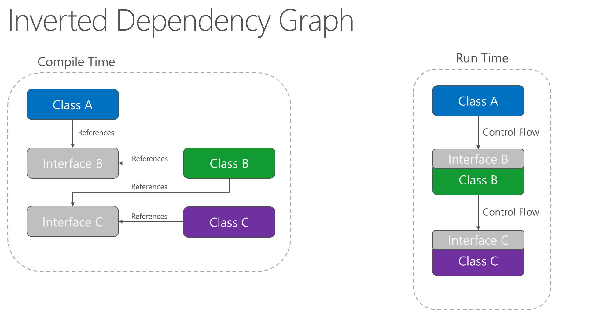

## 	服务器

-托管模型

### 进程内托管模型

ASP.NET Core 模块：

- 执行应用初始化。
  - 加载 [CoreCLR](https://docs.microsoft.com/zh-cn/dotnet/standard/glossary#coreclr)。
  - 调用 `Program.Main`。
- 处理 IIS 本机请求的生存期。

定目标到 .NET Framework 的 ASP.NET Core 应用不支持进程内托管模型。

下图说明了 IIS、ASP.NET Core 模块和进程内托管的应用之间的关系：

### 进程外托管模型

由于 ASP.NET Core 应用在独立于 IIS 工作进程的进程中运行，因此该模块会处理进程管理。 该模块在第一个请求到达时启动 ASP.NET Core 应用的进程，并在应用关闭或崩溃时重新启动该应用。 这基本上与在 [Windows 进程激活服务 (WAS)](https://docs.microsoft.com/zh-cn/iis/manage/provisioning-and-managing-iis/features-of-the-windows-process-activation-service-was) 托管的进程内运行的应用中出现的行为相同。

下图说明了 IIS、ASP.NET Core 模块和进程外托管的应用之间的关系：

## Kestrel

Kestrel 是 ASP.NET Core 项目模板中包括的默认 Web 服务器。

Kestrel 的使用方式如下：

- 本身作为边缘服务器，处理直接来自网络（包括 Internet）的请求。

  

- 与反向代理服务器（如 [Internet Information Services (IIS)](https://www.iis.net/)、[Nginx](http://nginx.org) 或 [Apache](https://httpd.apache.org/)）结合使用。 反向代理服务器接收来自 Internet 的 HTTP 请求，并将这些请求转发到 Kestrel。

  

## ASP.NET Core 中间件

使用 [Run](https://docs.microsoft.com/dotnet/api/microsoft.aspnetcore.builder.runextensions.run)[Map](https://docs.microsoft.com/dotnet/api/microsoft.aspnetcore.builder.mapextensions.map) 和 [Use](https://docs.microsoft.com/dotnet/api/microsoft.aspnetcore.builder.useextensions.use) 扩展方法来配置请求委托。 

可将一个单独的请求委托并行指定为匿名方法（称为并行中间件）

或在可重用的类中对其进行定义。 

这些可重用的类和并行匿名方法即为中间件，也叫中间件组件。

### 使用 IApplicationBuilder 创建中间件管道

泳道-流程	中间件管道

一系列请求委托，依次调用

双向队列结构

[重述 HTTP 模块和处理程序的工作原理：](https://docs.microsoft.com/zh-cn/aspnet/core/migration/http-modules?view=aspnetcore-2.2)

顺序定义了针对请求调用这些组件的顺序，以及响应的相反顺序。 此排序对于安全性、性能和功能至关重要。

## Scope

特征设置范围

全局-租户-个人

## 将 HTTP 处理程序和模块[迁移到 ASP.NET Core 中间件](https://docs.microsoft.com/zh-cn/aspnet/core/migration/http-modules?view=aspnetcore-2.2)

如前面所述，没有任何应用程序生命周期中 ASP.NET Core，中间件处理响应的顺序不同于使用模块的顺序。 这可能使你订购的决策更具挑战性。

如果排序将为问题，无法将你的模块[[写入自定义 ASP.NET Core 中间件](https://docs.microsoft.com/zh-cn/aspnet/core/fundamentals/middleware/write?view=aspnetcore-2.2)]分为多个中间件组件可单独进行排序。

所有中间件都是在这个HttpContext上下文中处理请求的

## 依赖关系反转

应用程序中的依赖关系方向应该是抽象的方向，而不是实现详细信息的方向。 大部分应用程序都是这样编写的，以便编译时依赖关系顺着运行时执行的方向流动。 这将产生一个直接依赖项关系图。 也就是说，如果模块 A 调用模块 B 中的函数，而模块 B 又调用模块 C 中的函数，则编译时 A 取决于 B，而 B 又取决于 C，如图 4-1 中所示。

**图 4-1**。 直接依赖项关系图。

应用依赖关系反转原则后，A 可以调用 B 实现的抽象上的方法，让 A 可以在运行时调用 B，而 B 又在编译时依赖于 A 控制的接口（因此，典型的编译时依赖项发生反转）。 运行时，程序执行的流程保持不变，但接口引入意味着可以轻松插入这些接口的不同实现。

**图 4-2**。 反转依赖项关系图。

依赖项反转是生成松散耦合应用程序的关键一环，因为可以将实现详细信息编写为依赖并实现更高级别的抽象，而不是相反。 因此，生成的应用程序的可测试性、模块化程度以及可维护性更高。 遵循依赖关系反转原则可实现依赖关系注入。

##	出站请求中间件

**`IHttpClientFactory`** 可以轻松定义处理程序并应用于每个命名客户端。 它支持注册和链接多个处理程序，以生成出站请求中间件管道。 每个处理程序都可以在出站请求前后执行工作。 此模式类似于 ASP.NET Core 中的入站中间件管道。 此模式提供了一种用于管理围绕 HTTP 请求的**横切关注点**的机制，包括缓存、错误处理、序列化以及日志记录。

##	使用基于 Polly 的处理程序[熔断]

`IHttpClientFactory` 与一个名为 [Polly](https://github.com/App-vNext/Polly) 的热门第三方库集成。 Polly 是适用于 .NET 的全面恢复和临时故障处理库。 开发人员通过它可以表达策略，例如以流畅且线程安全的方式处理重试、断路器、超时、Bulkhead 隔离和回退。

## 在 [Docker 容器中托管](https://docs.microsoft.com/zh-cn/aspnet/core/host-and-deploy/docker/?view=aspnetcore-2.1) ASP.NET Core

