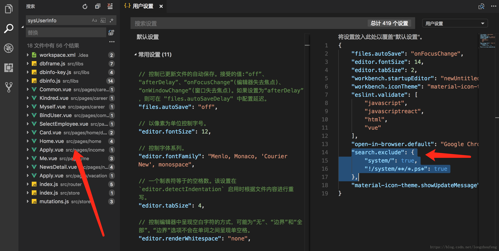

# VScode 全局搜索功能

​                                                   2018年05月23日 10:06:20           [meiger](https://me.csdn.net/u012529163)           阅读数：40526                                                                  

​                   

​                                                                         版权声明：          https://blog.csdn.net/u012529163/article/details/80415572        

最近知道到VScode这个软件，开始试用，总体感觉很不错，就是不能全局搜索，经过了解，是我的配置问题，上网找到了一个解决办法，

在配置文件添加：

“search.exclude”: { 
         “system/”: true, 
         “!/system/**/*.ps*”: true 
       }， 
 现在测试一下吧， 
  ctrl + shift +F，开始你的表演吧。


----


# VSCODE 全局搜索无效的问题

​                                                   2018年03月27日 15:27:17           [longzhoufeng](https://me.csdn.net/longzhoufeng)           阅读数：13400                                                                  

​                   

​                                                                         版权声明：本文为博主原创文章，未经博主允许不得转载。          https://blog.csdn.net/longzhoufeng/article/details/79713865        

## VSCODE 全局搜索无效的问题

1. 打开设置
2. 把如下代码复制粘贴进入

```
"search.exclude": {
   "system/": true,
   "!/system/**/*.ps*": true
 }1234
```

重启VSCODE，然后就能看到效果



​              