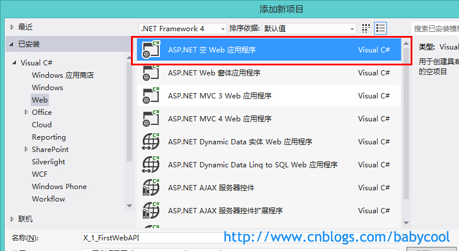
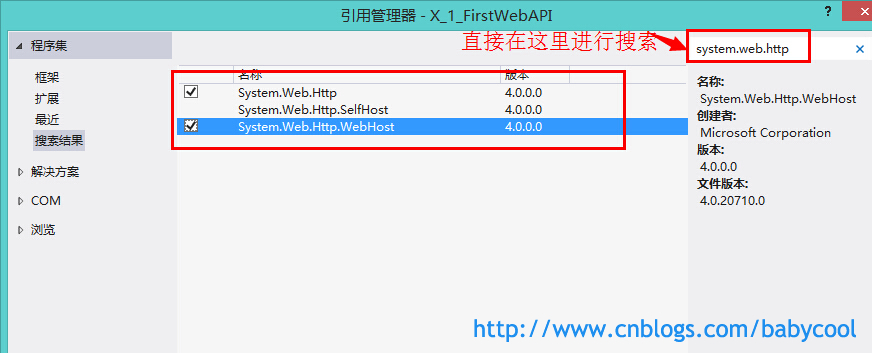
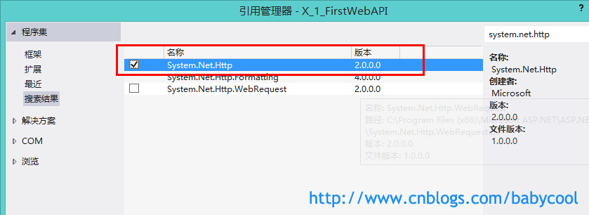
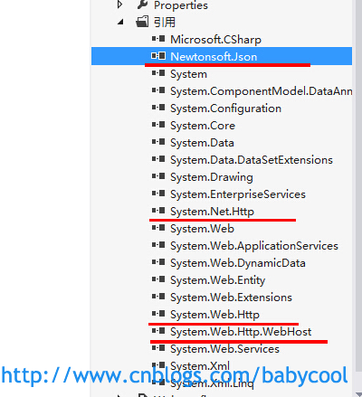
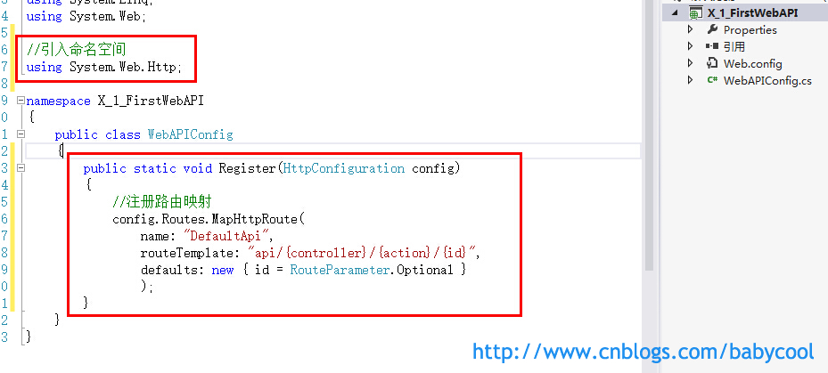
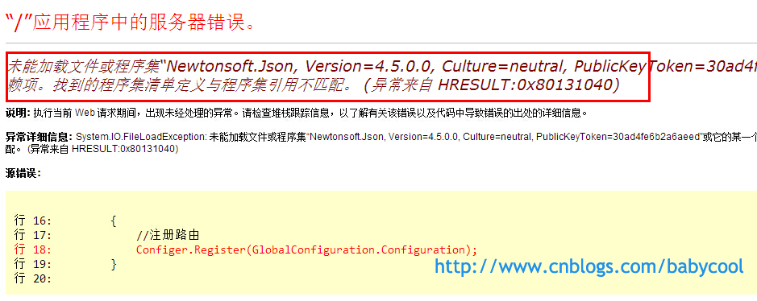
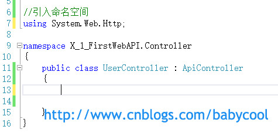
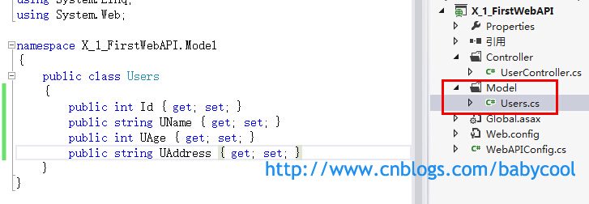

# [酷小孩](https://www.cnblogs.com/babycool/)

- [博客园](https://www.cnblogs.com/)
- [首页](https://www.cnblogs.com/babycool/)
- [新随笔](https://i.cnblogs.com/EditPosts.aspx?opt=1)
- [联系](https://msg.cnblogs.com/send/酷小孩)
- [订阅](https://www.cnblogs.com/babycool/rss) 
- [管理](https://i.cnblogs.com/)

 随笔 - 113   文章 - 0   评论 - 408 

#  			[ASP.NET MVC学习系列(一)-WebAPI初探](https://www.cnblogs.com/babycool/p/3861277.html) 		


　　由于即将要接手的新项目计划用ASP.NET   MVC3来开发，所以最近一段时间一直在看相关的书或文章。因为之前在大学里也曾学习过MVC2开发，也做过几个简单的MVC2的小型测试项目，不过在后来工作以后主要还是开发WebForm的项目，所以MVC的东西也就逐渐的淡忘了。

　　经过这一段时间的系统学习，真的觉得MVC3相比于之前的MVC2还有WebForm来说，确实有一种让人欲罢不能爽歪歪的感觉。特别是Razor语法、Linq表达式等的结合运用。

　　为了将学习过程中遇到的一些值得留意的问题和知识点进行一个很好地整理，所以打算把对MVC的学习过程整理成一个文章系列，同时也希望能帮助那些初学ASP.NET   MVC的童鞋们。可能文章的风格不会像其他文章那样讲的很深，主要还是通过实例来表达吧。由于自己也是初学，文章中难免有错误，也希望各位高手能够多多指教，大家共同学习。

　　好了，废话不多说，进入正题。

　　个人觉得在MVC中，路由规则算是比较重要的一点。记得之前曾看过dudu站长的一篇文章 [HttpClient + ASP.NET Web API, WCF之外的另一个选择](http://www.cnblogs.com/dudu/archive/2012/05/11/asp_net_webapi_httpclient.html) ，对于用惯了“html+ajax+一般处理程序” 来开发项目的我来说，觉得这应该算是另一种更加高端的处理数据请求的方式吧，所以，今天我们就从这种“精简版的WebAPI” 开始说起。

 

　　首先，先创建一个“ASP.NET 空Web应用程序” ：



　　然后添加对 “System.Web.Http” 和 “System.Web.Http.WebHost” 的引用：



 

　　再添加对“System.Net.Http” 的引用：



 

　　由于需要用到对Json数据的处理，所以还要添加对 “Newtonsoft.Json” 的引用。

这里需要注意一下：

如果开始不添加对“Newtonsoft.Json”的引用，在项目运行时就会报错，具体报错原因稍后再说。

 

　　对四个类库的引用：



 

　　然后新建一个类，用于注册默认路由映射，这里类名为 WebAPIConfig ：



　　添加Global.asax文件，在 Application_Start 方法中 初始化路由映射：

```
        protected void Application_Start(object sender, EventArgs e)
        {
            //在应用程序启动时注册路由映射
            WebAPIConfig.Register(GlobalConfiguration.Configuration);
        }
```

　　记得引入命名空间：

```
using System.Web.Http;
```

　　注意：

上面我们提到，如果开始时不引用 “Newtonsoft.Json”，那么在运行时 注册路由映射这里就会报错：



 

　创建名为Controller的文件夹，然后添加一个类且类名以 Controller结尾，这里为UserController 。让这个类继承自 ApiController 基类：



　　创建名为Model的文件夹用来存放实体类，添加Users类：



　　在 UserController 类中，添加一个 GetUser() 方法，模拟一些数据：

[](javascript:void(0);)

```
//引入命名空间
using System.Web.Http;
using X_1_FirstWebAPI.Model;

namespace X_1_FirstWebAPI.Controller
{
    public class UserController : ApiController
    {

        public List<Users> GetUser()
        {
            var userList = new List<Users> { 
            new Users{ Id=1,UName="张三",UAge=12,UAddress="海淀区"},
            new Users{Id=2,UName="李四",UAge=23,UAddress="昌平区"},
            new Users{Id=3,UName="王五",UAge=34,UAddress="朝阳区"}
            };

            var temp = (from u in userList
                        select u).ToList();
            return temp;
        }

    }
}
```

[](javascript:void(0);)

 

　　我们之前添加的路由规则为 "api/{controller}/{action}/{id}"  ，所以，我们在浏览器中访问数据的url为  http://localhost:****/api/controllerName/actionName  的形式，在这里即是  api/user/getuser :


　　OK，到这里，精简版的WebAPI项目就完成了，这个应该对于大部分.NET程序员来说理解起来是很简单的。

那下一篇文章我们就深入地来聊一聊如何调用WebAPI请求后台数据吧！

 　　[下载代码](http://files.cnblogs.com/babycool/XWebAPIDemo-WebAPI初探Demo.zip)

转载请注明出处。


作者：

酷小孩 

出处：<http://www.cnblogs.com/babycool/>

本文首发博客园，版权归作者跟博客园共有。

转载必须保留本段声明，并在页面显著位置给出本文链接，否则保留追究法律责任的权利。


分类: [ASP.NET MVC](https://www.cnblogs.com/babycool/category/383002.html),[C#](https://www.cnblogs.com/babycool/category/315471.html),[ASP.NET Web API](https://www.cnblogs.com/babycool/category/605206.html)


​         [好文要顶](javascript:void(0);)             [关注我](javascript:void(0);)     [收藏该文](javascript:void(0);)     [](javascript:void(0);)     [](javascript:void(0);) 


​             [酷小孩](https://home.cnblogs.com/u/babycool/)
​             [关注 - 112](https://home.cnblogs.com/u/babycool/followees)
​             [粉丝 - 298](https://home.cnblogs.com/u/babycool/followers)         


​                 [+加关注](javascript:void(0);)     

​         12     

​         0     


​     


[« ](https://www.cnblogs.com/babycool/p/3861181.html) 上一篇：[[开发笔记\]-Jqplot图表初体验](https://www.cnblogs.com/babycool/p/3861181.html)
[» ](https://www.cnblogs.com/babycool/p/3873798.html) 下一篇：[Sublime Text 使用技巧](https://www.cnblogs.com/babycool/p/3873798.html)

posted @ 2014-07-22 20:07 [酷小孩](https://www.cnblogs.com/babycool/) 阅读(41666) 评论(16)  [编辑](https://i.cnblogs.com/EditPosts.aspx?postid=3861277) [收藏](https://www.cnblogs.com/babycool/p/3861277.html#)


评论列表


 					  [回复](javascript:void(0);)[引用](javascript:void(0);) 				

\#1楼


2014-07-22 22:00

专注.net技术开发

 

直接用mvc4吧

[支持(0)](javascript:void(0);)[反对(0)](javascript:void(0);)

 					  [回复](javascript:void(0);)[引用](javascript:void(0);) 				

\#2楼


2014-07-23 08:25

柯小柯、瓶子

 

[@](https://www.cnblogs.com/babycool/p/3861277.html#2992648) 专注.net技术开发
web API 是要用MVC 4     但是这上面也没说安全问题

[支持(0)](javascript:void(0);)[反对(0)](javascript:void(0);)

 					  [回复](javascript:void(0);)[引用](javascript:void(0);) 				

\#3楼


[

楼主

]  

2014-07-23 11:01

酷小孩

 

[@](https://www.cnblogs.com/babycool/p/3861277.html#2992648) 专注.net技术开发
恩，相比于如果只想用WebAPI的话，mvc4实在是有点大材小用了，不过不得不说MVC4对WebAPI是有很大改进的。

[支持(1)](javascript:void(0);)[反对(0)](javascript:void(0);)

 					  [回复](javascript:void(0);)[引用](javascript:void(0);) 				

\#4楼


[

楼主

]  

2014-07-23 11:03

酷小孩

 

[@](https://www.cnblogs.com/babycool/p/3861277.html#2992726) 柯小柯、瓶子
安全问题。。。能否说的详细一点呢？

[支持(1)](javascript:void(0);)[反对(0)](javascript:void(0);)

 					  [回复](javascript:void(0);)[引用](javascript:void(0);) 				

\#5楼


2014-07-23 17:06

丶PanPan

 

持续关注

[支持(1)](javascript:void(0);)[反对(0)](javascript:void(0);)

 					  [回复](javascript:void(0);)[引用](javascript:void(0);) 				

\#6楼


[

楼主

]  

2014-07-24 08:22

酷小孩

 

[@](https://www.cnblogs.com/babycool/p/3861277.html#2993223) PanPanCN
谢谢

[支持(1)](javascript:void(0);)[反对(0)](javascript:void(0);)

 					  [回复](javascript:void(0);)[引用](javascript:void(0);) 				

\#7楼


2015-07-08 08:54

i surrender

 

老师您好 可以请教个问题吗 我的QQ 936944308 谢谢您

[支持(3)](javascript:void(0);)[反对(0)](javascript:void(0);)

 					  [回复](javascript:void(0);)[引用](javascript:void(0);) 				

\#8楼


2015-09-20 21:25

Lumia1020

 

收藏一下

[支持(0)](javascript:void(0);)[反对(0)](javascript:void(0);)

 					  [回复](javascript:void(0);)[引用](javascript:void(0);) 				

\#9楼


2016-01-13 09:18

飛飛逹人

 

下一篇在哪

[支持(0)](javascript:void(0);)[反对(0)](javascript:void(0);)

 					  [回复](javascript:void(0);)[引用](javascript:void(0);) 				

\#10楼


2016-05-24 10:52

橙子瓣

 

var temp = (from u in userList
             select u).ToList();
这句话有必要么？直接return userList不就完了，还再循环一遍，一点意义没有

[支持(0)](javascript:void(0);)[反对(0)](javascript:void(0);)

 					  [回复](javascript:void(0);)[引用](javascript:void(0);) 				

\#11楼


[

楼主

]  

2016-05-25 14:29

酷小孩

 

[@](https://www.cnblogs.com/babycool/p/3861277.html#3437969) 橙子瓣
确实是没有必要，多谢提醒。

[支持(0)](javascript:void(0);)[反对(0)](javascript:void(0);)

 					  [回复](javascript:void(0);)[引用](javascript:void(0);) 				

\#12楼


2016-11-24 20:01

攀迪

 

易懂，不错

[支持(0)](javascript:void(0);)[反对(0)](javascript:void(0);)

 					  [回复](javascript:void(0);)[引用](javascript:void(0);) 				

\#13楼


2017-05-03 17:09

纪晓鱼

 

楼主写的挺好，从空的项目一步步去创建，更易懂，虽然很基础，但是确实适合初学者。有问题大家指出就好，不要过分苛责了

[支持(0)](javascript:void(0);)[反对(0)](javascript:void(0);)

 					  [回复](javascript:void(0);)[引用](javascript:void(0);) 				

\#14楼


[

楼主

]  

2017-05-05 09:56

酷小孩

 

[@](https://www.cnblogs.com/babycool/p/3861277.html#3682573) 纪晓鱼
欢迎讨论

[支持(0)](javascript:void(0);)[反对(0)](javascript:void(0);)

 					  [回复](javascript:void(0);)[引用](javascript:void(0);) 				

\#15楼


2017-05-05 10:39

纪晓鱼

 

[@](https://www.cnblogs.com/babycool/p/3861277.html#3683960) 酷小孩
哈哈。好的。像楼主学习。

[支持(0)](javascript:void(0);)[反对(0)](javascript:void(0);)

 					  [回复](javascript:void(0);)[引用](javascript:void(0);) 				

\#16楼


2017-12-22 16:21

我来未来

 

挺好的，终于看懂了一个例子

[支持(0)](javascript:void(0);)[反对(0)](javascript:void(0);)


[刷新评论](javascript:void(0);)[刷新页面](https://www.cnblogs.com/babycool/p/3861277.html#)[返回顶部](https://www.cnblogs.com/babycool/p/3861277.html#top)

发表评论


 昵称： 

评论内容：

       


 

  [退出](javascript:void(0);)         [订阅评论](javascript:void(0);) 


 [Ctrl+Enter快捷键提交] 


[【推荐】超50万C++/C#源码: 大型实时仿真组态图形源码](http://www.ucancode.com/index.htm)
[【推荐】Java工作两年，一天竟收到33份面试通知](https://ke.qq.com/adActivity.html?name=xiangxueketang2)
[【推荐】程序员问答平台，解决您开发中遇到的技术难题](https://q.cnblogs.com/)


<iframe id="google_ads_iframe_/1090369/C1_0" title="3rd party ad content" name="google_ads_iframe_/1090369/C1_0" scrolling="no" marginwidth="0" marginheight="0" style="border: 0px none; vertical-align: bottom;" srcdoc="" data-google-container-id="1" data-load-complete="true" width="300" height="250" frameborder="0"></iframe>

**相关博文：**
·  [ASP.NET MVC学习系列(一)-WebAPI初探](https://www.cnblogs.com/jx270/p/6411626.html)
·  [ASP.NET MVC学习系列(一)-WebAPI初探](https://www.cnblogs.com/qfb620/p/6606044.html)
·  [ASP.NETMVC学习系列(一)-WebAPI初探](https://www.cnblogs.com/wangsea/p/9577793.html)
·  [WebAPI初探](https://www.cnblogs.com/chen110xi/p/4531145.html)
·  [转：WebApi（一）](https://www.cnblogs.com/BOSET/p/7085024.html)

<iframe id="google_ads_iframe_/1090369/C2_0" title="3rd party ad content" name="google_ads_iframe_/1090369/C2_0" scrolling="no" marginwidth="0" marginheight="0" style="border: 0px none; vertical-align: bottom;" srcdoc="" data-google-container-id="2" data-load-complete="true" width="468" height="60" frameborder="0"></iframe>

**最新新闻**：
 ·  [全球零售品牌榜出炉：阿里品牌价值1312亿美元排第二](https://news.cnblogs.com/n/625953/)
 ·  [饥饿能“饿死”癌细胞？刷爆朋友圈的流言到底是真是假](https://news.cnblogs.com/n/625952/)
 ·  [“双小行星”1999 KW4有什么奇特之处？](https://news.cnblogs.com/n/625951/)
 ·  [日本宣布将限制外资持有本国科技公司股权](https://news.cnblogs.com/n/625950/)
 ·  [WHO 将游戏成瘾归类为疾病](https://news.cnblogs.com/n/625949/)
» [更多新闻...](http://news.cnblogs.com/)


### 公告


酷小孩

 本博客中随笔除标明【转载】者均为原创，转载请注明出处。 

 座右铭： 兴趣是最好的老师 

 学知识，不仅要知其然，还要知其所以然

昵称：

酷小孩

园龄：

7年9个月

粉丝：

298

关注：

112

[+加关注](javascript:void(0);)

| [<](javascript:void(0);)2019年5月[>](javascript:void(0);) |      |      |      |      |      |      |
| --------------------------------------------------------- | ---- | ---- | ---- | ---- | ---- | ---- |
| 日                                                        | 一   | 二   | 三   | 四   | 五   | 六   |
| 28                                                        | 29   | 30   | 1    | 2    | 3    | 4    |
| 5                                                         | 6    | 7    | 8    | 9    | 10   | 11   |
| 12                                                        | 13   | 14   | 15   | 16   | 17   | 18   |
| 19                                                        | 20   | 21   | 22   | 23   | 24   | 25   |
| 26                                                        | 27   | 28   | 29   | 30   | 31   | 1    |
| 2                                                         | 3    | 4    | 5    | 6    | 7    | 8    |

### 搜索

 

### 常用链接

- [我的随笔](https://www.cnblogs.com/babycool/p/)
- [我的评论](https://www.cnblogs.com/babycool/MyComments.html)
- [我的参与](https://www.cnblogs.com/babycool/OtherPosts.html)
- [最新评论](https://www.cnblogs.com/babycool/RecentComments.html)
- [我的标签](https://www.cnblogs.com/babycool/tag/)

### 最新随笔

- [1. 使用Travis CI自动部署Hexo博客](https://www.cnblogs.com/babycool/p/7326722.html)
- [2. O2O地图应用之判断用户订单地址是否在服务范围内](https://www.cnblogs.com/babycool/p/5506339.html)
- [3. VirtualBox不能为虚拟电脑 Ubuntu 打开一个新任务](https://www.cnblogs.com/babycool/p/5348155.html)
- [4. ubuntu 12.04 安装Docker 实战](https://www.cnblogs.com/babycool/p/5255252.html)
- [5. Python将文本生成二维码](https://www.cnblogs.com/babycool/p/4734819.html)
- [6. Python 发送邮件](https://www.cnblogs.com/babycool/p/4734780.html)
- [7. 北京地铁月度消费总金额计算(Python版)](https://www.cnblogs.com/babycool/p/4611031.html)
- [8. 将w3cplus网站中的文章页面提取并导出为pdf文档](https://www.cnblogs.com/babycool/p/4172419.html)
- [9. ASP.NET MVC学习系列(二)-WebAPI请求](https://www.cnblogs.com/babycool/p/3922738.html)
- [10. [开发笔记\]-MarkDown语法](https://www.cnblogs.com/babycool/p/3892731.html)

### 随笔分类

- [.NET Framework(8)](https://www.cnblogs.com/babycool/category/315965.html) 
- [ASP.NET(28)](https://www.cnblogs.com/babycool/category/315468.html) 
- [ASP.NET MVC(2)](https://www.cnblogs.com/babycool/category/383002.html) 
- [ASP.NET Web API(2)](https://www.cnblogs.com/babycool/category/605206.html) 
- [ASP.NET扩展工具(1)](https://www.cnblogs.com/babycool/category/337208.html) 
- [C#(28)](https://www.cnblogs.com/babycool/category/315471.html) 
- [CSS(6)](https://www.cnblogs.com/babycool/category/372298.html) 
- [Docker(1)](https://www.cnblogs.com/babycool/category/796621.html) 
- [HTML5(1)](https://www.cnblogs.com/babycool/category/368674.html) 
- [JAVA](https://www.cnblogs.com/babycool/category/315470.html) 
- [JavaScript(12)](https://www.cnblogs.com/babycool/category/333334.html) 
- [jQuery(9)](https://www.cnblogs.com/babycool/category/366692.html) 
- [Linux(4)](https://www.cnblogs.com/babycool/category/337207.html) 
- [Python(3)](https://www.cnblogs.com/babycool/category/706430.html) 
- [Service服务(4)](https://www.cnblogs.com/babycool/category/582412.html) 
- [SQL Server(4)](https://www.cnblogs.com/babycool/category/336099.html) 
- [Sqlite](https://www.cnblogs.com/babycool/category/596889.html) 
- [Winform(9)](https://www.cnblogs.com/babycool/category/315469.html) 
- [WPF(1)](https://www.cnblogs.com/babycool/category/543538.html) 
- [程序人生(10)](https://www.cnblogs.com/babycool/category/315869.html) 
- [电脑技巧(6)](https://www.cnblogs.com/babycool/category/338455.html) 
- [开发笔记(37)](https://www.cnblogs.com/babycool/category/483879.html) 
- [前端开发(2)](https://www.cnblogs.com/babycool/category/579383.html) 
- [求职面试(3)](https://www.cnblogs.com/babycool/category/315870.html) 

### 随笔档案

- [2017年8月 (1)](https://www.cnblogs.com/babycool/archive/2017/08.html) 
- [2016年5月 (1)](https://www.cnblogs.com/babycool/archive/2016/05.html) 
- [2016年4月 (1)](https://www.cnblogs.com/babycool/archive/2016/04.html) 
- [2016年3月 (1)](https://www.cnblogs.com/babycool/archive/2016/03.html) 
- [2015年8月 (2)](https://www.cnblogs.com/babycool/archive/2015/08.html) 
- [2015年6月 (1)](https://www.cnblogs.com/babycool/archive/2015/06.html) 
- [2014年12月 (1)](https://www.cnblogs.com/babycool/archive/2014/12.html) 
- [2014年8月 (2)](https://www.cnblogs.com/babycool/archive/2014/08.html) 
- [2014年7月 (5)](https://www.cnblogs.com/babycool/archive/2014/07.html) 
- [2014年5月 (6)](https://www.cnblogs.com/babycool/archive/2014/05.html) 
- [2014年4月 (4)](https://www.cnblogs.com/babycool/archive/2014/04.html) 
- [2014年3月 (7)](https://www.cnblogs.com/babycool/archive/2014/03.html) 
- [2014年2月 (7)](https://www.cnblogs.com/babycool/archive/2014/02.html) 
- [2014年1月 (7)](https://www.cnblogs.com/babycool/archive/2014/01.html) 
- [2013年12月 (1)](https://www.cnblogs.com/babycool/archive/2013/12.html) 
- [2013年9月 (1)](https://www.cnblogs.com/babycool/archive/2013/09.html) 
- [2013年7月 (3)](https://www.cnblogs.com/babycool/archive/2013/07.html) 
- [2013年6月 (7)](https://www.cnblogs.com/babycool/archive/2013/06.html) 
- [2013年5月 (1)](https://www.cnblogs.com/babycool/archive/2013/05.html) 
- [2013年3月 (1)](https://www.cnblogs.com/babycool/archive/2013/03.html) 
- [2012年11月 (1)](https://www.cnblogs.com/babycool/archive/2012/11.html) 
- [2012年8月 (3)](https://www.cnblogs.com/babycool/archive/2012/08.html) 
- [2012年6月 (2)](https://www.cnblogs.com/babycool/archive/2012/06.html) 
- [2012年5月 (4)](https://www.cnblogs.com/babycool/archive/2012/05.html) 
- [2012年4月 (5)](https://www.cnblogs.com/babycool/archive/2012/04.html) 
- [2012年3月 (5)](https://www.cnblogs.com/babycool/archive/2012/03.html) 
- [2012年2月 (4)](https://www.cnblogs.com/babycool/archive/2012/02.html) 
- [2012年1月 (1)](https://www.cnblogs.com/babycool/archive/2012/01.html) 
- [2011年12月 (7)](https://www.cnblogs.com/babycool/archive/2011/12.html) 
- [2011年11月 (9)](https://www.cnblogs.com/babycool/archive/2011/11.html) 
- [2011年10月 (1)](https://www.cnblogs.com/babycool/archive/2011/10.html) 
- [2011年9月 (1)](https://www.cnblogs.com/babycool/archive/2011/09.html) 
- [2011年8月 (10)](https://www.cnblogs.com/babycool/archive/2011/08.html) 

### 积分与排名

-  		积分 -	191778 	
-  		排名 -	1895 	

### 最新评论

- [1. Re:C#程序调用cmd执行命令](https://www.cnblogs.com/babycool/p/3570648.html#4222851)
- 请教两个问题，1.为什么能直接找到cmd.exe , 2 .我这输出的中文为什么是乱码
- --富坚老贼
- [2. Re:C#如何以管理员身份运行程序](https://www.cnblogs.com/babycool/p/3569183.html#4165122)
- 跟exe右键以管理员身份运行性质一样吗？
- --木庄
- [3. Re:C#程序调用cmd执行命令](https://www.cnblogs.com/babycool/p/3570648.html#4155483)
- 学到了，非常感谢！
- --真为我感到捉急
- [4. Re:C#如何以管理员身份运行程序](https://www.cnblogs.com/babycool/p/3569183.html#4125280)
- 试了一下,好象单独运行应用程序也不需要有管理员认证了。感谢分享!
- --黑白天使
- [5. Re:[开发笔记\]-jQuery获取checkbox选中项等操作及注意事项](https://www.cnblogs.com/babycool/p/3302904.html#4101075)
- 写得很详细,而且有把所有代码贴出来,这对第一次接触的新手来说是个福音.感谢
- --希望cqx

### 阅读排行榜

- [1. [开发笔记\]-使用jquery获取url及url参数的方法(295404)](https://www.cnblogs.com/babycool/p/3169058.html)
- [2. jQuery无刷新上传之uploadify简单试用(146135)](https://www.cnblogs.com/babycool/archive/2012/08/04/2623137.html)
- [3. C#程序调用cmd执行命令(117524)](https://www.cnblogs.com/babycool/p/3570648.html)
- [4. ASP.NET MVC学习系列(二)-WebAPI请求(86275)](https://www.cnblogs.com/babycool/p/3922738.html)
- [5. C#如何以管理员身份运行程序(63996)](https://www.cnblogs.com/babycool/p/3569183.html)

### 评论排行榜

- [1. jQuery无刷新上传之uploadify简单试用(70)](https://www.cnblogs.com/babycool/archive/2012/08/04/2623137.html)
- [2. ASP.NET MVC学习系列(二)-WebAPI请求(65)](https://www.cnblogs.com/babycool/p/3922738.html)
- [3. 关于一道.NET程序员面试题的遐想(46)](https://www.cnblogs.com/babycool/archive/2012/02/22/2362725.html)
- [4. [开发笔记\]-未找到与约束ContractName Microsoft.VisualStudio.Text.ITextDocumentFactoryService...匹配的导出(45)](https://www.cnblogs.com/babycool/p/3199158.html)
- [5. 动软，我被你迷惑了(32)](https://www.cnblogs.com/babycool/archive/2012/04/20/2460723.html)

### 推荐排行榜

- [1. ASP.NET MVC学习系列(二)-WebAPI请求(60)](https://www.cnblogs.com/babycool/p/3922738.html)
- [2. [开发笔记\]-未找到与约束ContractName Microsoft.VisualStudio.Text.ITextDocumentFactoryService...匹配的导出(27)](https://www.cnblogs.com/babycool/p/3199158.html)
- [3. C#程序调用cmd执行命令(18)](https://www.cnblogs.com/babycool/p/3570648.html)
- [4. [开发笔记\]-使用jquery获取url及url参数的方法(16)](https://www.cnblogs.com/babycool/p/3169058.html)
- [5. C#如何以管理员身份运行程序(14)](https://www.cnblogs.com/babycool/p/3569183.html)


 		  Copyright ©2019 酷小孩 	