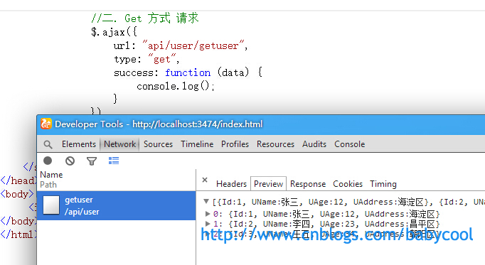
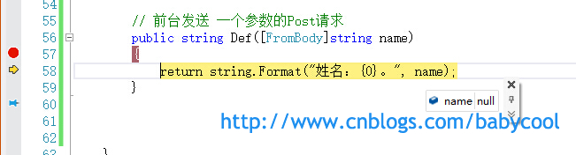
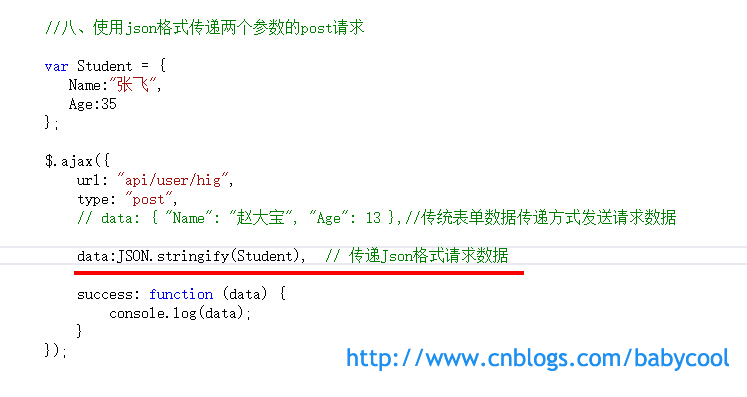

# [酷小孩](https://www.cnblogs.com/babycool/)

- [博客园](https://www.cnblogs.com/)
- [首页](https://www.cnblogs.com/babycool/)
- [新随笔](https://i.cnblogs.com/EditPosts.aspx?opt=1)
- [联系](https://msg.cnblogs.com/send/酷小孩)
- [订阅](https://www.cnblogs.com/babycool/rss) 
- [管理](https://i.cnblogs.com/)

 随笔 - 113   文章 - 0   评论 - 408 

#  			[ASP.NET MVC学习系列(二)-WebAPI请求](https://www.cnblogs.com/babycool/p/3922738.html) 		

　　继续接着上文 [ASP.NET MVC学习系列(一)-WebAPI初探](http://www.cnblogs.com/babycool/p/3861277.html) 来看看对于一般前台页面发起的get和post请求，我们在Web API中要如何来处理。

这里我使用Jquery 来发起异步请求实现数据调用。

　　继续使用上一文章中的示例，添加一个index.html页面，添加对jquery的引用。

 

**一、无参数Get请求**

　　一般的get请求我们可以使用jquery提供的$.get() 或者$.ajax({type:"get"}) 来实现：

　　请求的后台Action方法仍为上篇文章中的GetUser() :

　　也可以用$.ajax({type:"get"}) 方式，正确的获得了返回数据：

 

**二、传递一个参数的Get请求**

　　通常我们需要传递参数只需要指定ajax方法的data属性即可： data:{"name":"赵大宝"} 

　　后台正确的返回数据：

 

**三、传递两个或多个参数的Get请求**

　　按照上面的方法，对于多个参数我们可以很容易就写出来： data:{"name":"赵大宝","age":12}

 　　后台正确的返回数据：

**四、无参数的Post请求**

　　我们可以使用$.post() 或$.ajax({type:"post"}) 来发起post请求：

　　后台正确的返回了数据：

**五、传递一个参数的Post请求：**

　　首先这里需要提醒大家一下，我们在修改完后台代码后，如果没有重新生成项目，那么在请求时就会报错：“未找到与请求***匹配的HTTP资源” ：

　　所以，我们只要我们修改了后台代码，就一定要重新生成一下：

 

　　不过，当我们重新生成项目，再次发送请求，看到的仍然是404错误，再次检查一番代码，也没有发现是哪里的问题。

　　**事实上，ASP.NET Web API能够正确的识别我们的UserController控制器处理Post /api/user ，但却不能找到一个可以接受的方法来处理请求。**

也就是说，Web API接收到的请求能够找到User控制器，但在该控制器中找不到名称为Def 的这个Action。

那我们要怎么来解决呢？

通过搜索MSDN上Web API官网中的说明，我们可以找到下面的一段介绍：

即**在Action 方法中我们需要使用 [FromBody] 属性标签来标明属性**。

　　修改后，再次发送请求，我们可以看到，Status Code 为200，请求发送成功。

　　可以看到，在post请求中，方法的参数必须要用 [FromBody] 属性来修饰才可以， [FromBody] 就告诉Web API 要从post请求体重去获取参数的值。

但让我们诧异的却是，后台返回的数据中name的值为空。

　　通过调试，我们可以看到，后台Action 中接收到的name值为null。

 

　　通过上面的测试我就也能够猜测到，Web API 要求请求传递的  [FromBody] 参数，肯定是有一个特定的格式，才能被正确的获取到。而这种特定的格式并不是我们常见的 key=value  的键值对形式。Web API 的模型绑定器希望找到 [FromBody] 里没有键名的值，也就是说， 不是 key=value ，而是  =value 。

现在，咱们把data中的key设置为空，然后再次发送请求：

　　测试可见，后台正确的接收到了数据:

 **六、传递两个参数的Post请求**

　　按理说，一个参数的请求实现了，那么传递两个或者多个参数也就很顺利了，对于两个参数的后台接收方法，我们可能会这样来写:

但事实证明，这样是错误的。

 

那到底两个或者多个参数我们要怎样来定义呢？

再次查看官网中的介绍，我们了解到：

　　也就是说，**[FromBody] 修饰的参数只能有一个**。我们需要对传递的多个参数进行封装才行。

这里，我们可以将 Name和 Age 封装成一个Student 类：

　　前台页面再次发送请求：

　　Status Code为200，请求成功，并正确获取到后台返回的数据：

 

　　这里，我们通过上面图片中的请求头数据可以看到，Form Data  的格式是 key=value&key=value  这种表单数据格式 Name=%E8%B5%B5%E5%A4%A7%E5%AE%9D&Age=13  ，我们平时使用的比较多的一般为json格式。 这里，我们使用 JSON.stringify() 来序列化数据。

再次发送请求：

　　可以看到，From Data 中数据的格式为json字符串，Status Code为200，请求正确，但结果又出错了，后台又没有接收到数据参数：

那么问题到底出在哪呢？

　　我们再次查看上图中请求头内容，注意到，虽然我们传递的数据格式是json字符串，但请求头中的Content-type 却为 

application/x-www-form-urlencoded ，并不是json格式对于的 application/json 。 而编码格式 application/x-www-form-urlencoded 表示的是：窗体数据被编码为名称/值对。 

　　这里，也就是我想要说的一个注意点。**平时我们在使用json数据的时候，很容易就忘记了 要指定 Content-type 为 "application/json" ，所以就容易导致很多“想不到”的错误。**

所以，我们在 $.ajax() 中指定 Content-type :

　　这次，后台正确的接收并返回了数据：

 

**七、传递多个参数的Post请求**

　　有了上面的经验，传递多个参数的post请求我们就很容易能写出来了：

后台接收并返回数据：

 

**八、传递多个不同对象的Post请求**

　　有时候我们还会遇到需要传递多个不同对象参数的情况，对于这种特殊的情况在  Json.Net 中为我们提供了一个 名为 JObject 的通用对象容器，我们可以通过 .对象名  的方式来动态的遍历参数里面的属性的值，然后动态的转换和json类型中对应的属性类型。

比如：

后台调试，通过dynamic 动态转换获取属性的值：

后台正确的返回了数据：

 

**九、获取不同类型的数据**

　　一般我们获取到后台返回的数据格式类型为 json格式，我们也可以指定 请求头中的输出类型来获得不同的返回类型数据：

指定输出类型为xml格式：

指定输出类型为 json格式：

 

　　基本到这里，这篇文章的主要内容也就算说完了，其中的重点还是 Post请求中对于参数的处理是需要重点注意的。

　　上面我们在测试的过程中，都是通过自己创建的Controller控制器类来对参数进行接收处理，可能有人会问，我们这么写到底是否符合规范呢，Web API中默认是怎么来处理的呢？ 这里，Visual Studio 中也为我们自带了 Web API控制器类：

我们可以添加新建项选择 Web API控制器类 即可：

　　这里我们可以看到，默认创建的Controller控制器类中，对于Post请求的Action方法都自带了 [FromBody] 属性。 现在不用我说，你也已经知道为什么 它会为参数默认带一个 [FromBody]属性吧！

好了，今天的内容就到这里，下面附上我参考的几篇文章：

MSDN中关于Web API 中 [FromBody] 的介绍： [Parameter Binding in ASP.NET Web API | The ASP.NET Site](http://www.asp.net/web-api/overview/formats-and-model-binding/parameter-binding-in-aspnet-web-api) 

关于[FromBody]属性的介绍及Post参数说明（E文）： [Using jQuery to POST [FromBody\] parameters to Web API | Encosia](http://encosia.com/using-jquery-to-post-frombody-parameters-to-web-api/) 

上面网页文章的翻译版本：[【翻译】使用JQuery POST表单到Web API | 北飘漂](http://buxuxiao.com/article/using-jquery-to-post-frombody-parameters-to-web-api) 

Post 多个参数到Web API的总结： [POST多个参数到Web API控制器方法总结 | 北飘漂](http://buxuxiao.com/article/passing-multiple-post-parameters-to-web-api-controller-methods)

附当前项目的代码：[XWebAPIDemo-WebAPI请求](http://files.cnblogs.com/babycool/XWebAPIDemo-WebAPI请求.zip)

转载请注明出处。

 

作者：

酷小孩 

出处：<http://www.cnblogs.com/babycool/>

本文首发博客园，版权归作者跟博客园共有。

转载必须保留本段声明，并在页面显著位置给出本文链接，否则保留追究法律责任的权利。

分类: [ASP.NET MVC](https://www.cnblogs.com/babycool/category/383002.html),[ASP.NET Web API](https://www.cnblogs.com/babycool/category/605206.html)

​         [好文要顶](javascript:void(0);)             [关注我](javascript:void(0);)     [收藏该文](javascript:void(0);)     ;)     ;) 

​             [酷小孩](https://home.cnblogs.com/u/babycool/)
​             [关注 - 112](https://home.cnblogs.com/u/babycool/followees)
​             [粉丝 - 298](https://home.cnblogs.com/u/babycool/followers)         

​                 [+加关注](javascript:void(0);)     

​         60     

​         2     

​     

[« ](https://www.cnblogs.com/babycool/p/3892731.html) 上一篇：[[开发笔记\]-MarkDown语法](https://www.cnblogs.com/babycool/p/3892731.html)
[» ](https://www.cnblogs.com/babycool/p/4172419.html) 下一篇：[将w3cplus网站中的文章页面提取并导出为pdf文档](https://www.cnblogs.com/babycool/p/4172419.html)

posted @ 2014-08-19 23:22 [酷小孩](https://www.cnblogs.com/babycool/) 阅读(86278) 评论(65)  [编辑](https://i.cnblogs.com/EditPosts.aspx?postid=3922738) [收藏](https://www.cnblogs.com/babycool/p/3922738.html#)

[< Prev](https://www.cnblogs.com/babycool/p/3922738.html#!comments)[1](https://www.cnblogs.com/babycool/p/3922738.html#!comments)2

评论列表

 					  [回复](javascript:void(0);)[引用](javascript:void(0);) 				

\#51楼

2017-02-28 14:29

王琴

 

楼主 在mvc中怎么调用API啊  两个解决方案

[支持(0)](javascript:void(0);)[反对(0)](javascript:void(0);)

 					  [回复](javascript:void(0);)[引用](javascript:void(0);) 				

\#52楼

[

楼主

]  

2017-03-01 15:50

酷小孩

 

[@](https://www.cnblogs.com/babycool/p/3922738.html#3628273) 王琴
不明白你这个问题想问什么？
项目中App_Start目录下WebApiConfig.cs是用来设置api路由的，在Controller目录下直接创建Web api 控制器 即可。

[支持(0)](javascript:void(0);)[反对(0)](javascript:void(0);)

 					  [回复](javascript:void(0);)[引用](javascript:void(0);) 				

\#53楼

2017-05-31 10:07

我爱广州小蛮腰

 

走一波支持，楼主66的！！！！

[支持(0)](javascript:void(0);)[反对(0)](javascript:void(0);)

 					  [回复](javascript:void(0);)[引用](javascript:void(0);) 				

\#54楼

2017-06-13 18:10

Crazydragcool

 

一个控制器里面只能有一个[FromBody]吗，为什么我一个控制器里面写了两个方法，然后都用了[FromBody]，然后两个方法就都用不了,两个都是定义了类（我明天再来看哦）

[支持(0)](javascript:void(0);)[反对(0)](javascript:void(0);)

 					  [回复](javascript:void(0);)[引用](javascript:void(0);) 				

\#55楼

2017-06-14 08:59

Crazydragcool

 

[@](https://www.cnblogs.com/babycool/p/3922738.html#3628273) 王琴
ajax

[支持(0)](javascript:void(0);)[反对(0)](javascript:void(0);)

 					  [回复](javascript:void(0);)[引用](javascript:void(0);) 				

\#56楼

2017-06-14 10:31

Crazydragcool

 

问题我解决了，可以用多个，每个方法设置一下独立的路由名字就OK

[支持(0)](javascript:void(0);)[反对(0)](javascript:void(0);)

 					  [回复](javascript:void(0);)[引用](javascript:void(0);) 				

\#57楼

2017-06-27 23:20

iwind

 

@王琴 
前台只能用ajax了；
webapi直接返回json，直接拼接jobject，model都可以不用。
例如，用dapper直接返回动态类型，直接拼接json对象；
前台目前有js的现成框架，后台直接架个webapi就完了。

[支持(0)](javascript:void(0);)[反对(0)](javascript:void(0);)

 					  [回复](javascript:void(0);)[引用](javascript:void(0);) 				

\#58楼

2017-07-27 19:09

superba

 

总结 的好

[支持(0)](javascript:void(0);)[反对(0)](javascript:void(0);)

 					  [回复](javascript:void(0);)[引用](javascript:void(0);) 				

\#59楼

2017-11-28 12:47

okjulien

 

从楼主这里学到了用简单类型参数接收主体内容数据的方法，原来主体内容得用空字符串作为键名。
另外问下楼主，在jquery ajax下，怎么用put或delete方式发送数据。

[支持(0)](javascript:void(0);)[反对(0)](javascript:void(0);)

 					  [回复](javascript:void(0);)[引用](javascript:void(0);) 				

\#60楼

[

楼主

]  

2017-11-28 14:59

酷小孩

 

[@](https://www.cnblogs.com/babycool/p/3922738.html#3852302) okjulien
对于put和delete，可以简单的理解成put和post类似，delete和get类似，所以传输数据的方式也类似，只是type的类型不一样。

[支持(0)](javascript:void(0);)[反对(0)](javascript:void(0);)

 					  [回复](javascript:void(0);)[引用](javascript:void(0);) 				

\#61楼

2017-11-28 15:15

okjulien

 

[@](https://www.cnblogs.com/babycool/p/3922738.html#3852479) 酷小孩
在jquery中，我用put和delete显示不出数据，用get/post可以，不知道为什么，可能配置有问题。type:"delete"

[支持(0)](javascript:void(0);)[反对(0)](javascript:void(0);)

 					  [回复](javascript:void(0);)[引用](javascript:void(0);) 				

\#62楼

[

楼主

]  

2017-11-28 15:19

酷小孩

 

[@](https://www.cnblogs.com/babycool/p/3922738.html#3852492) okjulien
接收数据时的Method也要一致，通过[HTTPGET] [HTTPPUT] 特性来指定：

​        [HttpPut]
​        public ContentResult Test()
​        {
​            return Content("hi");
​        }

[支持(0)](javascript:void(0);)[反对(0)](javascript:void(0);)

 					  [回复](javascript:void(0);)[引用](javascript:void(0);) 				

\#63楼

2017-11-28 15:32

okjulien

 

[@](https://www.cnblogs.com/babycool/p/3922738.html#3852497) 酷小孩
服务器端：
public IHttpActionResult get()
{
    return Ok<string>("hello world");
}
客户端：
function()
{
    $.ajax
    ({
        url: "<http://localhost>:90/api/home/get",
        success: function (result) {
            $("#mydiv").text(result);
        },
        type:"get"
    });
}
以上可以正常使用。
以下不能使用：
服务器端：
public IHttpActionResult delete()
{
       return Ok<string>("hello world");
}
客户端：
function()
{
    $.ajax
    ({
        url: "<http://localhost>:90/api/home/delete",
        success: function (result) {
            $("#mydiv").text(result);
        },
        type:"delete"
    });
}
public IHttpActionResult delete()
{
    return Ok<string>("hello world");
}

[支持(0)](javascript:void(0);)[反对(0)](javascript:void(0);)

 					  [回复](javascript:void(0);)[引用](javascript:void(0);) 				

\#64楼

2017-11-29 11:04

okjulien

 

jquery以PUT或DELETE方式调用WEB API目前我还是没测试成功，不过本人认为这两种方式存在浏览器和服务器兼容性问题，所以不建议使用，一般可使用POST代替PUT，使用GET代替DELETE。

[支持(0)](javascript:void(0);)[反对(0)](javascript:void(0);)

 					  [回复](javascript:void(0);)[引用](javascript:void(0);) 				

\#65楼

2018-08-17 14:23

湖畔飘絮

 

我想问问，webapi怎么接收xml报文形式的body内容？我百度了全是以xml返回的，我想问的是怎么接收xml报文？在webapi里面

[支持(0)](javascript:void(0);)[反对(0)](javascript:void(0);)

[< Prev](https://www.cnblogs.com/babycool/p/3922738.html#!comments)[1](https://www.cnblogs.com/babycool/p/3922738.html#!comments)2

[刷新评论](javascript:void(0);)[刷新页面](https://www.cnblogs.com/babycool/p/3922738.html#)[返回顶部](https://www.cnblogs.com/babycool/p/3922738.html#top)

发表评论

 昵称： 

评论内容：

       

 

  [退出](javascript:void(0);)         [订阅评论](javascript:void(0);) 

 [Ctrl+Enter快捷键提交] 

[【推荐】超50万C++/C#源码: 大型实时仿真组态图形源码](http://www.ucancode.com/index.htm)
[【推荐】Java工作两年，一天竟收到33份面试通知](https://ke.qq.com/adActivity.html?name=xiangxueketang2)
[【推荐】程序员问答平台，解决您开发中遇到的技术难题](https://q.cnblogs.com/)

<iframe id="google_ads_iframe_/1090369/C1_0" title="3rd party ad content" name="google_ads_iframe_/1090369/C1_0" scrolling="no" marginwidth="0" marginheight="0" style="border: 0px none; vertical-align: bottom;" srcdoc="" data-google-container-id="1" data-load-complete="true" width="300" height="250" frameborder="0"></iframe>

**相关博文：**
·  [ASP.NET MVC学习系列(二)-WebAPI请求](https://www.cnblogs.com/qfb620/p/6606362.html)
·  [ASP.NET MVC学习系列 WebAPI初探](https://www.cnblogs.com/varorbc/p/4449662.html)
·  [WebAPI请求](https://www.cnblogs.com/chen110xi/p/4531154.html)
·  [ASP.NET MVC学习系列(二)-WebAPI请求](https://www.cnblogs.com/jx270/p/6411645.html)
·  [WebAPI请求——js调用](https://www.cnblogs.com/yingger/p/6713616.html)

<iframe id="google_ads_iframe_/1090369/C2_0" title="3rd party ad content" name="google_ads_iframe_/1090369/C2_0" scrolling="no" marginwidth="0" marginheight="0" style="border: 0px none; vertical-align: bottom;" srcdoc="" data-google-container-id="2" data-load-complete="true" width="468" height="60" frameborder="0"></iframe>

**最新新闻**：
 ·  [全球零售品牌榜出炉：阿里品牌价值1312亿美元排第二](https://news.cnblogs.com/n/625953/)
 ·  [饥饿能“饿死”癌细胞？刷爆朋友圈的流言到底是真是假](https://news.cnblogs.com/n/625952/)
 ·  [“双小行星”1999 KW4有什么奇特之处？](https://news.cnblogs.com/n/625951/)
 ·  [日本宣布将限制外资持有本国科技公司股权](https://news.cnblogs.com/n/625950/)
 ·  [WHO 将游戏成瘾归类为疾病](https://news.cnblogs.com/n/625949/)
» [更多新闻...](http://news.cnblogs.com/)

### 公告

酷小孩

 本博客中随笔除标明【转载】者均为原创，转载请注明出处。 

 座右铭： 兴趣是最好的老师 

 学知识，不仅要知其然，还要知其所以然

昵称：

酷小孩

园龄：

7年9个月

粉丝：

298

关注：

112

[+加关注](javascript:void(0);)

| [<](javascript:void(0);)2019年5月[>](javascript:void(0);) |      |      |      |      |      |      |
| --------------------------------------------------------- | ---- | ---- | ---- | ---- | ---- | ---- |
| 日                                                        | 一   | 二   | 三   | 四   | 五   | 六   |
| 28                                                        | 29   | 30   | 1    | 2    | 3    | 4    |
| 5                                                         | 6    | 7    | 8    | 9    | 10   | 11   |
| 12                                                        | 13   | 14   | 15   | 16   | 17   | 18   |
| 19                                                        | 20   | 21   | 22   | 23   | 24   | 25   |
| 26                                                        | 27   | 28   | 29   | 30   | 31   | 1    |
| 2                                                         | 3    | 4    | 5    | 6    | 7    | 8    |

### 搜索

 

### 常用链接

- [我的随笔](https://www.cnblogs.com/babycool/p/)
- [我的评论](https://www.cnblogs.com/babycool/MyComments.html)
- [我的参与](https://www.cnblogs.com/babycool/OtherPosts.html)
- [最新评论](https://www.cnblogs.com/babycool/RecentComments.html)
- [我的标签](https://www.cnblogs.com/babycool/tag/)

### 最新随笔

- [1. 使用Travis CI自动部署Hexo博客](https://www.cnblogs.com/babycool/p/7326722.html)
- [2. O2O地图应用之判断用户订单地址是否在服务范围内](https://www.cnblogs.com/babycool/p/5506339.html)
- [3. VirtualBox不能为虚拟电脑 Ubuntu 打开一个新任务](https://www.cnblogs.com/babycool/p/5348155.html)
- [4. ubuntu 12.04 安装Docker 实战](https://www.cnblogs.com/babycool/p/5255252.html)
- [5. Python将文本生成二维码](https://www.cnblogs.com/babycool/p/4734819.html)
- [6. Python 发送邮件](https://www.cnblogs.com/babycool/p/4734780.html)
- [7. 北京地铁月度消费总金额计算(Python版)](https://www.cnblogs.com/babycool/p/4611031.html)
- [8. 将w3cplus网站中的文章页面提取并导出为pdf文档](https://www.cnblogs.com/babycool/p/4172419.html)
- [9. ASP.NET MVC学习系列(二)-WebAPI请求](https://www.cnblogs.com/babycool/p/3922738.html)
- [10. [开发笔记\]-MarkDown语法](https://www.cnblogs.com/babycool/p/3892731.html)

### 随笔分类

- [.NET Framework(8)](https://www.cnblogs.com/babycool/category/315965.html) 
- [ASP.NET(28)](https://www.cnblogs.com/babycool/category/315468.html) 
- [ASP.NET MVC(2)](https://www.cnblogs.com/babycool/category/383002.html) 
- [ASP.NET Web API(2)](https://www.cnblogs.com/babycool/category/605206.html) 
- [ASP.NET扩展工具(1)](https://www.cnblogs.com/babycool/category/337208.html) 
- [C#(28)](https://www.cnblogs.com/babycool/category/315471.html) 
- [CSS(6)](https://www.cnblogs.com/babycool/category/372298.html) 
- [Docker(1)](https://www.cnblogs.com/babycool/category/796621.html) 
- [HTML5(1)](https://www.cnblogs.com/babycool/category/368674.html) 
- [JAVA](https://www.cnblogs.com/babycool/category/315470.html) 
- [JavaScript(12)](https://www.cnblogs.com/babycool/category/333334.html) 
- [jQuery(9)](https://www.cnblogs.com/babycool/category/366692.html) 
- [Linux(4)](https://www.cnblogs.com/babycool/category/337207.html) 
- [Python(3)](https://www.cnblogs.com/babycool/category/706430.html) 
- [Service服务(4)](https://www.cnblogs.com/babycool/category/582412.html) 
- [SQL Server(4)](https://www.cnblogs.com/babycool/category/336099.html) 
- [Sqlite](https://www.cnblogs.com/babycool/category/596889.html) 
- [Winform(9)](https://www.cnblogs.com/babycool/category/315469.html) 
- [WPF(1)](https://www.cnblogs.com/babycool/category/543538.html) 
- [程序人生(10)](https://www.cnblogs.com/babycool/category/315869.html) 
- [电脑技巧(6)](https://www.cnblogs.com/babycool/category/338455.html) 
- [开发笔记(37)](https://www.cnblogs.com/babycool/category/483879.html) 
- [前端开发(2)](https://www.cnblogs.com/babycool/category/579383.html) 
- [求职面试(3)](https://www.cnblogs.com/babycool/category/315870.html) 

### 随笔档案

- [2017年8月 (1)](https://www.cnblogs.com/babycool/archive/2017/08.html) 
- [2016年5月 (1)](https://www.cnblogs.com/babycool/archive/2016/05.html) 
- [2016年4月 (1)](https://www.cnblogs.com/babycool/archive/2016/04.html) 
- [2016年3月 (1)](https://www.cnblogs.com/babycool/archive/2016/03.html) 
- [2015年8月 (2)](https://www.cnblogs.com/babycool/archive/2015/08.html) 
- [2015年6月 (1)](https://www.cnblogs.com/babycool/archive/2015/06.html) 
- [2014年12月 (1)](https://www.cnblogs.com/babycool/archive/2014/12.html) 
- [2014年8月 (2)](https://www.cnblogs.com/babycool/archive/2014/08.html) 
- [2014年7月 (5)](https://www.cnblogs.com/babycool/archive/2014/07.html) 
- [2014年5月 (6)](https://www.cnblogs.com/babycool/archive/2014/05.html) 
- [2014年4月 (4)](https://www.cnblogs.com/babycool/archive/2014/04.html) 
- [2014年3月 (7)](https://www.cnblogs.com/babycool/archive/2014/03.html) 
- [2014年2月 (7)](https://www.cnblogs.com/babycool/archive/2014/02.html) 
- [2014年1月 (7)](https://www.cnblogs.com/babycool/archive/2014/01.html) 
- [2013年12月 (1)](https://www.cnblogs.com/babycool/archive/2013/12.html) 
- [2013年9月 (1)](https://www.cnblogs.com/babycool/archive/2013/09.html) 
- [2013年7月 (3)](https://www.cnblogs.com/babycool/archive/2013/07.html) 
- [2013年6月 (7)](https://www.cnblogs.com/babycool/archive/2013/06.html) 
- [2013年5月 (1)](https://www.cnblogs.com/babycool/archive/2013/05.html) 
- [2013年3月 (1)](https://www.cnblogs.com/babycool/archive/2013/03.html) 
- [2012年11月 (1)](https://www.cnblogs.com/babycool/archive/2012/11.html) 
- [2012年8月 (3)](https://www.cnblogs.com/babycool/archive/2012/08.html) 
- [2012年6月 (2)](https://www.cnblogs.com/babycool/archive/2012/06.html) 
- [2012年5月 (4)](https://www.cnblogs.com/babycool/archive/2012/05.html) 
- [2012年4月 (5)](https://www.cnblogs.com/babycool/archive/2012/04.html) 
- [2012年3月 (5)](https://www.cnblogs.com/babycool/archive/2012/03.html) 
- [2012年2月 (4)](https://www.cnblogs.com/babycool/archive/2012/02.html) 
- [2012年1月 (1)](https://www.cnblogs.com/babycool/archive/2012/01.html) 
- [2011年12月 (7)](https://www.cnblogs.com/babycool/archive/2011/12.html) 
- [2011年11月 (9)](https://www.cnblogs.com/babycool/archive/2011/11.html) 
- [2011年10月 (1)](https://www.cnblogs.com/babycool/archive/2011/10.html) 
- [2011年9月 (1)](https://www.cnblogs.com/babycool/archive/2011/09.html) 
- [2011年8月 (10)](https://www.cnblogs.com/babycool/archive/2011/08.html) 

### 积分与排名

-  		积分 -	191778 	
-  		排名 -	1895 	

### 最新评论

- [1. Re:C#程序调用cmd执行命令](https://www.cnblogs.com/babycool/p/3570648.html#4222851)
- 请教两个问题，1.为什么能直接找到cmd.exe , 2 .我这输出的中文为什么是乱码
- --富坚老贼
- [2. Re:C#如何以管理员身份运行程序](https://www.cnblogs.com/babycool/p/3569183.html#4165122)
- 跟exe右键以管理员身份运行性质一样吗？
- --木庄
- [3. Re:C#程序调用cmd执行命令](https://www.cnblogs.com/babycool/p/3570648.html#4155483)
- 学到了，非常感谢！
- --真为我感到捉急
- [4. Re:C#如何以管理员身份运行程序](https://www.cnblogs.com/babycool/p/3569183.html#4125280)
- 试了一下,好象单独运行应用程序也不需要有管理员认证了。感谢分享!
- --黑白天使
- [5. Re:[开发笔记\]-jQuery获取checkbox选中项等操作及注意事项](https://www.cnblogs.com/babycool/p/3302904.html#4101075)
- 写得很详细,而且有把所有代码贴出来,这对第一次接触的新手来说是个福音.感谢
- --希望cqx

### 阅读排行榜

- [1. [开发笔记\]-使用jquery获取url及url参数的方法(295404)](https://www.cnblogs.com/babycool/p/3169058.html)
- [2. jQuery无刷新上传之uploadify简单试用(146135)](https://www.cnblogs.com/babycool/archive/2012/08/04/2623137.html)
- [3. C#程序调用cmd执行命令(117524)](https://www.cnblogs.com/babycool/p/3570648.html)
- [4. ASP.NET MVC学习系列(二)-WebAPI请求(86275)](https://www.cnblogs.com/babycool/p/3922738.html)
- [5. C#如何以管理员身份运行程序(63996)](https://www.cnblogs.com/babycool/p/3569183.html)

### 评论排行榜

- [1. jQuery无刷新上传之uploadify简单试用(70)](https://www.cnblogs.com/babycool/archive/2012/08/04/2623137.html)
- [2. ASP.NET MVC学习系列(二)-WebAPI请求(65)](https://www.cnblogs.com/babycool/p/3922738.html)
- [3. 关于一道.NET程序员面试题的遐想(46)](https://www.cnblogs.com/babycool/archive/2012/02/22/2362725.html)
- [4. [开发笔记\]-未找到与约束ContractName Microsoft.VisualStudio.Text.ITextDocumentFactoryService...匹配的导出(45)](https://www.cnblogs.com/babycool/p/3199158.html)
- [5. 动软，我被你迷惑了(32)](https://www.cnblogs.com/babycool/archive/2012/04/20/2460723.html)

### 推荐排行榜

- [1. ASP.NET MVC学习系列(二)-WebAPI请求(60)](https://www.cnblogs.com/babycool/p/3922738.html)
- [2. [开发笔记\]-未找到与约束ContractName Microsoft.VisualStudio.Text.ITextDocumentFactoryService...匹配的导出(27)](https://www.cnblogs.com/babycool/p/3199158.html)
- [3. C#程序调用cmd执行命令(18)](https://www.cnblogs.com/babycool/p/3570648.html)
- [4. [开发笔记\]-使用jquery获取url及url参数的方法(16)](https://www.cnblogs.com/babycool/p/3169058.html)
- [5. C#如何以管理员身份运行程序(14)](https://www.cnblogs.com/babycool/p/3569183.html)

 		  Copyright ©2019 酷小孩 	