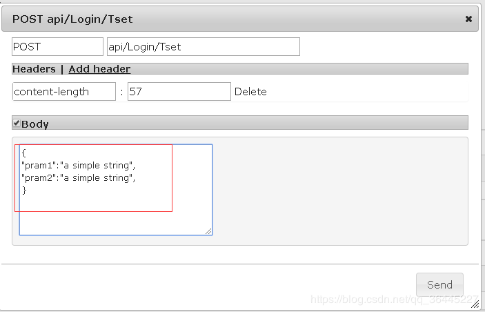
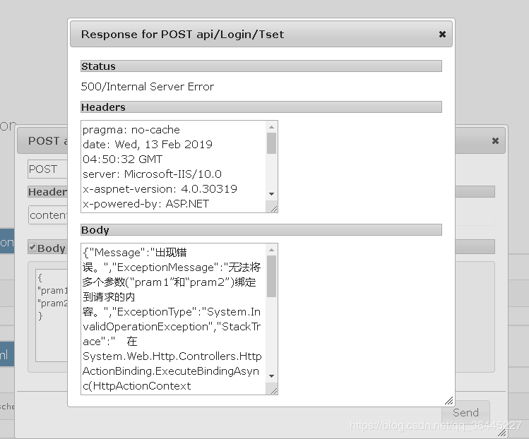
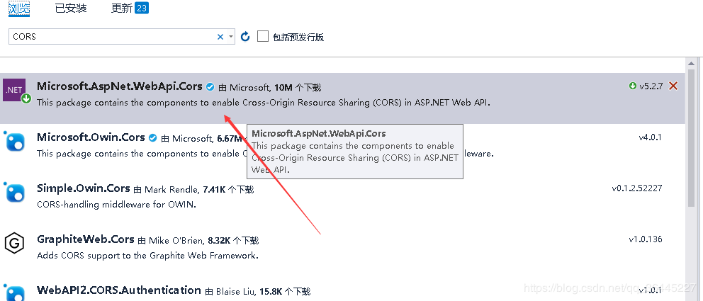
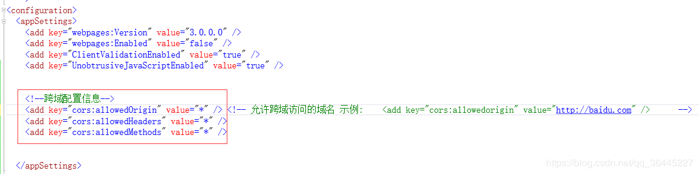
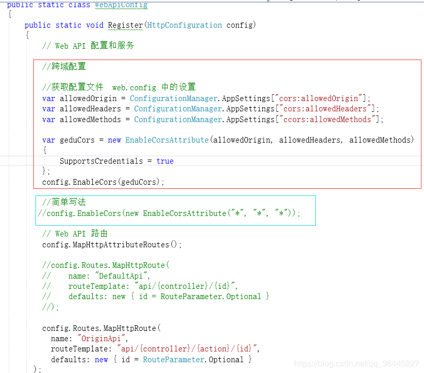

​	


# ASP.NET    WEB API   爬坑  过程

​                                                   2019年02月13日 13:00:50           [隶属感](https://me.csdn.net/qq_36445227)           阅读数：156                                                                  

​                   

​                                                                         版权声明：本文为博主原创文章，未经博主允许不得转载。          https://blog.csdn.net/qq_36445227/article/details/87173360        

**坑点一** **:对于  restful  格式的  api 我是拒绝的**, 因为实际情况 远远 多于 增删改查  

所以 修改路由:(注释了默认的路由规则)

```cs
   //config.Routes.MapHttpRoute(


            //    name: "DefaultApi",


            //    routeTemplate: "api/{controller}/{id}",


            //    defaults: new { id = RouteParameter.Optional }


            //);


 


            config.Routes.MapHttpRoute(


              name: "OriginApi",


              routeTemplate: "api/{controller}/{action}/{id}",


              defaults: new { id = RouteParameter.Optional }


          );
```

**坑点二** :**FromBody 类型的参数 只能有一个**  ,多于一个的需要写成 实体 形式 ,不然会报错

如下  错误格式 (特别提示下面 只有 一个frombody 类型参数 时是 不会报错的,  如还存在普通参数,会去url中找 )

```cs
  public string Tset([FromBody] string pram1, [FromBody] string pram2)


        {


            return "46578798";


        }
```

错误现场:





**期待的格式如下 :**

```cs
   public class Demo


        {


            public string pram1 { get; set; }


                


            public string pram2 { get; set; }


        }


 


        public string Tset([FromBody ] Demo data )


        {


            return "46578798";


        }
```

如果都像这样 多于一个frombody参数就写实体类 ,那真是要累死人 ,还好有动态类型 dynamic   可以很方便的处理这个坑

```cs
    public string PostValue([FromBody]   dynamic data)


        {


            return data["name"].ToObject<string>();


        }
```

 

**坑点三**:**跨域**

**我们写 webApi 肯定是为  类似  vue项目  手机app 等等  其他项目调用的,必然是要跨域的 , 现有一个插件 cors 在 vs 中安装后 简单配置后就可以跨域了**

开始安装配置插件 CORS 



完成后在  项目配置文件 web.config  中 添加  :



 <!--跨域配置信息-->

    <add key="cors:allowedOrigin" value="*" /> <!-- 允许跨域访问的域名 
示例:    <add key="cors:allowedorigin" value="http://baidu.com" />  
    -->

    <add key="cors:allowedHeaders" value="*" />

    <add key="cors:allowedMethods" value="*" />

将这三项加入到 appsetting 中  

 

最后一步:在 webapiconfig.cs 中 读取 上面添加的三项



一开始在配置文件中写好,是为了方便后期前端项目更改域名后  ,只需要在配置文件中修改即可,

一方面也是因为在开发环境没有域名,等正式上线时修改即可

**如果嫌麻烦,开发阶段直接 三个 通配符也是可以的,就暂时不用修改配置文件了 如 途中 绿色 框内容**

 

IE 8,9 是默认 关闭 跨域支持的 如使用 jQuery 需要全局  执行 

```
jQuery.support.cors = true; 达到 支持跨域
```

chrome firefox ie11 默认开启了支持,不用特别设置

 

 