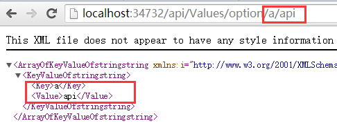

#  			[ASP.NET WEB API必知必会：特性路由](https://www.cnblogs.com/zuowj/p/5273221.html) 		


一、什么是特性路由？

特性路由是指将RouteAttribute或自定义继承自RouteAttribute的特性类标记在控制器或ACTION上，同时指定路由Url字符串，从而实现路由映射，相比之前的通过Routes.Add或Routes.MapHttpRoute来讲，更加灵活与直观。

若要使用特性路由功能需要先在Application_Start中开启映射到特性路由，代码如下：

```
`GlobalConfiguration.Configuration.MapHttpAttributeRoutes();``//或在WebApiConfig.Register方法中直接使用增加：``config.MapHttpAttributeRoutes();`
```

二、特性路由使用方法

1.基本路由映射

```
`[Route(``"api/Values"``)]``public` `IEnumerable<``string``> Get()``{``    ``return` `new` `string``[] { ``"value1"``, ``"value2"` `};``}`
```

访问地址：http://localhost:34732/api/values,结果如下：


2.路由映射到参数

```
`[Route(``"api/Values/{id}"``)]``public` `string` `Get2(``int` `id)``{``    ``return` `"value:"` `+ id.ToString();``}`
```

访问地址：http://localhost:34732/api/values,结果如下：


3.多重特性路由

```
`[Route(``"api/Values/{value1}/{value2}"``)]``[Route(``"api/Demo/{value2}/{value1}"``)]``public` `IEnumerable<``string``> Get3(``string` `value1, ``string` `value2)``{``    ``return` `new``[] { value1, value2 };``}`
```

访问地址：http://localhost:34732/api/values/a/b 或 http://localhost:34732/api/demo/a/b，结果如下：

       

4.缺省（默认）参数路由

```
`        ``//第一种方法``[Route(``"api/Values/option/{key}/{value?}"``)]``        ``public` `Dictionary<``string``, ``string``> Get4(``string` `key, ``string` `value = ``"test"``)``        ``{``            ``return` `new` `Dictionary<``string``, ``string``>() { ``                ``{key,value}``            ``};``        ``}` `        ``//第二种方法``        ``[Route(``"api/Values/option/{key}/{value=test}"``)]``        ``public` `Dictionary<``string``, ``string``> Get5(``string` `key, ``string` `value)``        ``{``            ``return` `new` `Dictionary<``string``, ``string``>() { ``                ``{key,value}``            ``};``        ``}`
```

访问地址：http://localhost:34732/api/Values/option/a, http://localhost:34732/api/Values/option/a/api  结果如下：

   

5.参数约束路由

```
`[Route(``"api/Values/constraint/{id:range(1,10)}"``)]``public` `string` `Get6(``int` `id)``{``    ``return` `"value:"` `+ id.ToString();``}`
```

访问地址：http://localhost:34732/api/Values/constraint/10, http://localhost:34732/api/Values/constraint/11  结果如下：

   

系统已提供的参数约束使用方法如下表（图片来源于蒋金楠书中）：


6.通配符（*）路由变量

```
`[Route(``"api/Values/many/{isOk:bool}/{*getDate:datetime}"``)]``public` `IHttpActionResult Get7(``bool` `isOk, DateTime? getDate = ``null``)``{``    ``return` `Json(``new` `{ Ok = isOk, Date = getDate });``}`
```

访问地址：http://localhost:34732/api/Values/many/true/**2016-3-13**, http://localhost:34732/api/Values/many/false/**2016/3/13**  结果如下：

   

7.路由映射（绑定）到复杂参数

```
`    ``[ModelBinder] ``//使其支持默认绑定``    ``public` `class` `Point``    ``{``        ``public` `int` `x { ``get``; ``set``; }` `        ``public` `int` `y { ``get``; ``set``; }``    ``}` `//第一种形式``        ``[Route(``"api/Values/model/{a.x:int}/{a.y:int}/{b.x:int}/{b.y:int}"``)]``        ``public` `IEnumerable<Point> Get8(Point a, Point b)``        ``{``            ``return` `new``[] { a, b };``        ``}` `//第二种形式``        ``[Route(``"api/Values/model"``)]``        ``public` `IEnumerable<Point> Get9(Point a, Point b)``        ``{``            ``return` `new``[] { a, b };``        ``}`
```

访问地址：http://localhost:34732/api/Values/model/1/2/3/4,  http://localhost:34732/api/Values/model?a.x=10&a.y=20&b.x=30&b.y=40   结果如下：

   

8.统一定义路由前缀及取消路由前缀

```
`[RoutePrefix(``"api/demo"``)] ``//定义路由前缀``public` `class` `DemoController : ApiController``{` `    ``[Route(``"Values"``)] ``//这里只需定义除路由前缀外的部份，完整路由：api/demo/Values``    ``public` `IEnumerable<``string``> Get()``    ``{``        ``return` `new` `string``[] { ``"value1"``, ``"value2"` `};``    ``}`  `    ``[Route(``"~/api/Values/{id}"``)] ``//这里通过~/取消路由前缀，完整路由：api/Values/{id}``    ``public` `string` `Get(``int` `id)``    ``{``        ``return` `"value:"` `+ id.ToString();``    ``}`
```

访问地址：http://localhost:34732/api/demo/values, http://localhost:34732/api/values/1  结果如下：

  

 

上面曾讲到过参数约束，其实除了系统提供的约束，还可以自定义实现IHttpRouteConstraint的约束类，下面是一个中英文切换的语言约束示例，代码实现如下：

首先定义一个中英文语言约束类：

```
`public` `class` `CultureRouteConstraint : IHttpRouteConstraint``{``    ``private` `static` `List<``string``> allowCultureList;``    ``static` `CultureRouteConstraint()``    ``{``        ``allowCultureList = ``new` `List<``string``> { ``"zh-cn"``,``"en-us"``}; ``//CultureInfo.GetCultures(CultureTypes.AllCultures).Select(c => c.Name).ToList();``    ``}` `    ``public` `bool` `Match(System.Net.Http.HttpRequestMessage request, IHttpRoute route, ``string` `parameterName, IDictionary<``string``, ``object``> values, HttpRouteDirection routeDirection)``    ``{``        ``if` `(values.ContainsKey(parameterName))``        ``{``            ``return` `allowCultureList.Any(c => c.Equals(values[parameterName].ToString(), StringComparison.OrdinalIgnoreCase));``        ``}``        ``return` `false``;``    ``}``}`
```

然后将其添加到默认路由约束解析器（DefaultInlineConstraintResolver）的参数与约束映射字典中，代码如下：

```
`DefaultInlineConstraintResolver defaultInlineConstraintResolver = ``new` `DefaultInlineConstraintResolver();``defaultInlineConstraintResolver.ConstraintMap.Add(``"culture"``, ``typeof``(CultureRouteConstraint));` `// Web API routes``config.MapHttpAttributeRoutes(defaultInlineConstraintResolver);`
```

最后就可以像使用普通约束一样来使用该约束，在使用约束前，定义两个资源文件，分别为：默认资源文件（中文）：Resources.resx，英文资源文件：Resources.en-us.resx

两个资源文件内容如下：

   

WEB API 的ACTION定义如下：

```
`[Route(``"api/Values/constraint/{culture:culture}/{name}"``)]``public` `string` `Get10(``string` `culture,``string` `name)``{``    ``CultureInfo currentCultureInfo = CultureInfo.CurrentCulture;``    ``CultureInfo currentCultureUIInfo = CultureInfo.CurrentUICulture;``    ``try``    ``{``        ``Thread.CurrentThread.CurrentCulture = Thread.CurrentThread.CurrentUICulture =``            ``new` `CultureInfo(culture);``        ``return` `Resources.ResourceManager.GetString(name.ToString());            ` `    ``}``    ``finally` `//因为线程池有复用功能，所以此处需要恢复到默认状态``    ``{``        ``Thread.CurrentThread.CurrentCulture = currentCultureInfo;``        ``Thread.CurrentThread.CurrentUICulture = currentCultureUIInfo;``    ``}``}`
```

访问地址：http://localhost:34732/api/Values/constraint/**zh-cn**/hello, http://localhost:34732/api/Values/constraint/**en-us**/hello  结果如下：

  

如果访问其它的语言，比如：http://localhost:34732/api/Values/constraint/**zh-tw**/hello,就会因约束限制而无法映射到ACTION，从而提示找不到页面，如下：


分类: [ASP.NET](https://www.cnblogs.com/zuowj/category/548289.html)

标签: [WebApi](https://www.cnblogs.com/zuowj/tag/WebApi/)