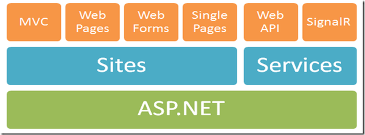

# ASP.NET WebAPI 实战问题总结（一）

​                                                   2017年05月22日 14:48:09           [ice_pill](https://me.csdn.net/ice_pill)           阅读数：603                                                                  

​                   

​                                                                         版权声明：本文为博主原创文章，未经博主允许不得转载。          https://blog.csdn.net/ice_pill/article/details/72626342        

## 序言

最近有个项目需要用到webaAPI来做后台处理，关于webAPI，网上资料相对较少，相关的书籍也比较少，能系统讲解的视频几乎没有，遇到问题往往都只能自己摸索摸索，作为初学WebApi  的我来说是想当痛苦。当然，有了MVC的经验，学WebApi并不难，但这里有一些坑，这也是我写这篇博客的目的，希望能和大家分享。

## WebAPI和MVC的区别

WebApi和MVC形式上看起来很相近，但其实是完全不同的两个东西，这里我应用网上查到的一张图片 
  
 由上观之，MVC和WebApi虽然是亲戚，但还是隔的有点远。 
 从使用和是哪个来说，MVC多用于建站，返回的是网页，WebAPI多用于构建Http服务，一般来说是没有网页的，返回的多为json或xml数据流。

## WebAPI的路由规则

想让我们来看看MVC的路由规则

> routes.MapRoute( 
>                    name: “Default”, 
>                    url: “{controller}/{action}/{id}”, 
>                    defaults: new { controller = “Home”, action = “Index”, id = UrlParameter.Optional }

默认的路由规则是 controller+action+id 的结构，通过访问控制器下面的方法去出来具体的http请求。 
 而我们webAPI的默认路由规则是这样的

> config.Routes.MapHttpRoute( 
>                    name: “DefaultApi”, 
>                    routeTemplate: “api/{controller}/{id}”, 
>                    defaults: new { id = RouteParameter.Optional } 
>                );

这里我们注意，没有action！！！这是个很奇怪的问题，没有action，API是怎么知道他要访问的是那个方法呢？尤其是当一个控制器内有很多相同参数的方法时。难道我们的API就只能写一个方法吗？ 
   当然不是，让我们来看看使用vs自动生成的控制器

> ////返回所有用户信息 
>            // GET: api/UserBaseInfoes 
>            public IQueryable GetUserBaseInfoSet() 
>            { 
>                return db.UserBaseInfoSet; 
>            }

这是其中一段代码，上方自动标注了相关的url，经查证，所有方法前面都有Get，Post，Put或者Delete，这正好是http中的四种方法，所以我猜测API是通过前面的这个标识来识别方法的，但又有个问题，如果同时有两个get的方法，比如

> GetUserInfo（int ID） 
>    GetUserFriend（int ID）

那么这样的话，只有自定义路由 了

> //自添 
>                config.Routes.MapHttpRoute( 
>                    name: “ActionApi_id”, 
>                    routeTemplate: “api/{controller}/{action}/{id}”, 
>                    defaults: new { id = RouteParameter.Optional })；

这样，我们的自定义的路由就可以解决找不到方法的问题了，那么，方法重载呢？ 
    比如：

> GetUserInfo（int id） 
>    GetUserInfo（string name） 
>    如果我只传一个1进去，api怎么知道我是传的int还是string呢？ 
>    当然，实际尝试过之后就会发现，根本不会调用String参数的方法，这是为什么呢？原因终于一条不成文的规定，  “api/{controller}/{action}/{id}”中id必须对应参数名id，即 GetUserInfo（int  id），不然会找不到资源返回404，所以这也是为什么上面例子中不会调用string参数的原因。当我们要使用string  参数时，只要在加一条路由规则就好了，当然里面不是写id，而是写name

## 默认返回json

webApi默认返回xml，但是xml格式往往让人觉得很不舒服，解析时间太长，消耗太多资源以及浪费用户流量。所以一帮网络中常用json作为通信媒介。那么我们要让webAPI默认返回json要怎么做呢，只需要在刚刚我们修改路由的地方加上下面这句

> GlobalConfiguration.Configuration.Formatters.JsonFormatter.SerializerSettings.ReferenceLoopHandling  = Newtonsoft.Json.ReferenceLoopHandling.Ignore; 
>                GlobalConfiguration.Configuration.Formatters.Remove(GlobalConfiguration.Configuration.Formatters.XmlFormatter);

大意就是将原来xml格式设定给移去，然后json去掉json的内处理循化（具体机制我没有仔细研究，反正加上这两句话，你返回的内容就是全是json了）

## 跨域访问

（[什么是跨域访问请参考](http://blog.csdn.net/lambert310/article/details/51683775)） 
 当我们和前端对接的时候，我们经常遇到一些问题，比如跨域访问。一般跨域访问的处理方式是在http请求头上添加”Access-Control-Allow-Origin” value=”*”,在这里，我们的处理方式是在web.config文件中

```
>     <httpProtocol>
> 
> <customHeaders>
> 
> <add name="Access-Control-Allow-Origin" value="*" />
> 
> <add name="Access-Control-Allow-Headers" value="Content-Type" />
> 
> <add name="Access-Control-Allow-Methods" value="GET, POST, PUT,
> DELETE, OPTIONS" />
> 
> </customHeaders>
> 
> </httpProtocol>1234567891011121314
```

自定义http请求头，那么我们的跨域访问就完成了