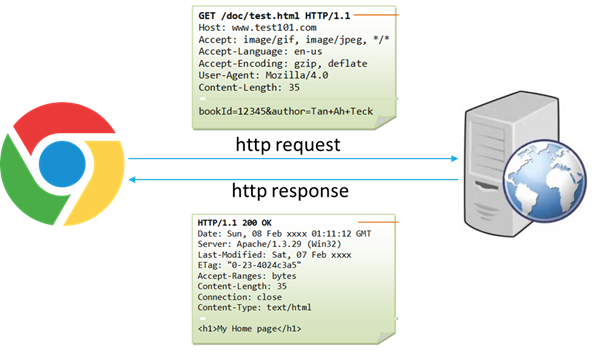
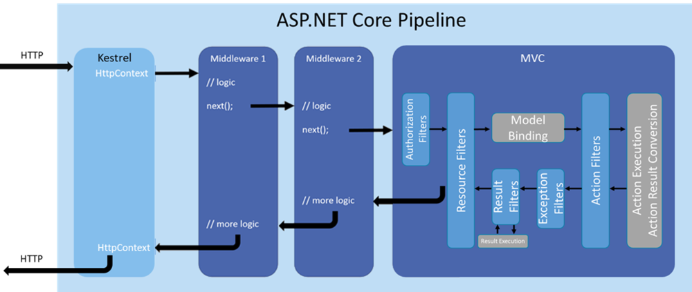
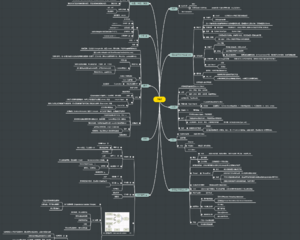
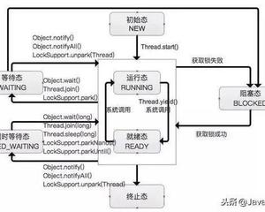

                              

​                    

 

# HTTP请求的处理流水线 -- 理解ASP.NET Core中的管道

​              

​             [程序采摘园](https://www.jianshu.com/u/10aeebbd55a8)                          

​                                               2018.06.09 22:32               字数 1109             阅读 224评论 0喜欢 0

理解管道对一个后端开发人员很是重要，可以说这是一种不同于桌面程序开发的编程思维。比方说要检查用户的输入（以参数的形式传入），基于桌面开发的经验，我第一反应会是在每个函数开始处都先调用UserInput.Validate(XXX)，如果通不过检查就返回错误信息。听起来挺“正确”的做法，但是在后端开发中这属于不正确的方式。那么ASP.NET  Core中怎么做才正确呢？下面就讲讲ASP.NET Core的管道(Pipeline)，以及如何用 “管道思维” 来解决这个问题。（*本篇属于概念介绍型，不涉及具体实现及代码细节*）

 Web程序的简单理解就是，浏览器发送一个请求（http request），服务器处理并响应这个请求，并返回给浏览器结果 （http response）。如图1所示

图1 Web程序

 那么服务器内部如何处理请求并返回结果？也就是后端程序如何工作的呢？ASP.NET Core采用管道（pipeline）的方式。如图2所示 

图2 ASP.NET Core管道

1. HTTP请求先到达一个叫**Kestrel**的Web Server。 Kestrel负责接收HTTP请求并把请求内容（字符串流）转化成结构化的数据（HttpContext）供后面的中间件使用。
2.  **中间件**（Middleware）是一个对HTTP请求和响应进行处理的组件。什么意思呢？就是中间件会对从上游来的HTTP请求做一定的操作/处理/检查，然后将HTTP请求传给下一个中间件；对从下游回来的HTTP响应做一定的操作/处理，再返回给上一个中间件。当然，中间件也可以忽略对HTTP请求或者HTTP响应的处理而直接传给下一个或返回上一个中间件。比如
    a.  用户认证（Authentication）中间件只检查HTTP请求的用户信息，是合法用户就向后传递HTTP请求；
    b.  日志中间件可以只检查HTTP响应，记录响应内容到日志，然后向前返回该响应；
    中间件还可以处理完请求后直接返回HTTP响应，无需向下传递。比如用户认证中间件找不到合法用户信息，这时会直接返回响应而无须通知后续中间件。
3. 多个中间件连接在一起就构成了**中间件管道**（Middleware  Pipeline），每个中间件负责一个特定职责。每个中间件都需要显式添加到管道中，并且添加的顺序很重要。比方说，如果用户认证中间件被第一个添加到管道，那没有用户信息的HTTP请求都会直接被返回；但是如果它被放到StaticFiles中间件之后，那没有用户信息的HTTP请求访问一个存在的静态文件时，会被StaticFiles中间件处理并返回正确的文件。
    a.  ASP.NET Core自带的中间件有用户认证，CORS，Response Compression，Static Files，URL Rewriting等；
    b.  第三方提供的中间件，如生成API文档的Swagger等；
    c.  自己定制的中间件，如检查特定用户信息的定制用户认证中间件等
4. ASP.NET Core中有一个特殊的“中间件”，**ASP.NET Core MVC**。  MVC是一个采用Model-View-Controller模式的开发框架。它被加到中间件管道的末尾，用来处理HTTP请求的业务逻辑。MVC自身的设计也是管道模式，叫做过滤器管道（Filter  Pipeline），一个过滤器就相当于一个中间件。MVC主要用来：
    a.  从HTTP请求中提取用户的输入信息（字符串）到结构化的模型中（Model Binding），并且做验证（Model Validation）；
    b.  把HTTP请求发送到恰当的控制器处理方法（Controller，Action method）上去，这个过程叫路由（Routing）；
    c.  控制器解析请求，做出处理，并生成HTTP响应（如生成HTML页面，生成响应数据等）。

### 总结

- ASP.NET Core后端程序是管道模式，中间件可自由配置，但顺序很重要；
- ASP.NET Core中编程时，要实现一个和特定业务不相关的功能（并且很多Action method都需要）时，首先考虑加过滤器或中间件
- 有很多很流行的第三方中间件，找到并配置好恰当的中间件，Asp.net core编程就成功了一大半。

小礼物走一走，来简书关注我

​                      随笔 

​           © 著作权归作者所有         

​           举报文章         

​             [                ](https://www.jianshu.com/u/10aeebbd55a8)            

程序采摘园

写了 2694 字，被 1 人关注，获得了 1 个喜欢

 

​                                      [                    ](javascript:void((function(s,d,e,r,l,p,t,z,c){var f='http://v.t.sina.com.cn/share/share.php?appkey=1881139527',u=z||d.location,p=['&url=',e(u),'&title=',e(t||d.title),'&source=',e(r),'&sourceUrl=',e(l),'&content=',c||'gb2312','&pic=',e(p||'')].join('');function a(){if(!window.open([f,p].join(''),'mb',['toolbar=0,status=0,resizable=1,width=440,height=430,left=',(s.width-440)/2,',top=',(s.height-430)/2].join('')))u.href=[f,p].join('');};if(/Firefox/.test(navigator.userAgent))setTimeout(a,0);else a();})(screen,document,encodeURIComponent,'','','', '推荐 程序采摘园 的文章《HTTP请求的处理流水线 -- 理解ASP.NET Core中的管道》（ 分享自 @简书 ）','https://www.jianshu.com/p/ab1f44381013?utm_campaign=maleskine&utm_content=note&utm_medium=reader_share&utm_source=weibo','页面编码gb2312|utf-8默认gb2312'));)                                                   [更多分享](javascript:void(0);)       

   

评论 

​             智慧如你，不想发表一点想法咩~           

-  
- 
- 
-  

被以下专题收入，发现更多相似内容

收入我的专题

ASP.NET...

使用Kubespray 2.8.3部署生产可用的Kubernetes集群（1.12.5）

Kubernetes的安装部署是难中之难，每个版本安装方式都略有区别。笔者一直想找一种支持多平台、相对简单  、适用于生产环境 的部署方案。经过一段时间的调研，有如下几种解决方案进入笔者视野：  其他诸如Kops之类的方案，由于无法跨平台，或者其他因素，被我pass了。 最终，...

​                                    

周立_itmuch

​                  

对 .Net的基础 脑图汇总

细节整理：一、设计模式，23种设计模式、6种原则：原则：场景触发-解决问题-总结沉淀-推广应用   23种设计模式，解决问题的套路1.创建型模式，共五种：工厂方法模式、抽象工厂模式、单例模式、建造者模式、原型模式。2.结构型模式，共七种：适配器模式、装饰器模式、代理模式、外观模...

​                                    

weilai1917

​                  

Java并发编程40道面试题及答案——面试稳了

1、线程与进程的区别？  进程是操作系统分配资源的最小单元，线程是操作系统调度的最小单元。 一个程序至少有一个进程,一个进程至少有一个线程。  文末有福利，思维导图和视频资料等你来领 2、什么是多线程中的上下文切换？ 多线程会共同使用一组计算机上的CPU，而线程数大于给程序分配...

​                                    

杜弥

​                  

30个值得关注的Vue开源项目

译者按： 学习优秀的开源项目是提高代码水平最有效的方式。 原文: 30  Amazing Vue.js Open Source Projects for the Past Year (v.2018) 译者:  Fundebug 为了保证可读性，本文采用意译而非直译。另外，本文版...

​                                    

Fundebug

Spring Boot 面试，一个问题就干趴下了！

最近栈长面试了不少人，其中不乏说对 Spring Boot  非常熟悉的，然后当我问到一些 Spring Boot 核心功能和原理的时候，没人能说得上来，或者说不到点上，可以说一个问题就问趴下了！  这是我的问题： 我看你上面写了熟悉 Spring Boot，那你能讲下为什么我...

​                                    

Java技术栈

每日精进 180515  0008

最重要的事情 1.邀约面试，评估候选人 2.完成论文全文 进步  1.第五章节内容正确率很高 2.完成一个章节的选择题 认知 越来越觉得时间不够用，想学和想做的事情太多了，只是天赋不够，只能勤奋一点了 生活  1.园监督我护肤，传授护肤水疗知识 2.今天身体状态不好，车上难受了...

​                                    

千_01eb

把相思烂在肚子里

内容不能为空，于是我就写了这么一句话

​                                    

echo快跑

万达电影4月线上活动通知汇总表（截止4.3）

活动一、 《奇葩朵朵》疯狂抢票活动： 1.  活动时间：4月4日-4月6日； 2.  活动规则：在推送文章中参与刮奖，就有机会获得《奇葩朵朵》1元2D兑换码一个，活动期间每位用户只能参与一次刮奖，数量有限，先到先得； 3.  活动详情：请关注微信订阅号“万达电影生活”4月4日推送...

​                                    

Mr魔性

​                  

梦回故里 山水老家——婺源

迎着初春清晨的太阳，走进洒满金子的“桃花源”，山水朦胧，烟雨环绕，远处的山峰如害羞的少女，看着陌生人的遮遮掩掩。  清明时节的是油菜花的最佳花期，慕名而来的游客络绎不绝。“采花贼”需谨慎哦！  猜想元代的马致远曾在此停留过，要不怎么会写出生活中的“小桥流水人家”呢？ 清明时节的...

​                                    

pingko