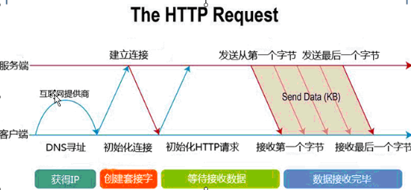
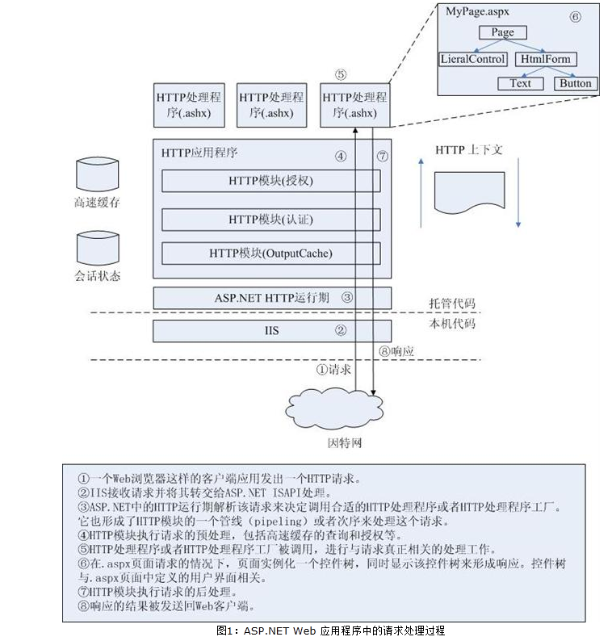
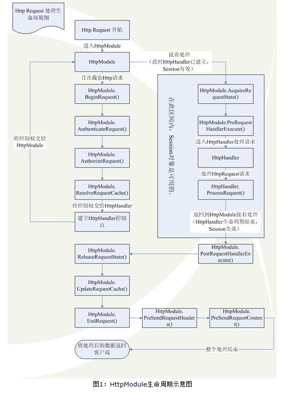
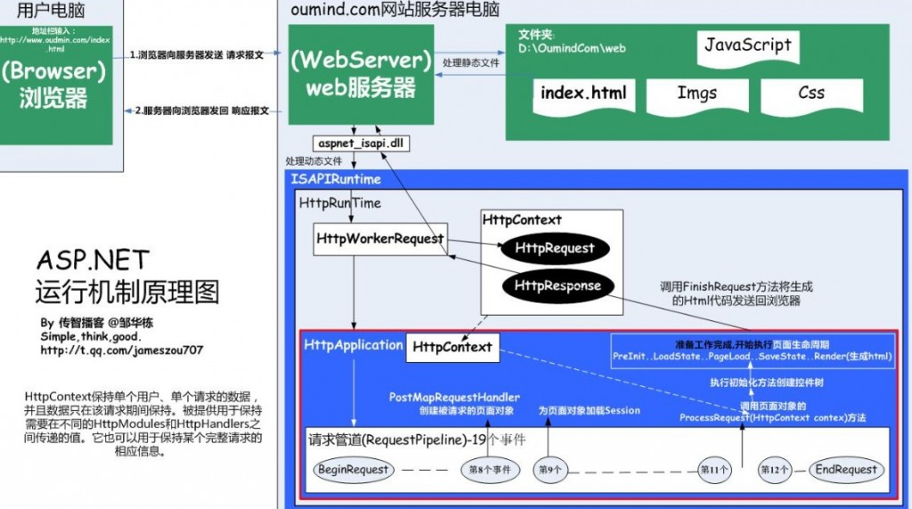
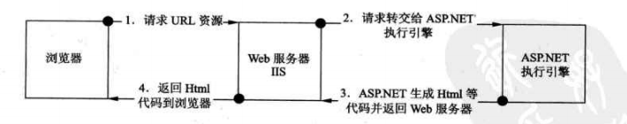

<svg aria-hidden="true" style="position: absolute; width: 0px; height: 0px; overflow: hidden;"></svg>

<svg aria-hidden="true" style="position: absolute; width: 0px; height: 0px; overflow: hidden;"></svg>

- ​                          
- [首页](https://www.csdn.net/)
- [博客](https://blog.csdn.net/)
- [学院](https://edu.csdn.net)                          
- [下载](https://download.csdn.net)
- [论坛](https://bbs.csdn.net)
- [APP](https://www.csdn.net/csdn-app/)                          
- [问答](https://ask.csdn.net)
- [商城](https://h5.youzan.com/v2/showcase/homepage?alias=BUj3rrGa2J&ps=760)
- [活动](https://huiyi.csdn.net/)
- [VIP会员](https://mall.csdn.net/vip)
- [招聘](http://job.csdn.net)
- [ITeye](http://www.iteye.com)
- [GitChat](https://gitbook.cn/?ref=csdn)

- 
- ​                                                    
- [写博客](https://mp.csdn.net/postedit)              
- ​              [消息](https://i.csdn.net/#/msg/index)                              
- 

 

转

# WebForm页面生命周期及asp.net运行机制

​                                                   2016年07月11日 17:36:32           [三天不学习](https://me.csdn.net/mss359681091)           阅读数：2883                   

​                   



1.先上几张原理图着重理解：

 

 

 

 

 现在针对第四副图原理进行解析：

流程:

1.浏览器发送请求

2.服务器软件（IIS）接收,它最终的目的就是为了向客户输出它请求的动态页面生成的html代码。

3.服务器不会处理类和动态页面，所以找扩展程序 

4.交给FrameWork，它其中有个类HttpRuntime，其中有个ProcessRequest()方法

5.ProcessRequest()创建了HttpWorkerRequest对象，把请求报文都封装在其中（HttpWorkerRequest中有个指针，它指向了扩展程序，待把后续返回的响应报文返回给IIS）

6.创建HttpContext对象（HttpRequest和HttpResponse）请求的报文被拆分成了不同属性而保存在HttpRequest中，方便程序员使用;HttpResponse准备了很多属性，用来保存要生成的响应报文的各个部分。

7.framework要运行页面对象，首先要创建HttpApplication对象，负责处理整个请求，页面中执行需要环境、安全验证等都封装在其中。

8.它要调用ProcessRequest (HttpContext context) 执行19个（事件）委托对象，也被叫做请求轨道。

9.其中在执行到第8个事件中创建请求的页面类对象，并转成HttpHandler接口对象

10.在11和12事件之间调用了ProcessRequest方法,最后有个finshRequest方法,结束了请求,生成响应报文,再通过HttpWorkerRequest的指针调用扩展程序再调用IIS,IIS最后将响应报文发回给浏览器

此时一般处理程序流程已经结束。

 

asp.net页面运行的整体流程和一般处理程序一样，不同之处在于它调用了Page类的ProcessRequest方法，创建了页面控件树，执行了页面声明周期。

流程：

1.调用了Page类的ProcessRequest方法

2.打造页面控件树（_buildControTree()方法）

3.执行页面生命周期（也就是200多行代码），里面有预定义好的很多种方法，方便程序员在事件中注册方法，实现自己的功能

​    3.1 LoadState加载状态

​    3.2 PageLoad 页面加载

​    3.3 SaveState

4.调用Render方法，生成html代码

 

注意：页面自动事件注册机制-----在页面的开头部分，有AutoEventWireup = "true" ,即开启自动事件注册机制

开启自动事件注册机制后，只要遵循对应约定的格式，如Page_Load，

当页面声明周期调用PageLoad事件的时候，也就调用了我们的Page_Load方法

 

 

asp.net运行机制

1.当第一次访问页面时，页面请求首先依次经过HttpModuls和HttpHandler的处理，服务器接收到HttpHandler的请求后将跳转到需要访问的页面，然后Asp.net  Engine  负责找到这个页面后台的类，并实例化为一个临时对象。在此过程中会触发一系列的事件，一部分事件需要经过对象中的方法进行处理，之后服务器会将这个处理后页面交给Response对象，然后再由Response对象将这个页面发送到客户端

 

2.因为服务器之间的会话已经建立，所以在这个页面上重新提交一些信息并再次向服务器发送请求时，是不用再经过初始化页面这一部分的工作的。故第二条线路是依次提交HttpModuls和HttpHandler请求，然后与临时对象交互并返回。

 

3.第三条路线与第二条的不同之处在于，在处理请求时，如果涉及到需要调用asp.net Cache时，临时对象直接从asp.net缓存中提取信息并返回。

 

4.第四条线路是在刷新页面的时候，服务器接收到并发现这个请求曾经处理过，并将处理结果存储到由一个由默认的HttpModule管理的输出缓存中。此时可以直接从缓存中提取信息并返回，无须重新处理一遍。

​            展开阅读全文                               

<iframe scrolling="no" src="https://pos.baidu.com/s?hei=104&amp;wid=900&amp;di=u3501897&amp;ltu=https%3A%2F%2Fblog.csdn.net%2Fmss359681091%2Farticle%2Fdetails%2F51882688&amp;psi=647ee6cdb002e36accfb1a38a0601492&amp;par=2560x999&amp;pcs=1391x902&amp;cpl=1&amp;ps=4862x399&amp;chi=1&amp;dis=0&amp;dri=0&amp;ltr=https%3A%2F%2Fbbs.csdn.net%2Ftopics%2F392366717&amp;ant=0&amp;prot=2&amp;ccd=24&amp;ti=WebForm%E9%A1%B5%E9%9D%A2%E7%94%9F%E5%91%BD%E5%91%A8%E6%9C%9F%E5%8F%8Aasp.net%E8%BF%90%E8%A1%8C%E6%9C%BA%E5%88%B6%20-%20%E6%9D%8E%E8%B5%9B%E8%B5%9B%E7%9A%84%E4%B8%93%E6%A0%8F%20-%20CSDN%E5%8D%9A%E5%AE%A2&amp;col=zh-CN&amp;cdo=-1&amp;cja=false&amp;cmi=2&amp;exps=111000,119008,110011&amp;cec=UTF-8&amp;cfv=0&amp;tlm=1558948040&amp;tpr=1558948040096&amp;pss=1391x8671&amp;dai=2&amp;drs=1&amp;ari=2&amp;psr=2560x1080&amp;dc=3&amp;cce=true&amp;dtm=HTML_POST&amp;tcn=1558948040&amp;pis=-1x-1" width="900" height="104" frameborder="0"></iframe>

 			[ 				 			](https://me.csdn.net/u011535356) 		

 			 			 			 		

 		

####  				C# page 的*生命周期*		

 				 				 					阅读数  					630 				

 			[ 				（1）请求页面：页请求发生在页生命周期开始之前。（2）开始：在开始阶段，将设置页属性，如Request和Response。在此阶段，页还将确定请求是回发请求还是新请求，并设置IsPostBack属性。... 			](https://blog.csdn.net/li185416672/article/details/31789585) 			 									博文 											[来自：	 Jeans](https://blog.csdn.net/li185416672) 												 		

####  				*asp.net**页面**生命周期*		

 				 				 					阅读数  					559 				

 			[ 				asp.net页面生命周期1.调用FrameworkInitialize()方法初始化页面,创建控件树2.正式开始页面的生命周期:1.设置IsPostBack属性的值2.触发PreInit事件,在该事... 			](https://blog.csdn.net/qq_35669328/article/details/78424330) 			 									博文 											[来自：	 loveWB的博客](https://blog.csdn.net/qq_35669328) 												 		

####  				*Asp.Net*底层解析（三）——ASPX*页面*的*生命周期*详解		

 				 				 					阅读数  					4189 				

 			[ 				前言：个人认为，对于页面生命周期的理解是开发人员在ASP.NET领域做好做深的前提。当然，因为微软已经将ASP.NET封装得很简单了，所以对于只有基本html&javascript的初学者来说也很容易... 			](https://blog.csdn.net/mlcactus/article/details/8564347) 			 									博文 											[来自：	 mlcactus的专栏](https://blog.csdn.net/mlcactus) 												 		

####  				关于*asp.net**页面**生命周期*的问题，重新描述了一下，希望能说清楚		

 				03-27 		

 			页面上有三个radioButton控件，r1、r2和r3；还有一个文本框控件t1 在设计视图下设置r1的checked属性为true ； <asp:RadioButton ID="r1" runat= 							论坛 					

<iframe id="iframeu3491668_0" name="iframeu3491668_0" src="https://pos.baidu.com/xcum?conwid=852&amp;conhei=60&amp;rdid=3491668&amp;dc=3&amp;exps=110011&amp;psi=647ee6cdb002e36accfb1a38a0601492&amp;di=u3491668&amp;dri=0&amp;dis=0&amp;dai=1&amp;ps=5302x423&amp;enu=encoding&amp;dcb=___adblockplus&amp;dtm=HTML_POST&amp;dvi=0.0&amp;dci=-1&amp;dpt=none&amp;tsr=0&amp;tpr=1558948039906&amp;ti=WebForm%E9%A1%B5%E9%9D%A2%E7%94%9F%E5%91%BD%E5%91%A8%E6%9C%9F%E5%8F%8Aasp.net%E8%BF%90%E8%A1%8C%E6%9C%BA%E5%88%B6%20-%20%E6%9D%8E%E8%B5%9B%E8%B5%9B%E7%9A%84%E4%B8%93%E6%A0%8F%20-%20CSDN%E5%8D%9A%E5%AE%A2&amp;ari=2&amp;dbv=0&amp;drs=1&amp;pcs=1391x902&amp;pss=1391x8416&amp;cfv=0&amp;cpl=1&amp;chi=1&amp;cce=true&amp;cec=UTF-8&amp;tlm=1558948039&amp;prot=2&amp;rw=902&amp;ltu=https%3A%2F%2Fblog.csdn.net%2Fmss359681091%2Farticle%2Fdetails%2F51882688&amp;ltr=https%3A%2F%2Fbbs.csdn.net%2Ftopics%2F392366717&amp;ecd=1&amp;uc=2560x999&amp;pis=-1x-1&amp;sr=2560x1080&amp;tcn=1558948040&amp;qn=d357cc2a24706487&amp;dpv=d357cc2a24706487&amp;tt=1558948039607.344.348.362" vspace="0" hspace="0" marginwidth="0" marginheight="0" scrolling="no" style="border:0;vertical-align:bottom;margin:0;width:852px;height:60px" allowtransparency="true" width="852" height="60" frameborder="0" align="center,center"></iframe>

####  				*asp.net*  web *页面**生命周期*		

 				 				 					阅读数  					2835 				

 			[ 				每次客户端请求都会创建页面实例，它的执行使自身及其包含的控件经历页面生命周期的各个阶段。页面的执行起始于HTTP运行库调用ProcessRequest时，该方法将启动页面并控制它的生命周期。生命周期由... 			](https://blog.csdn.net/lqh4188/article/details/8534233) 			 									博文 											[来自：	 宁静致远](https://blog.csdn.net/lqh4188) 												 		

####  				ASPX*页面*的*运行机制*		

 				 				 					阅读数  					312 				

 			[ 				咱理解的都注释到WebForm1.aspx.cs的这段代码里去了。在aspx页面中，添加最终也能得到“ASP.aspxwebform_webform1_aspx”这个子类名，也说明了中的代码被编译到子... 			](https://blog.csdn.net/SHINIKAMI/article/details/78546506) 			 									博文 											[来自：	 SHINIKAMI的博客](https://blog.csdn.net/SHINIKAMI) 												 		

####  				*WebForm**生命周期*		

 				 				 					阅读数  					392 				

 			[ 				1.关于WebForm环境下启用了autopostback的问题，注意，启用了autopostback的服务器控件要在修改值后按enter或tab或鼠标点击才会触发Page_Load，这一步会造成误解... 			](https://blog.csdn.net/lrprocedure/article/details/79351403) 			 									博文 											[来自：	 bakalr的专栏](https://blog.csdn.net/lrprocedure) 												 		

####  				*Asp.net* Web Form开发的*页面**生命周期*模型		

 				 				 					阅读数  					855 				

 			[ 				过程：PreInit、Init、PreLoad、Load、LoadComplete、PreRender、Render、Unload执行的事件：OnPreInit:用来检查IsPostBack属性、生成... 			](https://blog.csdn.net/yibintang/article/details/8526470) 			 									博文 											[来自：	 Daniel的专栏](https://blog.csdn.net/yibintang) 												 		

####  						Web实时推送Demo by SignalR ,*WebForm*					

12-18

 						因近期发现很多关于 Web实时推送的问题贴,所以写了一个简单的 基于 SignalR 的Web实时推送 Demo. 开发工具 VS2010 ASP.NET WebForm SignalR 版本 -Ve				

下载

#### *WebForm**生命周期* - bakalr的专栏 - CSDN博客

​                      12-4                    

#### ...- Part 4 *WebForm**页面**生命周期* - farmwang的专栏 - CSDN博客...

​                      11-6                    

其中CodeBehind这个属性定义了此aspx页面的专属后台代码文件的名称,而Inherits这个...WebForm页面生命周期及asp.net运行机制 - 李赛赛的专栏(学海无涯,回头是岸)  ...

​           *ASP.NET*就业实例视频教程（5）*WebForm*控件——更便捷地创建*页面*         

​           [             在使用ASP.NET的WebForm控件开发网站时，开发人员不用编写HTML、CSS代码也能开发web应用程序，直接对控件进行设置就可完成页面的创建。本课程学习的WebForm控件就是为了、高效的开发web应用程序。n【课程特色】n1、课程设计循序渐进、讲解细致、通俗易懂、非常适合自主学习n2、教学过程贯穿实战案例，边学边用n3、突出技术关键点、并且分析透彻           ](https://edu.csdn.net/course/detail/6712?utm_source=baidutj)                        学院             讲师：  徐照兴                    

####  				*WebForm**页面**生命周期*及*asp.net**运行机制*复习		

 				 				 					阅读数  					2032 				

 			[ 				http://blog.csdn.net/sxycxwb/article/details/8242861 			](https://blog.csdn.net/longvslove/article/details/8782795) 			 									博文 											[来自：	 longvslove的专栏](https://blog.csdn.net/longvslove) 												 		

#### *ASP.NET**页面**生命周期* - sdtsfhh的专栏 - CSDN博客

​                      11-23                    

#### *Asp.net* Web Form开发的*页面**生命周期*模型 - Daniel的专..._CSDN博客

​                      4-9                    

博文 来自: bakalr的专栏  WebForm页面生命周期及asp.net运行机制复习  04-10...3.服务... 博文 来自: 李赛赛的专栏  Web Page的生命周期详解 03-30  ASP...

####  				*asp.net* *WebForm* 事件响应模型		

 				 				 					阅读数  					4853 				

 			[ 				当我们新建一个ASP.NET的应用程序时，会默认生成一个Default.aspx和Default.aspx.cs页面。在Default.aspx的页面中第一行是一条页面指令：t"%>其中CodeBeh... 			](https://blog.csdn.net/ydm19891101/article/details/50552611) 			 									博文 											[来自：	 ydm东方旭日的专栏](https://blog.csdn.net/ydm19891101) 												 		

#### ...-*ASP.NET*请求管道、应用程序*生命周期*、整体*运行机制*..._CSDN博客

​                      11-11                    

微软的程序设计和相应的IDE做的很棒,让人很快就能有生产力。.NET上手容易,...WebForm页面生命周期及asp.net运行机制 - 李赛赛的专栏  07-11 2497  ...

#### IIS处理*Asp.net*请求和*Asp.net**页面**生命周期*说明 - hudie..._CSDN博客

​                      11-13                    

ASP.NET ISAPI定义在aspnet_isapi.dll中,它本身运行在一个非托管的环境中。ASP...WebForm页面生命周期及asp.net运行机制 - 李赛赛的专栏  07-11 2499  ...

####  				MVC基础入门(.net *webform*转MVC的意义)		

 				 				 					阅读数  					514 				

 			[ 				简介本文主要是作者回顾MVC基础的文章，整合个人认为基础且重点的信息，通过简单实践进行复习。相关代码地址：https://github.com/OtherRuan/Review-SerialsWebF... 			](https://blog.csdn.net/greenjolly/article/details/80995894) 			 									博文 											[来自：	 greenjolly的专栏](https://blog.csdn.net/greenjolly) 												 		

####  				*ASP.NET**页面*的往返与处理机制		

 				 				 					阅读数  					2164 				

 			[ 				 ASP.NET页面的处理循环如下：1、用户通过客户端浏览器请求页面，页面第一次运行。2、Web服务器上的ASP.NET对请求的页面进行处理，翻译成HTML和Javascript。3、页面将标记动态呈... 			](https://blog.csdn.net/dodream/article/details/4765690) 			 									博文 											[来自：	 dodream的专栏](https://blog.csdn.net/dodream) 												 		

#### *ASP.NET**运行机制*(三)--使用HttpHandler,处理对aspx*页面*..._CSDN博客

​                      11-14                    

个人分类: ASP.NET 最近了解了HttpHandler的基本原理后,制作了一个简单的案例。...WebForm页面生命周期及asp.net运行机制 - 李赛赛的专栏  07-11 2500  ...

#### 传统*WebForm*网站和MVC网站*运行机制*对比 - 赵尽朝 - CSDN博客

​                      11-10                    

####  				*ASP.NET**运行机制*(三)--使用HttpHandler，处理对aspx*页面*的请求		

 				 				 					阅读数  					508 				

 			[ 				最近了解了HttpHandler的基本原理后，制作了一个简单的案例。项目的目录如图：一、在App_Code文件夹里创建TestHttpHandler类，并实现IHttpHandler接口。 names... 			](https://blog.csdn.net/qq_33857502/article/details/80596594) 			 									博文 											[来自：	 满天星的博客](https://blog.csdn.net/qq_33857502) 												 		

<iframe scrolling="no" src="https://pos.baidu.com/s?hei=60&amp;wid=852&amp;di=u3491668&amp;ltu=https%3A%2F%2Fblog.csdn.net%2Fmss359681091%2Farticle%2Fdetails%2F51882688&amp;psi=647ee6cdb002e36accfb1a38a0601492&amp;dtm=HTML_POST&amp;pss=1391x8781&amp;drs=1&amp;ant=0&amp;ccd=24&amp;ps=6344x423&amp;ltr=https%3A%2F%2Fbbs.csdn.net%2Ftopics%2F392366717&amp;cfv=0&amp;prot=2&amp;ari=2&amp;dai=3&amp;cce=true&amp;pcs=1391x902&amp;col=zh-CN&amp;ti=WebForm%E9%A1%B5%E9%9D%A2%E7%94%9F%E5%91%BD%E5%91%A8%E6%9C%9F%E5%8F%8Aasp.net%E8%BF%90%E8%A1%8C%E6%9C%BA%E5%88%B6%20-%20%E6%9D%8E%E8%B5%9B%E8%B5%9B%E7%9A%84%E4%B8%93%E6%A0%8F%20-%20CSDN%E5%8D%9A%E5%AE%A2&amp;pis=-1x-1&amp;chi=1&amp;dc=3&amp;tcn=1558948040&amp;cja=false&amp;tlm=1558948040&amp;tpr=1558948040096&amp;dri=1&amp;dis=0&amp;psr=2560x1080&amp;cec=UTF-8&amp;par=2560x999&amp;exps=111000,119008,110011&amp;cpl=1&amp;cdo=-1&amp;cmi=2" width="852" height="60" frameborder="0"></iframe>

####  				c# windows form *生命周期* (Life cycle) 事件 顺序		

 				 				 					阅读数  					5515 				

 			[ 				c#windowsform生命周期(Lifecycle)事件顺序窗口初始化_______________________________________________________________... 			](https://blog.csdn.net/is2120/article/details/7572552) 			 									博文 											[来自：	 IS2120](https://blog.csdn.net/is2120) 												 		

####  				Form窗体的*生命周期*		

 				01-12 		

 			在资料上看到顺序是这样的： System.Windows.Forms.Control.HandleCreated System.Windows.Forms.Control.BindingContext 							论坛 					

####  				WinForm窗体*生命周期*		

 				 				 					阅读数  					3123 				

 			[ 				WinForm窗体生命周期1,窗体启动时:Control.HandleCreatedControl.BindingContextChangedForm.LoadControl.VisibleChang... 			](https://blog.csdn.net/fox123871/article/details/43888737) 			 									博文 											[来自：	 fox123871的专栏](https://blog.csdn.net/fox123871) 												 		

####  				.NET *页面**生命周期*		

 				 				 					阅读数  					4348 				

 			[ 				对于ASP.NET开发者，理解ASP.NET的页面生命周期是非常重要的。主要是为了搞明白在哪里放置特定的方法和在何时设置各种页面属性。但是记忆和理解页面生命周期里提供的事件处理方法(method)非常... 			](https://blog.csdn.net/zfj1981/article/details/8662870) 			 									博文 											[来自：	 学而不思则罔，思而不学则殆。](https://blog.csdn.net/zfj1981) 												 		

####  				page*页面*的*生命周期*		

 				 				 					阅读数  					449 				

 			[ 				刚刚接触c#页面加载，发现c#的Page页面在调用时莫名的加载了好多方法，不知道啥情况，经过一番查证终于找到了自己的盲棋：其原因是在使用.aspx页面进行编程时，这些内容要到服务器端进行编译，而需要编... 			](https://blog.csdn.net/XiaoqiangNan/article/details/66971415) 			 									博文 											[来自：	 XiaoqiangNan的博客](https://blog.csdn.net/XiaoqiangNan) 												 		

<iframe src="https://kunpeng-sc.csdnimg.cn/#/preview/237?positionId=62&amp;queryWord=" scrolling="no" width="100%" height="75px" frameborder="0"></iframe>

####  				*ASP.NET**页面**生命周期*描述 (已整理)		

 				 				 					阅读数  					1465 				

 			[ 				 对由Microsoft®Internet信息服务(IIS)处理的Microsoft®ASP.NET页面的每个请求都会被移交到ASP.NETHTTP管道。HTTP管道由一系列托管对象组成，这些托管对象... 			](https://blog.csdn.net/bill1315/article/details/1620019) 			 									博文 											[来自：	 Terry的专栏](https://blog.csdn.net/bill1315) 												 		

####  				*ASP.NET*网站*页面*加载及运行效率等多方面实战优化		

 				 				 					阅读数  					4401 				

 			[ 				ASP.NET网站优化之-论网站访问优化的重要性！ 			](https://blog.csdn.net/yangyisen0713/article/details/48490355) 			 									博文 											[来自：	 LisenYang的专栏](https://blog.csdn.net/yangyisen0713) 												 		

####  				WinForm、WPF、*ASP.NET*窗口*生命周期*		

 				 				 					阅读数  					811 				

 			[ 				做了这么久桌面应用程序开发，对窗口的生命周期还没有一个清晰的了解。那我们就对*WinForm、WPF和ASP.NET*应用程序中窗口的生命周期做一个测试，看一下在窗口的创建和消亡的过程中，各个事件的执... 			](https://blog.csdn.net/s_521_h/article/details/73826928) 			 									博文 											[来自：	 永远年轻，永远热泪盈眶](https://blog.csdn.net/s_521_h) 												 		

####  				*ASP.NET* C#，如何设置默认启动页		

 				08-30 		

 			比如书上的例子，它没有default.aspx文件，我点开哪个文件，ctrl+f5就运行那个页的代码。 但我的工程，ctrl+f5总是显示default.aspx，虽然我知道，右键可以选择哪个文件为默 							论坛 					

####  				*asp.net* *生命周期*		

 				 				 					阅读数  					156 				

 			[ 				网上找了一下，然后摘录整理了一下asp.net的生命周期，比较详细的。　一．Asp.Net页面生命周期的概念　　当我们在浏览器地址栏中输入网址，回车查看页面时，这时会向服务器端IIS）发送一个requ... 			](https://blog.csdn.net/chencai56/article/details/80405320) 			 									博文 											[来自：	 chencai56的博客](https://blog.csdn.net/chencai56) 												 		

<iframe src="https://kunpeng-sc.csdnimg.cn/#/preview/234?positionId=63&amp;queryWord=" scrolling="no" width="100%" height="75px" frameborder="0"></iframe>

####  				*asp.net* mvc *页面**生命周期*		

 				 				 					阅读数  					45 				

 			[ 				ASP.NETMVC页面生命周期是从请求开始到结束的每一个过程，在浏览器输入URL并敲击回车来请求一个ASP.NetMVC网站的页面之后发生的任何事情，都是页面的生命周期的一部分。生命周期步骤概览1.... 			](https://blog.csdn.net/kqwen/article/details/89473491) 			 									博文 											[来自：	 kqwen的博客](https://blog.csdn.net/kqwen) 												 		

####  				详解*ASP.NET* MVC的请求*生命周期*		

 				 				 					阅读数  					6766 				

 			[ 				本文的目的旨在详细描述ASP.NETMVC请求从开始到结束的每一个过程。我希望能理解在浏览器输入URL并敲击回车来请求一个ASP.NETMVC网站的页面之后发生的任何事情。为什么需要关心这些？有两个原... 			](https://blog.csdn.net/edison0621/article/details/35984873) 			 									博文 											[来自：	 edison0621的专栏](https://blog.csdn.net/edison0621) 												 		

####  				*ASP.NET*的*生命周期*		

 				 				 					阅读数  					407 				

 			[ 				前几天做的一道面试题：ASP.NET页面的生命周期？当一个获取网页的请求被发送到web服务器后，这个页面就会接着运行从创建到处理完成的一系列事件。在我们试图建立asp.net页面的时候，这个执行周期是... 			](https://blog.csdn.net/love_you_99/article/details/8172037) 			 									博文 											[来自：	 love_you_99的专栏](https://blog.csdn.net/love_you_99) 												 		

####  				*WebForm*网站和MVC网站*运行机制*的区别		

 				 				 					阅读数  					2046 				

 			[ 				WebForm网站和MVC网站运行机制的区别①WebForm网站的运行机制比如说我们现在要访问一个WebForm站点：www.google.com.hk/Default.aspx(仅仅是示例)。我们的... 			](https://blog.csdn.net/hdh123123/article/details/49475245) 			 									博文 											[来自：	 hdh123123的专栏](https://blog.csdn.net/hdh123123) 												 		

####  				传统*WebForm*网站和MVC网站*运行机制*对比		

 				 				 					阅读数  					927 				

 			[ 				先上图看对比：     一、运行机制  当我们访问一个网站的时候，浏览器和服务器都是做了哪些动作呢  （一）WebForm网站运行机制  假设为：www.baidu.com/index.aspx 1、... 			](https://blog.csdn.net/z15732621582/article/details/53870440) 			 									博文 											[来自：	 赵尽朝](https://blog.csdn.net/z15732621582) 												 		

<iframe src="https://kunpeng-sc.csdnimg.cn/#/preview/235?positionId=64&amp;queryWord=" scrolling="no" width="100%" height="75px" frameborder="0"></iframe>

####  				web服务器*运行机制*		

 				 				 					阅读数  					733 				

 			[ 				浏览器作用：1。向远程服务器发送请求2。读取远程服务器返回的字符串数据3。根据字符串数据渲染出一个丰富多彩的页面（建立HTML页面的DOM模型） web服务器运行机制：1。浏览器发送请求数据到服务器2... 			](https://blog.csdn.net/weixin_41351690/article/details/80241355) 			 									博文 											[来自：	 looselyNLL的博客](https://blog.csdn.net/weixin_41351690) 												 		

####  				winform程序*页面*打开初始化时各事件的执行顺序		

 				 				 					阅读数  					5034 				

 			[ 				话不多说，直入主题。总所周知，winform程序启动必须通过main函数入口来启动，新打开一个form窗体要通过main函数中执行Application.Run()方法来启动（如：Applicatio... 			](https://blog.csdn.net/EricXavier/article/details/54577232) 			 									博文 											[来自：	 EricXavier的博客](https://blog.csdn.net/EricXavier) 												 		

####  				spring MVC *生命周期*		

 				 				 					阅读数  					165 				

 			[ 				                              SpringMVC的生命周期其实就是跟踪前台发送请求到后台再到响应的一个过程下图是请求所经历的所有的站点下面根据请求经过站点的顺序，开始分析... 			](https://blog.csdn.net/TofuCai/article/details/82994994) 			 									博文 											[来自：	 TofuCai的博客](https://blog.csdn.net/TofuCai) 												 		

####  				*ASP.NET* MVC请求*生命周期*深入浅出详解		

 				 				 					阅读数  					715 				

 			[ 				要深入了解Asp.NET mvc就要知道Asp.NETMVC的生命周期，今天就来分析一下当一个ASP.NETMVC请求到来的时候，ASP.NETMVC程序的服务端主要做了些什么来响应客户请求的。一、R... 			](https://blog.csdn.net/lxrj2008/article/details/79456894) 			 									博文 											[来自：	 lxrj2008的专栏](https://blog.csdn.net/lxrj2008) 												 		

####  				*WebForm*运行的部分原理		

 				 				 					阅读数  					3626 				

 			[ 				首先WebForm即web窗体包含两个页面文件：aspx前台页面和cs后台页面文件。通过反编译器Reflector我们可以看到在Dll程序集中前台页面和后台页面分别生成了两个不同的类，而且前台页面as... 			](https://blog.csdn.net/yhc0322/article/details/6853807) 			 									博文 											[来自：	 阴慧超的博客](https://blog.csdn.net/yhc0322) 												 		

<iframe src="https://kunpeng-sc.csdnimg.cn/#/preview/236?positionId=65&amp;queryWord=" scrolling="no" width="100%" height="75px" frameborder="0"></iframe>

####  				实现web数据同步的四种方式		

 				 				 					阅读数  					6607 				

 			[ 				实现web数据同步的四种方式=======================================1、nfs实现web数据共享2、rsync+inotify实现web数据同步3、rsync+s... 			](https://blog.csdn.net/heidou_2016/article/details/52001745) 			 									博文 											[来自：	 heidou_2016的博客](https://blog.csdn.net/heidou_2016) 												 		

####  				*ASP.NET* 页*生命周期*概述		

 				 				 					阅读数  					251 				

 			[ 				ASP.NET页生命周期概述VisualStudio2010其他版本更新：2007年11月ASP.NET页运行时，此页将经历一个生命周期，在生命周期中将执行一系列处理步骤。这些步骤包括初始化、实例化控... 			](https://blog.csdn.net/chencai56/article/details/80409573) 			 									博文 											[来自：	 chencai56的博客](https://blog.csdn.net/chencai56) 												 		

####  				*ASP.NET* 页*生命周期*		

 				 				 					阅读数  					7293 				

 			[ 				ASP.NET页运行时，此页将经历一个生命周期，在生命周期中将执行一系列处理步骤。这些步骤包括初始化、实例化控件、还原和维护状态、运行事件处理程序代码以及进行呈现。了解页生命周期非常重要，因为这样做您... 			](https://blog.csdn.net/ojlovecd/article/details/2691116) 			 									博文 											[来自：	 ojlovecd的专栏](https://blog.csdn.net/ojlovecd) 												 		

####  				日志不说谎--*Asp.net*的*生命周期* 【结题】		

 				 				 					阅读数  					457 				

 			[ 							日志不说谎--Asp.net的生命周期这个问题解决掉了，要想知道为什么Page.IsPostBack为true，就要看看Asp.net中是怎么实现这个属性的；打开Reflector，依次点开Sy... 			](https://blog.csdn.net/ligaorenvip/article/details/4606219) 			 									博文 											[来自：	 坚强2002@CSDN](https://blog.csdn.net/ligaorenvip) 												 		

####  				*asp.net**页面*生存周期		

 				 				 					阅读数  					1893 				

 			[ 				当一个页面请求发送到WEB服务器时，不论该事件是由页面提交还是由页面重定向而激发的，页面在其被创建到释放的过程中都会运行一系列的事件。一个ASP.NET页面从悲怆见到释放的过程包含10个事件。（1） ... 			](https://blog.csdn.net/Eray/article/details/1331209) 			 									博文 											[来自：	 Eray的专栏](https://blog.csdn.net/Eray) 												 		

####  				*Asp.net*2.0*页面*的*生命周期*		

 				 				 					阅读数  					1281 				

 			[ 				当一个获取网页的请求（可能是通过用户提交完成的，也可能是通过超链接完成的）被发送到Web服务器后，这个页面就会接着运行从创建到处理完成的一系列事件。在我们试图建立Asp.net页面的时候，这个执行周期... 			](https://blog.csdn.net/lonely7345/article/details/1695439) 			 									博文 											[来自：	 lonely7345的专栏](https://blog.csdn.net/lonely7345) 												 		

####  				对*ASP.NET**页面**生命周期*总结（完结篇）		

 				 				 					阅读数  					715 				

 			[ 				补充：W3svc服务 负责把‘工作进程’启动起来W3svc连接工作进程、内核模块、IIS主服务的一个核心的桥梁W3svc还有一个作用就是维护应用程序池，可以设置多长时间回收，多长时间重启。再一个就是如... 			](https://blog.csdn.net/u014162325/article/details/21445401) 			 									博文 											[来自：	 善良的蜜蜂](https://blog.csdn.net/u014162325) 												 		

####  				*ASP.NET*运行原理和*运行机制*		

 				 				 					阅读数  					2593 				

 			[ 				一、ASP.NET运行原理当一个http请求发送过来并被IIS机收到之后,IIS首先通过你请求的页面类型为其加载相应的dll文件，然后在处理过程中将这条请求发送给能够处理这条请求的模块,而在ASP.N... 			](https://blog.csdn.net/yiyelanxin/article/details/78557082) 			 									博文 											[来自：	 Carey](https://blog.csdn.net/yiyelanxin) 												 		

####  				浅谈*Asp.net* *运行机制*		

 				 				 					阅读数  					143 				

 			[ 				一、Asp.net运行机制概述1.使用Asp.net进行动态Web开发，编写好Web应用程序，即动态页面，并部署到Web服务器，如IIS中；2.客户端在浏览器输入地址，请求相应的动态页面；3.Web服... 			](https://blog.csdn.net/yuchen_0515/article/details/80668270) 			 									博文 											[来自：	 yuchen_0515的专栏](https://blog.csdn.net/yuchen_0515) 												 		

####  				HTTP协议/IIS 原理及*ASP.NET**运行机制*浅析【图解】		

 				 				 					阅读数  					207 				

 			[ 				HTTP协议/IIS原理及ASP.NET运行机制浅析【图解】转自：http://www.uml.org.cn/net/201306193.asp前言前一段在整理邮件的时候发现几年前和CDD老师交流时的... 			](https://blog.csdn.net/qq_28960147/article/details/80964538) 			 									博文 											[来自：	 殘遛的博客](https://blog.csdn.net/qq_28960147) 												 		

####  				*ASP.NET*之旅--浅谈*Asp.net**运行机制*（一）		

 				 				 					阅读数  					1万+ 				

 			[ 				很多Asp.net开发人员都有过Asp的背景，以至于我们开发程序的时候总是停留在“页面”层次思考，也就是说我们常常会只考虑我们现在所做的系统是要完成什么功能，是要做问卷调查网站还是个人网站，而很少在“... 			](https://blog.csdn.net/zhang_xinxiu/article/details/10832805) 			 									博文 											[来自：	 航帆远洋](https://blog.csdn.net/zhang_xinxiu) 												 		

####  				web开发中web对象影响范围和*生命周期*		

 				 				 					阅读数  					945 				

 			[ 				一、影响范围与生命周期划分WEB是基于HTTP协议的，HTTP协议是无状态的。无状态是指无法直接通过HTTP连接的相关属性来鉴别用户状态。但实际上的WEB应用通常是需要以用户会话的形式来支撑业务运行的... 			](https://blog.csdn.net/fengzijinliang/article/details/51837294) 			 									博文 											[来自：	 fengzijinliang的专栏](https://blog.csdn.net/fengzijinliang) 												 		

####  				在*webForm*项目加添加*asp.net* mvc项目同时开发		

 				 				 					阅读数  					1777 				

 			[ 				本章将讨论如果在传统的webform项目中怎么添加asp.netmvc项目，实现混合项目开发！ 下面我们将一步一步操作：１．新建一个mvc项目，等会可以从这里copy一些东西到webform项目里面的... 			](https://blog.csdn.net/ddxkjddx/article/details/6687908) 			 									博文 											[来自：	 ddxkjddx的专栏](https://blog.csdn.net/ddxkjddx) 												 		

####  				*asp.net*（c#）微信公众平台源码微信运营管理平台微网站微商城源码2014最新版		

 				 				 					阅读数  					2484 				

 			[ 				沐雪微信平台源码，采用微软的开发语言asp.net(c#)webform开发，采用最基础的三层架构。使用了.netframework4.0数据库sqlserver2005，全部都是源码，代码有注释，操... 			](https://blog.csdn.net/liyangqiu1989/article/details/41477793) 			 									博文 											[来自：	 liyangqiu1989的专栏](https://blog.csdn.net/liyangqiu1989) 												 		

####  						*asp.net* *webform*登录界面开发文档					

09-10

 						多个关键字请用空格分隔，最多填写5个。点击右侧Tag快速添加 多个关键字请用空格分隔，最多填写5个。点击右侧Tag快速添加				

下载

####  				在*webform*中巧用事件进行对*页面*代码与后台代码的脱离		

 				 				 					阅读数  					1325 				

 			[ 				http://www.w3.org/TR/xhtml1/DTD/xhtml1-transitional.dtd">http://www.w3.org/1999/xhtml">   无标题页      ... 			](https://blog.csdn.net/wenzhoufeng/article/details/1756954) 			 									博文 											[来自：	 清风一吹(清风博客)](https://blog.csdn.net/wenzhoufeng) 												 		

####  				JVM学习05——内存分配与回收		

 				 				 					阅读数  					5680 				

 			[ 				对象的内存分配从大方向上将，就是在堆上分配（但也可能经过JIT编译后被拆散为标量类型并间接在栈上分配），对象主要分配在新生代的Eden区上，如果启动了本地线程分配缓冲，将按线程优先在TLAB（转换后援... 			](https://blog.csdn.net/xu__cg/article/details/53052993) 			 									博文 											[来自：	 小小本科生成长之路](https://blog.csdn.net/xu__cg) 												 		

####  				linux上安装Docker(非常简单的安装方法)		

 				 				 					阅读数  					27万+ 				

 			[ 				最近比较有空，大四出来实习几个月了，作为实习狗的我，被叫去研究Docker了，汗汗！  Docker的三大核心概念：镜像、容器、仓库 镜像：类似虚拟机的镜像、用俗话说就是安装文件。 容器：类似一个轻量... 			](https://blog.csdn.net/qq_36892341/article/details/73918672) 			 									博文 											[来自：	 我走小路的博客](https://blog.csdn.net/qq_36892341) 												 		

####  				centos 查看命令源码		

 				 				 					阅读数  					12万+ 				

 			[ 				# yum install yum-utils   设置源: [base-src\] name=CentOS-5.4 - Base src - baseurl=http://vault.ce... 			](https://blog.csdn.net/silentpebble/article/details/41279285) 			 									博文 											[来自：	 linux/unix](https://blog.csdn.net/silentpebble) 												 		

####  				DirectX修复工具增强版		

 				 				 					阅读数  					203万+ 				

 			[ 				最后更新：2018-12-20  DirectX修复工具最新版：DirectX Repair V3.8 增强版NEW!  版本号：V3.8.0.11638  大小: 107MB/7z格式压缩，189M... 			](https://blog.csdn.net/VBcom/article/details/7245186) 			 									博文 											[来自：	 VBcom的专栏](https://blog.csdn.net/VBcom) 												 		

####  				人脸检测工具face_recognition的安装与应用		

 				 				 					阅读数  					8万+ 				

 			[ 				人脸检测工具face_recognition的安装与应用 			](https://blog.csdn.net/roguesir/article/details/77104246) 			 									博文 											[来自：	 roguesir的博客](https://blog.csdn.net/roguesir) 												 		

####  				frp配置本地服务端口到服务器80端口		

 				 				 					阅读数  					2万+ 				

 			[ 				搭建环境： ubuntu 16.04 LTS （本地服务计算机） ubuntu 14.04 LTS(阿里云服务器) apache tomcat 7 java 7  frp 0.8.1 linux 搭建... 			](https://blog.csdn.net/Yan_Chou/article/details/53406095) 			 									博文 											[来自：	 Anteoy的博客](https://blog.csdn.net/Yan_Chou) 												 		

####  				利用栈实现中缀表达式转前缀表达式		

 				 				 					阅读数  					6953 				

 			[ 				前面既然写了中缀转后缀的，那么现在说下中缀转前缀的，至于后缀（前缀）转中缀，可以根据相关的转换规则自行转换。目的将中缀表达式（即标准的表达式）转换为前缀表达式例如：1+2*3+(4*5+6)7 转换成... 			](https://blog.csdn.net/tutuxs/article/details/54891548) 			 									博文 											[来自：	 Xefvan的博客](https://blog.csdn.net/tutuxs) 												 		

####  				C语言函数操作大全----(超详细)		

 				 				 					阅读数  					3万+ 				

 			[ 				fopen（打开文件） 相关函数 open，fclose 表头文件 #include 定义函数 FILE * fopen(const char * path,const char * mode)... 			](https://blog.csdn.net/u010258235/article/details/45666851) 			 									博文 											[来自：	 独旅天涯](https://blog.csdn.net/u010258235) 												 		

####  				关于SpringBoot bean无法注入的问题（与文件包位置有关）		

 				 				 					阅读数  					24万+ 				

 			[ 				问题场景描述整个项目通过Maven构建，大致结构如下： 核心Spring框架一个module spring-boot-base service和dao一个module server-core 提供系统... 			](https://blog.csdn.net/gefangshuai/article/details/50328451) 			 									博文 											[来自：	 开发随笔](https://blog.csdn.net/gefangshuai) 												 		

####  				即时通讯-Android推送方案（MQTT）		

 				 				 					阅读数  					7583 				

 			[ 				1.什么是MQTT协议MQTT（Message Queuing Telemetry Transport，消息队列遥测传输）是IBM开发的一个即时通讯协议。有可能成为物联网的重要组成部分。该协议支持所有... 			](https://blog.csdn.net/u012987546/article/details/53020916) 			 									博文 											[来自：	 liujun2son](https://blog.csdn.net/u012987546) 												 		

####  				jquery/js实现一个网页同时调用多个倒计时(最新的)		

 				 				 					阅读数  					52万+ 				

 			[ 				jquery/js实现一个网页同时调用多个倒计时(最新的)  最近需要网页添加多个倒计时. 查阅网络,基本上都是千遍一律的不好用. 自己按需写了个.希望对大家有用. 有用请赞一个哦!    //js ... 			](https://blog.csdn.net/wuchengzeng/article/details/50037611) 			 									博文 											[来自：	 Websites](https://blog.csdn.net/wuchengzeng) 												 		

####  				ubuntu16.04 通过命令，修改屏幕分辨率		

 				 				 					阅读数  					1万+ 				

 			[ 				ubuntu16.04 通过命令，修改屏幕分辨率 			](https://blog.csdn.net/l185979505/article/details/52856101) 			 									博文 											[来自：	 l185979505的博客](https://blog.csdn.net/l185979505) 												 		

####  				OpenCV生成标定图(棋盘格)		

 				 				 					阅读数  					7067 				

 			[ 				   网上查了一下工业视觉标定板，少则几百大洋，多则几千大洋，就想在A4纸上山寨打印一个标定图，就是黑白方格相间的那种。A4纸的标准大小为210*297mm。搞了个把小时，其实想明白了之后很简单。从每... 			](https://blog.csdn.net/eric_e/article/details/79570454) 			 									博文 											[来自：	 eric_e的博客](https://blog.csdn.net/eric_e) 												 		

####  				魔兽争霸3冰封王座1.24e 多开联机补丁 信息发布与收集点		

 				 				 					阅读数  					5万+ 				

 			[ 				畅所欲言！ 			](https://blog.csdn.net/Smile_qiqi/article/details/32724931) 			 									博文 											[来自：	 Smile_qiqi的专栏](https://blog.csdn.net/Smile_qiqi) 												 		

####  				Xmanager 5 远程连接linux图形界面		

 				 				 					阅读数  					4万+ 				

 			[ 				准备环境：Windows客户端安装 Xmanager 软件我用的Xmanager Enterprise 5  Linux系统环境[root@localhost ~\]# cat /etc/issue C... 			](https://blog.csdn.net/fgf00/article/details/50965686) 			 									博文 											[来自：	 人生就是一场修行](https://blog.csdn.net/fgf00) 												 		

####  				MATLAB中注释一段程序		

 				 				 					阅读数  					4万+ 				

 			[ 				在MATLAB中，可以注释一段程序。 使用“%{”和“%}”。 例如 %{ 。。。 %} 即可。 经典方法是用 if 0，但缺点是不够直观，注释掉的内容仍然保持代码的颜色。现在可以用 ... 			](https://blog.csdn.net/zd0303/article/details/7058457) 			 									博文 											[来自：	 知识小屋](https://blog.csdn.net/zd0303) 												 		

####  				Java设计模式学习06——静态代理与动态代理		

 				 				 					阅读数  					2万+ 				

 			[ 				一、代理模式为某个对象提供一个代理，从而控制这个代理的访问。代理类和委托类具有共同的父类或父接口，这样在任何使用委托类对象的地方都可以使用代理类对象替代。代理类负责请求的预处理、过滤、将请求分配给委托... 			](https://blog.csdn.net/xu__cg/article/details/52970885) 			 									博文 											[来自：	 小小本科生成长之路](https://blog.csdn.net/xu__cg) 												 		

####  				利用CSS设置背景图片不显示的问题		

 				 				 					阅读数  					1618 				

 			[ 				用CSS写背景图片，background-image:url("1.jpg"); 但是一直都不显示图片，只有原本写好的div的边框。 一般不显示都是路径写错的问题，（图片的相对路径是指相对于写这条c... 			](https://blog.csdn.net/yovven/article/details/75252871) 			 									博文 											[来自：	 yovven的博客](https://blog.csdn.net/yovven) 												 		

​                                                                                      [                         设计制作学习                    ](https://edu.csdn.net/combos/o363_l0_t)                                                                                                          [                         机器学习教程                    ](https://edu.csdn.net/courses/o5329_s5330_k)                                                                                                          [                         Objective-C培训                    ](https://edu.csdn.net/courses/o280_s351_k)                                                                                                          [                         交互设计视频教程                    ](https://edu.csdn.net/combos/o7115_s388_l0_t)                                                                                                          [                         颜色模型                    ](https://edu.csdn.net/course/play/5599/104252)                                                             

​                                                                  [                         mysql关联查询两次本表](https://www.csdn.net/gather_24/MtTaEg3sMDM5MS1ibG9n.html)                                                                                       [                         native底部 react](https://www.csdn.net/gather_10/MtjaIg3sMTUzMy1kb3dubG9hZAO0O0OO0O0O.html)                                                                                       [                         extjs glyph 图标](https://www.csdn.net/gather_1b/Ntzagg1sOTU3LWRvd25sb2Fk.html)                                                                                       [                         java课程的页面](https://www.csdn.net/gather_4a/NtzaMgwsODEtZWR1.html)                                                                                       [                         微信公众号的页面开发教程](https://www.csdn.net/gather_4a/NtDaAg2sMDgtZWR1.html)                                                              

​             [                                                                         ](https://blog.csdn.net/mss359681091)                      

​                 [三天不学习](https://blog.csdn.net/mss359681091)             

​                              关注                      

- [原创](https://blog.csdn.net/mss359681091?t=1)

  [120](https://blog.csdn.net/mss359681091?t=1)

- 粉丝

  446

- 喜欢

  267

- 评论

  215

- 等级：

  ​                 [                                                                                    ](https://blog.csdn.net/home/help.html#level)             

- 访问：

  ​                 81万+            

- 积分：

  ​                 8227            

- 排名：

  4273

勋章：

​                                                                              

<iframe id="iframe6096221_0" name="iframe6096221_0" onload="BAIDU_SSP_cacheRequest('66489340c3a93057', this);" src="https://pos.baidu.com/xcum?conwid=300&amp;conhei=250&amp;rtbid=3084354&amp;rdid=13314292&amp;dc=2&amp;exps=110011&amp;psi=647ee6cdb002e36accfb1a38a0601492&amp;di=6096221&amp;dri=0&amp;dis=0&amp;dai=0&amp;ps=332x91&amp;enu=encoding&amp;dcb=___adblockplus&amp;dtm=HTML_POST&amp;dvi=0.0&amp;dci=-1&amp;dpt=none&amp;tsr=0&amp;tpr=1558948039906&amp;ti=WebForm%E9%A1%B5%E9%9D%A2%E7%94%9F%E5%91%BD%E5%91%A8%E6%9C%9F%E5%8F%8Aasp.net%E8%BF%90%E8%A1%8C%E6%9C%BA%E5%88%B6%20-%20%E6%9D%8E%E8%B5%9B%E8%B5%9B%E7%9A%84%E4%B8%93%E6%A0%8F%20-%20CSDN%E5%8D%9A%E5%AE%A2&amp;ari=2&amp;dbv=0&amp;drs=1&amp;pcs=1391x902&amp;pss=1391x11316&amp;cfv=0&amp;cpl=1&amp;chi=1&amp;cce=true&amp;cec=UTF-8&amp;tlm=1558948044&amp;prot=2&amp;rw=902&amp;ltu=https%3A%2F%2Fblog.csdn.net%2Fmss359681091%2Farticle%2Fdetails%2F51882688&amp;ltr=https%3A%2F%2Fbbs.csdn.net%2Ftopics%2F392366717&amp;ecd=1&amp;uc=2560x999&amp;pis=-1x-1&amp;sr=2560x1080&amp;tcn=1558948045&amp;qn=66489340c3a93057&amp;dpv=66489340c3a93057&amp;tt=1558948039607.5132.5169.5170" vspace="0" hspace="0" marginwidth="0" marginheight="0" scrolling="no" style="border:0;vertical-align:bottom;margin:0;width:300px;height:250px" allowtransparency="true" width="300" height="250" frameborder="0" align="center,center"></iframe>

### 最新文章

- ​                 [HTML5 head meta属性](https://blog.csdn.net/mss359681091/article/details/90232322)             
- ​                 [微信扫码支付+Asp.Net MVC](https://blog.csdn.net/mss359681091/article/details/89875899)             
- ​                 [瀑布流排版-jquery.masonry.min.js使用说明](https://blog.csdn.net/mss359681091/article/details/87865290)             
- ​                 [（转）SqlServer 数据库同步的两种方式 (发布、订阅)，主从数据库之间的同步](https://blog.csdn.net/mss359681091/article/details/85553894)             
- ​                 [初级篇：借助Nginx搭建反向代理服务器](https://blog.csdn.net/mss359681091/article/details/85318254)             

### 个人分类

- ​                 [                     【开源】NET Core 跨平台                     4篇                 ](https://blog.csdn.net/mss359681091/article/category/7486459)             
- ​                 [                     【B/S】Asp.net系列                     69篇                 ](https://blog.csdn.net/mss359681091/article/category/6169313)             
- ​                 [                     【C/S】Winform系列                     3篇                 ](https://blog.csdn.net/mss359681091/article/category/6169314)             
- ​                 [                     【专题】C#系列                     71篇                 ](https://blog.csdn.net/mss359681091/article/category/6169315)             
- ​                 [                     【专题】MVC系列                     31篇                 ](https://blog.csdn.net/mss359681091/article/category/6169320)             
- ​                 [                     【专题】MVC5+EF6系列                     13篇                 ](https://blog.csdn.net/mss359681091/article/category/6351710)             
- ​                 [                     【数据库】Oracle                     22篇                 ](https://blog.csdn.net/mss359681091/article/category/6336642)             
- ​                 [                     【数据库】SQL                     24篇                 ](https://blog.csdn.net/mss359681091/article/category/6169317)             
- ​                 [                     【JS】Jquery                     24篇                 ](https://blog.csdn.net/mss359681091/article/category/6169300)             
- ​                 [                     【JS】Javascript                     12篇                 ](https://blog.csdn.net/mss359681091/article/category/6169322)             
- ​                 [                     【全文检索】分词                     4篇                 ](https://blog.csdn.net/mss359681091/article/category/6169299)             
- ​                 [                     【缓存】缓存机制                     7篇                 ](https://blog.csdn.net/mss359681091/article/category/6169416)             
- ​                 [                     【服务器】IIS                     9篇                 ](https://blog.csdn.net/mss359681091/article/category/6169301)             
- ​                 [                     【语法糖】Linq                     6篇                 ](https://blog.csdn.net/mss359681091/article/category/6191896)             
- ​                 [                     【开发工具】NuGet                     1篇                 ](https://blog.csdn.net/mss359681091/article/category/6195205)             
- ​                 [                     【开发工具】版本控制工具                     5篇                 ](https://blog.csdn.net/mss359681091/article/category/6195474)             
- ​                 [                     【日志】Log4net                     2篇                 ](https://blog.csdn.net/mss359681091/article/category/6201388)             
- ​                 [                     【全栈】全栈开发                     2篇                 ](https://blog.csdn.net/mss359681091/article/category/6204286)             
- ​                 [                     【Nosql】Redis                     2篇                 ](https://blog.csdn.net/mss359681091/article/category/6268941)             
- ​                 [                     【ORM】Entity Framework                     6篇                 ](https://blog.csdn.net/mss359681091/article/category/6214239)             
- ​                 [                     【ORM】NHibernate框架                     19篇                 ](https://blog.csdn.net/mss359681091/article/category/6428305)             
- ​                 [                     【ORM】Dapper                     1篇                 ](https://blog.csdn.net/mss359681091/article/category/6683036)             
- ​                 [                     【IOC】控制反转                     8篇                 ](https://blog.csdn.net/mss359681091/article/category/6339761)             
- ​                 [                     【服务】WCF                     7篇                 ](https://blog.csdn.net/mss359681091/article/category/6546976)             
- ​                 [                     【框架】.NET Framework+CLR                     14篇                 ](https://blog.csdn.net/mss359681091/article/category/6702921)             
- ​                 [                     【抓包工具】Fiddler                     1篇                 ](https://blog.csdn.net/mss359681091/article/category/6729228)             
- ​                 [                     【定时任务】Quartz.NET框架                     4篇                 ](https://blog.csdn.net/mss359681091/article/category/6752933)             
- ​                 [                     【Dto】AutoMapper                     1篇                 ](https://blog.csdn.net/mss359681091/article/category/6768835)             
- ​                 [                     【实时通信】SignalR                     3篇                 ](https://blog.csdn.net/mss359681091/article/category/6792908)             
- ​                 [                     【架构】设计模式                     3篇                 ](https://blog.csdn.net/mss359681091/article/category/6795909)             
- ​                 [                     【消息队列】RabbitMQ                     2篇                 ](https://blog.csdn.net/mss359681091/article/category/6753152)             
- ​                 [                     【消息队列】Kafka                     1篇                 ](https://blog.csdn.net/mss359681091/article/category/7435085)             
- ​                 [                     【情感】人生杂谈                     1篇                 ](https://blog.csdn.net/mss359681091/article/category/6793966)             
- ​                 [                     【管理】系统集成项目管理                     3篇                 ](https://blog.csdn.net/mss359681091/article/category/6824390)             
- ​                 [                     【架构】算法                     10篇                 ](https://blog.csdn.net/mss359681091/article/category/6957063)             
- ​                 [                     【爬虫】HtmlAgilityPack                     3篇                 ](https://blog.csdn.net/mss359681091/article/category/7343111)             
- ​                 [                     【支付】支付接口                     3篇                 ](https://blog.csdn.net/mss359681091/article/category/7343520)             
- ​                 [                     【前端框架】Vue.js                     1篇                 ](https://blog.csdn.net/mss359681091/article/category/7366473)             
- ​                 [                     【PDF】iTextSharp                     3篇                 ](https://blog.csdn.net/mss359681091/article/category/7370914)             
- ​                 [                     【分布式】Zookeeper                     1篇                 ](https://blog.csdn.net/mss359681091/article/category/7372773)             
- ​                 [                     【负载均衡】Nginx                     4篇                 ](https://blog.csdn.net/mss359681091/article/category/7492015)             
- ​                 [                     【移动端开发】MUI                     29篇                 ](https://blog.csdn.net/mss359681091/article/category/7974837)             
- ​                 [                     【大型网站】负载均衡                     3篇                 ](https://blog.csdn.net/mss359681091/article/category/8568375)             

​         展开     

### 归档

- ​                 [                     2019年5月                    2篇                 ](https://blog.csdn.net/mss359681091/article/month/2019/05)             
- ​                 [                     2019年2月                    1篇                 ](https://blog.csdn.net/mss359681091/article/month/2019/02)             
- ​                 [                     2019年1月                    1篇                 ](https://blog.csdn.net/mss359681091/article/month/2019/01)             
- ​                 [                     2018年12月                    4篇                 ](https://blog.csdn.net/mss359681091/article/month/2018/12)             
- ​                 [                     2018年9月                    28篇                 ](https://blog.csdn.net/mss359681091/article/month/2018/09)             
- ​                 [                     2018年8月                    1篇                 ](https://blog.csdn.net/mss359681091/article/month/2018/08)             
- ​                 [                     2018年7月                    2篇                 ](https://blog.csdn.net/mss359681091/article/month/2018/07)             
- ​                 [                     2018年6月                    1篇                 ](https://blog.csdn.net/mss359681091/article/month/2018/06)             
- ​                 [                     2018年5月                    3篇                 ](https://blog.csdn.net/mss359681091/article/month/2018/05)             
- ​                 [                     2018年4月                    2篇                 ](https://blog.csdn.net/mss359681091/article/month/2018/04)             
- ​                 [                     2018年3月                    12篇                 ](https://blog.csdn.net/mss359681091/article/month/2018/03)             
- ​                 [                     2018年2月                    2篇                 ](https://blog.csdn.net/mss359681091/article/month/2018/02)             
- ​                 [                     2018年1月                    6篇                 ](https://blog.csdn.net/mss359681091/article/month/2018/01)             
- ​                 [                     2017年12月                    17篇                 ](https://blog.csdn.net/mss359681091/article/month/2017/12)             
- ​                 [                     2017年10月                    3篇                 ](https://blog.csdn.net/mss359681091/article/month/2017/10)             
- ​                 [                     2017年9月                    2篇                 ](https://blog.csdn.net/mss359681091/article/month/2017/09)             
- ​                 [                     2017年8月                    9篇                 ](https://blog.csdn.net/mss359681091/article/month/2017/08)             
- ​                 [                     2017年6月                    18篇                 ](https://blog.csdn.net/mss359681091/article/month/2017/06)             
- ​                 [                     2017年4月                    1篇                 ](https://blog.csdn.net/mss359681091/article/month/2017/04)             
- ​                 [                     2017年3月                    11篇                 ](https://blog.csdn.net/mss359681091/article/month/2017/03)             
- ​                 [                     2017年2月                    32篇                 ](https://blog.csdn.net/mss359681091/article/month/2017/02)             
- ​                 [                     2017年1月                    12篇                 ](https://blog.csdn.net/mss359681091/article/month/2017/01)             
- ​                 [                     2016年12月                    4篇                 ](https://blog.csdn.net/mss359681091/article/month/2016/12)             
- ​                 [                     2016年11月                    14篇                 ](https://blog.csdn.net/mss359681091/article/month/2016/11)             
- ​                 [                     2016年10月                    2篇                 ](https://blog.csdn.net/mss359681091/article/month/2016/10)             
- ​                 [                     2016年9月                    27篇                 ](https://blog.csdn.net/mss359681091/article/month/2016/09)             
- ​                 [                     2016年8月                    19篇                 ](https://blog.csdn.net/mss359681091/article/month/2016/08)             
- ​                 [                     2016年7月                    23篇                 ](https://blog.csdn.net/mss359681091/article/month/2016/07)             
- ​                 [                     2016年6月                    7篇                 ](https://blog.csdn.net/mss359681091/article/month/2016/06)             
- ​                 [                     2016年5月                    9篇                 ](https://blog.csdn.net/mss359681091/article/month/2016/05)             
- ​                 [                     2016年4月                    91篇                 ](https://blog.csdn.net/mss359681091/article/month/2016/04)             
- ​                 [                     2012年2月                    2篇                 ](https://blog.csdn.net/mss359681091/article/month/2012/02)             

​         展开     

### 热门文章

- SQL Server 复制表及数据的两种方法

  阅读数 42440

- MVC5 + EF6 入门完整教程

  阅读数 40892

- 开源：ASP.NET MVC+EF6+Bootstrap开发框架

  阅读数 37353

- Nicescroll滚动条插件的用法

  阅读数 30367

- MVC5 + EF6 完整入门教程三

  阅读数 27575

### 最新评论

- HTML5 head meta属性

  ​                     [zjh1230wonder：](https://my.csdn.net/zjh1230wonder)你好，能留个QQ请教你关于MVC EF和LinQ的一些技术问题吗？我的QQ邮箱 252303048@qq.com，文件的话把QQ号发我邮箱我加你可好？最近看你的博文，有些地方没看明白，想请教你                

- 开源：ASP.NET MVC+EF...

  ​                     [weixin_42066682：](https://my.csdn.net/weixin_42066682)多个字段Order by倒序 ，ThenByDescending   改怎么修改那个方法呢，                

- MVC5 + EF6 入门完整教程

  ​                     [weixin_40770967：](https://my.csdn.net/weixin_40770967)楼主，EF6被你吃了？                

- 开源：ASP.NET MVC+EF...

  ​                     [zqd5920：](https://my.csdn.net/zqd5920)下一篇呢 大神                

- 开源：ASP.NET MVC+EF...

  ​                     [LYN_xj94512：](https://my.csdn.net/LYN_xj94512)感谢您的分享                

<iframe id="iframeu3163270_0" name="iframeu3163270_0" src="https://pos.baidu.com/xcum?conwid=300&amp;conhei=250&amp;rdid=3163270&amp;dc=3&amp;exps=110011&amp;psi=647ee6cdb002e36accfb1a38a0601492&amp;di=u3163270&amp;dri=0&amp;dis=0&amp;dai=5&amp;ps=2058x91&amp;enu=encoding&amp;dcb=___adblockplus&amp;dtm=HTML_POST&amp;dvi=0.0&amp;dci=-1&amp;dpt=none&amp;tsr=0&amp;tpr=1558948039906&amp;ti=WebForm%E9%A1%B5%E9%9D%A2%E7%94%9F%E5%91%BD%E5%91%A8%E6%9C%9F%E5%8F%8Aasp.net%E8%BF%90%E8%A1%8C%E6%9C%BA%E5%88%B6%20-%20%E6%9D%8E%E8%B5%9B%E8%B5%9B%E7%9A%84%E4%B8%93%E6%A0%8F%20-%20CSDN%E5%8D%9A%E5%AE%A2&amp;ari=2&amp;dbv=0&amp;drs=1&amp;pcs=1391x902&amp;pss=1391x11316&amp;cfv=0&amp;cpl=1&amp;chi=1&amp;cce=true&amp;cec=UTF-8&amp;tlm=1558948045&amp;prot=2&amp;rw=902&amp;ltu=https%3A%2F%2Fblog.csdn.net%2Fmss359681091%2Farticle%2Fdetails%2F51882688&amp;ltr=https%3A%2F%2Fbbs.csdn.net%2Ftopics%2F392366717&amp;ecd=1&amp;uc=2560x999&amp;pis=-1x-1&amp;sr=2560x1080&amp;tcn=1558948045&amp;qn=843216317625019d&amp;tt=1558948039607.5556.5558.5558" vspace="0" hspace="0" marginwidth="0" marginheight="0" scrolling="no" style="border:0;vertical-align:bottom;margin:0;width:300px;height:250px" allowtransparency="true" width="300" height="250" frameborder="0" align="center,center"></iframe>

程序人生

CSDN资讯

kefu@csdn.net

*QQ客服*

[客服论坛](http://bbs.csdn.net/forums/Service)

<svg t="1538013874294" width="17" height="17" style="" viewBox="0 0 1194 1024" version="1.1" xmlns="http://www.w3.org/2000/svg" p-id="23784" xlink="http://www.w3.org/1999/xlink"><defs></defs></svg>

400-660-0108 

工作时间 8:30-22:00

[关于我们](https://www.csdn.net/company/index.html#about)[招聘](https://www.csdn.net/company/index.html#recruit)[广告服务](https://www.csdn.net/company/index.html#contact)            [            网站地图](https://www.csdn.net/gather/A)

[*百度提供站内搜索*](https://zn.baidu.com/cse/home/index) [京ICP备19004658号](http://www.miibeian.gov.cn/publish/query/indexFirst.action)

©1999-2019 北京创新乐知网络技术有限公司 

[经营性网站备案信息](https://csdnimg.cn/cdn/content-toolbar/csdn-ICP.png)        *网络110报警服务*

[北京互联网违法和不良信息举报中心](http://www.bjjubao.org/)

[中国互联网举报中心](http://www.12377.cn/)[家长监护](https://download.csdn.net/index.php/tutelage/)[版权申诉](https://blog.csdn.net/blogdevteam/article/details/90369522)

-  			

<svg class="icon hover-hide" aria-hidden="true">
					<use xlink:href="https://blog.csdn.net/mss359681091/article/details/51882688#csdnc-comments"></use>
				</svg>

 										

 			

- ​          				 					 				 				 			
-  				[ 					 						 					 					 				](https://blog.csdn.net/mss359681091/article/details/51841062) 			
-  			[ 				 					 				 				 			](https://blog.csdn.net/mss359681091/article/details/51886635) 		

[                          ](https://mall.csdn.net/vip)[                          ](https://mall.csdn.net/vip)      [                                                      ](https://blog.csdn.net/mss359681091/article/details/51882688#)