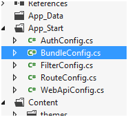

# MVC面试问题与答案

2014年03月16日 20:30:58

passport768594

阅读数：29819

​                 标签：                                   [mvc                                    ](https://so.csdn.net/so/search/s.do?q=mvc&t=blog)[面试                                    ](https://so.csdn.net/so/search/s.do?q=面试&t=blog)[mvc4.0                                    ](https://so.csdn.net/so/search/s.do?q=mvc4.0&t=blog)[高性能                                    ](https://so.csdn.net/so/search/s.do?q=高性能&t=blog)[自动化测试                                  ](https://so.csdn.net/so/search/s.do?q=自动化测试&t=blog)               更多

​                 个人分类：                                   [.Net                                  ](https://blog.csdn.net/dc8899/article/category/1893253)               

​                   


 免责声明 

 读这篇文章不意味着你一定要去并且能搞定MVC面试。这篇文章的目的是在面试之前让你快速复习MVC知识。这篇文章也不是MVC培训课程。

 如果你想学习MVC，从这儿开始 [Learn MVC (  Model view controller) step by step 7 days](http://www.codeproject.com/Articles/207797/Learn-MVC-Model-View-Controller-step-by-step-in-7) ，或者是 [step by step  MVC (Model View Controller) video series from YouTube.](https://www.youtube.com/playlist?list=PL33C9E91F8CDD2BF7) 

 

##  什么是MVC (模型 视图 控制器)?

 MVC是一个架构模式，它分离了表现与交互。它被分为三个核心部件：模型、视图、控制器。下面是每一个部件的分工：

- 视图是用户看到并与之交互的界面。
- 模型表示业务数据，并提供数据给视图。
- 控制器接受用户的输入并调用模型和视图去完成用户的需求。

 

 图: MVC (模型、视图、控制器)

##  你能解释下MVC的完整流程吗？

 下面是MVC（模型、视图、控制器）架构的控制流程：

- 所有的终端用户请求被发送到控制器。
- 控制器依赖请求去选择加载哪个模型，并把模型附加到对应的视图。
- 附加了模型数据的最终视图做为响应发送给终端用户。

##  MVC同时适用于Windows应用和Web应用吗?

 相比Windows应用，MVC架构更适用于Web应用。对于Windows应用，MVP(Model View Presenter)架构更好一点。如果你使用WPF和Silverlight，MVVM更适合。

##  使用MVC有哪些好处?

 MVC有两个大的好处：

- 分离了关注点。后台代码被移到单独的类文件，我们可以最大限度的重复利用代码。
- 自动化UI测试成为可能，因为后台代码移到了.NET类。这让我们更容易做单元测试和自动化测试。

##  MVC不同于三层架构？

 MVC是三层传统架构的演变。三层架构和MVC有一些通用的组成部分。 显示如下：

| 功能性             | 三层 / 分层架构 | Model view controller architecture |
| ------------------ | --------------- | ---------------------------------- |
| 显示与交互         | 用户界面        | 视图                               |
| UI逻辑             | 用户界面        | 控制器                             |
| 商业逻辑 / 验证    | 中间层          | 模型                               |
| 请求首先发送给谁？ | 用户界面        | 控制器                             |
| 访问数据           | 数据链接层      | 数据链接层                         |

 

 图示: 三层架构

##  MVC的最新版本是哪个?

 在写这篇文章时MVC已经发行了4个版本：MVC 1 , MVC 2, MVC 3, 和 MVC 4. 所以 MVC 4是最新版本。

##  每个版本的MVC有什么不同?

 下面的表格列出了详细的不同点。但是在面试中限于时间问题，很难去说出所有的东西。所以，我标出了所有重要区别。

| MVC 2                                                        | MVC 3                                                        | MVC 4                                                        |
| ------------------------------------------------------------ | ------------------------------------------------------------ | ------------------------------------------------------------ |
| Client-side validationTemplated Helpers AreasAsynchronous Controllers`Html.ValidationSummary` Helper Method`DefaultValueAttribute` in Action-MethodParameters bindingBinary data with Model BindersDataAnnotations AttributesModel-Validator ProvidersNew `RequireHttpsAttribute`Action FilterTemplated HelpersDisplay Model-Level Errors | RazorReadymade project templatesHTML 5 enabled templatesSupport for Multiple View Engines, JavaScript, and AJAXModel Validation Improvements | ASP.NET Web APIRefreshed and modernized default project templates. New mobile project template.Many new features to support mobile appsEnhanced support for asynchronous methods |

##  MVC中的HTML helpers是什么？

 HTML helpers帮助你渲染视图中的HTML控件。如果在面试中你想展示HTML输入框，下面是HTML helper代码。

 

```csharp
<%= Html.TextBox("LastName") %>
```


 checkbox的代码如下。用这种方式我们可以创建现存的所有HTML控件。

 

```csharp
<%= Html.CheckBox("Married") %>
```


##  “HTML.TextBox” 和 “HTML.TextBoxFor”有什么不同?

 它们两个输出相同的HTML， “HTML.TextBoxFor”是强类型的，但“HTML.TextBox”不是。下面是一个实例，它仅仅创建了一个名字为“CustomerCode”的输入框。 

 

```csharp
Html.TextBox("CustomerCode")
```


 下面的代码是用 “Html.TextBoxFor” 创建的HTML输入框，从对象"m"中调用了属性”CustomerCode“。

 

```csharp
Html.TextBoxFor(m => m.CustomerCode)
```


 相同的方式，我们可以用“Html.CheckBox” 和 “Html.CheckBoxFor”创建checkbox。

##  MVC的路由选择是什么?

 路由选择功能帮你定义一个URL规则，映射URL到控制器。

 举一个例子，我们想让用户输入“<http://localhost/View/ViewCustomer/>”时，它转向到“Customer”控制器并且调用`DisplayCustomer`。这个通过Maproute方法来定义。代码如下：

 

```csharp
routes.MapRoute(


               "View", // Route name


               "View/ViewCustomer/{id}", // URL with parameters


               new { controller = "Customer", action = "DisplayCustomer", 


id = UrlParameter.Optional }); // Parameter defaults   
```


##  在哪里写路由映射表？

 在 “global.asax” 文件。

##  我们可以映射多个URL到同一个动作吗？

 是的，可以。只需要添加多条不同Key名字的记录，并且指定同样的控制器和动作。

##  使用hyperlink生成链接，如何从一个视图链接到另一个视图?

 使用`ActionLink`方法，如下图所示。下面的代码生成一个简单的URL，链接到"Home"控制器的GotoHome动作。

 

```csharp
<%= Html.ActionLink("Home","Gotohome") %> 
```


##  如何限制一个动作的类型为GET或POST?

 我们可以给MVC的动作一个HttpGet或HttpPost属性去限制HTTP的类型。你可以看下面的代码段，这个`DisplayCustomer` 动作只能用HttpGet方式访问。如果我们尝试用Http post的方式，会看到错误信息。

 

```csharp
[HttpGet]


public ViewResult DisplayCustomer(int id)


{


    Customer objCustomer = Customers[id];


    return View("DisplayCustomer",objCustomer);


} 
```


##  在MVC中如何保持Sessions?

 可以通过三种方式保持： tempdata, viewdata, 和viewbag。

##  tempdata, viewdata, 和 viewbag之间有什么不同?

 

 图示:  tempdata, viewdata, 和viewbag之间不同点

- Temp data -在不同的控制器或动作间转换时保持数据。另外，进行页面转向时，tempdata可以保持数据。它是一个内部的Session变量。
- View data - 可以在控制器和视图间保持数据。
- View Bag -  它是视图数据的动态包装。使用Viewbag不需要类型转换。它使用的是内部动态关健词。 

 

 图示: 动态关键词

- Session 变量 - 使用Session变量可以在任何实体间保持数据。
- 隐藏字段和HTML控件 - 只能何持数据从UI到Controller。可以使用HTML控制器或隐藏字段，用HTTP方式(POST或GET)发送数据到控制器。

 下表是汇总：

| Maintains data between   | ViewData/ViewBag | TempData | Hidden fields | Session |
| ------------------------ | ---------------- | -------- | ------------- | ------- |
| Controller to Controller | No               | Yes      | No            | Yes     |
| Controller to View       | Yes              | No       | No            | Yes     |
| View to Controller       | No               | No       | Yes           | Yes     |

##  MVC是的局部视图是什么?

 局部视图是一个可重复调用的视图（和用户控件一样），它可以嵌入到视图里面。例如：你的站点页面有统一的菜单、头部、尾部，如下图所示：

 

 Figure: MVC中的局部视图

 如果你想在所有页面重用菜单、头部和尾部。可以创建局部视图，然后在主视图中调用它们。

##  如何创建和调用局部视图?

 点击"Create partial view"复选框去添加局部视图。

 

 图示: 创建局部视图

 局部视图创建好后，在主视图中使用 `Html.RenderPartial`调用。如下代码：

 

```html
<body>


<div>


<% Html.RenderPartial("MyView"); %>


</div>


</body> 
```


##  MVC中如何做输入验证?

 早期的MVC版本中使用数据注释来做验证。除了注释还可以利用数据模型的属性标签。例如，下面的实例代码中Customer类有一个属性customercode。

 这个CustomerCode属性标注了一个Required数据。如果不提供CustomerCode数据，它将不能通过验证。

 

```csharp
public class Customer


{


    [Required(ErrorMessage="Customer code is required")]


    public string CustomerCode


    {


        set;


        get;


    } 


}  
```


 为了显示验证错误提示我们需要使用ValidateMessageFor方法，它属于Html helper类。

 

```csharp
<% using (Html.BeginForm("PostCustomer", "Home", FormMethod.Post))


{ %>


<%=Html.TextBoxFor(m => m.CustomerCode)%>


<%=Html.ValidationMessageFor(m => m.CustomerCode)%>


<input type="submit" value="Submit customer data" />


<%}%> 
```


 在controller中，使用ModelState.IsValid属性检查数据是否正确。

 

```csharp
public ActionResult PostCustomer(Customer obj)


{


    if (ModelState.IsValid)


    {


        obj.Save();


        return View("Thanks");


    }


    else


    {


        return View("Customer");


    }


}
```


 下面是一个显示错误信息的实例。

 

 图示: MVC中的验证

##  可以一次显示所有的错误信息吗？

 可以。使用Html helper类中的ValidationSummary方法。

 

```csharp
<%= Html.ValidationSummary() %> 
```


 MVC中还有哪些注释属性用来验证？

 如果你要去检查字符的长度，你可以使用 `StringLength`.

 

```csharp
[StringLength(160)]


public string FirstName { get; set; }
```


 如果你想使用注册表达式，你可以使用 `RegularExpression` 。

 

```csharp
[RegularExpression(@"[A-Za-z0-9._%+-]+@[A-Za-z0-9.-]+\.[A-Za-z]{2,4}")]public string Email { get; set; }
```


 如果你想检查数字是否在一个范围内，你可以使用 `Range` 。

 

```csharp
[Range(10,25)]public int Age { get; set; }
```


 有时你想比较两个字段的值，我们可以使用 `Compare`。

 

```csharp
public string Password { get; set; }[Compare("Password")]public string ConfirmPass { get; set; }
```


 如果你想拿到错误详情，你可以使用 `Errors` 集合。

 

```csharp
var ErrMessage = ModelState["Email"].Errors[0].ErrorMessage;
```


 如果你已经创建好模型对象，你可以在Contronller中调用 `TryUpdateModel` 去检查它是否正确。

 

```csharp
TryUpdateModel(NewCustomer);
```


 如果你想在Controller中添加错误信息，你可以使用 `AddModelError` 函数。

 

```csharp
ModelState.AddModelError("FirstName", "This is my server-side error.");
```


##  如何启用客户端验证？

 有两个步骤：第一引用必须的jQuery文件。

 

```javascript
<script src="<%= Url.Content("~/Scripts/jquery-1.5.1.js") %>" type="text/javascript"></script>


<script src="<%= Url.Content("~/Scripts/jquery.validate.js") %>" type="text/javascript"></script>


<script src="<%= Url.Content("~/Scripts/jquery.validate.unobtrusive.js") %>" type="text/javascript"></script> 
```


 第二步去调用 `EnableClientValidation` 方法。 

 

```csharp
<% Html.EnableClientValidation(); %> 
```


##  什么是MVC中的Razor?

 它是一个轻量级的视图引擎。MVC最初只有一个ASPX的视图类型，直到MVC3才引进了Razor 。

##  已经有了ASPX，为什么还要Razor?

 相比ASPX，Razor是一个干净的、轻量级的和语法更简单。例如，ASPX去显示时间：

 

```csharp
<%=DateTime.Now%> 
```


 在Razor中，只需要一行：

 

```csharp
@DateTime.Now
```


##  Razor or ASPX，哪个更好?

 Razor更好，因为它是轻量级的，并且语法简单。

##  在MVC中如何做授权和认证？

 在MVC中你可以使用Windows或Forms认证。

##  在MVC中如何去执行Windows认证？

 你需要修改web.config文件，并设置验证模式为Windows。

 

```csharp
<authentication mode="Windows"/>


<authorization>


<deny users="?"/>


</authorization> 
```


 然后在controlle或action中，你可以使用 `Authorize` 属性，指定哪个用户可以访问这个controller或action。下面的代码设置到只有指定的用户可以访问它。

 

```csharp
[Authorize(Users= @"WIN-3LI600MWLQN\Administrator")]


public class StartController : Controller


{


    //


    // GET: /Start/


    [Authorize(Users = @"WIN-3LI600MWLQN\Administrator")]


    public ActionResult Index()


    {


        return View("MyView");


    }


} 
```


##  在MVC中如何用表单认证？

 表单认证和ASP.NET的表单验证一样。第一步是设置认证模式为Forms。loginUrl是指向到controller，而不是一个页面。

 

```csharp
<authentication mode="Forms">


<forms loginUrl="~/Home/Login"  timeout="2880"/>


</authentication> 
```


 

 我们也需要创建一个controller，去验证用户。如果验证通过，需要设置cookies值。

 

```csharp
public ActionResult Login()


{


    if ((Request.Form["txtUserName"] == "Shiv") && 


          (Request.Form["txtPassword"] == "Shiv@123"))


    {


        FormsAuthentication.SetAuthCookie("Shiv",true);


        return View("About");


    }


    else


    {


        return View("Index");


    }


} 
```


 其它需要验证的action都需要加一个 `Authorize` 属性，如果用户没权限将转向到登陆页面。

 

```csharp
[Authorize]


PublicActionResult Default()


{


return View();


}


[Authorize]


publicActionResult About()


{


return View();


} 
```


##  在MVC中如何执行AJAX?

 MVC中有两种方式可以执行AJAX：

- AJAX libraries
- jQuery

 下面是一个简单的实例，它使用“AJAX”帮助执行AJAX。在下面的代码中，你可以使用Ajax.BeginForm创建了一个表单。这个表单调用了一个getCustomer方法。

 

```html
<script language="javascript">


function OnSuccess(data1) 


{


// Do something here


}


</script>


<div>


<%


        var AjaxOpt = new AjaxOptions{OnSuccess="OnSuccess"};        


    %>


<% using (Ajax.BeginForm("getCustomer","MyAjax",AjaxOpt)) { %>


<input id="txtCustomerCode" type="text" /><br />


<input id="txtCustomerName" type="text" /><br />


<input id="Submit2" type="submit" value="submit"/></div>


<%} %> 
```


 如果你想做在hyperlink点击上做Ajax调用，你可以使用 `Ajax.ActionLink` 函数，如下图所示。

 

 图示: 在MVC中执行AJAX

 如果你想创建一个AJAX异步hyperlink，它调用controller中的GetDate方法，代码如下。一旦controller作出回应，这个数据会显示在id为DateDiv的DIV中。

 

```csharp
<span id="DateDiv" />


<%: 


Ajax.ActionLink("Get Date","GetDate",


new AjaxOptions {UpdateTargetId = "DateDiv" })


%> 
```


 下面是Controller代码。你可以看到GetDate有延迟10秒。

 

```csharp
public class Default1Controller : Controller


{


   public string GetDate()


   {


       Thread.Sleep(10000);


       return DateTime.Now.ToString();


   }


}
```


 在MVC中做Ajax调用的第二种方式是使用jQuery。下面的代码你可以看到我们做了一个AJAX POST到/MyAjax/getCustomer。它使用$.post。所有的逻辑代码放在GetData函数中，你可以通过一个按钮或者是链接点击事件去调用它。

 

```javascript
function GetData() 


{


    var url = "/MyAjax/getCustomer";


    $.post(url, function (data) 


    {


        $("#txtCustomerCode").val(data.CustomerCode);


        $("#txtCustomerName").val(data.CustomerName);


    }


    )


} 
```


##  在AJAX中有几种事件可以跟踪？

 

 图示: AJAX中的事件跟踪

##  ActionResult 和 ViewResult有什么不同?

- `ActionResult` 是一个抽象类，ViewResult衍生于 `ActionResult` 类。 `ActionResult`有几种衍生类，例如： `ViewResult`，`JsonResult``，``FileStreamResult`，  等等。

- ```
  ActionResult
  ```

   可以用来开发多态和动态动象。所以如果你动态运行不同类型的视图，

  ```
  ActionResult
  ```

   是最好的选择。例如下面的代码，你可以看见我们有一个

  DynamicView

  。基于标记（IsHtmlView），它会返回

  ```
  ViewResult
  ```

   或 

  ```
  JsonResult
  ```

  。

  ```csharp
  public ActionResult DynamicView()
  
  
  
  {
  
  
  
     if (IsHtmlView)
  
  
  
       return View(); // returns simple ViewResult
  
  
  
     else
  
  
  
       return Json(); // returns JsonResult view
  
  
  
  } 
  ```

##  MVC有多少种不同类型的结果类型？

 注意： 很难去记住所有的12种类型。但是一些重要的你可以记住，例如：`ActionResult`， `ViewResult`，和 `JsonResult`。详情如下:

 MVC中的12种结果类型，最主要的是ActionResult类，它是一个基础类，它有11个子类型，如下：

1. `ViewResult` - 给响应流渲染指定的视图
2. `PartialViewResult` - 给响应流渲染指定的局部视图
3. `EmptyResult` - 返回空的响应结果。
4. `RedirectResult` - 执行一个HTTP转向到指定的URL。
5. `RedirectToRouteResult` - 执行一个HTTP转向到一个URL，这个URL由基于路由数据的路由引擎来决定
6. `JsonResult` - 序列化一个ViewData对像到JSON格式。
7. `JavaScriptResult` - 返回一段Javascript代码，它可以在客户端执行。
8. `ContentResult` - 写内容到响应流，不需要视图支持。
9. `FileContentResult` - 返回一个文件到客户端。
10. `FileStreamResult` - 返回一个文件到客户端，它提供的是流。
11. `FilePathResult` - 返回一个文件到客户端。

##  MVC中的ActionFilters是什么？

 ActionFilters帮助你在MVC action执行中或执行后，执行一些逻辑。

 

 图示: MVC中的ActionFilters。

 Action filters通常用在下面的场景中：

1. 在action发生前，执行POST logic before the action happens.
2. 取消一个当前的执行。
3. 检查返回值。
4. 给action提供特殊的数据。

 你有两种方式创建action filters：

- 内联action filter.
- 创建一个 `ActionFilter` 属性.

 创建内联action filter，我们需要执行`IActionFilter` 接口。`IActionFilter`接口有两个方法： `OnActionExecuted` 和 `OnActionExecuting`。在这两个方法中我们可以执行预处理逻辑或取消逻辑。

 

```csharp
public class Default1Controller : Controller , IActionFilter


{


    public ActionResult Index(Customer obj)


    {


        return View(obj);


    }


    void IActionFilter.OnActionExecuted(ActionExecutedContext filterContext)


    {


        Trace.WriteLine("Action Executed");


    }


    void IActionFilter.OnActionExecuting(ActionExecutingContext filterContext)


    {


        Trace.WriteLine("Action is executing");


    }


} 
```


 内联Action filter的问题是不能跨Controler。我们可以转换内联action filter到action filter属性。创建action filter属性，我们需要继承ActionFilterAttribute和执行`IActionFilter` 接口，代码如下：

 

```csharp
public class MyActionAttribute : ActionFilterAttribute , IActionFilter


{


    void IActionFilter.OnActionExecuted(ActionExecutedContext filterContext)


    {


        Trace.WriteLine("Action Executed");


    }


    void IActionFilter.OnActionExecuting(ActionExecutingContext filterContext)


    {


      Trace.WriteLine("Action executing");


    }


} 
```


 之后我们可以在controller上使用这个属性。你可以看下面的代码：

 

```csharp
[MyActionAttribute]


public class Default1Controller : Controller 


{


    public ActionResult Index(Customer obj)


    {


        return View(obj);


    }


}
```


##  MVC中可以创建自定义视图引擎吗？

 可以，在MVC中我们可以创建自己的自定义视图引擎。创建自己的自定义视图引擎需要跟随下面三步：

 我们将创建一个自定义视图引擎，在视图里用户可以输入一个命令，比如“<DateTime>”，它会显示当前的日期和时间。

 步骤1：我们需要创建一个类去执行IView接口。我们应该在这个类的render函数中写一些逻辑，指明如何渲染视图。示例代码如下：

 

```csharp
public class MyCustomView : IView


{


    private string _FolderPath; // Define where  our views are stored


    public string FolderPath


    {


        get { return _FolderPath; }


        set { _FolderPath = value; }


    }


 


    public void Render(ViewContext viewContext, System.IO.TextWriter writer)


    {


       // Parsing logic <dateTime>


        // read the view file


        string strFileData = File.ReadAllText(_FolderPath);


        // we need to and replace <datetime> datetime.now value


        string strFinal = strFileData.Replace("<DateTime>", DateTime.Now.ToString());


        // this replaced data has to sent for display


        writer.Write(strFinal); 


    }


} 
```


 步聚2： 我们需要创建一个类，它继承`VirtualPathProviderViewEngine` ，并且我们需要提供一个文件夹路径和视图文件扩展名。例如，Razor是“cshtml”，aspx是“.aspx”。示例代码如下：

 

```csharp
public class MyViewEngineProvider : VirtualPathProviderViewEngine


{


    // We will create the object of Mycustome view


    public MyViewEngineProvider() // constructor


    {


        // Define the location of the View file


        this.ViewLocationFormats = new string[] { "~/Views/{1}/{0}.myview", 


          "~/Views/Shared/{0}.myview" }; //location and extension of our views


    }


    protected override IView CreateView(


      ControllerContext controllerContext, string viewPath, string masterPath)


    {


        var physicalpath = controllerContext.HttpContext.Server.MapPath(viewPath);


        MyCustomView obj = new MyCustomView(); // Custom view engine class


        obj.FolderPath = physicalpath; // set the path where the views will be stored


        return obj; // returned this view paresing


        // logic so that it can be registered in the view engine collection


    }


    protected override IView CreatePartialView(ControllerContext controllerContext, string partialPath)


    {


        var physicalpath = controllerContext.HttpContext.Server.MapPath(partialPath);


        MyCustomView obj = new MyCustomView(); // Custom view engine class


        obj.FolderPath = physicalpath; // set the path where the views will be stored


        return obj;


        // returned this view paresing logic


        // so that it can be registered in the view engine collection


    }


} 
```


步骤 3： 我们需要注册自定义视图到视图集合。注册自定义视图引擎最适合的地方是global.aspx文件中的`ViewEngines`集合。代码如下：


```csharp
protected void Application_Start()


{


    // Step3 :-  register this object in the view engine collection


    ViewEngines.Engines.Add(new MyViewEngineProvider());


    …..


} 
```


 下面是一个实例，在自定义视图的顶部中写了一个定义好的命令。

 

 图示: MVC中的自定义视图引擎

 当你调用视图，你应该能看见下面的输出：

 

##  在MVC中如何返回JSON格式的结果？

 在MVC中，我们有`JsonResult` 类可以返回JSON格式数据。下面是一个简单的例子，它使用JsonResult返回Customer对象的JSON格式。

 

```csharp
public JsonResult getCustomer()


{


    Customer obj = new Customer();


    obj.CustomerCode = "1001";


    obj.CustomerName = "Shiv";


    return Json(obj,JsonRequestBehavior.AllowGet);


}
```


 下面是上面代码的JSON输出：

 

##  什么是WebAPI?

 HTTP是最常用的协议。过去的很多年，浏览器是我们使用HTTP方式公开数据的首选客户端。但是日新月异，客户端发展到多种形式。我们需要使用HTTP方式传递数据给不同的客户端，例如：移动手机、Javascript，Windows应用等等。

 WebAPI是一个通过HTTP方式公开数据的技术，它跟随REST规则。

##  WCF SOAP 也做同样的事情，它与WebAPI也有什么区别？

|          | SOAP                                                         | WEB API                                                      |
| -------- | ------------------------------------------------------------ | ------------------------------------------------------------ |
| **大小** | 重量级，因为它使用复杂的WSDL结构。                           | 轻量级，只有需要的信息被传递。                               |
| 协议     | 协议无关                                                     | 只支持HTTP协议                                               |
| 格式     | 解析SOAP信息，客户端需要理解WSDL格式。写自定义代码去解析WSDL是非常重要的任务。如果客户端足够聪明去创建一个代理对象，比如在.net中添加引用，那么SOAP是最简单的方式。 | WebAPI的输出是简单的字符串、JSON、简单XML格式等。所以，写解析逻辑非常简单。 |
| 规则     | SOAP跟随WS-* 规定                                            | WebAPI跟随REST规定。(Please refer to REST in WCF chapter.)   |

##  关于Web API, 你可以看我的另一篇翻译：[ASP.NET  Web API详解](http://blog.csdn.net/passport768594/article/details/19753475)

##  在MVC中我们如何识别是PSOT还是GET调用？

 在控制器中识别POST或GET，我们可以使用 `Request.HttpMethod` ，代码如下所示：

 

```csharp
public ActionResult SomeAction()


{


    if (Request.HttpMethod == "POST")


    {


        return View("SomePage");


    }


    else


    {


        return View("SomeOtherPage");


    }


}
```


##  什么是MVC中的打包也压缩?

 打包与压缩帮助我们减少一个页面的请求时间，从而提高页面执行性能。

##  打包如何搞高性能？

 我们的项目总是需要CSS和脚本文件。打包帮助你合并多个Javascript和css文件到单个文件，从而最小化多个请求到一个请求。

 例如，包含下面的web请求到一个页。这个页面要求两个Javascript文件，Javascript1.js和Javascript2.js。 当请求这个页面时，它要做三次请求：

- 一个是Index页面. 
- 两个请求是为了两个JavaScript文件：Javascript1.js 和Javascript2.js.

 如果页面中有大量的javascript文件，这样会降低性能。如果我们可以合并所有的JS文件到一个文件，只请求一个，这将加增加性能。如下图所示：

 
   

 

##  MVC中如何执行打包？

 打开App_Start文件夹中的BundleConfig.cs

 

 在BundleConfig.cs中，添加你想打包的JS文件路径到打包集合。如下所示：

 

```csharp
bundles.Add(new ScriptBundle("~/Scripts/MyScripts").Include(


"~/Scripts/*.js")); 
```


 下面是 BundleConfig.cs 文件的代码：

 

```csharp
public  class BundleConfig


{


    public static void RegisterBundles(BundleCollection bundles)


    {


        bundles.Add(new ScriptBundle("~/Scripts/MyScripts").Include(


           "~/Scripts/*.js"));


        BundleTable.EnableOptimizations = true;


    }


}
```


 一旦你合并了脚本到一个文件，你可以使用下面的代码去调用它：

 

```csharp
<%= Scripts.Render("~/Scripts/MyScripts")  %>
```


 你将看到脚本请求被合并到一个：

 

##  在debug模式下如何测试打包功能？

 如果你在debug模式下，你需要在bundleconfig.cs中设置`EnableOptimizations`为true，否则你不会看到打包效果。

 

```csharp
BundleTable.EnableOptimizations = true;
```


##  解释压缩，它是如何执行的？

 压缩功能通过移除空格、注释等减少了脚本与CSS文件的大小。例如下面的代码：

 

```csharp
// This is test


var x = 0;


x = x + 1;


x = x * 2;
```


 执行压缩后的Javascript代码如下所示。

 

```csharp
var x=0;x=x+1;x=x*2;
```


##  如何执行压缩？

 当你执行打包时，压缩会自动执行。它的执行步骤与打包一样。

 

 原文： <http://www.codeproject.com/Articles/556995/MVC-interview-questions-with-answers>