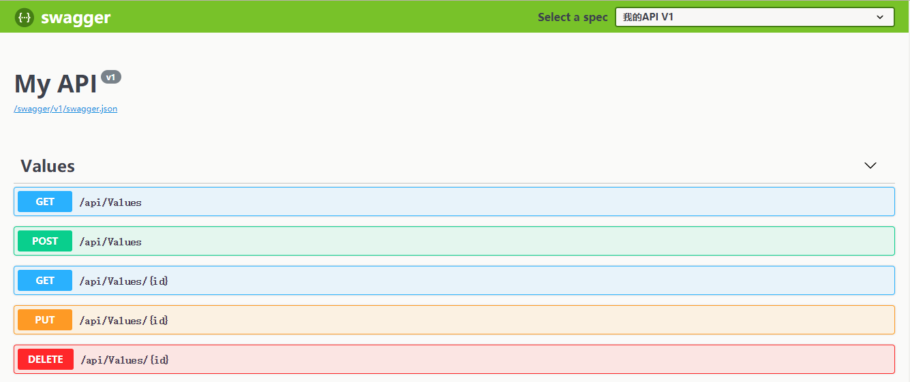

​	

###	异步编程`await`,`async`

一定要异步到底，避免阻塞。

###	Swagger

通过`NuGet`加载依赖包`Swashbuckle.AspNetCore`


在`Configure` 方法中加入下面代码：

```csharp
    app.UseSwagger();
    app.UseSwaggerUI(c=>{
        c.SwaggerEndpoint("/swagger/v1/swagger.json", "我的API V1");
    });
```




##	使用 Nginx

> ## 依赖框架的部署 (FDD)

在 ASP.NET Core 推荐配置中，应用使用 **IIS/**ASP.NET Core 模块、**Nginx** 或 **Apache** 进行托管。 代理服务器、负载均衡器和其他网络设备通常会在请求到达应用之前隐藏有关请求的信息：

- 当通过 HTTP 代理 HTTPS 请求时，原方案 (HTTPS) 将丢失，并且必须在标头中转接。
- 由于应用收到来自代理的请求，而不是 Internet 或公司网络上请求的真实源，因此原始客户端 IP 地址也必须在标头中转接。

此信息在请求处理中可能很重要，例如在重定向、身份验证、链接生成、策略评估和客户端地理位置中。