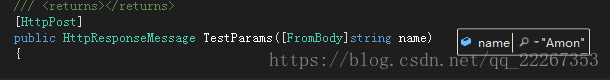
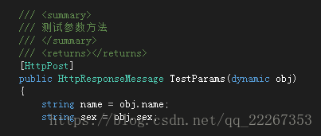
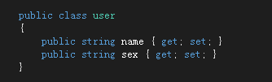
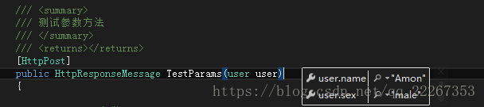
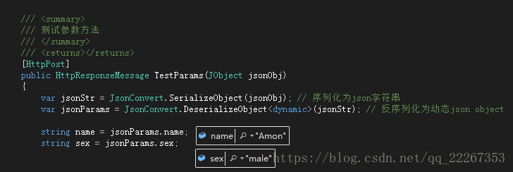

# NET WebAPI post参数传递

​                                                                                                                         2018年08月30日 09:52:38                     [cjchnvs](https://me.csdn.net/qq_22267353)                     阅读数 5036                                                                                                                                 

​                                     

​                                                                                                                                                                     版权声明：本文为博主原创文章，未经博主允许不得转载。项目合作qq：1936057493                          https://blog.csdn.net/qq_22267353/article/details/82216535                     

## 可行的传参形式

1. 键值对对应
2. dynamic动态类型（非跨域）
3. 实体类
4. JObject参数（推荐）

------

## 1.键值对对应

这里所说的键值对并非是一般的键值对，是指键为空，值不为空的键值对 
 前台请求

```
$.ajax({
    url: host + '/api/Source/TestParams',
    type:"post",
    data: { '': "Amon"},
    success: function(a) {
        console.log(a);
    }
});12345678
```

后台 
 

可以看到后台是接收到参数了的，但是这种方式只能传一个键值对参数,`{'': 'Amon', '': 'male'}` 这种参数是接收不到的，当然也可以把所有参数序列化为字符串，后台再进行反序列化，但是这种方式较为繁琐，所以不推荐

## 2.dynamic 动态类型（非跨域）

这种传参方式在非跨域环境下可行，但是在跨域环境下，前台请求时会出现 405 错误，虽然通过调整ajax请求参数会解决这个错误，但是后台无法正常接收参数 
 前台请求

```
$.ajax({
    url: host + '/api/Source/TestParams',
    type:"post",
    contentType: 'application/json',
    data: JSON.stringify({ 'name': "Amon", sex: 'male'}),
    success: function(a) {
        console.log(a);
    }
});123456789
```

后台 
 

当前传参方式在非跨域环境中测试为可以正常传参，跨域环境暂未找到解决方法，如果有解决方法，欢迎交流

## 3.实体类

实体类是相对来说比较简单的一种传参方式，跟我们平常采用的传参方式相似 
 前台请求

```
$.ajax({
    url: host + '/api/Source/TestParams',
    type:"post",
    data: { 'name': "Amon", sex: 'male'},
    success: function(a) {
        console.log(a);
    }
});12345678
```

后台 
  
  
 这种传参方式需要声明一个实体类，所以说在改变传参时，相应的要去更改实体类，灵活性不是很高

## 4.JObject 参数（推荐）

JObject传参方式是个人比较推荐的一种方式，前台请求传参写法不具迷惑性，后台接收也较为灵活 
 前台请求

```
$.ajax({
    url: host + '/api/Source/TestParams',
    type:"post",
    data: { 'name': "Amon", sex: 'male'},
    success: function(a) {
        console.log(a);
    }
});12345678
```

后台 
 

如果有其他的传参方式，欢迎交流