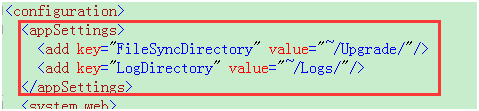
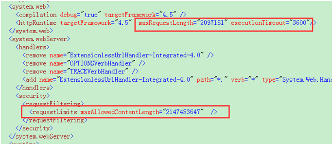
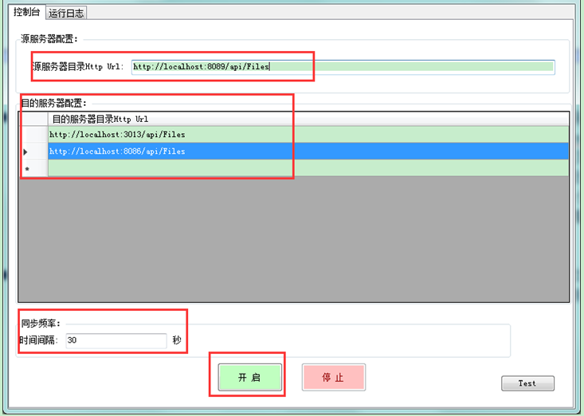
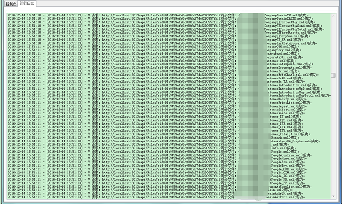

#  			[详解：基于WEB API实现批量文件由一个服务器同步快速传输到其它多个服务器功能](https://www.cnblogs.com/zuowj/p/6158247.html) 		


文件同步传输工具比较多，传输的方式也比较多，比如：FTP、共享、HTTP等，我这里要讲的就是基于HTTP协议的WEB API实现批量文件由一个服务器同步快速传输到其它多个服务器这样的一个工具（简称：一端到多端的文件同步工具）

**一、设计原理：**

1.使用的技术：WinForm、WebApi

1.1 WinForm：为程序主界面，作为一端（一个源文件服务器）同步传输到多端（多个目的文件服务器）文件的业务处理中介；程序内部主要通过System.Timers.Timer+HttpClient来实现定时执行文件同步传输业务；

1.2 WebApi：实现通过HTTP协议批量下载或批量上传多个文件（文件同步传输的核心业务逻辑）；MultipartContent作为批量下载或批量上传的唯一媒介。

2.实现思路：

2.1客户端（WinForm程序主界面）通过HttpClient向源文件服务器目录URL发送GET请求；

2.2源文件服务器服务端（WebApi）的GetFiles方法接收到GET请求后，按照web.config中配置的源文件路径递归获取所有文件的字节信息并转换成MultipartFormDataContent对象后返回；（即：实现了批量下载）

2.3客户端（WinForm程序主界面）将响应的结果显式转换并生成对应的目的文件服务器数量的多文件流内容（MultipartContent）对象列表，以便后续用于批量上传；

2.4客户端（WinForm程序主界面）启用并行循环（Parallel.ForEach）来遍历目的文件服务器目录URL（采用并行循环是为了达到同时向多个目的文件服务器批量上传文件的效果，从而提高运行效率），在循环遍历中，每次将2.3中获得的多文件流内容（MultipartContent）通过HttpClient向目的文件服务器目录URL发送POST请求；

2.5目的文件服务器服务端（WebApi）的SaveFiles方法接收到POST请求后，解析2.4中POST过来的多文件流内容（MultipartContent），并循环遍历文件流，在循环遍历中，按照web.config中配置的上传文件路径，将文件流输出保存到指定的文件路径下，同时生成文件保存成功与失败的日志信息字典，最后返回该字典。（即：实现了批量上传保存）

2.6客户端（WinForm程序主界面）将响应的结果显式转换成保存成功与失败的日志信息字典，并添加到线程安全的无序集合对象中；（采用线程安全的无序集合对象是因为存在多线程并发更新的风险）

2.7客户端（WinForm程序主界面）等待所有并行循环同步上传执行完毕后，根据最后得到的保存成功与失败的日志信息无序集合对象，获得所有目的文件服务器全部保存成功文件名列表及保存成功与失败的日志信息列表（判断是否全部上传成功：若某个文件应上传到5个目的文件服务器，实际成功上传5个，则视为成功，否则有一个未上传成功则视为失败），然后通过HttpClient向源文件服务器目录URL发送PUT请求删除源文件服务器中的同名文件，向源文件服务器LOG  URL发送POST请求将此次文件同步传输的日志保存到源文件服务器目录中

2.8源文件服务器服务端（WebApi）RemoveFiles方法接收到PUT请求后，循环遍历PUT过来的保存成功文件名列表，依次删除同名文件（含子目录），WriteLog方法接收到POST请求后，直接将POST过来的日志信息列表输出保存至源文件服务器web.config中配置的LOG文件路径；为了避免日志无限增大及考虑日志的使用价值，日志文件每天重新覆盖生成新的文件；

**3.****业务流程图：**

**序列图：**

****

**二、使用说明：**

1.将KyFileSyncTransfer.Api项目分别发布到源文件服务器、目的文件服务器；

2.修改源文件服务器服务端（WebApi）web.config中的AppSettings节点，配置FileSyncDirectory（源文件存放目录）、LogDirectory（日志文件保存路径，仅限源文件服务器服务端配置），这两个路径支持当前项目的子目录（即：配置时使用~/）或其它路径（其它路径则需直接配置完整的物理路径）；修改目的文件服务器服务端（WebApi）web.config中的AppSettings节点，配置FileSyncDirectory（上传文件存放目录），这个路径支持当前项目的子目录（即：配置时使用~/）或其它路径（其它路径则需直接配置完整的物理路径）

 

注：为了能够支持大文件批量上传，同时需修改请求内容长度限制，如下设置成最大批量上传1.9G：



3.将客户端（WinForm程序主界面）部署到某台服务器上（只要能够访问源文件服务器、目的文件服务器即可，也可以他们服务器上的任意一台），然后开启客户端（WinForm程序主界面），将上述的源文件服务器服务端URL（http://源文件服务器Host/Api/Files）及多个目的文件服务器服务端URL（http://目的文件服务器Host/Api/Files）录入到程序预设的地方，设置好时间间隔，最后点击开启即可（需保持该程序一直处于运行中，可以最小化到任务栏，双击图标可以显示界面）；若需停止文件同步，点击停止按钮即可；若需查看运行日志，可以切换到运行日志页签浏览。

4.以上3步是完成了文件自动定时同步传输的所有工作，后续只需要将需要同步的文件放到源文件服务器服务端web.config中的AppSettings节点设置的FileSyncDirectory（源文件存放目录）即可。

 运行效果如下：





**三、贴出主要的源代码**

服务端代码（WEB API代码，需要进行文件传输的每个服务器均需要部署该WEB API站点）

FilesController：（实现：批量下载文件、批量上传文件、批量删除文件、批量写日志信息）

[](javascript:void(0);)

```
using System;
using System.Collections.Generic;
using System.IO;
using System.Linq;
using System.Net;
using System.Net.Http;
using System.Web;
using System.Web.Http;
using KyFileSyncTransfer.Api.Common;
using System.Net.Http.Headers;
using System.Net.Http.Formatting;
using System.Threading.Tasks;

namespace KyFileSyncTransfer.Api.Controllers
{
    public class FilesController : ApiController
    {
        private static string fileSyncDirectory = null;
        private static string logDirectory = null;

        static FilesController()
        {
            fileSyncDirectory = BaseUtility.GetDirectoryFromConfig("FileSyncDirectory");
            logDirectory = BaseUtility.GetDirectoryFromConfig("LogDirectory");
        }

        /// <summary>
        /// 从源文件服务器获取所有文件信息(采用JSON方式)
        /// </summary>
        /// <returns></returns>
        [HttpGet, Route("~/api/downfiles")]
        public IHttpActionResult GetFilesForJson()
        {
            if (!Directory.Exists(fileSyncDirectory))
            {
                return BadRequest("同步文件目录不存在或未配置。");
            }

            Dictionary<string, byte[]> files = new Dictionary<string, byte[]>();
            BaseUtility.LoadFileDatas(files, fileSyncDirectory);
            files = files.ToDictionary(kv => kv.Key.Replace(fileSyncDirectory, ""), kv => kv.Value);

            return Json(files);
        }

        /// <summary>
        /// 将所有文件同步保存到目的文件服务器(采用JSON方式)
        /// </summary>
        /// <param name="files"></param>
        /// <returns></returns>
        [HttpPost, Route("~/api/upfiles")]
        public IHttpActionResult SaveFilesForJson([FromBody]IDictionary<string, byte[]> files)
        {
            string requestUrl = HttpContext.Current.Request.Url.ToString();
            var savedErrors = new Dictionary<string, string>();

            if (files == null || !Directory.Exists(fileSyncDirectory))
            {
                return BadRequest();
            }
            foreach (var item in files)
            {
                string file = item.Key;

                string filePath = Path.GetDirectoryName(fileSyncDirectory + file);

                try
                {
                    if (!Directory.Exists(filePath))
                    {
                        Directory.CreateDirectory(filePath);
                    }
                    string saveFilePath = Path.Combine(filePath, Path.GetFileName(file));
                    File.WriteAllBytes(saveFilePath, item.Value);
                }
                catch (Exception ex)
                {
                    savedErrors[file] = string.Format("[{0:yyyy-MM-dd HH:mm:ss}] -请求：{1}同步文件：{2}失败，原因：{3}",
                                    DateTime.Now, requestUrl, file, ex.Message);
                }
            }

            return Json(savedErrors);
        }


        /// <summary>
        /// 从源文件服务器获取所有文件信息
        /// </summary>
        /// <returns></returns>
        [HttpGet]
        public HttpResponseMessage GetFiles()
        {
            if (!Directory.Exists(fileSyncDirectory))
            {
                return Request.CreateErrorResponse(HttpStatusCode.BadRequest, "同步文件目录不存在或未配置。");
            }

            var response = new HttpResponseMessage(HttpStatusCode.OK);
            var content = new MultipartFormDataContent();
            BaseUtility.CreateMultipartFormDataContent(content, fileSyncDirectory, fileSyncDirectory);
            response.Content = content;
            return response;
        }


        /// <summary>
        /// 将所有文件同步保存到目的文件服务器
        /// </summary>
        /// <returns></returns>
        [HttpPost]
        public HttpResponseMessage SaveFiles()
        {
            if (!Request.Content.IsMimeMultipartContent())
            {
                return Request.CreateErrorResponse(HttpStatusCode.UnsupportedMediaType, "未上传任何文件");
            }

            if (!Directory.Exists(fileSyncDirectory))
            {
                return Request.CreateErrorResponse(HttpStatusCode.BadRequest, "未找到文件同步上传目录：" + fileSyncDirectory);
            }

            string requestUrl = HttpContext.Current.Request.Url.ToString();
            Dictionary<string, Dictionary<string, string>> savedResult = new Dictionary<string, Dictionary<string, string>>();
            var provider = new MultipartMemoryStreamProvider();
            const string success = "success";
            const string failure = "failure";

            try
            {

                savedResult[success] = new Dictionary<string, string>();
                savedResult[failure] = new Dictionary<string, string>();

                //Request.Content.ReadAsMultipartAsync(provider).Wait();

                Task.Run(async () => await Request.Content.ReadAsMultipartAsync(provider)).Wait();

                foreach (var item in provider.Contents)
                {
                    string fileName = item.Headers.ContentDisposition.FileName;
                    if (string.IsNullOrEmpty(fileName))
                    {
                        continue;
                    }

                    var fileData = item.ReadAsByteArrayAsync().Result;

                    fileName = BaseUtility.ReviseFileName(fileName);
                    string saveFilePath = fileSyncDirectory + fileName;
                    string fileBasePath = Path.GetDirectoryName(saveFilePath);

                    try
                    {
                        if (!Directory.Exists(fileBasePath))
                        {
                            Directory.CreateDirectory(fileBasePath);
                        }
                        File.WriteAllBytes(saveFilePath, fileData);
                        savedResult[success][fileName] = string.Format("[{0:yyyy-MM-dd HH:mm:ss}] - V 请求：{1}同步文件：<{2}>成功。", DateTime.Now, requestUrl, fileName);
                    }
                    catch (Exception ex)
                    {
                        while(ex.InnerException!=null)
                        {
                            ex = ex.InnerException;
                        }

                        savedResult[failure][fileName] = string.Format("[{0:yyyy-MM-dd HH:mm:ss}] - X 请求：{1}同步文件：<{2}>失败，原因：{3}",
                                        DateTime.Now, requestUrl, fileName, ex.Message);
                    }
                }
            }
            catch (Exception ex)
            {
                while (ex.InnerException != null)
                {
                    ex = ex.InnerException;
                }

                return Request.CreateErrorResponse(HttpStatusCode.BadRequest, ex.Message);
            }
            return Request.CreateResponse(HttpStatusCode.OK, savedResult);
        }


        /// <summary>
        /// 移除源文件服务器指定的文件
        /// </summary>
        /// <param name="files"></param>
        /// <returns></returns>
        [HttpPut]
        public IHttpActionResult RemoveFiles([FromBody]IEnumerable<string> files)
        {
            if (files == null || !Directory.Exists(fileSyncDirectory))
            {
                return BadRequest();
            }

            foreach (string file in files)
            {
                string filePath = Path.Combine(fileSyncDirectory, file);
                if (File.Exists(filePath))
                {
                    File.Delete(filePath);
                }
            }

            return Ok();
        }

        /// <summary>
        /// 将同步的日志信息写入到源文件服务器LOG文件中
        /// </summary>
        /// <param name="savedErrors"></param>
        /// <returns></returns>
        [HttpPost]
        [Route("~/Api/Files/Log")]
        public IHttpActionResult WriteLog([FromBody] IEnumerable<string> savedResult)
        {
            if (!Directory.Exists(logDirectory))
            {
                return BadRequest("同步日志目录不存在或未配置。");
            }

            BaseUtility.WriteLogToFile(logDirectory, savedResult.ToArray());
            return Ok();
        }

    }
}
```

[](javascript:void(0);)

 

WebApiConfig：（增加全局token验证及全部采用json数据返回）

[](javascript:void(0);)

```
using System;
using System.Collections.Generic;
using System.Linq;
using System.Web.Http;
using KyFileSyncTransfer.Api.Models;
using System.Net.Http.Formatting;

namespace FileSyncTransfer.Api
{
    public static class WebApiConfig
    {
        public static void Register(HttpConfiguration config)
        {
            // Web API 配置和服务

            // Web API 路由
            config.MapHttpAttributeRoutes();

            config.Routes.MapHttpRoute(
                name: "DefaultApi",
                routeTemplate: "api/{controller}/{id}",
                defaults: new { id = RouteParameter.Optional }
            );

            config.Filters.Add(new TokenAuthentificationAttribute());

            var jsonFormatter = new JsonMediaTypeFormatter();
            config.Services.Replace(typeof(IContentNegotiator), new JsonContentNegotiator(jsonFormatter));
        }
    }
}
```

[](javascript:void(0);)

JsonContentNegotiator：

[](javascript:void(0);)

```
    public class JsonContentNegotiator : IContentNegotiator
    {
        private readonly JsonMediaTypeFormatter _jsonFormatter;

        public JsonContentNegotiator(JsonMediaTypeFormatter formatter)
        {
            _jsonFormatter = formatter;
        }

        public ContentNegotiationResult Negotiate(Type type, HttpRequestMessage request, IEnumerable<MediaTypeFormatter> formatters)
        {
            var result = new ContentNegotiationResult(_jsonFormatter, new MediaTypeHeaderValue("application/json"));
            return result;
        }
    }
```

[](javascript:void(0);)

TokenAuthentificationAttribute：

[](javascript:void(0);)

```
    public class TokenAuthentificationAttribute : AuthorizationFilterAttribute
    {
        public override void OnAuthorization(System.Web.Http.Controllers.HttpActionContext actionContext)
        {
            if (actionContext.ActionDescriptor.GetCustomAttributes<AllowAnonymousAttribute>().Count > 0)
            {
                base.OnAuthorization(actionContext);
                return;
            }

            //HttpContextBase context = (HttpContextBase)actionContext.Request.Properties["MS_HttpContext"];//获取传统context
            //HttpRequestBase request = context.Request;//定义传统request对象  

            IEnumerable<string> requestToken = null;
            if (actionContext.Request.Headers.TryGetValues("token", out requestToken) && BaseUtility.ValidateToken(requestToken.ElementAt(0)))
            {
                base.OnAuthorization(actionContext);
            }
            else
            {
                actionContext.Response = actionContext.Request.CreateErrorResponse(HttpStatusCode.Unauthorized, "token验证未通过。");
                return;
            }

        }
    }
```

[](javascript:void(0);)

BaseUtility：（通用方法类）

[](javascript:void(0);)

```
using System;
using System.Collections.Generic;
using System.Linq;
using System.Web;
using System.Configuration;
using System.Net.Http;
using System.IO;
using System.Net.Http.Headers;

namespace KyFileSyncTransfer.Api.Common
{
    public static class BaseUtility
    {
        public static string GetDirectoryFromConfig(string cfgName)
        {
            string dir = ConfigurationManager.AppSettings[cfgName];
            if (string.IsNullOrEmpty(dir))
            {
                return null;
            }

            if (dir.Contains('~'))
            {
                dir = HttpContext.Current.Server.MapPath(dir);
            }

            if (!Directory.Exists(dir))
            {
                Directory.CreateDirectory(dir);
            }

            return dir;
        }


        public static MultipartFormDataContent CreateMultipartFormDataContent(MultipartFormDataContent content, string removeRootDir, string dir)
        {
            foreach (string file in Directory.GetFileSystemEntries(dir))
            {
                if (File.Exists(file))
                {
                    byte[] fileBytes = File.ReadAllBytes(file);
                    var fileContent = new ByteArrayContent(fileBytes);
                    fileContent.Headers.ContentDisposition = new ContentDispositionHeaderValue("form-data")
                    {
                        Name = "files",
                        FileName = file.Replace(removeRootDir, "")
                    };
                    fileContent.Headers.ContentType = new MediaTypeHeaderValue(MimeMapping.GetMimeMapping(file));
                    fileContent.Headers.ContentLength = fileBytes.LongLength;
                    content.Add(fileContent);
                }
                else
                {
                    CreateMultipartFormDataContent(content, removeRootDir, file);
                }
            }
            return content;
        }

        public static void LoadFileDatas(Dictionary<string, byte[]> files, string path)
        {
            foreach (string file in Directory.GetFileSystemEntries(path))
            {
                if (File.Exists(file))
                {
                    files[file] = File.ReadAllBytes(file);
                }
                else
                {
                    LoadFileDatas(files, file);
                }
            }
        }

        public static void WriteLogToFile(string logDir, params string[] contents)
        {
            string logFilePath = Path.Combine(logDir, "KyFileSyncTransfer.log");
            if (File.Exists(logFilePath) && !File.GetLastWriteTime(logFilePath).Date.Equals(DateTime.Today))
            {
                File.Delete(logFilePath);
            }

            File.AppendAllLines(logFilePath, contents, System.Text.Encoding.UTF8);

        }

        public static bool ValidateToken(string token)
        {
            try
            {
                token = EncryptUtility.Decrypt(token);
                var tokenParts = token.Split(new[] { "-", string.Empty }, StringSplitOptions.RemoveEmptyEntries);
                if (tokenParts.Length != 2)
                {
                    return false;
                }
                if (tokenParts[0] == string.Join(string.Empty, "KyFileSyncTransfer.Api".OrderBy(c => c))) //对固定KEY进行排序然后比对
                {
                    long tokenTstamp = -1;
                    long svrTokenTimeStamp = GetTimeStamp();
                    if (long.TryParse(tokenParts[1], out tokenTstamp) && svrTokenTimeStamp - tokenTstamp <= 10) //时间戳<=10则视为有效
                    {
                        return true;
                    }
                }
            }
            catch
            { }

            return false;
        }

        public static string ReviseFileName(string fileName)
        {
            var regex = new System.Text.RegularExpressions.Regex("^\"+(?<name>.*)\"+$");
            var matchResult = regex.Match(fileName);
            if (matchResult != null && matchResult.Length > 0)
            {
                return matchResult.Groups["name"].Value;
            }
            return fileName;
        }

        /// <summary>
        /// 获取时间戳
        /// </summary>
        /// <returns></returns>
        private static long GetTimeStamp()
        {
            TimeSpan ts = DateTime.UtcNow - new DateTime(1970, 1, 1, 0, 0, 0, 0);
            return Convert.ToInt64(ts.TotalSeconds);
        }


    }
}
```

[](javascript:void(0);)

 

客户端代码：（**这里面有一个需要注意的地方就是：GetNeedSyncTransferFilesDatas方法，这个是将从源文件服务器下载有流转换成多个副本的多文件流对象，之前是用的GetNeedSyncTransferFilesData方法，但MultipartContent是一种字节流对象，一旦被用于请求后将会被关闭，再次使用时就会报错**）

[](javascript:void(0);)

```
using System;
using System.Collections.Generic;
using System.ComponentModel;
using System.Data;
using System.Drawing;
using System.Linq;
using System.Text;
using System.Threading.Tasks;
using System.Windows.Forms;
using System.Threading;
using KyFileSyncTransfer.Business;
using System.Diagnostics;
using System.Net.Http;
using System.Collections.Concurrent;
using System.IO;
using System.Runtime.Serialization.Formatters.Binary;
using System.Net.Http.Headers;


namespace KyFileSyncTransfer
{
    public partial class FrmMain : Form
    {
        private const string appVersion = "16.1215.1";
        private FormWindowState thisFormWindowState;
        private System.Timers.Timer appTimer = null;

        private static int syncFlag = 0;
        private static object syncObj = new object();
        private static DateTime lastRunTime = DateTime.MinValue;

        private int runInterval = 10;

        private string srcFileApiUrl = null;
        private List<WebApiUrlInfo> destFileApiUrlList = null;

        private const string success = "success";
        private const string failure = "failure";
        private const string RunInterval = "RunInterval";
        private const string SrcFileApiUrl = "SrcFileApiUrl";
        private const string DestFileApiUrls = "DestFileApiUrls";

        public FrmMain()
        {
            InitializeComponent();
        }


        #region 自定义方法区域


        private void ExecuteFileTransfer()
        {
            List<string> srcFileNameList = new List<string>();
            var needSyncTransferFilesDatas = GetNeedSyncTransferFilesDatas(srcFileNameList, destFileApiUrlList.Count).Result;


            WriteLog(string.Format("从源服务器目录Http Url:{0}，获取到{1}个需要同步的文件.", srcFileApiUrl, srcFileNameList.Count));

            if (needSyncTransferFilesDatas == null || srcFileNameList.Count <= 0) return;

            ShowFileInfoLogs("需要同步的文件列表如下：", srcFileNameList);

            var fileTransferResultBag = new ConcurrentBag<Dictionary<string, Dictionary<string, string>>>();

            Parallel.ForEach(destFileApiUrlList, (destFileApiUrl) =>
            {
                MultipartContent needSyncTransferFilesData = null;
                if (needSyncTransferFilesDatas.TryTake(out needSyncTransferFilesData))
                {
                    var savedResult = new Dictionary<string, Dictionary<string, string>>();
                    try
                    {
                        savedResult = SyncTransferFiles(destFileApiUrl.Url, needSyncTransferFilesData).Result;
                    }
                    catch (Exception ex)
                    {
                        while (ex.InnerException != null)
                        {
                            ex = ex.InnerException;
                        }

                        savedResult[success] = new Dictionary<string, string>();
                        savedResult[failure] = new Dictionary<string, string>();
                        savedResult[failure][destFileApiUrl.Url] = string.Format("[{0:yyyy-MM-dd HH:mm:ss}] - X 请求：{1} 响应失败，原因：{3}", DateTime.Now, destFileApiUrl, ex.Message);
                    }
                    fileTransferResultBag.Add(savedResult);
                    ShowSyncTransferFileLogs(savedResult);
                }
            });

            #region 同步循环
            //foreach (var destFileApiUrl in destFileApiUrlList)
            //{
            //    MultipartContent needSyncTransferFilesData = null;
            //    if (needSyncTransferFilesDatas.TryTake(out needSyncTransferFilesData))
            //    {
            //        var savedResult = new Dictionary<string, Dictionary<string, string>>();
            //        try
            //        {
            //            savedResult = SyncTransferFiles(destFileApiUrl.Url, needSyncTransferFilesData).Result;
            //        }
            //        catch (Exception ex)
            //        {
            //            while (ex.InnerException != null)
            //            {
            //                ex = ex.InnerException;
            //            }
            //            savedResult[success] = new Dictionary<string, string>();
            //            savedResult[failure] = new Dictionary<string, string>();
            //            savedResult[failure][destFileApiUrl.Url] = string.Format("[{0:yyyy-MM-dd HH:mm:ss}] - X 请求：{1} 响应失败，原因：{2}", DateTime.Now, destFileApiUrl, ex.Message);
            //        }
            //        fileTransferResultBag.Add(savedResult);
            //        ShowSyncTransferFileLogs(savedResult);
            //    }
            //}
            #endregion

            List<string> needRemoveFileNameList = GetNeedRemoveFileNameList(srcFileNameList, fileTransferResultBag.Select(b => b[success]));

            RemoveSourceFiles(needRemoveFileNameList);

            WriteSyncTransferFileLog(GetSyncTransferFileLogList(fileTransferResultBag));

            ShowFileInfoLogs("以下文件已成功同步保存到预设的所有目的服务器目录Http Url中,且已移除在源服务器目录Http Url中的相同文件：", needRemoveFileNameList);

        }

        private void ShowFileInfoLogs(string logTitle, List<string> fileList)
        {
            WriteLog(logTitle);
            foreach (string file in fileList)
            {
                WriteLog(file);
            }
            WriteLog("-".PadRight(30, '-'));
        }

        private void ShowSyncTransferFileLogs(Dictionary<string, Dictionary<string, string>> savedResult)
        {
            foreach (var kv in savedResult)
            {
                bool isError = (kv.Key == failure);
                foreach (var kv2 in kv.Value)
                {
                    WriteLog(kv2.Value, isError);
                }
            }
        }

        private void ReviseFileNames(List<string> fileNameList)
        {
            var regex = new System.Text.RegularExpressions.Regex("^\"+(?<name>.*)\"+$");
            for (int i = 0; i < fileNameList.Count; i++)
            {
                string fileName = fileNameList[i];
                var matchResult = regex.Match(fileName);
                if (matchResult != null && matchResult.Length > 0)
                {
                    fileNameList[i] = matchResult.Groups["name"].Value;
                }
            }
        }


        private string ReviseFileName(string fileName)
        {
            var regex = new System.Text.RegularExpressions.Regex("^\"+(?<name>.*)\"+$");
            var matchResult = regex.Match(fileName);
            if (matchResult != null && matchResult.Length > 0)
            {
                return matchResult.Groups["name"].Value;
            }
            return fileName;
        }

        private List<string> GetSyncTransferFileLogList(IEnumerable<Dictionary<string, Dictionary<string, string>>> savedResult)
        {
            List<string> syncTransferFileLogList = new List<string>();
            foreach (var dic in savedResult)
            {
                foreach (var kv in dic)
                {
                    syncTransferFileLogList.AddRange(kv.Value.Values);
                }
            }

            return syncTransferFileLogList;
        }

        private List<string> GetNeedRemoveFileNameList(List<string> srcFileNameList, IEnumerable<Dictionary<string, string>> successResult)
        {
            List<string> successFileNameList = new List<string>();

            int needTransferFileCount = destFileApiUrlList.Count;

            foreach (var dic in successResult)
            {
                successFileNameList.AddRange(dic.Keys);
            }

            var successFileNames = successFileNameList.GroupBy(f => f).Where(gp => gp.Count() >= needTransferFileCount).Select(gp => gp.Key);

            return srcFileNameList.Where(f => successFileNames.Contains(f, StringComparer.OrdinalIgnoreCase)).ToList();
        }


        private void WriteSyncTransferFileLog(IEnumerable<string> savedResult)
        {
            try
            {
                string apiUrl = srcFileApiUrl + (srcFileApiUrl.EndsWith("/") ? "" : "/") + "/Log" + (srcFileApiUrl.Contains('?') ? "&rid=" : "?rid=") + Guid.NewGuid().ToString("N");
                HttpClient client = new HttpClient();
                client.DefaultRequestHeaders.Add("token", GetToken());
                var result = client.PostAsJsonAsync(apiUrl, savedResult).Result;
                result.EnsureSuccessStatusCode();
            }
            catch (Exception ex)
            {
                WriteLog("WriteSyncTransferFileLog错误:" + ex.Message, true);
            }
        }

        private void RemoveSourceFiles(IEnumerable<string> needRemoveFileNames)
        {
            try
            {
                string apiUrl = srcFileApiUrl + (srcFileApiUrl.Contains('?') ? "&rid=" : "?rid=") + Guid.NewGuid().ToString("N");
                using (HttpClient client = new HttpClient())
                {
                    client.DefaultRequestHeaders.Add("token", GetToken());
                    var result = client.PutAsJsonAsync(apiUrl, needRemoveFileNames).Result;
                    result.EnsureSuccessStatusCode();
                }
            }
            catch (Exception ex)
            {
                WriteLog("RemoveSourceFiles错误:" + ex.Message, true);
            }
        }

        private async Task<Dictionary<string, Dictionary<string, string>>> SyncTransferFiles(string destFileApiUrl, HttpContent filesData)
        {
            string apiUrl = destFileApiUrl + (destFileApiUrl.Contains('?') ? "&rid=" : "?rid=") + Guid.NewGuid().ToString("N");
            using (HttpClient client = new HttpClient())
            {
                client.DefaultRequestHeaders.Add("token", GetToken());
                var result = await client.PostAsync(apiUrl, filesData);
                result.EnsureSuccessStatusCode();
                var savedResult = await result.Content.ReadAsAsync<Dictionary<string, Dictionary<string, string>>>();
                return savedResult;
            }
        }


        private async Task<MultipartContent> GetNeedSyncTransferFilesData(List<string> srcFileNameList)
        {
            string apiUrl = srcFileApiUrl + (srcFileApiUrl.Contains('?') ? "&rid=" : "?rid=") + Guid.NewGuid().ToString("N");
            var filesCont = new MultipartContent();
            using (HttpClient client = new HttpClient())
            {
                client.DefaultRequestHeaders.Add("token", GetToken());

                var result = await client.GetAsync(apiUrl);
                result.EnsureSuccessStatusCode();
                var provider = await result.Content.ReadAsMultipartAsync();
                foreach (var item in provider.Contents)
                {
                    string fileName = item.Headers.ContentDisposition.FileName;
                    if (!string.IsNullOrEmpty(fileName))
                    {
                        filesCont.Add(item);
                        srcFileNameList.Add(ReviseFileName(fileName));
                    }
                }
            }

            return filesCont;
        }


        private async Task<ConcurrentBag<MultipartContent>> GetNeedSyncTransferFilesDatas(List<string> srcFileNameList, int destFileServerCount)
        {
            var multipartContents = new ConcurrentBag<MultipartContent>();

            string apiUrl = srcFileApiUrl + (srcFileApiUrl.Contains('?') ? "&rid=" : "?rid=") + Guid.NewGuid().ToString("N");
            using (HttpClient client = new HttpClient())
            {
                client.DefaultRequestHeaders.Add("token", GetToken());

                var result = await client.GetAsync(apiUrl);
                result.EnsureSuccessStatusCode();

                for (int i = 0; i < destFileServerCount; i++)
                {
                    multipartContents.Add(new MultipartContent());
                }

                var provider = await result.Content.ReadAsMultipartAsync();
                foreach (var item in provider.Contents)
                {
                    string fileName = item.Headers.ContentDisposition.FileName;
                    if (!string.IsNullOrEmpty(fileName))
                    {
                        var bytes = await item.ReadAsByteArrayAsync();

                        foreach (var cont in multipartContents)
                        {
                            cont.Add(CreateByteArrayContent(bytes, fileName, item.Headers.ContentType.MediaType));
                        }

                        srcFileNameList.Add(ReviseFileName(fileName));
                    }
                }
            }

            return multipartContents;
        }


        private HttpContent CreateByteArrayContent(byte[] fileBytes, string fileName, string mediaTypeValue)
        {
            var fileContent = new ByteArrayContent(fileBytes);
            fileContent.Headers.ContentDisposition = new ContentDispositionHeaderValue("form-data")
            {
                Name = "files",
                FileName = fileName
            };
            fileContent.Headers.ContentType = new MediaTypeHeaderValue(mediaTypeValue);
            fileContent.Headers.ContentLength = fileBytes.LongLength;

            return fileContent;
        }

        private string GetToken()
        {
            string timeStamp = GetTimeStamp();
            string key = string.Join(string.Empty, "KyFileSyncTransfer.Api".OrderBy(c => c));
            return EncryptUtility.Encrypt(string.Format("{0}-{1}", key, timeStamp));
        }

        /// <summary>
        /// 获取时间戳
        /// </summary>
        /// <returns></returns>
        private string GetTimeStamp()
        {
            TimeSpan ts = DateTime.UtcNow - new DateTime(1970, 1, 1, 0, 0, 0, 0);
            return Convert.ToInt64(ts.TotalSeconds).ToString();
        }


        private void WriteLog(string msg, bool isError = false)
        {
            if (this.IsHandleCreated && this.InvokeRequired)
            {
                this.Invoke(new Action<string, bool>(WriteLog), msg, isError);
            }
            else
            {
                if (isError && !msg.Contains("Error:"))
                {
                    msg = "Error:" + msg;
                }

                msg = string.Format("{0:yyyy-MM-dd HH:mm:ss} - {1}", DateTime.Now, msg);

                lstLog.Items.Add(msg);
                lstLog.SelectedIndex = lstLog.Items.Count - 1;
            }
        }

        private void SaveAppSettingsToConfig()
        {
            ConfigUtility.RemoveAppSettings(null);
            Dictionary<string, string> settings = new Dictionary<string, string>();
            settings[RunInterval] = txtInterval.Text.Trim();
            settings[SrcFileApiUrl] = txtSrcHttpUrl.Text.Trim();
            settings[DestFileApiUrls] = string.Join(",", destFileApiUrlList.Select(u => u.ToString()));
            ConfigUtility.SetAppSettingValues(settings);
        }

        private void LoadAppSettingsFromConfig()
        {
            var settings = ConfigUtility.GetAppSettingValues();
            foreach (var kv in settings)
            {
                if (kv.Key.Equals(RunInterval, StringComparison.OrdinalIgnoreCase))
                {
                    txtInterval.Text = settings[RunInterval];
                }
                else if (kv.Key.Equals(SrcFileApiUrl, StringComparison.OrdinalIgnoreCase))
                {
                    txtSrcHttpUrl.Text = settings[SrcFileApiUrl];
                }
                else if (kv.Key.Equals(DestFileApiUrls, StringComparison.OrdinalIgnoreCase) && !string.IsNullOrEmpty(kv.Value))
                {
                    var destFileApiUrls = settings[DestFileApiUrls].Split(new[] { ",", "" }, StringSplitOptions.RemoveEmptyEntries);
                    destFileApiUrlList = destFileApiUrls.Select(u => new WebApiUrlInfo(u) { }).ToList();
                }
            }
        }

        #endregion

        private void FrmMain_Load(object sender, EventArgs e)
        {
            this.Text = string.Format("{0} V{1}", this.Text, appVersion);
            this.notifyIconApp.Text = this.Text;

            destFileApiUrlList = new List<WebApiUrlInfo>();

            LoadAppSettingsFromConfig();

            dgvDestHttpUrls.AutoGenerateColumns = false;
            dgvDestHttpUrls.DataSource = new BindingList<WebApiUrlInfo>(destFileApiUrlList);

            appTimer = new System.Timers.Timer();
            appTimer.Elapsed += appTimer_Elapsed;

            btnStop.Enabled = false;

        }

        private void appTimer_Elapsed(object sender, System.Timers.ElapsedEventArgs e)
        {
            if (Interlocked.Increment(ref syncFlag) == 1) //若不忙则执行(0+1=1表示不忙)
            {
                Stopwatch watch = new Stopwatch();
                do
                {
                    watch.Restart();
                    try
                    {
                        ExecuteFileTransfer();
                    }
                    catch (Exception ex)
                    {
                        WriteLog("执行文件同步传输时发生错误：" + ex.Message, true);
                    }
                    watch.Stop();

                } while (watch.ElapsedMilliseconds >= runInterval); //如果执行的时间超过同步频率间隔，则直接再执行一次

                Interlocked.Exchange(ref syncFlag, 0); //解除忙
            }
        }

        private void lstLog_DrawItem(object sender, DrawItemEventArgs e)
        {
            if (e.Index < 0) return;
            e.DrawBackground();
            string itemValue = lstLog.Items[e.Index].ToString();
            if (itemValue.Contains("Error:"))//如果Error，则红字显示
            {
                e.Graphics.DrawString(itemValue, e.Font, new SolidBrush(Color.Red), e.Bounds);
            }
            else
            {
                e.Graphics.DrawString(itemValue, e.Font, new SolidBrush(e.ForeColor), e.Bounds);
            }
            e.DrawFocusRectangle();
        }

        private void notifyIconApp_MouseDoubleClick(object sender, MouseEventArgs e)
        {
            if (WindowState == FormWindowState.Minimized)
            {
                WindowState = thisFormWindowState;
                this.ShowInTaskbar = true;
            }
        }

        private void FrmMain_SizeChanged(object sender, EventArgs e)
        {
            //判断是否选择的是最小化按钮
            if (WindowState == FormWindowState.Minimized)
            {
                //隐藏任务栏区图标
                this.ShowInTaskbar = false;
                //图标显示在托盘区
                this.notifyIconApp.Visible = true;
            }
            else
            {
                thisFormWindowState = WindowState;
            }
        }

        private void FrmMain_FormClosing(object sender, FormClosingEventArgs e)
        {
            if (MessageBox.Show("您确定要退出程序吗？", "退出确认", MessageBoxButtons.OKCancel, MessageBoxIcon.Question) == DialogResult.Cancel)
            {
                e.Cancel = true;
                return;
            }

            this.notifyIconApp.Visible = false;
            SaveAppSettingsToConfig();
        }

        private void btnStart_Click(object sender, EventArgs e)
        {
            try
            {
                srcFileApiUrl = txtSrcHttpUrl.Text.Trim();
                if (string.IsNullOrEmpty(srcFileApiUrl))
                {
                    throw new Exception("源服务器目录Http Url不能为空！");
                }

                if (destFileApiUrlList.Count <= 0)
                {
                    throw new Exception("目的服务器目录Http Url列表不能为空！");
                }

                if (!int.TryParse(txtInterval.Text, out runInterval) || runInterval < 10)
                {
                    throw new Exception("时间间隔不正确，必需是整数且>=10！");
                }

                runInterval = runInterval * 1000;
                appTimer.Interval = runInterval;
                appTimer.Start();

                txtSrcHttpUrl.Enabled = false;
                dgvDestHttpUrls.Enabled = false;
                txtInterval.Enabled = false;
                btnStart.Enabled = false;
                btnStop.Enabled = true;

            }
            catch (Exception ex)
            {
                MessageBox.Show("发生错误：" + ex.Message, "错误提示");
            }
        }

        private void btnStop_Click(object sender, EventArgs e)
        {
            appTimer.Stop();
            Interlocked.Exchange(ref syncFlag, 0);

            txtSrcHttpUrl.Enabled = true;
            dgvDestHttpUrls.Enabled = true;
            txtInterval.Enabled = true;

            btnStart.Enabled = true;
            btnStop.Enabled = false;
        }


    }
}
```

[](javascript:void(0);)

设计器生成的代码：

  View Code

 

 特别说明：若客户端需要直接使用ReadAsAsync<T>将响应的结果反序列化成对象，则Newtonsoft.Json应采用6.0.0.0版本，这个是WebApi框架默认使用的版本，若单独通过NuGet引用可能是最新的9.0版本，会报错，这点注意；

另外文中为何采用Winform作为客户端，目的是可以实时查看运行结果，若没有这个需求，那么就可以采用Windows服务程序即可,看个人意愿了。

还有人可能认为，批量上传与下载采取打包上传与打包下载更快，这个我认为看各人的实际需求。

看到大家都想要源代码，其实源代码上面都有复制到项目中即可，但为了便于大家测试，故我也将GIT仓库地址告诉给大家：git@git.oschina.net:zuowj/KyFileSyncTransfer.git，大家如有需要可以下载或查看。

 


分类: [ASP.NET](https://www.cnblogs.com/zuowj/category/548289.html)

标签: [WebApi](https://www.cnblogs.com/zuowj/tag/WebApi/)

​         [好文要顶](javascript:void(0);)             [关注我](javascript:void(0);)     [收藏该文](javascript:void(0);)     [](javascript:void(0);)     [](javascript:void(0);) 


​             [梦在旅途](https://home.cnblogs.com/u/zuowj/)
​             [关注 - 45](https://home.cnblogs.com/u/zuowj/followees)
​             [粉丝 - 401](https://home.cnblogs.com/u/zuowj/followers)         


​                 [+加关注](javascript:void(0);)     

​         5     

​         0     


​     


[« ](https://www.cnblogs.com/zuowj/p/6013040.html) 上一篇：[关于Quartz.NET作业调度框架的一点小小的封装，实现伪AOP写LOG功能](https://www.cnblogs.com/zuowj/p/6013040.html)
[» ](https://www.cnblogs.com/zuowj/p/6264711.html) 下一篇：[近期开发项目中用到的编码小技巧汇总说明](https://www.cnblogs.com/zuowj/p/6264711.html)