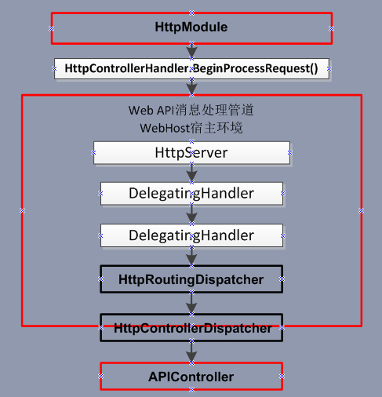

## ASP.NET Web API

### 	 **[ASP.NET Web API webhost宿主环境中管道、路由](https://blog.csdn.net/JinYuan0829/article/details/38412517)**

下面将会主要讲解路由的注册执行过程（WebHost环境），对于管道不会去刻意的说明，都会包含在路由的讲解中，拆开来说明效果不太好。

 

**HttpRoute->HostedHttpRoute->HttpWebRoute->Route**

下面我们看一下整体的一个示意图,

图2

 

最后对于HttpControllerDispatcher类型在控制器部分讲解。

###	[ASP.NET Web API SelfHost宿主环境管道](https://blog.csdn.net/JinYuan0829/article/details/38395451)

首先我们先来看个示意图，大概的描述了在SelfHost宿主环境中管道形态。

图1

---------------------

作者：JinYuan0829 
来源：CSDN 
原文：https://blog.csdn.net/JinYuan0829/article/details/38395451 
版权声明：本文为博主原创文章，转载请附上博文链接！