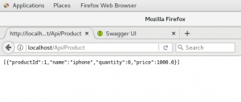
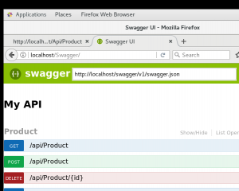

、

# [Asp.Net Core 2  WebAPI+Dapper+MySql+CentOS7+Nginx+windows+IIS 部署例子](http://www.nsoff.com/archives/690/)


 版权属于: [烁飞日志](http://www.nsoff.com)

 原文地址: <http://www.nsoff.com/archives/690/>

  10-14  [.NET](http://www.nsoff.com/archives/category/asp-net/),[CentOS](http://www.nsoff.com/archives/category/centos/),[MySQL](http://www.nsoff.com/archives/category/mysql/)  [honeyeater](http://www.nsoff.com/archives/author/honeyeater/)  948 views


# 1 WebAPI测试程序

新建Asp.Net Core 的WebAPI项目,

 

## ORM

这里用的ORM 是Dapper 利用NUGET管理器安装Dappper

数据库是Mysql 所以还需要一个Mysql的驱动Pomelo.Data.MySql  这个也安装上

## 表结构Sql

DROP TABLE IF EXISTS `products`;
 CREATE TABLE `products` (
 `ProductID` int(11) NULL DEFAULT NULL,
 `Name` varchar(255) CHARACTER SET utf8 COLLATE utf8_general_ci NULL DEFAULT NULL,
 `Quantity` int(255) NULL DEFAULT NULL,
 `Price` int(10) NULL DEFAULT NULL
 ) ENGINE = MyISAM CHARACTER SET = utf8 COLLATE = utf8_general_ci ROW_FORMAT = Dynamic;

## 控制器

ProductController

using Microsoft.AspNetCore.Mvc;
 using System;
 using System.Collections.Generic;
 using System.Linq;
 using System.Threading.Tasks;
 using WebApplication2.Model;
 using WebApplication2.Repository;

namespace WebApplication2.Controllers
 {
 [Route(“api/[controller]”)]
 public class ProductController : Controller
 {
 private readonly ProductRepository productRepository;
 public ProductController()
 {
 productRepository = new ProductRepository();
 }
 // GET: api/values
 [HttpGet]
 public IEnumerable<Product> Get()
 {
 return productRepository.GetAll();
 }

// GET api/values/5
 [HttpGet(“{id}”)]
 public Product Get(int id)
 {
 return productRepository.GetByID(id);
 }

// POST api/values
 [HttpPost]
 public void Post([FromBody]Product prod)
 {
 if (ModelState.IsValid)
 productRepository.Add(prod);
 }

// PUT api/values/5
 [HttpPut(“{id}”)]
 public void Put(int id, [FromBody]Product prod)
 {
 prod.ProductId = id;
 if (ModelState.IsValid)
 productRepository.Update(prod);
 }

// DELETE api/values/5
 [HttpDelete(“{id}”)]
 public void Delete(int id)
 {
 productRepository.Delete(id);
 }
 }
 }

 

## 实体

using System;
 using System.Collections.Generic;
 using System.ComponentModel.DataAnnotations;
 using System.Linq;
 using System.Threading.Tasks;

namespace WebApplication2.Model
 {
 public class Product
 {
 [Key]
 public int ProductId { get; set; }
 public string Name { get; set; }
 public int Quantity { get; set; }
 public double Price { get; set; }
 }
 }

 

数据仓储

ProductRepository

using Dapper;
 using Pomelo.Data.MySql;
 using System;
 using System.Collections.Generic;
 using System.Data;

using System.Linq;
 using System.Threading.Tasks;
 using WebApplication2.Model;

namespace WebApplication2.Repository
 {
 public class ProductRepository
 {
 private string connectionString;
 public ProductRepository()
 {
 connectionString = @”server=192.168.100.75;user id=root;password=123456;persistsecurityinfo=True;database=DapperDemo;”;
 }

public IDbConnection Connection
 {
 get
 {

return new MySqlConnection(connectionString);
 }
 }

public void Add(Product prod)
 {
 using (IDbConnection dbConnection = Connection)
 {
 string sQuery = “INSERT INTO Products (Name, Quantity, Price)”
 \+ ” VALUES(@Name, @Quantity, @Price)”;
 dbConnection.Open();
 dbConnection.Execute(sQuery, prod);
 }
 }

public IEnumerable<Product> GetAll()
 {
 using (IDbConnection dbConnection = Connection)
 {
 dbConnection.Open();
 return dbConnection.Query<Product>(“SELECT * FROM Products”);
 }
 }

public Product GetByID(int id)
 {
 using (IDbConnection dbConnection = Connection)
 {
 string sQuery = “SELECT * FROM Products”
 \+ ” WHERE ProductId = @Id”;
 dbConnection.Open();
 return dbConnection.Query<Product>(sQuery, new { Id = id }).FirstOrDefault();
 }
 }

public void Delete(int id)
 {
 using (IDbConnection dbConnection = Connection)
 {
 string sQuery = “DELETE FROM Products”
 \+ ” WHERE ProductId = @Id”;
 dbConnection.Open();
 dbConnection.Execute(sQuery, new { Id = id });
 }
 }

public void Update(Product prod)
 {
 using (IDbConnection dbConnection = Connection)
 {
 string sQuery = “UPDATE Products SET Name = @Name,”
 \+ ” Quantity = @Quantity, Price= @Price”
 \+ ” WHERE ProductId = @ProductId”;
 dbConnection.Open();
 dbConnection.Query(sQuery, prod);
 }
 }
 }
 }

## 使用Swagger

NUGET安装Swashbuckle.AspNetCore

 

## 配置Swagger

Startup.cs

public class Startup
 {
 public Startup(IConfiguration configuration)
 {
 Configuration = configuration;
 }

public IConfiguration Configuration { get; }

// This method gets called by the runtime. Use this method to add services to the container.
 public void ConfigureServices(IServiceCollection services)
 {
 services.AddMvc();
 services.AddSwaggerGen(c =>
 {
 c.SwaggerDoc(“v1”, new Info { Title = “My API”, Version = “v1” });
 });
 }

// This method gets called by the runtime. Use this method to configure the HTTP request pipeline.
 public void Configure(IApplicationBuilder app, IHostingEnvironment env)
 {
 if (env.IsDevelopment())
 {
 app.UseDeveloperExceptionPage();
 }

// Enable middleware to serve swagger-ui assets (HTML, JS, CSS etc.)
 app.UseSwaggerUI(c =>
 {
 c.SwaggerEndpoint(“/swagger/v1/swagger.json”, “My API V1”);
 });
 app.UseMvc();
 }
 }

## 发布

项目可成功运行

# 2 windows+IIS部署

本地环境win10 查看iis是否安装AspNetCoreModule 未安装需要下载后安装

下载地址：<https://aka.ms/dotnetcore.2.0.0-windowshosting>

下载后是DotNetCore.2.0.0-WindowsHosting.exe 直接安装后再去查看就会有此模块了

新建站点或使用默认站点，把此站点的应用程序池修改为无拖管代码，即可正常运行asp.net Core的程序

# 3 Centos+nginx部署

https://www.microsoft.com/net/core#linuxcentos

按此网页的1步和2步进行操作即完成 .net core sdk安装

##  安装nginx

```
curl -o nginx.rpm http://nginx.org/packages/centos/7/noarch/RPMS/nginx-release-centos-7-0.el7.ngx.noarch.rpm 
rpm -ivh nginx.rpm 
yum install nginx

systemctl start nginx //启动nginx服务
systemctl enable nginx //开机启动 

启动dotnet 网站服务

[root@localhost ~]# dotnet /home/tianpeng/wwwroot/webapi/WebApplication2.dll
info: Microsoft.AspNetCore.DataProtection.KeyManagement.XmlKeyManager[0]
 User profile is available. Using '/root/.aspnet/DataProtection-Keys' as key repository; keys will not be encrypted at rest.
Hosting environment: Production
Content root path: /root
Now listening on: http://localhost:5000
Application started. Press Ctrl+C to shut down.

配置nginx转发
vi /etc/nginx/conf.d/default.conf
内容改为
```

server {
 listen 80;
 server_name localhost;
 location / {
 proxy_pass http://localhost:5000;
 proxy_http_version 1.1;
 proxy_set_header Upgrade $http_upgrade;
 proxy_set_header Connection keep-alive;
 proxy_set_header Host $host;
 proxy_cache_bypass $http_upgrade;
 }
 }

 

重启nginx

systemctl restart nginx

访问本机http://localhost 可正常调用webapi即完配置完成

后续还有配置守护进程。。保证dotnet那个网站服务一直是运行的。这里略过

 

附成功截图吧
 成功调用接口

[
 ](http://www.nsoff.com/archives/690/qq截图20171014150922/) 成功运行Swagger

[](http://www.nsoff.com/archives/690/qq截图20171014150932/)

- [上一篇](http://www.nsoff.com/archives/630/)
- [下一篇](http://www.nsoff.com/archives/698/)

 版权属于: [烁飞日志](http://www.nsoff.com)

 原文地址: <http://www.nsoff.com/archives/690/>

转载时必须以链接形式注明原始出处及本声明。