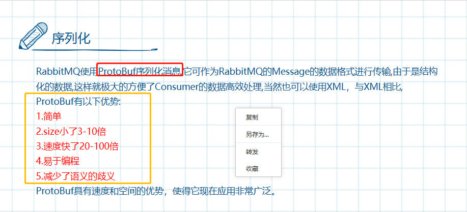
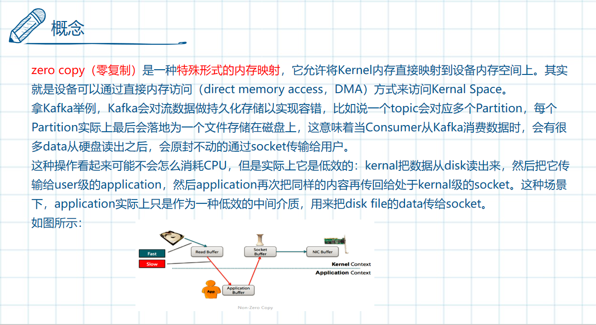
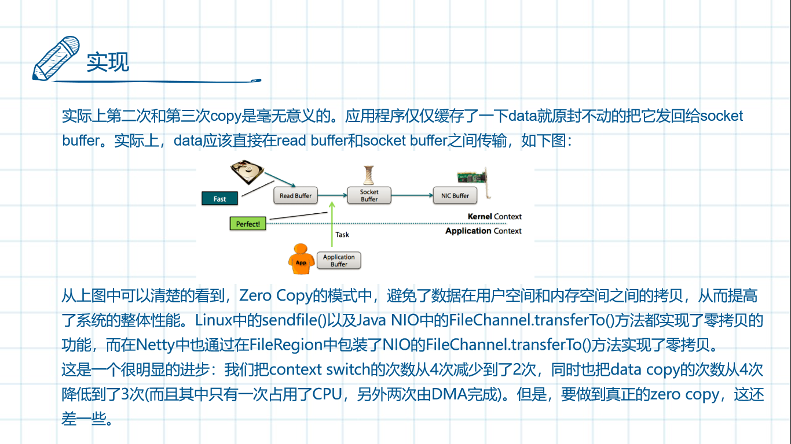
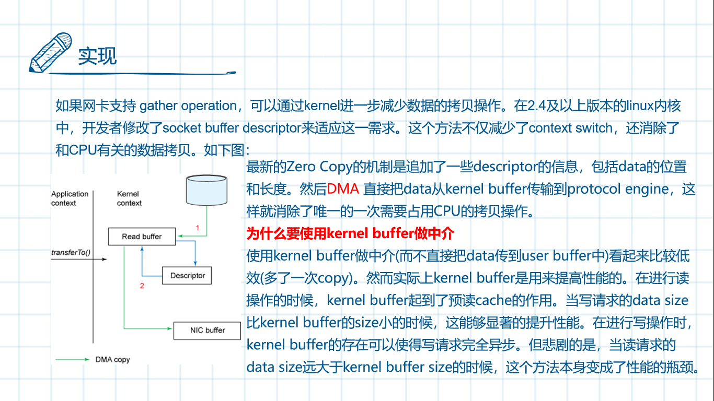

# 序列化

##	RESTful 接口 

**用了 JSON-RPC 不等于 是RESTful API**，RESTful API通常是基于HTTP/JSON方式实现的 ，两种方式的API设计方式都不错，项目中选适合的就好。简单对比如下：

- JSON-RPC: 通常采用POST Method，路径为类名方法名拼接，接口发布快捷，可以通过框架自动化，技术上无需人工参与。规范约束性小、易扩散不好管控，适合系统内部接口调用。实际情况是这种RPC模式调用中，为了提升性能，通常都采用类似Thrift 或 protobuf框架，相比基于文本的JSON序列化性能更高。
- RESTful API : 需要人工规划和设计的API接口，更加容易理解、设计统一且美观。风格约定内容相比RPC更多，适合做用户接口Open API的规范 。通过网关对外发布接口时，强烈建议要采用这种设计风格。

## 序列化(二进制协议)

### Hessian

- [《Hessian原理分析》](https://www.cnblogs.com/happyday56/p/4268249.html)
  Binary-RPC;不仅仅是序列化

### Protobuf

- [《Protobuf协议的Java应用例子》](https://blog.csdn.net/antgan/article/details/52103966)
  Goolge出品、占用空间和效率完胜其他序列化类库，如Hessian；需要编写  .proto 文件。
- [《Protocol Buffers序列化协议及应用》](https://worktile.com/tech/share/prototol-buffers)
  - 关于协议的解释；缺点：可读性差;
- [《简单的使用 protobuf 和 protostuff》](https://blog.csdn.net/eric520zenobia/article/details/53766571)
  - protostuff 的好处是不用写 .proto 文件，Java 对象直接就可以序列化。

> ### [Protobuf On HTTP 技术预研](https://www.jianshu.com/p/d74032949634) （附代码）
>
> https://www.jianshu.com/p/d74032949634
>
> > - [一、背景](#一背景)
> > - 二、Protobuf说明
> >   - [2.1 什么是Protobuf](#21-什么是protobuf)
> >   - [2.2 Protobuf优点](#22-protobuf优点)
> >   - [2.3 Protobuf缺点](#23-protobuf缺点)
> > - 三、Protobuf 相关框架
> >   - [3.1 gRPC框架](#31-grpc框架)
> >   - [3.2 Thrift框架](#32-thrift框架)
> > - [四、Protobuf-HTTP抓包方案](#四protobuf-http抓包方案)
> > - 五、业界方案调研
> >   - [5.1 Protobuf在Http中的使用(抓包分析)](https://www.jianshu.com/p/d74032949634#51-protobuf在http中的使用抓包分析)
> >   - [5.2 gRPC 框架](https://www.jianshu.com/p/d74032949634#52-grpc-框架)
> >   - [5.3 Thrift 框架](https://www.jianshu.com/p/d74032949634#53-thrift-框架)

# 零拷贝（Zero-copy）

## Kafka[零拷贝](https://www.jianshu.com/p/1c27da322767)

- [《对于 Netty ByteBuf 的零拷贝(Zero Copy) 的理解》](https://www.cnblogs.com/xys1228/p/6088805.html)
  - 多个物理分离的buffer，通过逻辑上合并成为一个，从而避免了数据在内存之间的拷贝。
- 彻底搞懂[Netty高性能之零拷贝](https://www.jianshu.com/p/9126bfc6e240)
- 你不得不知道的[知识-零拷贝](https://www.jianshu.com/p/e113cfdf4e89)
- 

