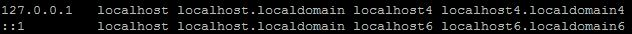
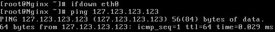

# localhost、127.0.0.1 和 本机IP 三者的区别?

 

[更深的蓝](https://www.zhihu.com/people/james-98-78)

#	总结：

l**ocalhost 是个域名**，不是地址，它可以被配置为任意的 IP 地址，不过通常情况下都指向 127.0.0.1(ipv4)和 [::1](ipv6)

整个127.* 网段通常被用作 loopback 网络接口的默认地址，按惯例通常设置为 127.0.0.1。这个地址在其他计算机上不能访问，就算你想访问，**访问的也是自己**，因为每台带有TCP/IP协议栈的设备基本上都有 localhost/127.0.0.1。

本机地址通常指的是绑定在物理或虚拟网络接口上**的IP地址，可供其他设备访问到**。【本机在外网的IP地址】

最后，从开发度来看

- localhost是个域名，性质跟 “www.baidu.com” 差不多。不能直接绑定套接字，必须先gethostbyname转成IP才能绑定。
- 127.0.0.1 是绑定在 loopback 接口上的地址，如果服务端套接字绑定在它上面，你的客户端程序就只能在本机访问。
- 如果主机中存在多个网卡，分别连接不同的物理网络，比如 192.168.0.1/255.255.255.0 和 192.168.1.1/255.255.255.0，那么当你的服务端套接字绑到 192.168.0.1 这个地址上时，位于 192.168.1.* 网段的其他计算机是无法连接的，只有位于192.168.0.* 网段的计算机才能访问你的服务端程序。

排名第一的答案还没说的太完整。
首先 localhost 是一个域名，在过去它指向 127.0.0.1 这个IP地址。在操作系统支持 ipv6 后，它同时还指向ipv6 的地址 [::1]
在 Windows 中，这个域名是预定义的，从 hosts 文件中可以看出：
# localhost name resolution is handled within DNS itself.
#	127.0.0.1       localhost
#	::1             localhost
而在 Linux 中，其定义位于 /etc/hosts 中：
127.0.0.1    localhost
注意这个值是可修改的，比如我把它改成
192.068.206.1    localhost
然后再去 ping localhost，提示就变成了
PING localhost (192.168.206.1) 56(84) bytes of data.
当然一般人不会像我这么蛋疼。
————分割线—说完localhost再说127.0.0.1————
127.0.0.1
 这个地址通常分配给 loopback 接口。loopback 
是一个特殊的网络接口(可理解成虚拟网卡)，用于本机中各个应用之间的网络交互。只要操作系统的网络组件是正常的，loopback 
就能工作。Windows 中看不到这个接口，Linux中这个接口叫 lo：
#ifconfig
eth0    Link encap:Ethernet hwaddr 00:00:00:00:00:00
            inet addr :192.168.0.1 Bcase:192.168.0.255 Mask:255.255.255.0
           ......
lo        Link encap:Local Loopback
           inetaddr: 127.0.0.1 Mask: 255.0.0.0
           ......
可以看出 lo 接口的地址是 127.0.0.1。事实上整个 127.* 网段都算能够使用，比如你 ping 127.0.0.2 也是通的。
但是使用127.0.0.1作为loopback接口的默认地址只是一个惯例，比如下面这样：
#ifconfig lo 192.168.128.1
#ping localhost   #糟糕，ping不通了
#ping 192.128.128.1  # 可以通
#ifconfig lo
lo        Link encap:Local Loopback
           inetaddr: 192.168.128.1 Mask: 255.255.255.0
           ......
当然，一般人更不会像我这样蛋疼。如果随便改这些配置，可能导致很多只认 127.0.0.1 的软件挂掉。
————分割线—说完127.0.0.1再说本机地址————
确切地说，“本机地址”并不是一个规范的名词。通常情况下，指的是“本机物理网卡所绑定的网络协议地址”。由于目前常用网络协议只剩下了IPV4，IPX/Apple
 Tak消失了，IPV6还没普及，所以通常仅指IP地址甚至ipv4地址。一般情况下，并不会把 
127.0.0.1当作本机地址——因为没必要特别说明，大家都知道。
本机地址是与具体的网络接口绑定的。比如以太网卡、无线网卡或者PPP/PPPoE拨号网络的虚拟网卡，想要正常工作都要绑定一个地址，否则其他设备就不知道如何访问它。

————最后总结一下区别————

- localhost 是个域名，不是地址，它可以被配置为任意的 IP 地址，不过通常情况下都指向 127.0.0.1(ipv4)和 [::1](ipv6)

- 整个127.*  网段通常被用作 loopback 网络接口的默认地址，按惯例通常设置为  127.0.0.1。这个地址在其他计算机上不能访问，就算你想访问，访问的也是自己，因为每台带有TCP/IP协议栈的设备基本上都有  localhost/127.0.0.1。

- 本机地址通常指的是绑定在物理或虚拟网络接口上的IP地址，可供其他设备访问到。

- 最后，从开发度来看

- - localhost是个域名，性质跟 “www.baidu.com” 差不多。不能直接绑定套接字，必须先gethostbyname转成IP才能绑定。
  - 127.0.0.1 是绑定在 loopback 接口上的地址，如果服务端套接字绑定在它上面，你的客户端程序就只能在本机访问。
  - 如果主机中存在多个网卡，分别连接不同的物理网络，比如  192.168.0.1/255.255.255.0 和 192.168.1.1/255.255.255.0，那么当你的服务端套接字绑到  192.168.0.1 这个地址上时，位于 192.168.1.* 网段的其他计算机是无法连接的，只有位于192.168.0.*  网段的计算机才能访问你的服务端程序。

[发布于 2014-05-30](https://www.zhihu.com/question/23940717/answer/26230963)

[呜呜云](https://www.zhihu.com/people/wuwuyun)

linux运维

[刘雨培](https://www.zhihu.com/people/liuyupei)

、

[可可苏玛](https://www.zhihu.com/people/cocosuma)

等 

\1.  127.0.0.1/8整个都是环回地址，用来测试本机的TCP/IP协议栈，发往这段A类地址数据包不会出网卡，网络设备不会对其做路由。
\2. localhost  就是个指向本机环回口的域名，方便记忆与输入，/etc/hosts第一行就是"127.0.0.1   localhost..."  第二行的[::1]是IPv6

\3. 本机IP看你是有几张网卡几个接口了多网卡可能还得分内外网 环回口不需要网卡up，协议栈正常就能通

\4. 还有个地址段169.254.0.0/16，可以看成一个B类私网地址，专门用来在DHCP获取失败时自动配置的接口地址，windows上肯定有，Linux上倒是没见过。。明天试试看。。

[编辑于 2014-05-29](https://www.zhihu.com/question/23940717/answer/26173583)

[pansz](https://www.zhihu.com/people/pansz)

[Linux](https://www.zhihu.com/people/pansz/creations/19554300)、[Android 开发](https://www.zhihu.com/people/pansz/creations/19555634) 话题的优秀回答者

[天猪](https://www.zhihu.com/people/liuyong25)

等 

localhost 就是一个域名，域名指向 127.0.0.1 ，两者是一样的。

至于本机 IP，你可以理解为本机有三块网卡，一块网卡叫做 loopback（这是一块虚拟网卡），另外一块网卡叫做 ethernet （这是你的有线网卡），另外一块网卡叫做 wlan（这是你的无线网卡）。

你的本机 IP 是你真实网卡的 IP，具体来说有线无线各有一个，而 127.0.0.1 是那块叫做 loopback 的虚拟网卡的 IP。

[发布于 2014-05-28](https://www.zhihu.com/question/23940717/answer/26153147)

[可可苏玛](https://www.zhihu.com/people/cocosuma)

反玩家的玩家

对人来说localhost = 127.0.0.1 ，
这是因为hosts文件定义了localhost=127.0.0.1 。所以你只需要记住localhost就可以代表本机了。它其实是个和[http://baidu.com](https://link.zhihu.com/?target=http%3A//baidu.com)一样的域名。

对机器来说，它需要通过hosts文件来定义localhost  = 127.0.0.1  ，才能知道localhost代表的是本机。机器只知道127.0.0.1代表本机。因此在你朝localhost发消息的时候，机器会自动翻译成朝127.0.0.1发消息，并且这个消息不会出网卡（不需要经过上级路由器），而是在机器本身就可以处理了。

但如果是

http://192.168.1.XXX

或者桥接的虚拟网卡的话，就要看具体的操作系统和虚拟网卡+虚拟交换机是怎么实现的了。有的机灵点的不需要经过上级路由器，有些傻的可能会一本正经地绕一圈。。。

[发布于 2016-03-05](https://www.zhihu.com/question/23940717/answer/89395850)

[孙苏](https://www.zhihu.com/people/sun-su-92)

我是一名程序猿

[在好](https://www.zhihu.com/people/zai-hao-24)

等 

排名第一的说的没错，我来讲的更通俗一点。
1.localhost=127.0.0.1，只不过localhost是域名，127.0.0.1是IP地址。
2.本机IP就是本机在外网的IP地址，如图。

[发布于 2015-03-19](https://www.zhihu.com/question/23940717/answer/42449155)

[郭小闲](https://www.zhihu.com/people/guo-xiao-xian)

南锣鼓巷泡过妞

本机  IP 实际上还要包括一个拨号设备的 IP 地址。一般 PPPoE （也包括传统的 ppp 拨号方式）都会有这么一个虚拟设备（unix  类系统里这个设备一般叫做 tun）。这个 IP 地址和你的有线网卡的 IP 是不同的，一般都有你的 ISP  分配一个临时地址给你。每次拨号都可能获得不同的地址。

[发布于 2014-05-28](https://www.zhihu.com/question/23940717/answer/26170944)

匿名用户

操作系统解析网络地址是有优先级的。
优先级最高的就是host查找，首先读取
然后是netbios广播查找，最后查找DNS。

[发布于 2016-03-05](https://www.zhihu.com/question/23940717/answer/89404535)

[先知](https://www.zhihu.com/people/xian-zhi-51-76)

**必须严正加上一条：127.0.0.1会被浏览器默认为受信任站点，然而本机IP并不会**

[发布于 2017-07-18](https://www.zhihu.com/question/23940717/answer/199830636)

[哲学编程](https://www.zhihu.com/people/ajiev5)

程序猿入门到放弃，敲着代码，学着养生之道

本机IP没什么好说的，在局域网有局域网的对应IP，因特网对于这个大局域网的入口IP而已！

localhost与127.0.0.1的区别是什么？

相信有人会说是本地ip，曾有人说，用127.0.0.1比localhost好，可以减少一次解析。

看来这个入门问题还有人不清楚，其实这两者是有区别的。 

no1: localhost也叫local ，正确的解释是:本地服务器 127.0.0.1在windows等系统的正确解释是:本机地址(本机服务器) 

no2: localhot(local)是不经网卡传输！这点很重要，它不受网络防火墙和网卡相关的的限制。 

127.0.0.1是通过网卡传输，依赖网卡，并受到网络防火墙和网卡相关的限制。

一般设置程序时本地服务用localhost是最好的，localhost不会解析成ip，也不会占用网卡、网络资源。 

有时候用localhost可以，但用127.0.0.1就不可以的情况就是在于此。

猜想localhost访问时，系统带的本机当前用户的权限去访问，而用ip的时候，等于本机是通过网络再去访问本机，可能涉及到网络用户的权-限。

[编辑于 2017-12-01](https://www.zhihu.com/question/23940717/answer/266056750)

[静极思动](https://www.zhihu.com/people/jing-ji-si-dong)

农民

localhost和127.0.0.1在域管理时好像不太一样，网页有个未标记为安全的控件，浏览器的受信任站点由域管理员设置，没有加本机ip。在ie中访问时，从页面上看控件应该都加载了(会弹出允许运行控件的询问)，但是只有使用localhost可以正常调用控件，用127.0.0.1就不行。

[发布于 2019-02-02](https://www.zhihu.com/question/23940717/answer/588049757)

[陈泱宇](https://www.zhihu.com/people/cyyself)

大一CS萌新 曾经是个OIer

localhost是一个主机名称，指向本地主机。ipv4对应127.0.0.1，ipv6对应::1。也就是说，localhost多了ipv6的支持。（前面3个回答没有一人提到这点）本机IP是指每个网卡各自的IP地址。

[编辑于 2014-05-29](https://www.zhihu.com/question/23940717/answer/26172558)

排名第一的答案还没说的太完整。
首先 localhost 是一个域名，在过去它指向 127.0.0.1 这个IP地址。在操作系统支持 ipv6 后，它同时还指向ipv6 的地址 [::1]
在 Windows 中，这个域名是预定义的，从 hosts 文件中可以看出：
# localhost name resolution is handled within DNS itself.
#	127.0.0.1       localhost
#	::1             localhost

而在 Linux 中，其定义位于 /etc/hosts 中：
127.0.0.1    localhost
注意这个值是可修改的，比如我把它改成
192.068.206.1    localhost
然后再去 ping localhost，提示就变成了
PING localhost (192.168.206.1) 56(84) bytes of data.
当然一般人不会像我这么蛋疼。
————分割线—说完localhost再说127.0.0.1————
127.0.0.1
 这个地址通常分配给 loopback 接口。loopback 
是一个特殊的网络接口(可理解成虚拟网卡)，用于本机中各个应用之间的网络交互。只要操作系统的网络组件是正常的，loopback 
就能工作。Windows 中看不到这个接口，Linux中这个接口叫 lo：
#ifconfig
eth0    Link encap:Ethernet hwaddr 00:00:00:00:00:00
            inet addr :192.168.0.1 Bcase:192.168.0.255 Mask:255.255.255.0
           ......
lo        Link encap:Local Loopback
           inetaddr: 127.0.0.1 Mask: 255.0.0.0
           ......
可以看出 lo 接口的地址是 127.0.0.1。事实上整个 127.* 网段都算能够使用，比如你 ping 127.0.0.2 也是通的。
但是使用127.0.0.1作为loopback接口的默认地址只是一个惯例，比如下面这样：
#ifconfig lo 192.168.128.1
#ping localhost   #糟糕，ping不通了
#ping 192.128.128.1  # 可以通
#ifconfig lo
lo        Link encap:Local Loopback
           inetaddr: 192.168.128.1 Mask: 255.255.255.0
           ......
当然，一般人更不会像我这样蛋疼。如果随便改这些配置，可能导致很多只认 127.0.0.1 的软件挂掉。
————分割线—说完127.0.0.1再说本机地址————
确切地说，“本机地址”并不是一个规范的名词。通常情况下，指的是“本机物理网卡所绑定的网络协议地址”。由于目前常用网络协议只剩下了IPV4，IPX/Apple
 Tak消失了，IPV6还没普及，所以通常仅指IP地址甚至ipv4地址。一般情况下，并不会把 
127.0.0.1当作本机地址——因为没必要特别说明，大家都知道。
本机地址是与具体的网络接口绑定的。比如以太网卡、无线网卡或者PPP/PPPoE拨号网络的虚拟网卡，想要正常工作都要绑定一个地址，否则其他设备就不知道如何访问它。

————最后总结一下区别————

- localhost 是个域名，不是地址，它可以被配置为任意的 IP 地址，不过通常情况下都指向 127.0.0.1(ipv4)和 [::1](ipv6)

- 整个127.*  网段通常被用作 loopback 网络接口的默认地址，按惯例通常设置为  127.0.0.1。这个地址在其他计算机上不能访问，就算你想访问，访问的也是自己，因为每台带有TCP/IP协议栈的设备基本上都有  localhost/127.0.0.1。

- 本机地址通常指的是绑定在物理或虚拟网络接口上的IP地址，可供其他设备访问到。

- 最后，从开发度来看

- - localhost是个域名，性质跟 “www.baidu.com” 差不多。不能直接绑定套接字，必须先gethostbyname转成IP才能绑定。
  - 127.0.0.1 是绑定在 loopback 接口上的地址，如果服务端套接字绑定在它上面，你的客户端程序就只能在本机访问。
  - 如果主机中存在多个网卡，分别连接不同的物理网络，比如  192.168.0.1/255.255.255.0 和 192.168.1.1/255.255.255.0，那么当你的服务端套接字绑到  192.168.0.1 这个地址上时，位于 192.168.1.* 网段的其他计算机是无法连接的，只有位于192.168.0.*  网段的计算机才能访问你的服务端程序。

[发布于 2014-05-30](https://www.zhihu.com/question/23940717/answer/26230963)

[呜呜云](https://www.zhihu.com/people/wuwuyun)

linux运维

[刘雨培](https://www.zhihu.com/people/liuyupei)

、

[可可苏玛](https://www.zhihu.com/people/cocosuma)

等 

\1.  127.0.0.1/8整个都是环回地址，用来测试本机的TCP/IP协议栈，发往这段A类地址数据包不会出网卡，网络设备不会对其做路由。
\2. localhost  就是个指向本机环回口的域名，方便记忆与输入，/etc/hosts第一行就是"127.0.0.1   localhost..."  第二行的[::1]是IPv6

\3. 本机IP看你是有几张网卡几个接口了多网卡可能还得分内外网 环回口不需要网卡up，协议栈正常就能通

\4. 还有个地址段169.254.0.0/16，可以看成一个B类私网地址，专门用来在DHCP获取失败时自动配置的接口地址，windows上肯定有，Linux上倒是没见过。。明天试试看。。

[编辑于 2014-05-29](https://www.zhihu.com/question/23940717/answer/26173583)

[pansz](https://www.zhihu.com/people/pansz)

[Linux](https://www.zhihu.com/people/pansz/creations/19554300)、[Android 开发](https://www.zhihu.com/people/pansz/creations/19555634) 话题的优秀回答者

[天猪](https://www.zhihu.com/people/liuyong25)

等 

localhost 就是一个域名，域名指向 127.0.0.1 ，两者是一样的。

至于本机 IP，你可以理解为本机有三块网卡，一块网卡叫做 loopback（这是一块虚拟网卡），另外一块网卡叫做 ethernet （这是你的有线网卡），另外一块网卡叫做 wlan（这是你的无线网卡）。

你的本机 IP 是你真实网卡的 IP，具体来说有线无线各有一个，而 127.0.0.1 是那块叫做 loopback 的虚拟网卡的 IP。

[发布于 2014-05-28](https://www.zhihu.com/question/23940717/answer/26153147)

[可可苏玛](https://www.zhihu.com/people/cocosuma)

反玩家的玩家

对人来说localhost = 127.0.0.1 ，
这是因为hosts文件定义了localhost=127.0.0.1 。所以你只需要记住localhost就可以代表本机了。它其实是个和[http://baidu.com](https://link.zhihu.com/?target=http%3A//baidu.com)一样的域名。

对机器来说，它需要通过hosts文件来定义localhost  = 127.0.0.1  ，才能知道localhost代表的是本机。机器只知道127.0.0.1代表本机。因此在你朝localhost发消息的时候，机器会自动翻译成朝127.0.0.1发消息，并且这个消息不会出网卡（不需要经过上级路由器），而是在机器本身就可以处理了。

但如果是

http://192.168.1.XXX

或者桥接的虚拟网卡的话，就要看具体的操作系统和虚拟网卡+虚拟交换机是怎么实现的了。有的机灵点的不需要经过上级路由器，有些傻的可能会一本正经地绕一圈。。。

[发布于 2016-03-05](https://www.zhihu.com/question/23940717/answer/89395850)

[孙苏](https://www.zhihu.com/people/sun-su-92)

我是一名程序猿

[在好](https://www.zhihu.com/people/zai-hao-24)

等 

排名第一的说的没错，我来讲的更通俗一点。
1.localhost=127.0.0.1，只不过localhost是域名，127.0.0.1是IP地址。
2.本机IP就是本机在外网的IP地址，如图。

[发布于 2015-03-19](https://www.zhihu.com/question/23940717/answer/42449155)

[郭小闲](https://www.zhihu.com/people/guo-xiao-xian)

南锣鼓巷泡过妞

本机  IP 实际上还要包括一个拨号设备的 IP 地址。一般 PPPoE （也包括传统的 ppp 拨号方式）都会有这么一个虚拟设备（unix  类系统里这个设备一般叫做 tun）。这个 IP 地址和你的有线网卡的 IP 是不同的，一般都有你的 ISP  分配一个临时地址给你。每次拨号都可能获得不同的地址。

[发布于 2014-05-28](https://www.zhihu.com/question/23940717/answer/26170944)

匿名用户

操作系统解析网络地址是有优先级的。
优先级最高的就是host查找，首先读取
然后是netbios广播查找，最后查找DNS。

[发布于 2016-03-05](https://www.zhihu.com/question/23940717/answer/89404535)

[先知](https://www.zhihu.com/people/xian-zhi-51-76)

**必须严正加上一条：127.0.0.1会被浏览器默认为受信任站点，然而本机IP并不会**

[发布于 2017-07-18](https://www.zhihu.com/question/23940717/answer/199830636)

[哲学编程](https://www.zhihu.com/people/ajiev5)

程序猿入门到放弃，敲着代码，学着养生之道

本机IP没什么好说的，在局域网有局域网的对应IP，因特网对于这个大局域网的入口IP而已！

localhost与127.0.0.1的区别是什么？

相信有人会说是本地ip，曾有人说，用127.0.0.1比localhost好，可以减少一次解析。

看来这个入门问题还有人不清楚，其实这两者是有区别的。 

no1: localhost也叫local ，正确的解释是:本地服务器 127.0.0.1在windows等系统的正确解释是:本机地址(本机服务器) 

no2: localhot(local)是不经网卡传输！这点很重要，它不受网络防火墙和网卡相关的的限制。 

127.0.0.1是通过网卡传输，依赖网卡，并受到网络防火墙和网卡相关的限制。

一般设置程序时本地服务用localhost是最好的，localhost不会解析成ip，也不会占用网卡、网络资源。 

有时候用localhost可以，但用127.0.0.1就不可以的情况就是在于此。

猜想localhost访问时，系统带的本机当前用户的权限去访问，而用ip的时候，等于本机是通过网络再去访问本机，可能涉及到网络用户的权-限。

[编辑于 2017-12-01](https://www.zhihu.com/question/23940717/answer/266056750)

[静极思动](https://www.zhihu.com/people/jing-ji-si-dong)

农民

localhost和127.0.0.1在域管理时好像不太一样，网页有个未标记为安全的控件，浏览器的受信任站点由域管理员设置，没有加本机ip。在ie中访问时，从页面上看控件应该都加载了(会弹出允许运行控件的询问)，但是只有使用localhost可以正常调用控件，用127.0.0.1就不行。

[发布于 2019-02-02](https://www.zhihu.com/question/23940717/answer/588049757)

[陈泱宇](https://www.zhihu.com/people/cyyself)

大一CS萌新 曾经是个OIer

localhost是一个主机名称，指向本地主机。ipv4对应127.0.0.1，ipv6对应::1。也就是说，localhost多了ipv6的支持。（前面3个回答没有一人提到这点）本机IP是指每个网卡各自的IP地址。

[编辑于 2014-05-29](https://www.zhihu.com/question/23940717/answer/26172558)