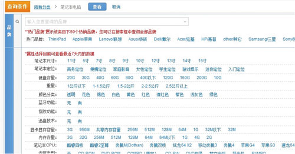

# [淘宝应对"双11"的技术架构分析](https://kb.cnblogs.com/page/193670/)

​                 作者: [T.J](http://user.qzone.qq.com/908571305/)  发布时间: 2013-11-20 18:10  阅读: 60454 次  推荐: 172                   [原文链接](http://user.qzone.qq.com/908571305/blog/1384218477)                   [[收藏\]](javascript:void(0))               

　　双“11”最热门的话题是TB ，最近正好和阿里的一个朋友聊淘宝的技术架构，发现很多有意思的地方，分享一下他们的解析资料：

　　**淘宝海量数据产品技术架构**

　　数据产品的一个最大特点是数据的非实时写入，正因为如此，我们可以认为，在一定的时间段内，整个系统的数据是只读的。这为我们设计缓存奠定了非常重要的基础。

 

图1 淘宝海量数据产品技术架构

　　按照数据的流向来划分，我们把淘宝数据产品的技术架构分为五层（如图1所示），分别是数据源、计算层、存储层、查询层和产品层。位于架构顶端的是我们的数据来源层，这里有淘宝主站的用户、店铺、商品和交易等数据库，还有用户的浏览、搜索等行为日志等。这一系列的数据是数据产品最原始的生命力所在。

　　在数据源层实时产生的数据，通过淘宝自主研发的数据传输组件DataX、DbSync和Timetunnel准实时地传输到一个有1500个节点的Hadoop集群上，这个集群我们称之为“云梯”，是计算层的主要组成部分。在“云梯”上，我们每天有大约40000个作业对1.5PB的原始数据按照产品需求进行不同的MapReduce计算。这一计算过程通常都能在凌晨两点之前完成。相对于前端产品看到的数据，这里的计算结果很可能是一个处于中间状态的结果，这往往是在数据冗余与前端计算之间做了适当平衡的结果。

　　不得不提的是，一些对实效性要求很高的数据，例如针对搜索词的统计数据，我们希望能尽快推送到数据产品前端。这种需求再采用“云梯”来计算效率将是比较低的，为此我们做了流式数据的实时计算平台，称之为“银河”。“银河”也是一个分布式系统，它接收来自TimeTunnel的实时消息，在内存中做实时计算，并把计算结果在尽可能短的时间内刷新到NoSQL存储设备中，供前端产品调用。

　　容易理解，“云梯”或者“银河”并不适合直接向产品提供实时的数据查询服务。这是因为，对于“云梯”来说，它的定位只是做离线计算的，无法支持较高的性能和并发需求；而对于“银河”而言，尽管所有的代码都掌握在我们手中，但要完整地将数据接收、实时计算、存储和查询等功能集成在一个分布式系统中，避免不了分层，最终仍然落到了目前的架构上。

　　为此，我们针对前端产品设计了专门的存储层。在这一层，我们有基于MySQL的分布式关系型数据库集群MyFOX和基于HBase的NoSQL存储集群Prom，在后面的文字中，我将重点介绍这两个集群的实现原理。除此之外，其他第三方的模块也被我们纳入存储层的范畴。

　　存储层异构模块的增多，对前端产品的使用带来了挑战。为此，我们设计了通用的数据中间层——glider——来屏蔽这个影响。glider以HTTP协议对外提供restful方式的接口。数据产品可以通过一个唯一的URL获取到它想要的数据。

　　以上是淘宝海量数据产品在技术架构方面的一个概括性的介绍，接下来我将重点从四个方面阐述数据魔方设计上的特点。

　　**关系型数据库仍然是王道**

　　关系型数据库（RDBMS）自20世纪70年代提出以来，在工业生产中得到了广泛的使用。经过三十多年的长足发展，诞生了一批优秀的数据库软件，例如Oracle、MySQL、DB2、Sybase和SQL Server等。

 

图2 MyFOX中的数据增长曲线

　　尽管相对于非关系型数据库而言，关系型数据库在分区容忍性（Tolerance to Network Partitions）方面存在劣势，但由于它强大的语义表达能力以及数据之间的关系表达能力，在数据产品中仍然占据着不可替代的作用。

　　淘宝数据产品选择MySQL的MyISAM引擎作为底层的数据存储引擎。在此基础上，为了应对海量数据，我们设计了分布式MySQL集群的查询代理层——MyFOX，使得分区对前端应用透明。

 

图3 MyFOX的数据查询过程

　　目前，存储在MyFOX中的统计结果数据已经达到10TB，占据着数据魔方总数据量的95%以上，并且正在以每天超过6亿的增量增长着（如图2所示）。这些数据被我们近似均匀地分布到20个MySQL节点上，在查询时，经由MyFOX透明地对外服务（如图3所示）。

 

图4 MyFOX节点结构

　　值得一提的是，在MyFOX现有的20个节点中，并不是所有节点都是“平等”的。一般而言，数据产品的用户更多地只关心“最近几天”的数据，越早的数据，越容易被冷落。为此，出于硬件成本考虑，我们在这20个节点中分出了“热节点”和“冷节点”（如图4所示）。

　　顾名思义，“热节点”存放最新的、被访问频率较高的数据。对于这部分数据，我们希望能给用户提供尽可能快的查询速度，所以在硬盘方面，我们选择了每分钟15000转的SAS硬盘，按照一个节点两台机器来计算，单位数据的存储成本约为4.5W/TB。相对应地，“冷数据”我们选择了每分钟7500转的SATA硬盘，单碟上能够存放更多的数据，存储成本约为1.6W/TB。

　　将冷热数据进行分离的另外一个好处是可以有效提高内存磁盘比。从图4可以看出，“热节点”上单机只有24GB内存，而磁盘装满大约有1.8TB（300 * 12 * 0.5 / 1024），内存磁盘比约为4:300，远远低于MySQL服务器的一个合理值。内存磁盘比过低导致的后果是，总有一天，即使所有内存用完也存不下数据的索引了——这个时候，大量的查询请求都需要从磁盘中读取索引，效率大打折扣。

　　**NoSQL****是****SQL****的有益补充**

　　在MyFOX出现之后，一切都看起来那么完美，开发人员甚至不会意识到MyFOX的存在，一条不用任何特殊修饰的SQL语句就可以满足需求。这个状态持续了很长一段时间，直到有一天，我们碰到了传统的关系型数据库无法解决的问题——全属性选择器（如图5所示）。

 

图5 全属性选择器

　　这是一个非常典型的例子。为了说明问题，我们仍然以关系型数据库的思路来描述。对于笔记本电脑这个类目，用户某一次查询所选择的过滤条件可能包括“笔记本尺寸”、“笔记本定位”、“硬盘容量”等一系列属性（字段），并且在每个可能用在过滤条件的属性上，属性值的分布是极不均匀的。在图5中我们可以看到，笔记本电脑的尺寸这一属性有着10个枚举值，而“蓝牙功能”这个属性值是个布尔值，数据的筛选性非常差。

　　在用户所选择的过滤条件不确定的情况下，解决全属性问题的思路有两个：一个是穷举所有可能的过滤条件组合，在“云梯”上进行预先计算，存入数据库供查询；另一个是存储原始数据，在用户查询时根据过滤条件筛选出相应的记录进行现场计算。很明显，由于过滤条件的排列组合几乎是无法穷举的，第一种方案在现实中是不可取的；而第二种方案中，原始数据存储在什么地方？如果仍然用关系型数据库，那么你打算怎样为这个表建立索引？

　　这一系列问题把我们引到了“创建定制化的存储、现场计算并提供查询服务的引擎”的思路上来，这就是Prometheus（如图6所示）。

图6 Prom的存储结构

　　从图6可以看出，我们选择了HBase作为Prom的底层存储引擎。之所以选择HBase，主要是因为它是建立在HDFS之上的，并且对于MapReduce有良好的编程接口。尽管Prom是一个通用的、解决共性问题的服务框架，但在这里，我们仍然以全属性选择为例，来说明Prom的工作原理。这里的原始数据是前一天在淘宝上的交易明细，在HBase集群中，我们以属性对（属性与属性值的组合）作为row-key进行存储。而row-key对应的值，我们设计了两个column-family，即存放交易ID列表的index字段和原始交易明细的data字段。在存储的时候，我们有意识地让每个字段中的每一个元素都是定长的，这是为了支持通过偏移量快速地找到相应记录，避免复杂的查找算法和磁盘的大量随机读取请求。

图7 Prom查询过程

　　图7用一个典型的例子描述的Prom在提供查询服务时的工作原理，限于篇幅，这里不做详细描述。值得一提的是，Prom支持的计算并不仅限于求和SUM运算，统计意义上的常用计算都是支持的。在现场计算方面，我们对HBase进行了扩展，Prom要求每个节点返回的数据是已经经过“本地计算”的局部最优解，最终的全局最优解只是各个节点返回的局部最优解的一个简单汇总。很显然，这样的设计思路是要充分利用各个节点的并行计算能力，并且避免大量明细数据的网络传输开销。

　　**用中间层隔离前后端**

　　上文提到过，MyFOX和Prom为数据产品的不同需求提供了数据存储和底层查询的解决方案，但随之而来的问题是，各种异构的存储模块给前端产品的使用带来了很大的挑战。并且，前端产品的一个请求所需要的数据往往不可能只从一个模块获取。

　　举个例子，我们要在数据魔方中看昨天做热销的商品，首先从MyFOX中拿到一个热销排行榜的数据，但这里的“商品”只是一个ID，并没有ID所对应的商品描述、图片等数据。这个时候我们要从淘宝主站提供的接口中去获取这些数据，然后一一对应到热销排行榜中，最终呈现给用户。

 

图8 glider的技术架构

　　有经验的读者一定可以想到，从本质上来讲，这就是广义上的异构“表”之间的JOIN操作。那么，谁来负责这个事情呢？很容易想到，在存储层与前端产品之间增加一个中间层，它负责各个异构“表”之间的数据JOIN和UNION等计算，并且隔离前端产品和后端存储，提供统一的数据查询服务。这个中间层就是glider（如图8所示）。

　　**缓存是系统化的工程**

　　除了起到隔离前后端以及异构“表”之间的数据整合的作用之外，glider的另外一个不容忽视的作用便是缓存管理。上文提到过，在特定的时间段内，我们认为数据产品中的数据是只读的，这是利用缓存来提高性能的理论基础。

　　在图8中我们看到，glider中存在两层缓存，分别是基于各个异构“表”（datasource）的二级缓存和整合之后基于独立请求的一级缓存。除此之外，各个异构“表”内部可能还存在自己的缓存机制。细心的读者一定注意到了图3中MyFOX的缓存设计，我们没有选择对汇总计算后的最终结果进行缓存，而是针对每个分片进行缓存，其目的在于提高缓存的命中率，并且降低数据的冗余度。

　　大量使用缓存的最大问题就是数据一致性问题。如何保证底层数据的变化在尽可能短的时间内体现给最终用户呢？这一定是一个系统化的工程，尤其对于分层较多的系统来说。

 

图9 缓存控制体系

　　图9向我们展示了数据魔方在缓存控制方面的设计思路。用户的请求中一定是带了缓存控制的“命令”的，这包括URL中的query string，和HTTP头中的“If-None-Match”信息。并且，这个缓存控制“命令”一定会经过层层传递，最终传递到底层存储的异构“表”模块。各异构“表”除了返回各自的数据之外，还会返回各自的数据缓存过期时间（ttl），而glider最终输出的过期时间是各个异构“表”过期时间的最小值。这一过期时间也一定是从底层存储层层传递，最终通过HTTP头返回给用户浏览器的。

　　缓存系统不得不考虑的另一个问题是缓存穿透与失效时的雪崩效应。缓存穿透是指查询一个一定不存在的数据，由于缓存是不命中时被动写的，并且出于容错考虑，如果从存储层查不到数据则不写入缓存，这将导致这个不存在的数据每次请求都要到存储层去查询，失去了缓存的意义。

　　有很多种方法可以有效地解决缓存穿透问题，最常见的则是采用布隆过滤器，将所有可能存在的数据哈希到一个足够大的bitmap中，一个一定不存在的数据会被这个bitmap拦截掉，从而避免了对底层存储系统的查询压力。在数据魔方里，我们采用了一个更为简单粗暴的方法，如果一个查询返回的数据为空（不管是数据不存在，还是系统故障），我们仍然把这个空结果进行缓存，但它的过期时间会很短，最长不超过五分钟。

　　缓存失效时的雪崩效应对底层系统的冲击非常可怕。遗憾的是，这个问题目前并没有很完美的解决方案。大多数系统设计者考虑用加锁或者队列的方式保证缓存的单线程（进程）写，从而避免失效时大量的并发请求落到底层存储系统上。在数据魔方中，我们设计的缓存过期机制理论上能够将各个客户端的数据失效时间均匀地分布在时间轴上，一定程度上能够避免缓存同时失效带来的雪崩效应。

　　**结束语**

　　正是基于本文所描述的架构特点，数据魔方目前已经能够提供压缩前80TB的数据存储空间，数据中间层glider支持每天4000万的查询请求，平均响应时间在28毫秒（6月1日数据），足以满足未来一段时间内的业务增长需求。

　　尽管如此，整个系统中仍然存在很多不完善的地方。一个典型的例子莫过于各个分层之间使用短连接模式的HTTP协议进行通信。这样的策略直接导致在流量高峰期单机的TCP连接数非常高。所以说，一个良好的架构固然能够在很大程度上降低开发和维护的成本，但它自身一定是随着数据量和流量的变化而不断变化的。我相信，过不了几年，淘宝数据产品的技术架构一定会是另外的样子。

　　**其他文章摘要**

　　【1】海量数据领域涵盖分布式数据库、分布式存储、数据实时计算、分布式计算等多个技术方向。

　　对于海量数据处理，从数据库层面来讲无非就是两点：1、压力如何分摊，分摊的目的就是为了把集中式变为分布式。2、采用多种的存储方案，针对不同的业务数据，不同的数据特点，采用RDBMS或采用KV  Store，选择不同数据库软件，使用集中式或分布式存储，或者是其他的一些存储方案。

　　【2】将数据库进行拆分，包括水平拆分和垂直拆分。

　　水平拆分主要解决两个问题：1、底层存储的无关性。2、通过线性的去增加机器，支持数据量以及访问请求包括TPS（Transaction  Per Second）、QPS（Query Per Second）的压力增长。其方式如把一张大数据表按一定的方式拆分到不同的数据库服务器上。

　　海量数据从集中式走向分布式，可能涉及跨多个IDC容灾备份特性。

　　【3】阿里巴巴的数据对不同地域数据的处理方法。

　　由三个产品密切配合解决：是Erosa、Eromanga和Otter。

　　Erosa做MySQL（或其他数据库库）的Bin-Log时时解析，解析后放到Eromanga。Eromanga是增量数据的发布订阅的产品。Erosa产生了时时变更的数据发布到Eromanga。然后各个业务端（搜索引擎、数据仓库或关联的业务方）通过订阅的方式，把时时变更的数据时时的通过Push或Pull的方式拉到其业务端，进行一些业务处理。而Otter就是跨IDC的数据同步，把数据能及时反映到不同的AA站。

　　数据同步可能会有冲突，暂时是以那个站点数据为优先，比如说A机房的站点的数据是优先的，不管怎么样，它就覆盖到B的。

　　【4】对于缓存。

　　1、注意切分力度，根据业务选择切分力度。把缓存力度划分的越细，缓存命中率相对会越高。
　　2、确认缓存的有效生命周期。

　　【5】拆分策略

　　1、按字段拆分（最细力度）。如把表的Company字段拆掉，就按COMPANY_ID来拆。

　　2、按表来拆，把一张表拆到MySQL，那张表拆到MySQL集群，更类似于垂直拆分。

　　3、按Schema拆分，Schema拆分跟应用相关的。如把某一模块服务的数据放到某一机群，另一模块服务的数据放到其他MySQL机群。但对外提供的整体服务是这些机群的整体组合，用Cobar来负责协调处理。

　　Cobar类似于MySQL Proxy，解析MySQL所有的协议，相当于可以把它看成MySQL Server来访问的。

​                             172                         

​                             3                         

​                                                                                                                

标签：[淘宝](https://kb.cnblogs.com/tag/淘宝/) [架构](https://kb.cnblogs.com/tag/架构/)

[« ](https://kb.cnblogs.com/page/190039/)上一篇：[别让用户发呆——设计中的防呆策略](https://kb.cnblogs.com/page/190039/)
[» ](https://kb.cnblogs.com/page/186516/)下一篇：[理解本真的REST架构风格](https://kb.cnblogs.com/page/186516/)

​                     