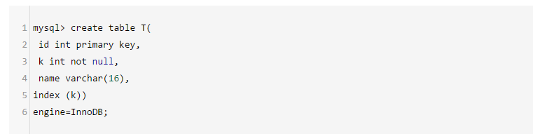
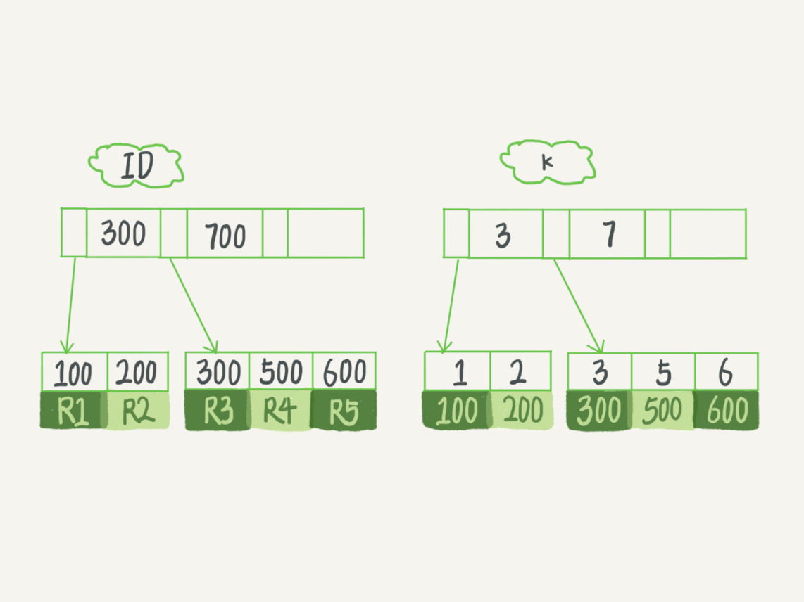
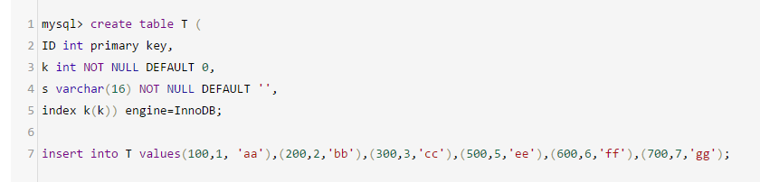
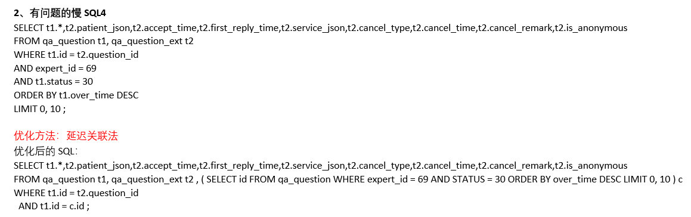
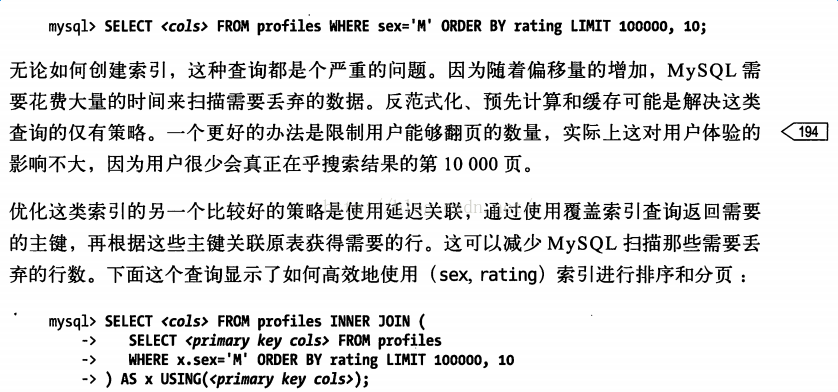
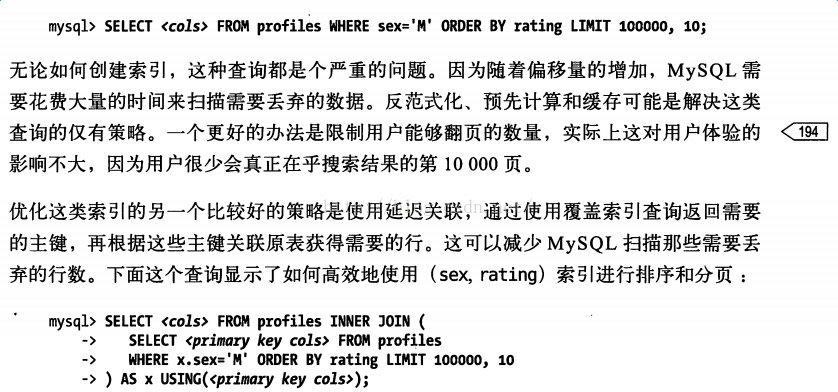

​          [覆盖索引](https://www.cnblogs.com/Leo_wl/p/11069862.html)           	

> **阅读目录**
>
> - [一、前言](https://www.cnblogs.com/Leo_wl/p/11069862.html#_label0)
> - [二、回表](https://www.cnblogs.com/Leo_wl/p/11069862.html#_label1)
> - [三、覆盖索引](https://www.cnblogs.com/Leo_wl/p/11069862.html#_label2)
> - [四、延迟关联](https://www.cnblogs.com/Leo_wl/p/11069862.html#_label3)
> - [五、结语](https://www.cnblogs.com/Leo_wl/p/11069862.html#_label4)

**阅读目录**

- [mysql优化：覆盖索引（延迟关联）](https://www.cnblogs.com/Leo_wl/p/11069862.html#_label0)

[回到目录](https://www.cnblogs.com/Leo_wl/p/11069862.html#_labelTop)

# [mysql优化：覆盖索引（延迟关联）](https://www.cnblogs.com/wang-meng/p/ae6d1c4a7b553e9a5c8f46b67fb3e3aa.html)

 

[返回顶部](https://www.cnblogs.com/Leo_wl/p/11069862.html#_labelTop)

### 前言

上周新系统改版上线，上线第二天就出现了较多的线上**慢sql**查询，紧接着dba 给出了定位及解决方案，这里较多的是使用**延迟关联**去优化。 
而我对于这个**延迟关联**也是第一次听说（o(╥﹏╥)o），所以今天一定要学习并产出一篇学习笔记。(*^▽^*)

[返回顶部](https://www.cnblogs.com/Leo_wl/p/11069862.html#_labelTop)

### 回表

我们都知道InnoDB采用的B+ tree来实现索引的，索引又分为主键索引(聚簇索引)和普通索引(二级索引)。 
那么我们就来看下**基于主键索引和普通索引的查询有什么区别？**

- 如果语句是select * from T where ID=500，即主键查询方式，则只需要搜索ID这棵B+树；
- 如果语句是select * from T where k=5，即普通索引查询方式，则需要先搜索k索引树，得到ID的值为500，再到ID索引树搜索一次。这个过程称为回表。

举个栗子：

 

 

可以看出我们有一个普通索引k，那么两颗B+树的示意图如下：

 
**（注：图来自极客时间专栏）**

当我们查询 **select \* from T where k=5** 其实会先到k那个索引树上查询k = 5，然后找到对应的id为500，最后回表到主键索引的索引树找返回所需数据。 
如果我们查询**select id from T where k=5** 则不需要回表就直接返回。 
也就是说，基于非主键索引的查询需要多扫描一棵索引树。因此，我们在应用中应该尽量使用主键查询。

[返回顶部](https://www.cnblogs.com/Leo_wl/p/11069862.html#_labelTop)

### 覆盖索引

- 解释一： 就是select的数据列只用从索引中就能够取得，不必从数据表中读取，换句话说查询列要被所使用的索引覆盖。
- 解释二： 索引是高效找到行的一个方法，当能通过检索索引就可以读取想要的数据，那就不需要再到数据表中读取行了。如果一个索引包含了（或覆盖了）满足查询语句中字段与条件的数据就叫做覆盖索引。
- 解释三：是非聚集组合索引的一种形式，它包括在查询里的Select、Join和Where子句用到的所有列（即建立索引的字段正好是覆盖查询语句[select子句]与查询条件[Where子句]中所涉及的字段，也即，索引包含了查询正在查找的所有数据）。
- **不是所有类型的索引都可以成为覆盖索引。覆盖索引必须要存储索引的列，而哈希索引、空间索引和全文索引等都不存储索引列的值，所以MySQL只能使用B-Tree索引做覆盖索引**
- **当发起一个被索引覆盖的查询(也叫作索引覆盖查询)时，在EXPLAIN的Extra列可以看到“Using index”的信息**

概念如上，这里我们还是用例子来说明：

 

 
**（注：图来自极客时间专栏）** 
现在，我们一起来看看这条SQL查询语句的执行流程： select * from T where k between 3 and 5

1. 在k索引树上找到k=3的记录，取得 ID = 300；
2. 再到ID索引树查到ID=300对应的R3；
3. 在k索引树取下一个值k=5，取得ID=500；
4. 再回到ID索引树查到ID=500对应的R4；
5. 在k索引树取下一个值k=6，不满足条件，循环结束。

在这个过程中，**回到主键索引树搜索的过程，我们称为回表。**可以看到，这个查询过程读了k索引树的3条记录（步骤1、3和5），回表了两次（步骤2和4）。 
在这个例子中，由于查询结果所需要的数据只在主键索引上有，所以不得不回表。那么，有没有可能经过索引优化，避免回表过程呢？

如果执行的语句是select ID from T where k between 3 and  5，这时只需要查ID的值，而ID的值已经在k索引树上了，因此可以直接提供查询结果，不需要回表。也就是说，在这个查询里面，索引k已经“覆盖了”我们的查询需求，我们称为覆盖索引。 
**由于覆盖索引可以减少树的搜索次数，显著提升查询性能，所以使用覆盖索引是一个常用的性能优化手段。** 
需要注意的是，在引擎内部使用覆盖索引在索引k上其实读了三个记录，R3~R5（对应的索引k上的记录项），但是对于MySQL的Server层来说，它就是找引擎拿到了两条记录，因此MySQL认为扫描行数是2。

[返回顶部](https://www.cnblogs.com/Leo_wl/p/11069862.html#_labelTop)

### 延迟关联

上面介绍了那么多 其实是在为延迟关联做铺垫，这里直接续上我们本次慢查询的sql：

我们都知道在做分页时会用到Limit关键字去筛选所需数据，limit接受1个或者2个参数，接受两个参数时第一个参数表示偏移量，即从哪一行开始取数据，第二个参数表示要取的行数。 如果只有一个参数，相当于偏移量为0。 
当偏移量很大时，如limit 100000,10 取第100001-100010条记录，mysql会取出100010条记录然后将前100000条记录丢弃，这无疑是一种巨大的性能浪费。

当有这种写法时，我们可以采用延迟关联来进行优化，重点关注：**SELECT id FROM qa_question WHERE expert_id = 69 AND STATUS = 30 ORDER BY over_time DESC LIMIT 0, 10**， 这里其实利用了索引覆盖，where条件后的expert_id 是有添加索引的，这里查询id 可以避免回表，大大提升效率。

[返回顶部](https://www.cnblogs.com/Leo_wl/p/11069862.html#_labelTop)

### 结语

工作中会遇到各种各样的问题，对于一个研发来说最重要的是能够从这些问题中学到什么。好久没有写博客了，究其原因还是自己变得懒惰了。 (￣ェ￣;)
最后以《高性能Mysql》中的一段话结束：

​     分类:              [[32\]MySql](https://www.cnblogs.com/Leo_wl/category/236660.html)