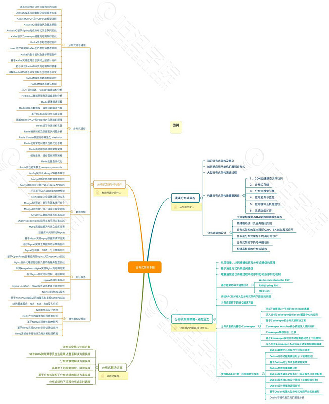
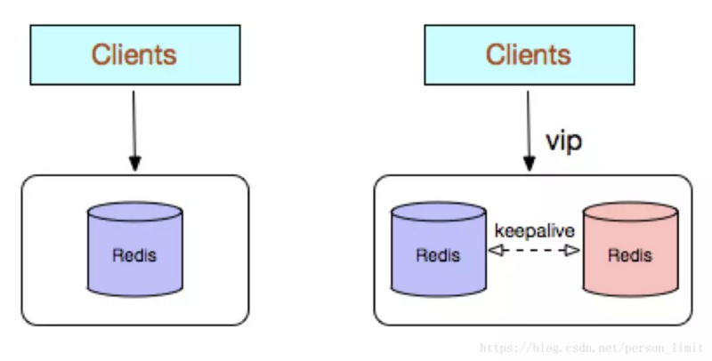
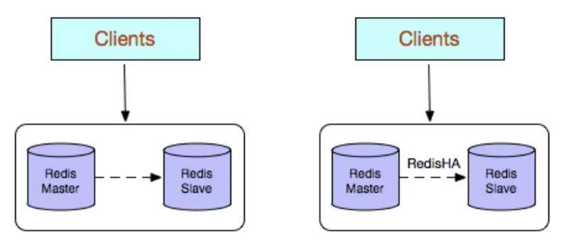
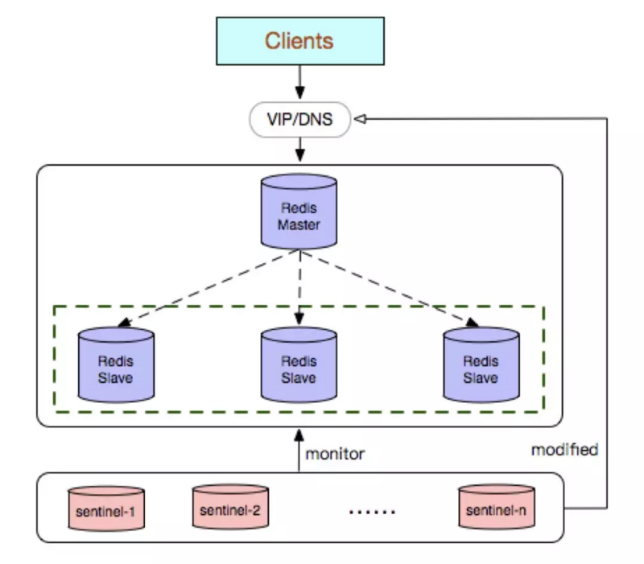
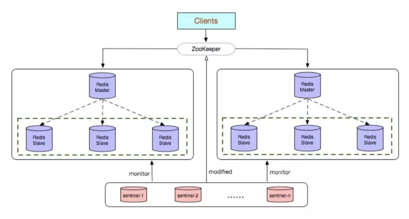
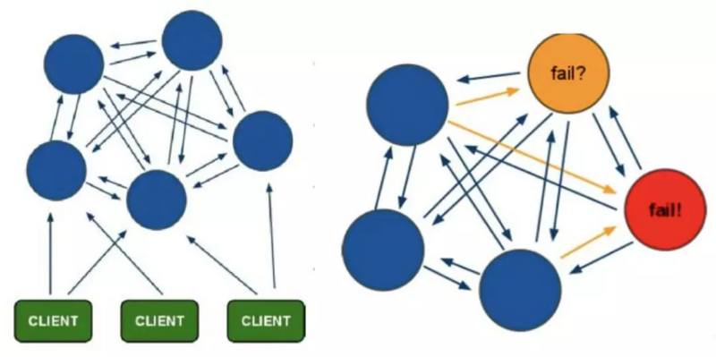
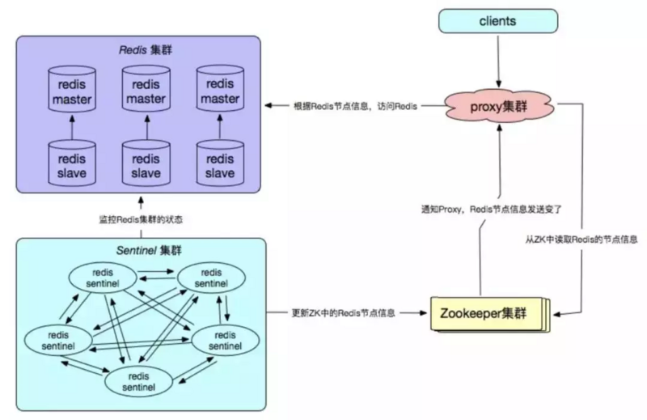
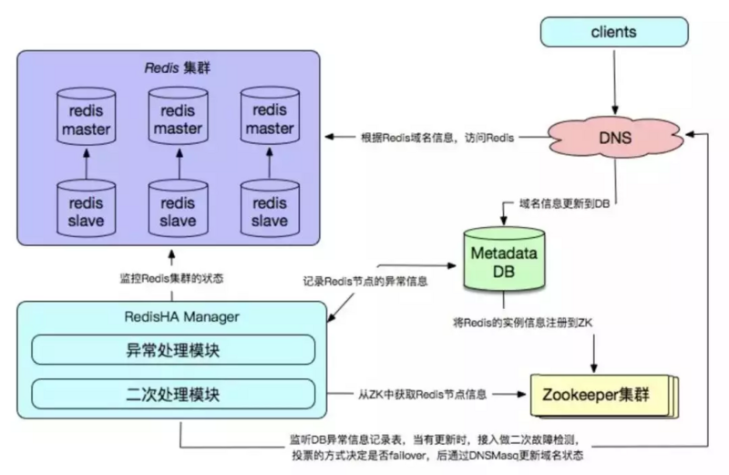

#                                              [ 【独家】终生受用的Redis高可用技术解决方案大全](https://segmentfault.com/a/1190000015592717)                                         

- ​                                                         [                                                                                                                                                                                                                                            java                                                         ](https://segmentfault.com/t/java/blogs)                                                     
- ​                                                         [                                                                                                                       redis集群                                                         ](https://segmentfault.com/t/redis集群/blogs)                                                     
- ​                                                         [                                                                                                                       架构                                                         ](https://segmentfault.com/t/架构/blogs)                                                     
- ​                                                         [                                                                                                                       后端开发                                                         ](https://segmentfault.com/t/后端开发/blogs)                                                     

​                                                 1.5k 次阅读                                                  ·                                                  读完需要 15 分钟                                                                              

​                         

​                                                                                                                                                  

> 最近很多朋友向我咨询关于高可用的方案的优缺点以及如何选择合适的方案线上使用，刚好最近在给宜人贷，光大银行做企业内训的时候也详细讲过，这里我再整理发出来，供大家参考，如有不妥之处，欢迎批评指正，也欢迎推荐更好的技术方案。不废话了，来看看方案吧～

**总纲**

Redis常见的几种主要使用方式：

**Redis 单副本**

**Redis 多副本（主从）**

**Redis Sentinel（哨兵）**

**Redis Cluster**

**Redis 自研**

Redis各种使用方式的优缺点：

**1、Redis单副本**

Redis 单副本，采用单个Redis节点部署架构，没有备用节点实时同步数据，不提供数据持久化和备份策略，适用于数据可靠性要求不高的纯缓存业务场景。

*优点：*

1、架构简单、部署方便

2、高性价比，当缓存使用时无需备用节点（单实例可用性可以用supervisor或crontab保证），当然为了满足业务的高可用性，也可以牺牲一个备用节点，但同时刻只有一个实例对外提供服务。

3、高性能

*缺点：*

1、不保证数据的可靠性

2、当缓存使用，进程重启后，数据丢失，即使有备用的节点解决高可用性，但是仍然不能解决缓存预热问题，因此不适用于数据可靠性要求高的业务。

3、高性能受限于单核CPU的处理能力（Redis是单线程机制），CPU为主要瓶颈，所以适合操作命令简单，排序、计算较少的场景。也可以考虑用memcached替代。

**2、Redis多副本（主从）**

Redis 多副本，采用主从（replication）部署结构，相较于单副本而言最大的特点就是主从实例间数据实时同步，并且提供数据持久化和备份策略。主从实例部署在不同的物理服务器上，根据公司的基础环境配置，可以实现同时对外提供服务和读写分离策略。

*优点：*

1、高可靠性，一方面，采用双机主备架构，能够在主库出现故障时自动进行主备切换，从库提升为主库提供服务，保证服务平稳运行。另一方面，开启数据持久化功能和配置合理的备份策略，能有效的解决数据误操作和数据异常丢失的问题。

2、读写分离策略，从节点可以扩展主库节点的读能力，有效应对大并发量的读操作。

*缺点：*

1、故障恢复复杂，如果没有RedisHA系统（需要开发），当主库节点出现故障时，需要手动将一个从节点晋升为主节点，同时需要通知业务方变更配置，并且需要让其他从库节点去复制新主库节点，整个过程需要人为干预，比较繁琐。

2、主库的写能力受到单机的限制，可以考虑分片

3、主库的存储能力受到单机的限制，可以考虑Pika

4、原生复制的弊端在早期的版本也会比较突出，如：Redis复制中断后，Slave会发起psync，此时如果同步不成功，则会进行全量同步，主库执行全量备份的同时可能会造成毫秒或秒级的卡顿；又由于COW机制，导致极端情况下的主库内存溢出，程序异常退出或宕机；主库节点生成备份文件导致服务器磁盘IO和CPU（压缩）资源消耗；发送数GB大小的备份文件导致服务器出口带宽暴增，阻塞请求。建议升级到最新版本。

**3、Redis Sentinel（哨兵）**

Redis Sentinel是社区版本推出的原生高可用解决方案，Redis Sentinel部署架构主要包括两部分：Redis  Sentinel集群和Redis数据集群，其中Redis  Sentinel集群是由若干Sentinel节点组成的分布式集群。可以实现故障发现、故障自动转移、配置中心和客户端通知。Redis  Sentinel的节点数量要满足2n+1（n>=1）的奇数个。

*优点：*

1、Redis Sentinel集群部署简单

2、能够解决Redis主从模式下的高可用切换问题

3、很方便实现Redis数据节点的线形扩展，轻松突破Redis自身单线程瓶颈，可极大满足对Redis大容量或高性能的业务需求。

4、可以实现一套Sentinel监控一组Redis数据节点或多组数据节点

*缺点：*

1、部署相对Redis 主从模式要复杂一些，原理理解更繁琐

2、资源浪费，Redis数据节点中slave节点作为备份节点不提供服务

3、Redis Sentinel主要是针对Redis数据节点中的主节点的高可用切换，对Redis的数据节点做失败判定分为主观下线和客观下线两种，对于Redis的从节点有对节点做主观下线操作，并不执行故障转移。

4、不能解决读写分离问题，实现起来相对复杂

*建议：*

1、如果监控同一业务，可以选择一套Sentinel集群监控多组Redis数据节点的方案，反之选择一套Sentinel监控一组Redis数据节点的方案

2、sentinel monitor <master-name> <ip> <port>  <quorum>  配置中的<quorum>建议设置成Sentinel节点的一半加1，当Sentinel部署在多个IDC的时候，单个IDC部署的Sentinel数量不建议超过（Sentinel数量  – quorum）。

3、合理设置参数，防止误切，控制切换灵敏度控制

quorum

down-after-milliseconds 30000

failover-timeout 180000

maxclient

timeout

4、部署的各个节点服务器时间尽量要同步，否则日志的时序性会混乱

5、Redis建议使用pipeline和multi-keys操作，减少RTT次数，提高请求效率

6、自行搞定配置中心（zookeeper），方便客户端对实例的链接访问

**4、Redis Cluster**

Redis  Cluster是社区版推出的Redis分布式集群解决方案，主要解决Redis分布式方面的需求，比如，当遇到单机内存，并发和流量等瓶颈的时候，Redis  Cluster能起到很好的负载均衡的目的。Redis  Cluster集群节点最小配置6个节点以上（3主3从），其中主节点提供读写操作，从节点作为备用节点，不提供请求，只作为故障转移使用。Redis  Cluster采用虚拟槽分区，所有的键根据哈希函数映射到0～16383个整数槽内，每个节点负责维护一部分槽以及槽所印映射的键值数据。

文章写到这里，也给大家送一个福利，给大家推荐一个Java架构方面的交流学习群：650385180，里面会分享一些资深架构师录制的视频录像：有Spring，MyBatis，Netty源码分析，高并发、高性能、分布式、微服务架构的原理，JVM性能优化这些成为架构师必备的知识体系。还能领取免费的学习资源。文章开头的总纲就是在群里面获取的，相信对于已经工作和遇到技术瓶颈的码友，在这个群里一定有你需要的内容。

*优点：*

1、无中心架构

2、数据按照slot存储分布在多个节点，节点间数据共享，可动态调整数据分布。

3、可扩展性，可线性扩展到1000多个节点，节点可动态添加或删除。

4、高可用性，部分节点不可用时，集群仍可用。通过增加Slave做standby数据副本，能够实现故障自动failover，节点之间通过gossip协议交换状态信息，用投票机制完成Slave到Master的角色提升。

5、降低运维成本，提高系统的扩展性和可用性。

*缺点：*

1、Client实现复杂，驱动要求实现Smart Client，缓存slots  mapping信息并及时更新，提高了开发难度，客户端的不成熟影响业务的稳定性。目前仅JedisCluster相对成熟，异常处理部分还不完善，比如常见的“max  redirect exception”。

2、节点会因为某些原因发生阻塞（阻塞时间大于clutser-node-timeout），被判断下线，这种failover是没有必要的。

3、数据通过异步复制,不保证数据的强一致性。

4、多个业务使用同一套集群时，无法根据统计区分冷热数据，资源隔离性较差，容易出现相互影响的情况。

5、Slave在集群中充当“冷备”，不能缓解读压力，当然可以通过SDK的合理设计来提高Slave资源的利用率。

6、key批量操作限制，如使用mset、mget目前只支持具有相同slot值的key执行批量操作。对于映射为不同slot值的key由于keys 不支持跨slot查询，所以执行mset、mget、sunion等操作支持不友好。

7、key事务操作支持有限，只支持多key在同一节点上的事务操作，当多个key分布于不同的节点上时无法使用事务功能。

8、key作为数据分区的最小粒度，因此不能将一个很大的键值对象如hash、list等映射到不同的节点。

9、不支持多数据库空间，单机下的redis可以支持到16个数据库，集群模式下只能使用1个数据库空间，即db 0。

10、复制结构只支持一层，从节点只能复制主节点，不支持嵌套树状复制结构。

11、避免产生hot-key，导致主库节点成为系统的短板。

12、避免产生big-key，导致网卡撑爆、慢查询等。

13、重试时间应该大于cluster-node-time时间

14、Redis Cluster不建议使用pipeline和multi-keys操作，减少max redirect产生的场景。

**5、Redis自研 - 推荐推荐**

Redis 自研的高可用解决方案，主要体现在配置中心、故障探测和failover的处理机制上，通常需要根据企业业务的实际线上环境来定制化。

*优点：*

1、高可靠性、高可用性

2、自主可控性高

3、贴切业务实际需求，可缩性好，兼容性好

*缺点：*

1、实现复杂，开发成本高

2、需要建立配套的周边设施，如监控，域名服务，存储元数据信息的数据库等。

3、维护成本高

- 
- 

- [