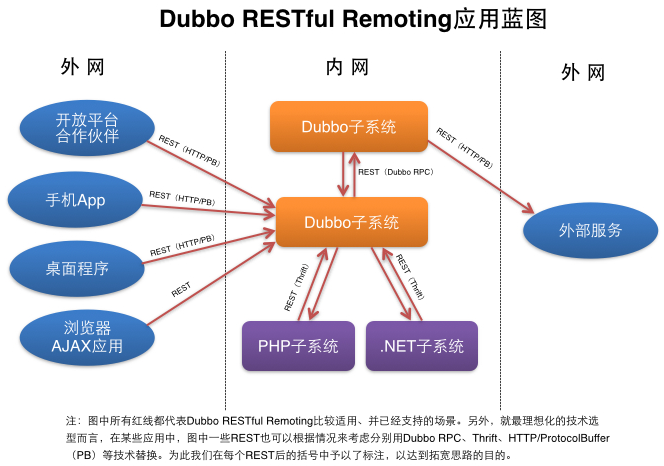
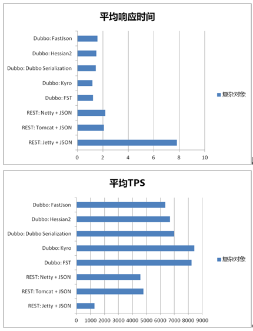

[微服务架构下dubbo的缺点](https://blog.csdn.net/earthhour/article/details/77883418)

1、

 Dubbo只是实现了服务治理，其他组件需要另外整合以实现对应的功能，比如：

 分布式配置：可以使用淘宝的diamond、百度的disconf来实现分布式配置管理。

 服务跟踪：可以使用京东开源的Hydra

批量任务：可以使用当当开源的Elastic-Job

 而Spring Cloud下面有17个子项目（可能还会新增）分别覆盖了微服务架构下的方方面面，服务治理只是其中的一个方面

 2、Dubbo的RPC来实现服务间调用的一些痛点

  a、服务提供方与调用方接口依赖方式太强：调用方对提供方的抽象接口存在强依赖关系，需要严格的管理版本依赖，才不会出现服务方与调用方的不一致导致应用无法编译成功等一系列问题；

  b、服务对平台敏感，难以简单复用：通常我们在提供对外服务时，都会以REST的方式提供出去，这样可以实现跨平台的特点。

 在Dubbo中我们要提供REST接口时，不得不实现一层代理，用来将RPC接口转换成REST接口进行对外发布。所以当当网在**dubbox（基于Dubbo的开源扩展）中增加了对REST支持**。

# [Dubbox：来自当当网的SOA服务框架](https://www.cnblogs.com/beautiful-code/p/6109447.html)

[Dubbo](http://www.biaodianfu.com/dubbo.html)是一个来自阿里巴巴的开源分布式服务框架，当当根据自身的需求，为Dubbo实现了一些新的功能，包括REST风格远程调用、Kryo/FST序列化等等。并将其命名为[Dubbox](https://github.com/dangdangdotcom/dubbox)（即Dubbo eXtensions）。Dubbox主要的新功能包括：

一、支持REST风格远程调用（HTTP + JSON/XML)

dubbo支持多种远程调用方式，例如dubbo RPC（二进制序列化 + tcp协议）、http invoker（二进制序列化 +  http协议，至少在开源版本没发现对文本序列化的支持）、hessian（二进制序列化 + http协议）、WebServices （文本序列化 +  http协议）等等，但缺乏对当今特别流行的REST风格远程调用（文本序列化 + http协议）的支持。

dubbox基于非常成熟的JBoss RestEasy框架，在dubbo中实现了REST风格（HTTP +  JSON/XML）的远程调用，以显著简化企业内部的跨语言交互，同时显著简化企业对外的Open  API、无线API甚至AJAX服务端等等的开发。事实上，这个REST调用也使得Dubbo可以对当今特别流行的“微服务”架构提供基础性支持。  另外，REST调用也达到了比较高的性能，在基准测试下，HTTP + JSON与Dubbo 2.x默认的RPC协议（即TCP +  Hessian2二进制序列化）之间只有1.5倍左右的差距。

REST的优点（摘自维基百科）：

- 可更高效利用缓存来提高响应速度
- 通讯本身的无状态性可以让不同的服务器的处理一系列请求中的不同请求，提高服务器的扩展性
- 浏览器即可作为客户端，简化软件需求
- 相对于其他叠加在HTTP协议之上的机制，REST的软件依赖性更小
- 不需要额外的资源发现机制
- 在软件技术演进中的长期的兼容性更好

基于简单的文本格式消息和通用的HTTP协议，使REST具备极广的适用性，几乎所有语言和平台都对它提供支持，同时其学习和使用的门槛也较低。在dubbo中支持REST，可以为当今多数主流的远程调用场景都带来好处：

1. 显著简化企业内部的异构系统之间的（跨语言）调用。此处主要针对这种场景：dubbo的系统做服务提供端，其他语言的系统（也包括某些不基于  dubbo的java系统）做服务消费端，两者通过HTTP和文本消息进行通信。即使相比Thrift、ProtoBuf等二进制跨语言调用方  案，REST也有自己独特的优势（详见后面讨论）
2. 显著简化对外Open API（开放平台）的开发。既可以用dubbo来开发专门的Open API应用，也可以将原内部使用的dubbo  service直接“透明”发布为对外的Open REST  API（当然dubbo本身未来最好可以较透明的提供诸如权限控制、频次控制、计费等诸多功能）
3. 显著简化手机（平板）APP或者PC桌面客户端开发。类似于2，既可以用dubbo来开发专门针对无线或者桌面的服务器端，也可以将原内部使用的  dubbo service直接“透明”的暴露给手机APP或桌面程序。当然在有些项目中，手机或桌面程序也可以直接访问以上场景2中所述的Open  API。
4. 显著简化浏览器AJAX应用的开发。类似于2，既可以用dubbo来开发专门的AJAX服务器端，也可以将原内部使用的dubbo  service直接“透明”的暴露给浏览器中JavaScript。当然，很多AJAX应用更适合与web框架协同工作，所以直接访问dubbo  service在很多web项目中未必是一种非常优雅的架构。
5. 为企业内部的dubbo系统之间（即服务提供端和消费端都是基于dubbo的系统）提供一种基于文本的、易读的远程调用方式。
6. 一定程度简化dubbo系统对其它异构系统的调用。可以用类似dubbo的简便方式“透明”的调用非dubbo系统提供的REST服务（不管服务提供端是在企业内部还是外部）

需要指出的是， 1～3是dubbo的REST调用最有价值的三种应用场景，并且为dubbo添加REST调用，其最主要到目的也是面向服务的提供端，即开发REST服务来提供给非dubbo的（异构）消费端。归纳起来，所有应用场景如下图所示：

 

二、支持基于Kryo和FST的Java高效序列化实现

dubbo RPC是dubbo体系中最核心的一种高性能、高吞吐量的远程调用方式，简单的说：

- 长连接：避免了每次调用新建TCP连接，提高了调用的响应速度
- 多路复用：单个TCP连接可交替传输多个请求和响应的消息，降低了连接的等待闲置时间，从而减少了同样并发数下的网络连接数，提高了系统吞吐量。

dubbo  RPC主要用于两个dubbo系统之间作远程调用，特别适合高并发、小数据的互联网场景。而序列化对于远程调用的响应速度、吞吐量、网络带宽消耗等同样也  起着至关重要的作用，是我们提升分布式系统性能的最关键因素之一。在dubbo RPC中，同时支持多种序列化方式，例如：

- dubbo序列化：阿里尚未开发成熟的高效java序列化实现，阿里不建议在生产环境使用它
- hessian2序列化：hessian是一种跨语言的高效二进制序列化方式。但这里实际不是原生的hessian2序列化，而是阿里修改过的hessian lite，它是dubbo RPC默认启用的序列化方式
- json序列化：目前有两种实现，一种是采用的阿里的fastjson库，另一种是采用dubbo中自己实现的简单json库，但其实现都不是特别成熟，而且json这种文本序列化性能一般不如上面两种二进制序列化。
- java序列化：主要是采用JDK自带的Java序列化实现，性能很不理想。

在通常情况下，这四种主要序列化方式的性能从上到下依次递减。对于dubbo  RPC这种追求高性能的远程调用方式来说，实际上只有1、2两种高效序列化方式比较般配，而第1个dubbo序列化由于还不成熟，所以实际只剩下2可用，  所以dubbo  RPC默认采用hessian2序列化。但hessian是一个比较老的序列化实现了，而且它是跨语言的，所以不是单独针对java进行优化的。而  dubbo RPC实际上完全是一种Java to Java的远程调用，其实没有必要采用跨语言的序列化方式（当然肯定也不排斥跨语言的序列化）。

最近几年，各种新的高效序列化方式层出不穷，不断刷新序列化性能的上限，最典型的包括：

- 专门针对Java语言的：Kryo，FST等等
- 跨语言的：Protostuff，ProtoBuf，Thrift，Avro，MsgPack等等

这些序列化方式的性能多数都显著优于hessian2（甚至包括尚未成熟的dubbo序列化）。有鉴于此，我们为dubbo引入Kryo和FST这  两种高效Java序列化实现，来逐步取代hessian2。其中，Kryo是一种非常成熟的序列化实现，已经在Twitter、Groupon、  Yahoo以及多个著名开源项目（如Hive、Storm）中广泛的使用。而FST是一种较新的序列化实现，目前还缺乏足够多的成熟使用案例，但它还是非  常有前途的。

三、其他新功特性

- 支持基于嵌入式Tomcat的HTTP remoting体系：基于嵌入式tomcat实现dubbo的 HTTP  remoting体系（即dubbo-remoting-http），用以逐步取代Dubbo中旧版本的嵌入式Jetty，可以显著的提高REST等的远  程调用性能，并将Servlet  API的支持从5升级到3.1。（注：除了REST，dubbo中的WebServices、Hessian、HTTP  Invoker等协议都基于这个HTTP remoting体系）。
- 升级Spring：将dubbo中Spring由x升级到目前最常用的3.x版本，减少项目中版本冲突带来的麻烦。
- 升级ZooKeeper客户端：将dubbo中的zookeeper客户端升级到最新的版本，以修正老版本中包含的bug。

参考文档：

- <http://dangdangdotcom.github.io/dubbox/>
- <https://github.com/dangdangdotcom/dubbox>

 来自：http://www.biaodianfu.com/dubbox.html