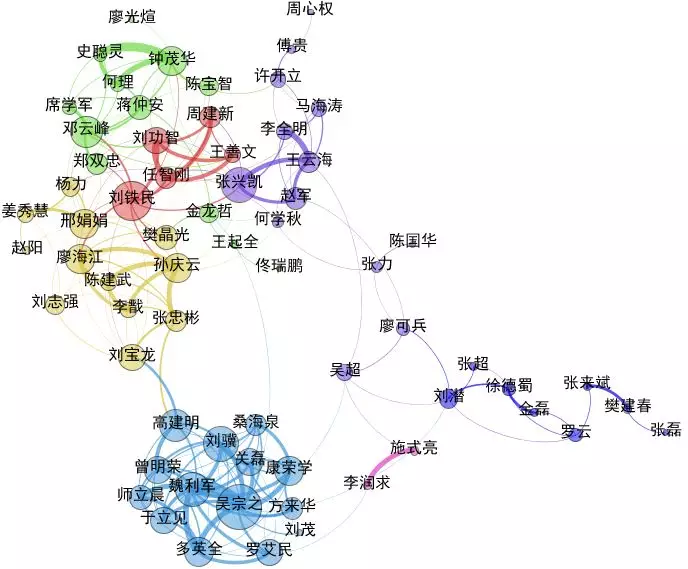
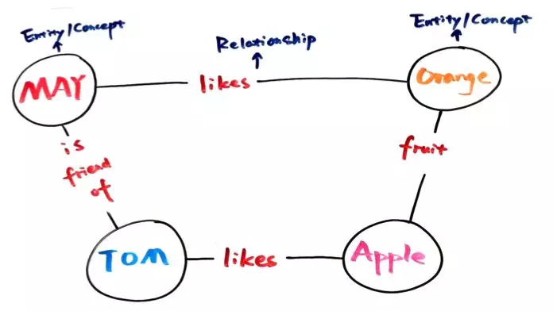
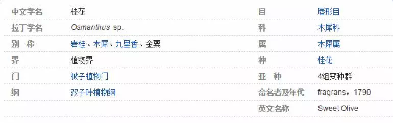
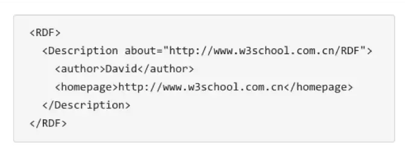
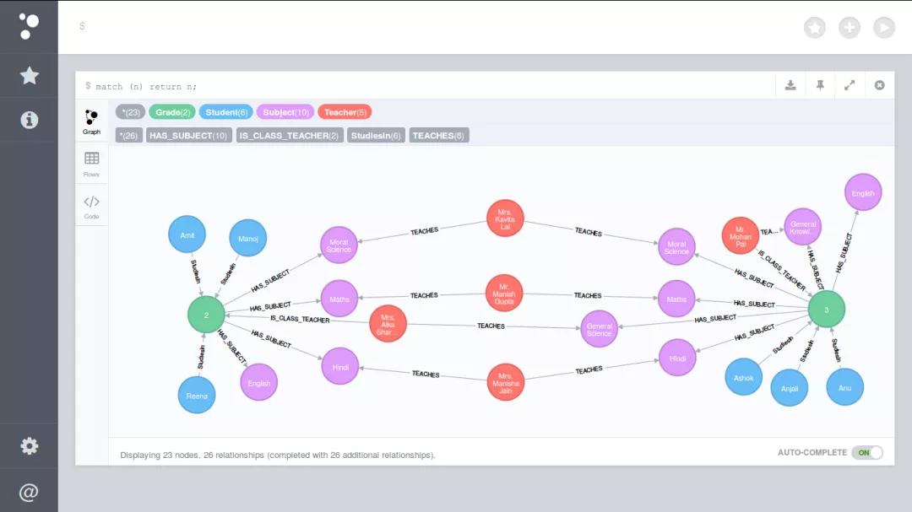
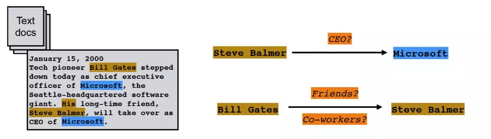
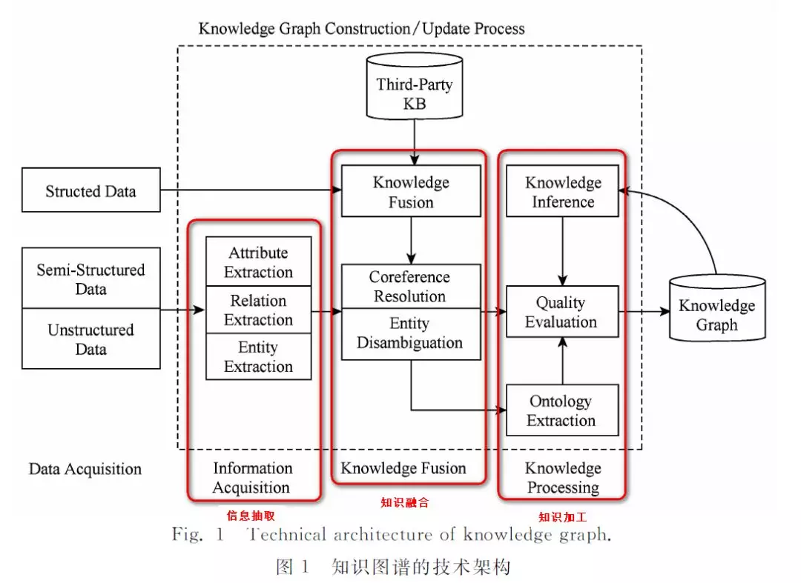

​	

##                                                                一文揭秘！自底向上构建知识图谱全过程                                                                                  

​                                                                                                                                  薇拉                                                                                                                                                      [                         阿里技术                      ](javascript:void(0);)                                                                   *2018-06-28*                      

阿里妹导读：知识图谱的构建技术主要有自顶向下和自底向上两种。其中自顶向下构建是指借助百科类网站等结构化数据源，从高质量数据中提取本体和模式信息，加入到知识库里。而自底向上构建，则是借助一定的技术手段，从公开采集的数据中提取出资源模式，选择其中置信度较高的信息，加入到知识库中。

在本文中，笔者主要想分享一下自底向上构建知识图谱的全过程，抛砖引玉，欢迎大家交流。

> “The world is not made of strings , but is made of things.”
> ——辛格博士，from Google.

知识图谱，是结构化的语义知识库，用于迅速描述物理世界中的概念及其相互关系，通过将数据粒度从document级别降到data级别，聚合大量知识，从而实现知识的快速响应和推理。

当下知识图谱已在工业领域得到了广泛应用，如搜索领域的Google搜索、百度搜索，社交领域的领英经济图谱，企业信息领域的天眼查企业图谱等。

在知识图谱技术发展初期，多数参与企业和科研机构主要采用自顶向下的方式构建基础知识库，如Freebase。随着自动知识抽取与加工技术的不断成熟，当前的知识图谱大多采用自底向上的方式构建，如Google的Knowledge  Vault和微软的Satori知识库。

###   1、定义###   

俗话说：“看人先看脸。”在我们深入了解知识图谱之前，让我们先来看一下它长什么样子!

如图所示，你可以看到，如果两个节点之间存在关系，他们就会被一条无向边连接在一起，那么这个节点，我们就称为###   实体###   （Entity），它们之间的这条边，我们就称为###   关系###   （Relationship）。

知识图谱的基本单位，便是“实体（Entity）-关系（Relationship）-实体（Entity）”构成的三元组，这也是知识图谱的核心。

###   2、数据类型和存储方式###   

知识图谱的原始数据类型一般来说有三类（也是互联网上的三类原始数据）：

- 结构化数据（Structed Data），如关系数据库
- 非结构化数据，如图片、音频、视频
- 半结构化数据 如XML、JSON、百科 

如何存储上面这三类数据类型呢？一般有两种选择，一个是通过RDF（资源描述框架）这样的规范存储格式来进行存储，比较常用的有Jena等。

还有一种方法，就是使用图数据库来进行存储，常用的有Neo4j等。

那你可能会问我了，你不就是一大堆的三元组吗，用关系数据库来存储不也一样嘛。

是的，用关系数据库来存储，尤其是存储简单的知识图谱，从技术上来说是完全没问题的。

但需要注意的是，一旦知识图谱变复杂，图数据库在关联查询的效率上会比传统的关系数据存储方式有显著的提高。当我们涉及到2,3度的关联查询，基于知识图谱的查询效率会高出几千倍甚至几百万倍。

除此之外，基于图的存储在设计上会非常灵活，一般只需要局部的改动即可。

因此如果你的数据量较大，还是建议直接用图数据库来进行存储的。

###   3、知识图谱的架构###   

知识图谱的架构主要可以被分为：

- 逻辑架构
- 技术架构

###   3.1 逻辑架构###   

在逻辑上，我们通常将知识图谱划分为两个层次：###   数据层和模式层。###   

- 模式层：在数据层之上，是知识图谱的核心，存储经过提炼的知识，通常通过本体库来管理这一层这一层（本体库可以理解为面向对象里的“类”这样一个概念，本体库就储存着知识图谱的类）。
- 数据层：存储真实的数据。

如果还是有点模糊，可以看看这个例子：

> 模式层：实体-关系-实体，实体-属性-性值
>
> 数据层：比尔盖茨-妻子-梅琳达·盖茨，比尔盖茨-总裁-微软

###   3.2 技术架构###   

知识图谱的整体架构如图所示，其中虚线框内的部分为知识图谱的构建过程，同时也是知识图谱更新的过程。

别紧张，让我们顺着这张图来理一下思路。首先我们有一大堆的数据，这些数据可能是结构化的、非结构化的以及半结构化的，然后我们基于这些数据来构建知识图谱，这一步主要是通过一系列自动化或半自动化的技术手段，来从原始数据中提取出知识要素，即一堆实体关系，并将其存入我们的知识库的模式层和数据层。

构建知识图谱是一个迭代更新的过程，根据知识获取的逻辑，每一轮迭代包含三个阶段：

- 信息抽取：从各种类型的数据源中提取出实体、属性以及实体间的相互关系，在此基础上形成本体化的知识表达；
- 知识融合：在获得新知识之后，需要对其进行整合，以消除矛盾和歧义，比如某些实体可能有多种表达，某个特定称谓也许对应于多个不同的实体等；
- 知识加工：对于经过融合的新知识，需要经过质量评估之后（部分需要人工参与甄别），才能将合格的部分加入到知识库中，以确保知识库的质量。

###   4、构建技术###   

前面我们已经说过了，知识图谱有自顶向下和自底向上两种构建方式，这里提到的构建技术主要是自底向上的构建技术。

如前所述，构建知识图谱是一个迭代更新的过程，根据知识获取的逻辑，每一轮迭代包含三个阶段：

- 信息抽取：从各种类型的数据源中提取出实体、属性以及实体间的相互关系，在此基础上形成本体化的知识表达；
- 知识融合：在获得新知识之后，需要对其进行整合，以消除矛盾和歧义，比如某些实体可能有多种表达，某个特定称谓也许对应于多个不同的实体等；
- 知识加工：对于经过融合的新知识，需要经过质量评估之后（部分需要人工参与甄别），才能将合格的部分加入到知识库中，以确保知识库的质量，见下图

下面我们依次来对每一个步骤进行介绍。（长文预警）

#####   4.1 信息抽取###

信息抽取（infromation extraction）是知识图谱构建的第1步，其中的关键问题是：如何从异构数据源中自动抽取信息得到候选指示单元？

信息抽取是一种自动化地从半结构化和无结构数据中抽取实体、关系以及实体属性等结构化信息的技术。

涉及的关键技术包括：###   实体抽取、关系抽取和属性抽取。###   

★ 4.1.1 实体抽取

实体抽取###   ，也称为###   命名实体识别###   （named entity recognition，NER），是指从文本数据集中自动识别出命名实体。

比如在下图中，通过实体抽取我们可以从其中抽取出三个实体——“Steve Balmer”, "Bill Gates",和"Microsoft"。

实体抽取的研究历史主要是从面向单一领域进行实体抽取，逐步跨步到面向开放域（open domain）的实体抽取。

★ 4.1.2 关系抽取

文本语料经过实体抽取之后，得到的是一系列离散的命名实体，为了得到语义信息，还需要从相关语料中提取出实体之间的关联关系，通过关系将实体联系起来，才能够形成网状的知识结构。这就是关系抽取需要做的事，如下图所示。

研究历史：

1. 人工构造语法和语义规则（模式匹配）
2. 统计机器学习方法
3. 基于特征向量或核函数的有监督学习方法
4. 研究重点转向半监督和无监督
5. 开始研究面向开放域的信息抽取方法
6. 将面向开放域的信息抽取方法和面向封闭领域的传统方法结合

★ 4.1.3 属性抽取

 属性抽取###   的目标是从不同信息源中采集特定实体的属性信息，如针对某个公众人物，可以从网络公开信息中得到其昵称、生日、国籍、教育背景等信息。

研究历史：

1. 将实体的属性视作实体与属性值之间的一种名词性关系，将属性抽取任务转化为关系抽取任务。
2. 基于规则和启发式算法，抽取结构化数据
3. 基于百科类网站的半结构化数据，通过自动抽取生成训练语料，用于训练实体属性标注模型，然后将其应用于对非结构化数据的实体属性抽取。
4. 采用数据挖掘的方法直接从文本中挖掘实体属性和属性值之间的关系模式，据此实现对属性名和属性值在文本中的定位。

#####   4 4.2 知识融合###   

通过信息抽取，我们就从原始的非结构化和半结构化数据中获取到了实体、关系以及实体的属性信息。

如果我们将接下来的过程比喻成拼图的话，那么这些信息就是拼图碎片，散乱无章，甚至还有从其他拼图里跑来的碎片、本身就是用来干扰我们拼图的错误碎片。
也就是说：

- 拼图碎片（信息）之间的关系是扁平化的，缺乏层次性和逻辑性；
- 拼图（知识）中还存在大量冗杂和错误的拼图碎片（信息）

那么如何解决这一问题，就是在知识融合这一步里我们需要做的了。

知识融合包括2部分内容：

- 实体链接
- 知识合并

★ 4.2.1 实体链接

 实体链接###   （entity linking）是指对于从文本中抽取得到的实体对象，将其链接到知识库中对应的正确实体对象的操作。

其基本思想是首先根据给定的###   实体指称项###   ，从知识库中选出一组候选实体对象，然后通过###   相似度计算###   将指称项链接到正确的实体对象。

研究历史：

1. 仅关注如何将从文本中抽取到的实体链接到知识库中，忽视了位于同一文档的实体间存在的语义联系。
2. 开始关注利用实体的共现关系，同时将多个实体链接到知识库中。即###   集成实体链接###   （collective entity linking）

实体链接的流程：

1. 从文本中通过实体抽取得到实体指称项；
2. 进行###   实体消歧###   和###   共指消解###   ，判断知识库中的同名实体与之是否代表不同的含义以及知识库中是否存在其他命名实体与之表示相同的含义；
3. 在确认知识库中对应的正确实体对象之后，将该实体指称项链接到知识库中对应实体。

> 实体消歧是专门用于解决同名实体产生歧义问题的技术，通过实体消歧，就可以根据当前的语境，准确建立实体链接，实体消歧主要采用聚类法。其实也可以看做基于上下文的分类问题，类似于词性消歧和词义消歧。
>
> 
>
> 共指消解技术主要用于解决多个指称对应同一实体对象的问题。在一次会话中，多个指称可能指向的是同一实体对象。利用共指消解技术，可以将这些指称项关联（合并）到正确的实体对象，由于该问题在信息检索和自然语言处理等领域具有特殊的重要性，吸引了大量的研究努力。共指消解还有一些其他的名字，比如对象对齐、实体匹配和实体同义。

★ 4.2.2 知识合并

在前面的实体链接中，我们已经将实体链接到知识库中对应的正确实体对象那里去了，但需要注意的是，实体链接链接的是我们从半结构化数据和非结构化数据那里通过信息抽取提取出来的数据。

那么除了半结构化数据和非结构化数据以外，我们还有个更方便的数据来源——###   结构化数据###   ，如外部知识库和关系数据库。

对于这部分结构化数据的处理，就是我们###   知识合并###   的内容啦。一般来说知识合并主要分为两种：

- 合并外部知识库，主要处理数据层和模式层的冲突
- 合并关系数据库，有RDB2RDF等方法

#####   4   4.3 知识加工###   

经过刚才那一系列步骤，我们终于走到了知识加工这一步了！

感觉大家可能已经有点晕眩，那么让我们再来看一下知识图谱的这张架构图。

在前面，我们已经通过###   信息抽取###   ，从原始语料中提取出了实体、关系与属性等知识要素，并且经过###   知识融合###   ，消除实体指称项与实体对象之间的歧义，得到一系列基本的事实表达。

 然而事实本身并不等于知识。###   要想最终获得结构化，网络化的知识体系，还需要经历###   知识加工###   的过程。

知识加工主要包括3方面内容：###   本体构建、知识推理和质量评估###   。

★ 4.3.1 本体构建

 本体###   （ontology）是指工人的概念集合、概念框架，如“人”、“事”、“物”等。

本体可以采用人工编辑的方式手动构建（借助本体编辑软件），也可以以数据驱动的自动化方式构建本体。因为人工方式工作量巨大，且很难找到符合要求的专家，因此当前主流的全局本体库产品，都是从一些面向特定领域的现有本体库出发，采用自动构建技术逐步扩展得到的。

自动化本体构建过程包含三个阶段：

1. 实体并列关系相似度计算
2. 实体上下位关系抽取
3. 本体的生成

比如对下面这个例子，当知识图谱刚得到“阿里巴巴”、“腾讯”、“手机”这三个实体的时候，可能会认为它们三个之间并没有什么差别，但当它去计算三个实体之间的相似度后，就会发现，阿里巴巴和腾讯之间可能更相似，和手机差别更大一些。

这就是第一步的作用，但这样下来，知识图谱实际上还是没有一个上下层的概念，它还是不知道，阿里巴巴和手机，根本就不隶属于一个类型，无法比较。因此我们在实体上下位关系抽取这一步，就需要去完成这样的工作，从而生成第三步的本体。

当三步结束后，这个知识图谱可能就会明白，“阿里巴巴和腾讯，其实都是公司这样一个实体下的细分实体。它们和手机并不是一类。”

★ 4.3.2 知识推理

在我们完成了本体构建这一步之后，一个知识图谱的雏形便已经搭建好了。但可能在这个时候，知识图谱之间大多数关系都是残缺的，缺失值非常严重，那么这个时候，我们就可以使用知识推理技术，去完成进一步的知识发现。

比如在下面这个例子里：

我们可以发现：如果A是B的配偶，B是C的主席，C坐落于D，那么我们就可以认为，A生活在D这个城市。

根据这一条规则，我们可以去挖掘一下在图里，是不是还有其他的path满足这个条件，那么我们就可以将AD两个关联起来。除此之外，我们还可以去思考，串联里有一环是B是C的主席，那么B是C的CEO、B是C的COO，是不是也可以作为这个推理策略的一环呢？

当然知识推理的对象也并不局限于实体间的关系，也可以是实体的属性值，本体的概念层次关系等。

比如：

- 推理属性值：已知某实体的生日属性，可以通过推理得到该实体的年龄属性；
- 推理概念：已知(老虎，科，猫科)和（猫科，目，食肉目）可以推出（老虎，目，食肉目）

这一块的算法主要可以分为3大类，基于逻辑的推理、基于图的推理和基于深度学习的推理。

★ 4.3.3 质量评估

质量评估也是知识库构建技术的重要组成部分，这一部分存在的意义在于：可以对知识的可信度进行量化，通过舍弃置信度较低的知识来###   保障知识库的质量###   。

好啦，在质量评估之后，你是不是想说，妈耶知识图谱终于构建完毕了。终于可以松一口气了。

好吧，实不相瞒，知识图谱这个宝宝目前虽然我们构建成功了。

但是！你家宝宝不吃饭的啊！你家宝宝不学习的啊！

所以，让我们冷静一下，乖乖进入知识更新这一步……
#####   4##   4.4 知识更新###   

从逻辑上看，知识库的更新包括###   概念层的更新和数据层的更新###   。

- 概念层的更新是指新增数据后获得了新的概念，需要自动将新的概念添加到知识库的概念层中。
- 数据层的更新主要是新增或更新实体、关系、属性值，对数据层进行更新需要考虑数据源的可靠性、数据的一致性（是否存在矛盾或冗杂等问题）等可靠数据源，并选择在各数据源中出现频率高的事实和属性加入知识库。

知识图谱的内容更新有两种方式：

- 全面更新：指以更新后的全部数据为输入，从零开始构建知识图谱。这种方法比较简单，但资源消耗大，而且需要耗费大量人力资源进行系统维护；
- 增量更新：以当前新增数据为输入，向现有知识图谱中添加新增知识。这种方式资源消耗小，但目前仍需要大量人工干预（定义规则等），因此实施起来十分困难。

###   5、知识图谱的应用###   

好了！终于终于！知识图谱的构建方式我们就此结束了！

为了让大家不立刻弃疗，让我们来看看知识图谱能做到什么，以及目前已经做到了什么~

- 智能搜索——也是知识图谱最成熟的一个场景，自动给出搜索结果和相关人物

- 构建人物关系图，查看更多维度的数据

- 反欺诈：这主要有两部分原因，一个是反欺诈的数据来源多样，结构化和非结构化，二是不少欺诈案件会涉及到复杂的关系网络

- 不一致性验证（类似交叉验证）——关系推理

- 异常分析（运算量大，一般离线）

- - 静态分析：给定一个图形结构和某个时间点，从中去发现一些异常点（比如有异常的子图）。
  - 动态分析：分析其结构随时间变化的趋势。（假设短时间内知识图谱结构的变化不会太大，如果它的变化很大，就说明可能存在异常，需要进一步的关注。会涉及到时序分析技术和图相似性计算技术。）

- 失联客户管理 挖掘出更多的新联系人，提高催收的成功率。

- ……

事实上，知识图谱的应用远不止于此。在我看来，这个世界就是一张巨大的知识图谱，是无数个实体关系对，这两年工业界对图数据库、知识图谱的巨大需求也同样反映出了这一点。

就像这篇文章开头说的那句一样，

> “The world is not made of strings , but is made of things.”
> ——辛格博士，from Google.

###   6、招人啦！###   

阿里安全钱盾反诈实验室，专注研究全领域反病毒、反钓鱼、反诈骗技术，长期协同社会各界治理通信网络诈骗，保护和服务消费者。

欢迎各位对算法和Java后台感兴趣的小伙伴加入我们（简历投递邮箱：ranqing.sxy@alibaba-inc.com）

References

[1] 刘峤, 李杨, 段宏,等. 知识图谱构建技术综述[J]. 计算机研究与发展, 2016, 53(3):582-600.
[2] 打怪的蚂蚁. CSDN. 知识图谱技术技巧. http://blog.csdn.net/xgjianstart/article/details/70214852
[3]  Ehrlinger L, Wöß W. Towards a Definition of Knowledge Graphs[C]// Joint  Proceedings of the Posters and Demos Track of, International Conference  on Semantic Systems - Semantics2016 and, International Workshop on  Semantic Change & Evolving Semantics. 2016.
[4]  Das R, Neelakantan A, Belanger D, et al. Chains of Reasoning over  Entities, Relations, and Text using Recurrent Neural Networks[J].  2016:132-141.

每天一篇技术文章，

看不过瘾？

关注“###   阿里巴巴机器智能###   ”，

发现更多AI干货。

 

###   你可能还喜欢###   

点击下方图片即可阅读

[毕业3年，为何技术能力相差越来越大？](http://mp.weixin.qq.com/s?__biz=MzIzOTU0NTQ0MA==&mid=2247487690&idx=1&sn=b56e94dda0466693b3cf5d8be1c0287c&chksm=e9292dc5de5ea4d3f191e1a66793bd5bfccbc477404ce5442a83e5568648dab7e715733bfbf8&scene=21#wechat_redirect)

[程序员吃的是青春饭？本质上取决于......](http://mp.weixin.qq.com/s?__biz=MzIzOTU0NTQ0MA==&mid=2247487544&idx=1&sn=a15c8762edf234e843e11061def8931a&chksm=e9292d37de5ea42115530d2e8a59cf456388068b8e8aa382e2bdeccc7b218e7a10f1aea07c2f&scene=21#wechat_redirect)

[为什么阿里工程师纷纷在内网晒代码？](http://mp.weixin.qq.com/s?__biz=MzIzOTU0NTQ0MA==&mid=2247487548&idx=1&sn=767ddc1aeec5d388a23d45814286a95a&chksm=e9292d33de5ea425d9077cd1c0efaa55085fc03f92ecc9b0038a4571d38d20add24811ac40ae&scene=21#wechat_redirect)

###   关注「阿里技术」###   

###   把握前沿技术脉搏###   