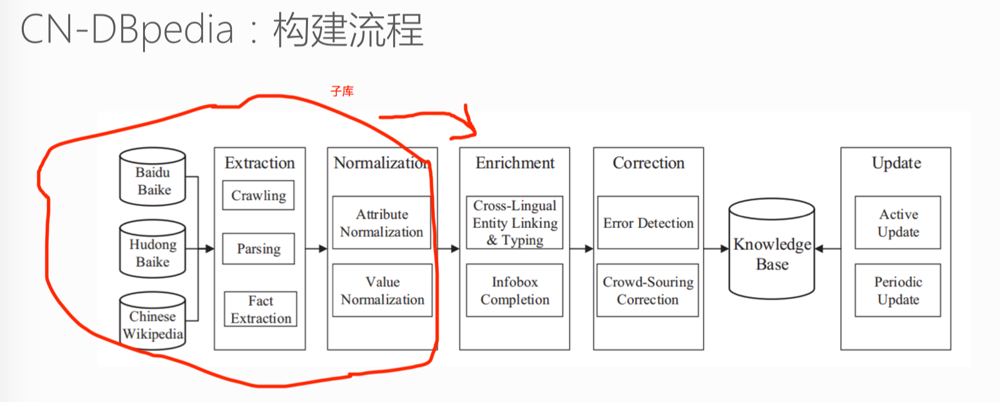
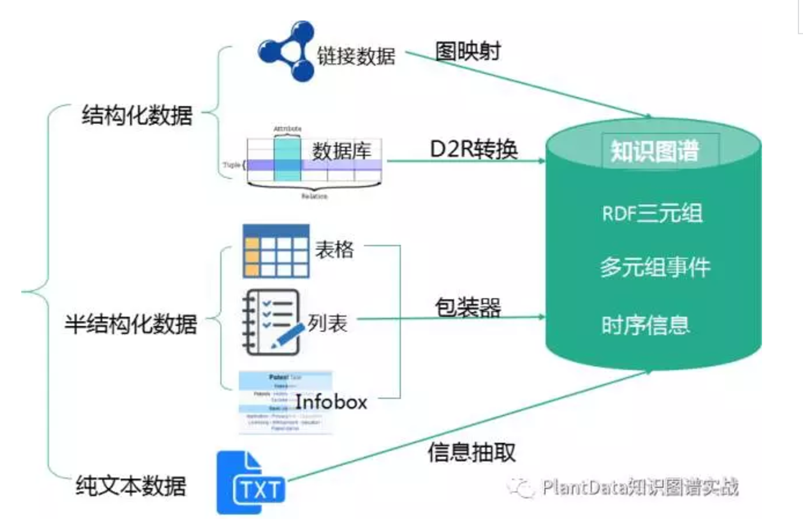
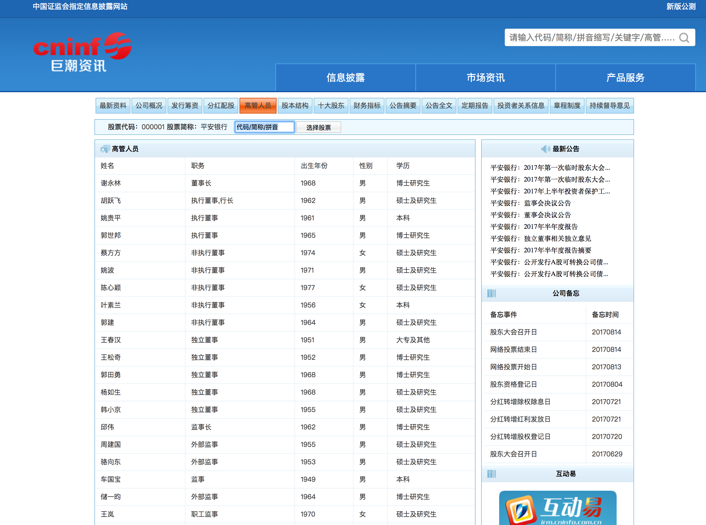
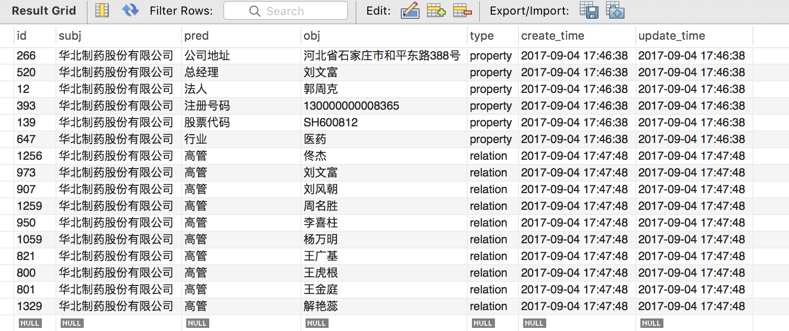
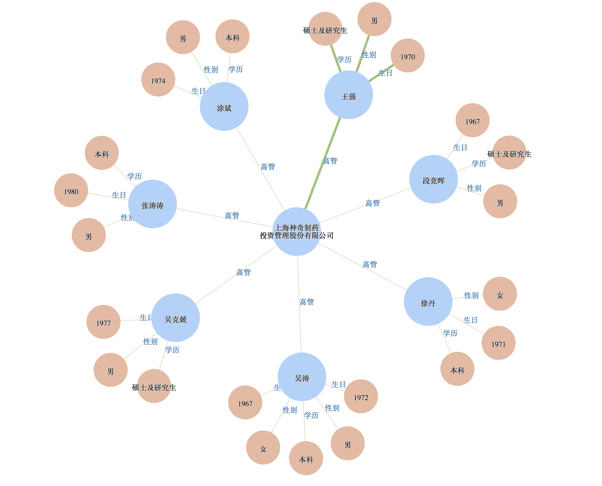
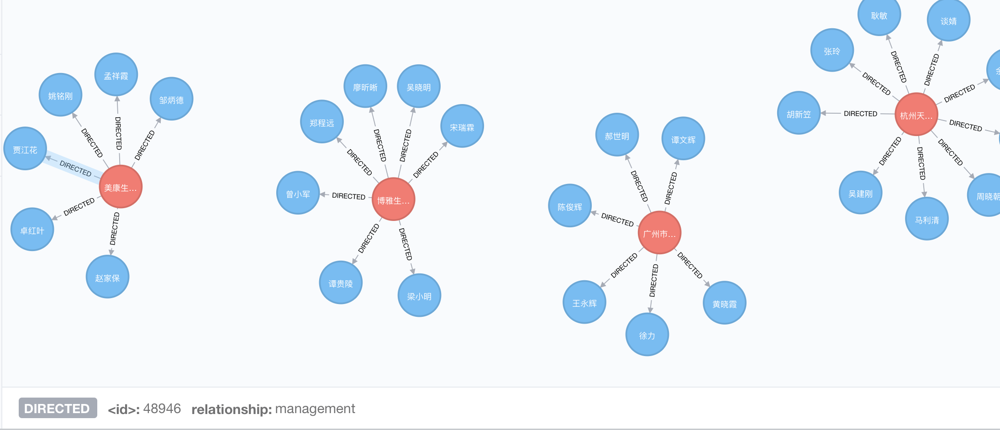

     [              徐阿衡            ](http://www.shuang0420.com/)   

- ​           [                                                       Home           ](http://www.shuang0420.com/)         
- ​           [                                                       Categories           ](http://www.shuang0420.com/categories)         
- ​           [                                                       Works           ](http://www.shuang0420.com/works)         
- ​           [                                                       About           ](http://www.shuang0420.com/aboutme)         
- ​           [                                                       Tags           ](http://www.shuang0420.com/tags)         
- ​                        [                                                                  Search           ](javascript:;)         

​                 

#                项目实战--知识图谱初探

​                                     Posted on                            2017-09-05                                                                  |                                In                                                   [                     Projects                   ](http://www.shuang0420.com/categories/Projects/)                                                                                                                                                       |                   [                                    ](http://www.shuang0420.com/2017/09/05/项目实战-知识图谱初探/#comments)                                                                                                       |                                                                   

实践了下怎么建一个简单的知识图谱，两个版本，一个从 0 开始(start from scratch)，一个在  CN-DBpedia 基础上补充，把 MySQL，PostgreSQL，Neo4j  数据库都尝试了下。自己跌跌撞撞摸索可能踩坑了都不知道，欢迎讨论。

## CN-DBpedia 构建流程

知识库可以分为两种类型，一种是以  Freebase，Yago2 为代表的 Curated KBs，主要从维基百科和 WordNet  等知识库中抽取大量的实体及实体关系，像是一种结构化的维基百科。另一种是以 Stanford OpenIE，和我们学校 Never-Ending  Language Learning (NELL) 为代表的 Extracted KBs，直接从上亿个非结构化网页中抽取实体关系三元组。与  Freebase 相比，这样得到的知识更加**多样性**，但同时精确度要低于 Curated KBs，因为实体关系和实体更多的是**自然语言**的形式，如“奥巴马出生在火奴鲁鲁。” 可以被表示为（“Obama”, “was also born in”, “ Honolulu”），

下面以 CN-DBpedia 为例看下知识图谱大致是怎么构建的。

上图分别是 CN-DBpedia 的构建流程和系统架构。知识图谱的构建是一个浩大的工程，从大方面来讲，分为**知识获取、知识融合、知识验证、知识计算和应用**几个部分，也就是上面架构图从下往上走的一个流程，简单来走一下这个流程。

### 数据支持层

最底下是知识获取及存储，或者说是**数据支持层**，首先从不同来源、不同结构的数据中**获取**知识，CN-DBpedia 的知识来源主要是通过爬取各种百科知识这类半结构化数据。

至于**数据存储**，要考虑的是选什么样的数据库以及怎么设计 schema。选**关系数据库**还是**NoSQL 数据库**？要不要用**内存数据库**？要不要用**图数据库**？这些都需要根据数据场景慎重选择。CN-DBpedia  实际上是基于 mongo 数据库，参与开发的谢晨昊提到，一般只有在基于特定领域才可能会用到图数据库，就知识图谱而言，基于 json(bson)  的 mongo 就足够了。用到图查询的领域如征信，一般是需要要找两个公司之间的关联交易，会用到最短路径/社区计算等。

schema 的重要性不用多说，高质量、标准化的 schema  能有效降低领域数据之间对接的成本。我们希望达到的效果是，对于任何数据，进入知识图谱后后续流程都是相同的。换言之，对于不同格式、不同来源、不同内容的数据，在接入知识图谱时都会按照预定义的  schema 对数据进行转换和清洗，无缝使用已有元数据和资源。

### 知识融合层

我们知道，目前分布在互联网上的知识常常以**分散、异构、自治**的形式存在，另外还具有**冗余、噪音、不确定、非完备**的特点，清洗并不能解决这些问题，因此从这些知识出发，通常需要**融合**和**验证**的步骤，来将不同源不同结构的数据融合成统一的知识图谱，以保证知识的一致性。所以数据支持层往上一层实际上是融合层，主要工作是对获取的数据进行标注、抽取，得到大量的三元组，并对这些三元组进行融合，去冗余、去冲突、规范化，

第一部分 SPO **三元组抽取**，对不同种类的数据用不同的技术提取

- 从结构化数据库中获取知识：D2R
  难点：复杂表数据的处理
- 从链接数据中获取知识：图映射
  难点：数据对齐
- 从半结构化（网站）数据中获取知识：使用包装器
  难点：方便的包装器定义方法，包装器自动生成、更新与维护
- 从文本中获取知识：信息抽取
  难点：结果的准确率与覆盖率

尤其是纯文本数据会涉及到的 **实体识别、实体链接、实体关系识别、概念抽取** 等，需要用到许多自然语言处理的技术，包括但不仅限于分词、词性标注、分布式语义表达、篇章潜在主题分析、同义词构建、语义解析、依存句法、语义角色标注、语义相似度计算等等。

第二部分才到融合，目的是将不同数据源获取的知识进行融合构建数据之间的关联。包括 **实体对齐、属性对齐、冲突消解、规范化** 等，这一部分很多都是 dirty work，更多的是做一个数据的映射、实体的匹配，可能还会涉及的是本体的构建和融合。最后融合而成的知识库存入上一部分提到的数据库中。如有必要，也需要如 Spark 等大数据平台提供高性能计算能力，支持快速运算。

知识融合的四个难点：

- 实现不同来源、不同形态数据的融合
- 海量数据的高效融合
- 新增知识的实时融合
- 多语言的融合

### 知识验证

再往上一层主要是**验证**，分为**补全、纠错、外链、更新**各部分，确保知识图谱的**一致性和准确性**。一个典型问题是，知识图谱的构建不是一个静态的过程，当引入新知识时，需要判断新知识是否正确，与已有知识是否一致，如果新知识与旧知识间有冲突，那么要判断是原有的知识错了，还是新的知识不靠谱？这里可以用到的证据可以是**权威度、冗余度、多样性、一致性**等。如果新知识是正确的，那么要进行相关实体和关系的更新。

### 知识计算和应用

这一部分主要是基于知识图谱计算功能以及知识图谱的应用。**知识计算**主要是根据图谱提供的信息得到更多隐含的知识，像是通过**本体或者规则推理**技术可以获取数据中存在的隐含知识；通过**链接预测**预测实体间隐含的关系；通过**社区计算**在知识网络上计算获取知识图谱上存在的社区，提供知识间关联的路径……通过知识计算知识图谱可以产生大量的智能应用如专家系统、推荐系统、语义搜索、问答等。

知识图谱涉及到的技术非常多，每一项技术都需要专门去研究，而且已经有很多的研究成果。Anyway 这章不是来论述知识图谱的具体技术，而是讲怎么做一个 hello world 式的行业知识图谱。这里讲两个小 demo，一个是 **爬虫+mysql+d3** 的小型知识图谱，另一个是 **基于 CN-DBpedia+爬虫+PostgreSQL+d3** 的”增量型”知识图谱，要实现的是某行业上市公司与其高管之间的关系图谱。

## Start from scratch

### 数据获取

第一个重要问题是，我们需要什么样的知识？需要爬什么样的数据？一般在数据获取之前会先做个**知识建模**，建立知识图谱的数据模式，可以采用两种方法：一种是**自顶向下**的方法，专家手工编辑形成数据模式；另一种是**自底向上**的方法，基于行业现有的标准进行转换或者从现有的高质量行业数据源中进行映射。数据建模都过程很重要，因为标准化的 schema 能有效降低领域数据之间对接的成本。

作为一个简单的  demo，我们只做上市公司和高管之间的关系图谱，企业信息就用公司注册的基本信息，高管信息就用基本的姓名、出生年、性别、学历这些。然后开始写爬虫，爬虫看着简单，实际有很多的技巧，怎么做优先级调度，怎么并行，怎么屏蔽规避，怎么在遵守互联网协议的基础上最大化爬取的效率，有很多小的  trick，之前博客里也说了很多，就不展开了，要注意的一点是，**高质量的数据来源是成功的一半！**

来扯一扯爬取建议：

- 从数据质量来看，优先考虑权威的、稳定的、数据格式规整且前后一致、数据完整的网页
- 从爬取成本来看，优先考虑免登录、免验证码、无访问限制的页面
- 爬下来的数据务必**保存好爬取时间、爬取来源(source)或网页地址(url)**
  source 可以是新浪财经这类的简单标识，url 则是网页地址，这些在后续数据清洗以及之后的纠错(权威度计算)、外链和更新中非常重要

企业信息可以在天眼查、启信宝、企查查各种网站查到，信息还蛮全的，不过有访问限制，需要注册登录，还有验证码的环节，当然可以过五关斩六将爬到我们要的数据，然而没这个必要，换别个网站就好。

推荐两个数据来源：

- [中财网数据引擎](http://data.cfi.cn/cfidata.aspx)
- [巨潮资讯](http://www.cninfo.com.cn/cninfo-new/index)

其中巨潮资讯还可以同时爬取高管以及公告信息。看一下数据

换句话说，我们直接能得到规范的**实体(公司、人)**，以及规范的**关系(高管)**，当然也可以把高管展开，用下一层关系，董事长、监事之类，这就需要做进一步的清洗，也可能需要做关系的对齐。

这里爬虫框架我用的是 scrapy+redis 分布式，每天可以定时爬取，爬下来的数据写好自动化清洗脚本，定时入库。

### 数据存储

数据存储是非常重要的一环，第一个问题是选什么数据库，这里作为 starter，用的是关系型数据库 MySQL。设计了四张表，两张实体表分别存**公司(company)**和**人物(person)**的信息，一张关系表存公司和高管的**对应关系(management)**，最后一张 SPO 表存**三元组**。

**为什么爬下来两张表，存储却要用 4 张表？**
一个考虑是知识图谱里典型的**一词多义**问题，相同实体名但有可能指向不同的意义，比如说  Paris 既可以表示巴黎，也可以表示人名，怎么办？让作为地名的 “Paris” 和作为人的 “Paris”  有各自独一无二的ID。“Paris1”（巴黎）通过一种内在关系与埃菲尔铁塔相联，而  “Paris2”（人）通过取消关系与各种真人秀相联。这里也是一样的场景，同名同姓不同人，需要用 id  做唯一性标识，也就是说我们需要对原来的数据格式做一个转换，不同的张三要标识成张三1，张三2…  那么，用什么来区别人呢？拍脑袋想用姓名、生日、性别来定义一个人，也就是说我们需要一张人物表，需要 (name, birth, sex) 来作**composite unique key** 表示每个人。公司也是相同的道理，不过这里只有上市公司，股票代码就可以作为唯一性标识。

Person 表和 company 表是多对多的关系，这里需要做 normalization，用 management  这张表来把多对多转化为两个一对多的关系，(person_id, company_id) 就表示了这种映射。management 和 spo  表都表示了这种映射，为什么用两张表呢？是出于实体对齐的考虑。management 保存了原始的关系，”董事”、监事”等，而 spo  把这些关系都映射成”高管”，也就是说 management 可能需要通过映射才能得到 SPO 表，SPO 才是最终成型的表。

可能有更简单的方法来处理上述问题，思考中，待更新—-

我们知道知识库里的关系其实有两种，一种是**属性(property)**，一种是**关系(relation)**。那么还有一个问题是 **SPO 需不需要存储属性？**

最后要注意的一点是，每条记录要保存创建时间以及最后更新时间，做一个简单的版本控制。

### 数据可视化

Flask 做 server，d3 做可视化，可以检索公司名/人名获取相应的图谱，如下图。之后会试着更新有向图版本。

## Start from CN-DBpedia

把  CN-DBpedia 的三元组数据，大概 6500 万条，导入数据库，这里尝试了 PostgreSQL。然后检索了 112  家上市公司的注册公司名称，只有 69 家公司返回了结果，属性、关系都不是很完善，说明了通用知识图谱有其不完整性(也有可能需要先做一次  mention2entity，可能它的标准实体并不是注册信息的公司名称，不过 API 小范围试了下很多是 Unknown Mention)。

做法也很简单，把前面 **Start from scratch** 中得到的 SPO 表插入到这里的 SPO 表就好了。这么简单？因为这个场景下不用做实体对齐和关系对齐。

## 拓展

这只是个 hello world 项目，在此基础上可以进行很多有趣的拓展，最相近的比如说加入企业和股东的关系，可以进行**企业最终控制人查询**(e.g.,基于股权投资关系寻找持股比例最大的股东，最终追溯至自然人或国有资产管理部门)。再往后可以做企业社交图谱查询、企业与企业的路径发现、企业风险评估、反欺诈等等等等。具体来说：

1. 重新设计数据模型 引入”概念”，形成可动态变化的“概念—实体—属性—关系”数据模型，实现各类数据的统一建模
2. 扩展多源、异构数据，结合实体抽取、关系抽取等技术，填充数据模型
3. 展开知识融合(实体链接、关系链接、冲突消解等)、验证工作(纠错、更新等)

最后补充一下用 Neo4j 方式产生的可视化图，有两种方法。一是把上面说到的 MySQL/PostgreSQL 里的 company 表和  person 表存成 node，node 之间的关系由 spo 表中 type == relation 的 record  中产生；二是更直接的，从 spo 表中，遇到 type == property 就给 node(subject)  增加属性({predicate:object})，遇到 type == relation 就给 node 增加关系((Nsubject) -  [r:predicate]-> node(Nobject))，得到下面的图，移动鼠标到相应位置就可以在下方查看到关系和节点的属性。

[项目地址](https://github.com/Shuang0420/knowledge_graph_demo)

欢迎关注：徐阿衡的微信公众号

客官，打个赏呗~

​        

​                        [#Knowledge Graph](http://www.shuang0420.com/tags/Knowledge-Graph/)                        [#知识库](http://www.shuang0420.com/tags/知识库/)                    

​                            [                  深度学习-过拟合(Andrew Ng. DL 笔记)               ](http://www.shuang0420.com/2017/08/29/神经网络-过拟合(Andrew Ng. DL 笔记)/)                        

​                            [                 Neo4j Cypher Cheetsheet                ](http://www.shuang0420.com/2017/09/11/Neo4j Cypher Cheetsheet/)                        

​            

​                

​                          

- ​             Table of Contents           
- ​             Overview           

1. [1. CN-DBpedia 构建流程](http://www.shuang0420.com/2017/09/05/项目实战-知识图谱初探/#CN-DBpedia-构建流程)
2. [2. Start from scratch](http://www.shuang0420.com/2017/09/05/项目实战-知识图谱初探/#Start-from-scratch)
3. [3. Start from CN-DBpedia](http://www.shuang0420.com/2017/09/05/项目实战-知识图谱初探/#Start-from-CN-DBpedia)
4. [4. 拓展](http://www.shuang0420.com/2017/09/05/项目实战-知识图谱初探/#拓展)

​      ©  2016 -    2019              徐阿衡   [粤ICP备17129486号](http://www.miitbeian.gov.cn/) 

   Powered by [Hexo](https://hexo.io) 

   Theme -   [     NexT.Mist   ](https://github.com/iissnan/hexo-theme-next) 

​                                

​            