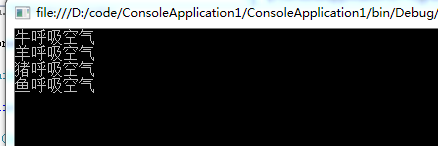
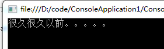
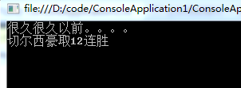
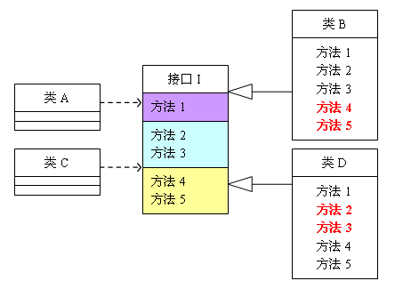
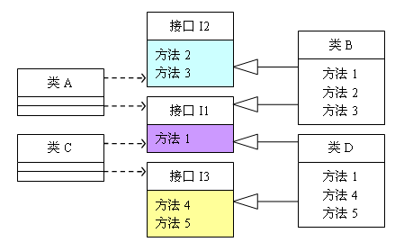

##  			[设计模式六大原则](https://www.cnblogs.com/shijingjing07/p/6227728.html)

### 1.设计模式的目的
设计模式是为了更好的代码重用性，可读性，可靠性，可维护性。

###  2.常用的六大设计模式
1)单一职责原则
2)里氏替换原则
3)依赖倒转原则
4)接口隔离原则
5)迪米特法则
6)开闭原则

###  3.单一职责原则
该原则是针对类来说的，即一个类应该只负责一项职责。
如类T负责两个不同职责：职责P1，职责P2。当职责P1需求变更而改变T时，可能造成职责P2发生故障，所以需要将类T的粒度分解为T1，T2。
示例如下：
用一个类秒数动物呼吸这个场景

[](javascript:void(0);)

```
class Animal {
    public void breathe(string animal)
    {
        Console.WriteLine(animal+"呼吸空气");
    }
}
class Program
{
    static void Main(string[] args)
    {
        Animal animal = new Animal();
        animal.breathe("牛");
        animal.breathe("羊");
        animal.breathe("猪");
        animal.breathe("鱼");
        Console.ReadLine();
    }
}
```

[](javascript:void(0);)

输出结果：



我们发现不是所有动物都是呼吸空气的，比如鱼就是呼吸水的，根据单一职责原则，我们将Animal类细分为陆生动物类和水生动物类，如下所示：

[](javascript:void(0);)

```
class Terrestrial
{
    public void breathe(string animal)
    {
        Console.WriteLine(animal+"呼吸空气");
    }
}
class Aquatic
{
    public void breathe(string animal)
    {
        Console.WriteLine(animal + "呼吸水");
    }
}
class Program
{
    static void Main(string[] args)
    {
        Terrestrial terrestrial = new Terrestrial();
        terrestrial.breathe("牛");
        terrestrial.breathe("羊");
        terrestrial.breathe("猪");
        Aquatic aquatic = new Aquatic();
        aquatic.breathe("鱼");
        Console.ReadLine();
    }
}
```

[](javascript:void(0);)

我们发现这样修改的花销很大，既要将原来的类分解，又要修改客户端。而直接修改Animal类虽然违背了单一职责原则，但花销小的多，如下所示：

[](javascript:void(0);)

```
class Animal
{
    public void breathe(string animal)
    {
        if ("鱼".Equals(animal))
        {
            Console.WriteLine(animal + "呼吸水");
        }
        else {
            Console.WriteLine(animal + "呼吸空气");
        }
    }
}
class Program
{
    static void Main(string[] args)
    {
        Animal animal = new Animal();
        animal.breathe("牛");
        animal.breathe("羊");
        animal.breathe("猪");
        animal.breathe("鱼");
        Console.ReadLine();
    }
}
```

[](javascript:void(0);)

可以看到，这种修改方式简单的多。但却存在隐患，一天需要将鱼分为淡水鱼，海水鱼，又需要修改Animal类的breathe方法。可能给“猪牛羊”等相关功能带来风险，这种修改直接在代码级别违背了单一职责原则，虽然修改起来最简单，但隐患最大。还有一种修改方式：

[](javascript:void(0);)

```
class Animal
{
    public void breathe(string animal)
    {
         Console.WriteLine(animal + "呼吸空气");
    }
    public void breathe2(string animal)
    {
        Console.WriteLine(animal + "呼吸水");
    }
}
class Program
{
    static void Main(string[] args)
    {
        Animal animal = new Animal();
        animal.breathe("牛");
        animal.breathe("羊");
        animal.breathe("猪");
        animal.breathe2("鱼");
        Console.ReadLine();
    }
} 
```

[](javascript:void(0);)

这种修改方式没有改动原来的方法，而是在类中新加了一个方法，这样虽然违背了单一职责原则，但在方法级别上却是符合单一职责原则的。那么在实际编程中，采用哪一种呢？我的原则是，只有逻辑足够简单，才可以在代码级违反单一职责原则；只有类中方法数量足够少，才可以在方法级别违反单一职责原则。

遵循单一职责的优点：
1)降低类的复杂度，一个类只负责一项职责。
2)提高类的可读性，可维护性
3)降低变更引起的风险。

###  4.里氏替换原则
该原则是在1988年，由麻省理工学院的以为姓里的女士提出的。
如果对每个类型为T1的对象o1，都有类型为T2的对象o2，使得以T1定义的所有程序P在所有的对象o1都代换成o2时，程序P的行为没有发生变化，那么类型T2是类型T1的子类型。
换句话说，所有引用基类的地方必须能透明地使用其子类的对象。

由定义可知，在使用继承时，遵循里氏替换原则，在子类中尽量不要重写和重载父类的方法。
继承包含这样一层含义：父类中凡是已经实现好的方法（相对抽象方法而言），实际上是在设定一系列的规范和契约，虽然它不强制要求所有的子类必须遵循这些契约，但是如果子类对这些非抽象方法任意修改，就会对整个继承体系造成破坏。而里氏替换原则就是表达了这一层含义。
继承作为面向对象三大特性之一，在给程序设计带来巨大遍历的同时，也带来了弊端。比如使用继承会给程序带来侵入性，程序的可移植性降低，增加对象间的耦合性，如果一个类被其他的类所继承，则当这个类需要修改时，必须考虑到所有的子类，并且父类修改后，所有涉及到子类的功能都有可能产生故障。
举例说明继承的风险，我们需要完成一个两数相减的功能，由类A来负责。

[](javascript:void(0);)

```
class A{
    public int func1(int a,int b){
        return a-b;
    }
}
public class Client{
    public static void main(string[] args){
        A a=new A();
        System.out.println("100-50="+a.func1(100,50));
        System.out.println("100-80="+a.func1(100,80));
    }
}
```

[](javascript:void(0);)

运行结果：

100-50=50
100-80=20

后来，我们需要增加一个新的功能：完成两数相加，然后再与100求和，由类B来负责。

[](javascript:void(0);)

```
Class B extends A{
    public int func1(int a,int b){
        return a+b;
    }
    public int func2(int a,int b){
        return func1(a,b)+100;
    }
}
public class Client{
    public static void main(string[] args){
        B a=new B();
        System.out.println("100-50="+b.func1(100,50));
        System.out.println("100-80="+b.func1(100,80));
        System.out.println("100+20+100="+b.func2(100,20));
    }
}
```

[](javascript:void(0);)

运行结果：

100-50=150
100-80=180
100+20+100=220

我们发现原来运行正常的相减功能发生了错误。原因就是类B无意中重写了父类的方法，造成原有功能出现错误。在实际编程中，我们常常会通过重写父类的方法完成新的功能，这样写起来虽然简单，但整个继承体系的复用性会比较差。特别是运行多态比较频繁的时候，如果非要重写父类的方法，通用的做法是：原来的父类和子类都继承一个更通俗的基类，原有的继承关系去掉，采用依赖，聚合，组合等关系代替。

###  5.依赖倒转原则
高层模块不应该依赖低层模块，二者都应该依赖其抽象；抽象不应该依赖细节，细节应该依赖抽象。
类A直接依赖类B，如果要将类A改为依赖类C，则必须通过修改类A的代码来达成。此时，类A一般是高层模块，负责复杂的业务逻辑，类B和类C是低层模块，负责基本的原子操作；修改A会给程序带来风险。
将类A修改未依赖接口I，类B和类C各自实现接口I，类A通过接口I间接与类B或类C发生联系，则会大大降低修改类A的记几率。
依赖倒置原则基于这样一个事实：相对于细节的多变性，抽象的东西要稳定的多。以抽象为基础搭建的架构比以细节为基础的架构要稳定的多。在java中，抽象指的是接口或抽象类，细节就是具体的实现类，使用接口或抽象类的目的是制定好规范，而不涉及任何具体的操作，把展现细节的任务交给他们的实现类去完成。
依赖倒置的中心思想是面向接口编程。

代码示例如下：

[](javascript:void(0);)

```
class Book {
    public string getContent() {
        return "很久很久以前。。。。。";
    }
}
class Mother {
    public void narrate(Book book)
    {
        Console.WriteLine(book.getContent());
    }
}
class Program
{
    static void Main(string[] args)
    {
        Mother monther = new Mother();
        monther.narrate(new Book());
        Console.ReadLine();
    }
}
```

[](javascript:void(0);)

运行结果：



如果读的对象是报纸，杂志，却发现客户端不适用了。
我们引入一个抽象的接口IReader,代表读物

```
interface IReader{
    public string getContent();
}
```

这样Mother类与接口IReader发生依赖关系，而Book和Newspaper都属于读物的范畴，他们各自都去实现IReader接口，这样就符合依赖倒置原则了，修改代码如下：

[](javascript:void(0);)

```
interface IReader {
         string getContent();
    }
    class Newspaper: IReader
    {
    public string getContent()
    {
        return "切尔西豪取12连胜";
    }
}
class Book:IReader
{

    public string getContent()
{
    return "很久很久以前。。。。";
}
}
class Mother
{
    public void narrate(IReader reader)
    {
        Console.WriteLine(reader.getContent());
    }
}
class Program
{
    static void Main(string[] args)
    {
        Mother monther = new Mother();
        monther.narrate(new Book());
        monther.narrate(new Newspaper());
        Console.ReadLine();
    }
}
```

[](javascript:void(0);)

运行结果:



采用依赖倒置原则给多人并行开发带来极大的便利，比如上列中Mother类与Book类直接耦合，Mother必须等Book类编码完成后才可以进行编码，因为Mother类依赖于Book类。修改后的程序可以同时开工，互不影响。
依赖关系的传递有三种方式，接口传递，构造方法传递和setter方法传递。
接口传递：

[](javascript:void(0);)

```
interface IDriver{
    public void drive(ICar car);
}
public class Driver:IDriver{
    public void drive(ICar car){
        car.run();
    }
}
```

[](javascript:void(0);)

构造方法传递：

[](javascript:void(0);)

```
interface IDriver{
    public void drive();
}
public class Driver implements IDriver{
    public ICar car;
    public Driver(ICar _car){
        this.car=_car;
    }
    public void drive(){
        this.car.run();
    }
}
```

[](javascript:void(0);)

setter方式传递：

[](javascript:void(0);)

```
interface IDriver{
    public void setCar(ICar car);
    public void drive();
}
public class Driver:IDriver{
    PRIVATE ICar car;
    public void setCar(ICar car){
        this.car=car;
    }
    public void drive(){
        this.car.run();
    }
}
```

[](javascript:void(0);)

在实际编程中，一般需要做到如下3点：
低层模块尽量都要有抽象类或接口，或者两者都有。
变量的声明类型尽量是抽象类或接口。
使用继承时遵循里氏替换原则

###  6.接口隔离原则
客户端不应该依赖它不需要的接口；一个类对另一个类的依赖应该建立在最小的接口上。
类A通过接口I依赖类B，类C通过接口I依赖类D，如果接口I对于类A和类C来说不是最小接口，则类B和类D必须去实现他们不需要的方法。
将臃肿的接口I拆分为独立的几个接口，类A和类C分别与他们需要的接口建立依赖关系。也就是采用接口隔离原则。
举例说明接口隔离原则：



这个图的意思是：类A依赖接口I中的方法1，方法2，方法3，类B是对类A依赖的实现；类C依赖接口I中的方法1，方法4，方法5，类D是对类C依赖的实现。对于类B和类D来说，虽然存在用不到的方法（红色标记所示），但由于实现了接口I，所以也必须要实现这些用不到的方法。代码如下：

[](javascript:void(0);)

```
interface I{
    void method1();
    void method2();
    void method3();
    void method4();
    void method5();
}
class A{
    public void depend1(I i){
        i.method1();
    }
    public void depend2(I i){
        i.method2();
    }
    public void depend3(I i){
        i.method3();
    }
}
class C{
    public void depend1(I i){
        i.method1();
    }
    public void depend2(I i){
        i.method4();
    }
    public void depend3(I i){
        i.method5();
    }
}
class B:I{
    public void method1(){
        Console.WriteLine("类B实现接口I的方法1");
    }
    public void method2(){
        Console.WriteLine("类B实现接口I的方法2");
    }
    public void method3(){
        Console.WriteLine("类B实现接口I的方法3");
    }
    public void method4(){}
    public void method5(){}
}
class D:I{
    public void method1(){
        Console.WriteLine("类B实现接口I的方法1");
    }
    public void method2(){}
    public void method3(){}
    public void method4(){
        Console.WriteLine("类B实现接口I的方法4");
    }
    public void method5(){
        Console.WriteLine("类B实现接口I的方法5");
    }
}
class Program
{
    static void Main(string[] args)
    {
        A a=new A();
        a.depend1(new B());
        a.depend2(new B());
        a.depend3(new B());
        
        C c=new C();
        c.depend1(new D());
        c.depend2(new D());
        c.depend3(new D());
        Console.ReadLine();
    }
}
```

[](javascript:void(0);)

可以看到，接口中出现的方法，不管对依赖于它的类有没有作用，实现类中都必须去实现这些方法。于是我们将原接口I拆分为三个接口：



代码如下所示：

[](javascript:void(0);)

```
interface I1{
    void method1();
}
interface I2{
    void method2();
    void method3();
}
interface I3{
    void method4();
    void method5();
}
class A{
    public void depend1(I1 i){
        i.method1();
    }
    public void depend2(I2 i){
        i.method2();
    }
    public void depend3(I2 i){
        i.method3();
    }
}
class C{
    public void depend1(I1 i){
        i.method1();
    }
    public void depend2(I3 i){
        i.method4();
    }
    public void depend3(I3 i){
        i.method5();
    }
}
class B:I1,I2{
    public void method1(){
        Console.WriteLine("类B实现接口I1的方法1");
    }
    public void method2(){
        Console.WriteLine("类B实现接口I2的方法2");
    }
    public void method3(){
        Console.WriteLine("类B实现接口I2的方法3");
    }
}
class D:I1,I3{
    public void method1(){
        Console.WriteLine("类B实现接口I的方法1");
    }
    public void method4(){
        Console.WriteLine("类B实现接口I的方法4");
    }
    public void method5(){
        Console.WriteLine("类B实现接口I的方法5");
    }
}
class Program
{
    static void Main(string[] args)
    {
        A a=new A();
        a.depend1(new B());
        a.depend2(new B());
        a.depend3(new B());
        
        C c=new C();
        c.depend1(new D());
        c.depend2(new D());
        c.depend3(new D());
        Console.ReadLine();
    }
}
```

[](javascript:void(0);)

说到这里，可能会觉得接口隔离原则和之前的单一职责原则很相似，其实不然。一，单一职责注重职责，而接口隔离原则注重对接口依赖的隔离；二，单一职责是约束类，其次是方法，针对的是程序中的实现和细节；而接口隔离原则约束的是接口，针对的是抽象，程序整体框架的构建。

###  7.迪米特法则
一个对象应该对其他对象保持最少的了解。
类与类关系越密切，耦合度越大。
迪米特法则又叫最少知道原则，即一个类对自己依赖的类知道的越少越好。也就是说，对于被依赖的类不管多么复杂，都尽量将逻辑封装在类的内部。对外除了提供的public 方法，不对外泄露任何信息。
迪米特法则还有个更简单的定义：只与直接的朋友通信。
什么是直接的朋友：每个对象都会与其他对象由耦合关系，只要两个对象之间有耦合关系，我们就说这两个对象之间是朋友关系。耦合的方式很多，依赖，关联，组合，聚合等。其中，我们称出现成员变量，方法参数，方法返回值中的类为直接的朋友，而出现在局部变量中的类不是直接的朋友。也就是说，陌生的类最好不要以局部变量的形式出现在类的内部。
举例额说明如下，有一个集团公司，下属单位有分公司和直属部门，现要求打印出所有下属单位的员工ID。

[](javascript:void(0);)

```
class Employee{
    private string id;
    public void setId(string id){
        this.id=id;
    }
    public string getId(){
        return id;
    }
}
class SubEmployee{
    private string id;
    public void setId(string id){
        this.id=id;
    }
    public string getId(){
        return id;
    }
}
class SubCompanyManager{
    public List<SubEmployee> getAllEmployee(){
        List<SubEmployee> list=new ArrayList(SubEmployee);
        for(int i=0;i<100;i++){
            SubEmployee emp=new SubEmployee();
            emp.setId("分公司"+i);
            list.add(emp);
        }
        return list;
    }
}
class CompanyManager{
    public List<Employee> getAllEmployee(){
        List<Employee> list=new ArrayList<Employee>();
        for(int i=0;i<30;i++)
        {
            Employee emp=new Employee();
            emp.setId("总公司"+i);
            list.add(emp);
        }
        return list;
    }
    publi void printAllEmployee(SubCompanyManager sub){
        List<SubEmployee> list1=sub.getAllEmployee();
        foreach(SubEmployee e in list1){
            Console.WriteLine(e.getId());
        }
        List<Employee> list2=this.getAllEmployee();
        foreach(Employee e in list2){
            Console.WriteLine(e.getId());
        }
    }
}
class Program
{
    static void Main(string[] args)
    {
        CompanyManager e=new CompanyManager();
        e.printAllEmployee(new SubCompanyManager());
        Console.ReadLine();
    }
}
```

[](javascript:void(0);)

这个设计的问题在于CompanyManager中，SubEmployee类并不是CompanyManager类的直接朋友，按照迪米特法则，应该避免类中出现这样非直接朋友关系的耦合。修改后的代码如下:

[](javascript:void(0);)

```
class SubCompanyManager{
    public List<SubEmployee> getAllEmployee(){
        List<SubEmployee> list = new ArrayList<SubEmployee>();
        for(int i=0; i<100; i++){
            SubEmployee emp = new SubEmployee();
            //为分公司人员按顺序分配一个ID
            emp.setId("分公司"+i);
            list.add(emp);
        }
        return list;
    }
    public void printEmployee(){
        List<SubEmployee> list = this.getAllEmployee();
        for(SubEmployee e:list){
            System.out.println(e.getId());
        }
    }
}
class CompanyManager{
    public List<Employee> getAllEmployee(){
        List<Employee> list = new ArrayList<Employee>();
        for(int i=0; i<30; i++){
            Employee emp = new Employee();
            //为总公司人员按顺序分配一个ID
            emp.setId("总公司"+i);
            list.add(emp);
        }
        return list;
    }
    
    public void printAllEmployee(SubCompanyManager sub){
        sub.printEmployee();
        List<Employee> list2 = this.getAllEmployee();
        for(Employee e:list2){
            System.out.println(e.getId());
        }
    }
}
```

[](javascript:void(0);)

迪米特法则的初衷是降低类之间的耦合，由于每个类都减少了不必要的依赖，因此的确可以降低耦合关系。

###  8.开闭原则

一个软件实体如类，模块和函数应该对扩展开放，对修改关闭。用抽象构建框架，用实现扩展细节。
当软件需要变化时，尽量通过扩展软件实体的行为来实现变化，而不是通过修改已有的代码来实现变化。
当我们遵循前面介绍的5大原则，以及使用23中设计模式的目的就是遵循开闭原则。


分类: [架构](https://www.cnblogs.com/shijingjing07/category/895412.html)

标签: [设计原则](https://www.cnblogs.com/shijingjing07/tag/设计原则/)