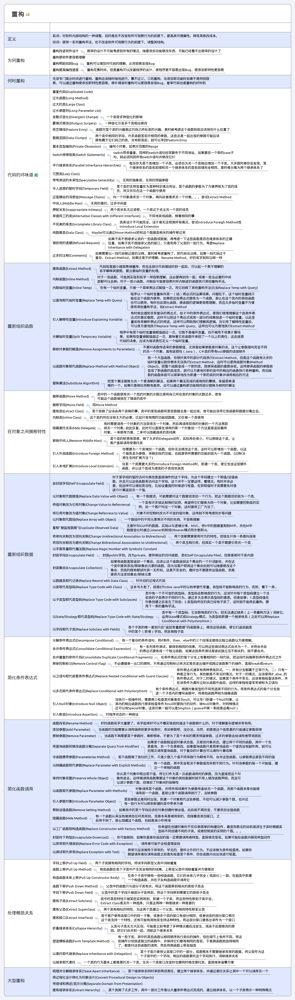
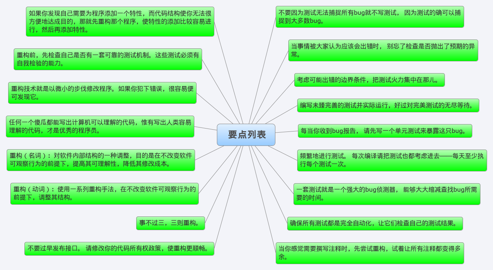

# [AngelDevil](https://www.cnblogs.com/angeldevil/)

## [我的个人博客：angeldevil.me](http://www.angeldevil.me)

 随笔 - 40   文章 - 0   评论 - 205 

# [《重构，改善既有代码的设计》读书笔记](https://www.cnblogs.com/angeldevil/p/3601730.html)

重构，绝对是写程序过程中最重要的事之一。在写程序之前我们不可能事先了解所有的需求，设计肯定会有考虑不周的地方，而且随着项目需求的修改，也有可能原来的设计已经被改得面目全非了。更何况，**我们很少有机会从头到尾完成一个项目**，基本上都是接手别人的代码，即使这个项目是从头参与的，也有可能接手其他组员的代码。我们都有过这样的经验，看到别人的代码时感觉就像屎一样，有一种强烈的想重写的冲动，但一定要压制住这种冲动，你完全重写，可能比原来的好一点，但浪费时间不说，还有可能引入原来不存在的Bug，而且，你不一定比原来设计得好，也许原来的设计考虑到了一些你没考虑到的情况。我们写的代码，终有一天也会被别人接手，很可能到时别人会有和我们现在一样的冲动。所以，我们要做的是重构，从小范围的重构开始。

重构不只可以改善既有的设计，还可以帮助我们理解原来很难理解的流程。比如一个复杂的条件表达式，我们可能需要很久才能看明白这个表达式的作用，还可能看了好久终于看明白了，过了没多长时间又忘了，现在还要从头看，如果我们把这个表达式运用Extract   Method抽象出来，并起一个易于理解的名字，如果函数名字起得好，下次当我们再看到这段代码时，不用看逻辑我们就知道这个函数是做什么的。如果对这个函数内所有难于理解的地方我们做了适当的重构，把每个细小的逻辑抽象成一个小函数并起一个容易理解的名字，当我们看代码时就有可能像看注释一样，不用再像以前一样通过看代码的实现来猜测这段代码到底是做什么的，好的代码胜过注释，毕竟注释还是有可能更新不及时的。

《重构，改善既有代码的设计》，这是一部经典之作，相信很多人都听过或看过，看这本书时会发现，书中讲的都是一些很简单的东西，而且很多东西就是我们平时在做的，只是作者把它们总结了起来。比如说Rename   Field，就是对不易理解其作用的字段起一个易于理解的名字，这个肯定我们都做过，但是更多时候，我们是对这种字段视而不见，比如曾经花了很久没搞明白代码的字段"IP"是什么的缩写，最后发现竟然是“INPUT”。看过这本书的收获是，让重构融于整个写代码的过程中，让重构不再作为一项独立的任务，而是在写代码的过程中随时随地的进行，一个函数不容易理解，重构；添加新功能时很不方便，重构，使添加新功能变得理解。

这本书是用Java写的，而且Java的版本很老。

书中的一些东西说得太绝对，比如说看到switch就重构，但这是不现实的，比如说Android开发，菜单的onOptionsItemSelected，这个肯定是重构不了的；对于很多控件的onClickListener，还是统一设置一个Listener并通过ViewID区分方便点，尤其是在Adapter的getView中，针对每个控件new一个onClickListener会生成太多对象。当然，不是说这个重构手法无效，而是这个手法提醒我们，当看到这样的情况时需要认真考虑一下，当前的情况是否需要重构，如果确定不需要，就那样好了。

但是有些东西还是很值得注意的，比如**封装集合(Encapsulate Collection)**，当调用者请求一个类的一个集合对象时，我们最好不要返回这个集合对象，而是返回这个集合对像的一个不可修改的副本，并增加添加/移除数据的函数。比如Android开发的Adapter，我们经常会为了方便给Adapter添加返回数据集合与设置数据集合的方法，但这是不安全的，**我们不能确定调用者获得这个集合后会做什么事情，如果调用者修改了这个集合的内容我们也对其一无所知，在Android中，如果调用者在非UI线程获得了Adapter列表的数据并修改是会出问题的。**

**重构前，先检查自己是否有一套可靠的测试机制。这些测试必须有自我检验的能力，**毕竟重构可能破坏掉一些东西，我们要靠测试帮助我们发现这些问题，**不要因为测试无法捕捉所有bug就不写测试， 因为测试的确可以捕捉到大多数bug。**不过，说来惭愧，我很少写测试，尤其是Android项目。

书中全是一些很简单的手法，我相信，我们肯定都用过其中的大部分重构手法，只是没有察觉。这本书只是对其进行了一个总结，并让我们意识到重构这项技能，并让重构融入我们整个写程序的过程中，让重构无处不在。

书中的一些重构手法，在我感觉可能就不算是重构手法，比如给函数添加参数，如果参数不够又必须添加，我们肯定会添加的，这算是功能修改还是重构，随便怎么理解吧，不过作为笔记，还是把所有这些都记录下来了。

对这本书的笔记只有三个图，是对书中所有重构手法列表的一个简单记录，方便以后查阅，至于具体操作步骤或例子，以后想看时翻书就行了，或都网上也可以搜到的。下面这个链接是一个C#版本关于重构的系列，**但不是这本书的C#版本**，其中的手法大都是相同的，[圣殿骑士：31天重构系列](http://www.cnblogs.com/KnightsWarrior/archive/2010/06/30/1767981.html)。

##	重构列表：

##	要点列表：

##	代码坏味：

作者：

AngelDevil

 出处：

www.cnblogs.com/angeldevil

[欢迎访问我的个人站点：angeldevil.me](http://www.angeldevil.me) 

转载请注明出处！

分类: [读书笔记](https://www.cnblogs.com/angeldevil/category/560745.html)

标签: [重构](https://www.cnblogs.com/angeldevil/tag/重构/), [读书笔记](https://www.cnblogs.com/angeldevil/tag/读书笔记/)

- 