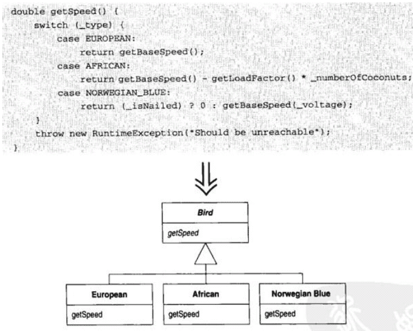

​          [](https://www.jianshu.com/)                    

​           [](https://www.jianshu.com/u/b2372a42e28d)         

 

 

​                

- ​               [                  ](https://www.jianshu.com/)            
- ​               [                  ](https://www.jianshu.com/subscriptions)            
- [   1](https://www.jianshu.com/notifications) 
- ​                                                      


广告


# 《重构：改善既有代码的设计》读书笔记

​              

​             [高稷](https://www.jianshu.com/u/96ff8e78771d)                          

​                                                    0.9                                                 2018.01.27 10:17               字数 8334             阅读 3570评论 0喜欢 11

## 一，重构，第一个案例

这一章作者先用一个影片出租程序的案例，来演示重构的过程


重构前UML.PNG

```
public class Movie {

  public static final int CHILDRENs = 2;
  public static final int REGULAR = 0;
  public static final int NEW_RELEASE = 1;

  private String title;
  private int priceCode;

  public Movie(String title, int priceCode) {
    this.title = title;
    this.priceCode = priceCode;
  }

  public String getTitle() {
    return title;
  }

  public void setTitle(String title) {
    this.title = title;
  }

  public int getPriceCode() {
    return priceCode;
  }

  public void setPriceCode(int priceCode) {
    this.priceCode = priceCode;
  }
}
public class Rental {
  private Movie movie;
  private int daysRented;

  public Rental(Movie movie, int daysRented) {
    this.movie = movie;
    this.daysRented = daysRented;
  }

  public Movie getMovie() {
    return movie;
  }

  public void setMovie(Movie movie) {
    this.movie = movie;
  }

  public int getDaysRented() {
    return daysRented;
  }

  public void setDaysRented(int daysRented) {
    this.daysRented = daysRented;
  }
}
public class Customer {
  private String name;
  private Vector<Rental> _rentals = new Vector<>();

  Customer(String name) {
    this.name = name;
  }

  void addRental(Rental arg) {
    _rentals.addElement(arg);
  }

  private String getName() {
    return name;
  }

  String statement() {
    double totalAmount = 0;
    int frequentRenterPoints = 0;
    Enumeration<Rental> rentals = _rentals.elements();
    String result = "Rental Record for " + getName() + "\n";
    while (rentals.hasMoreElements()) {
      double thisAmount = 0;
      Rental each = rentals.nextElement();

      switch (each.getMovie().getPriceCode()) {
        case Movie.REGULAR:
          thisAmount += 2;
          if (each.getDaysRented() > 2)
            thisAmount += (each.getDaysRented() - 2) * 1.5;
          break;
        case Movie.NEW_RELEASE:
          thisAmount += each.getDaysRented() * 3;
          break;
        case Movie.CHILDRENs:
          thisAmount += 1.5;
          if (each.getDaysRented()>3)
            thisAmount += (each.getDaysRented() - 3) * 1.5;
          break;
      }

      frequentRenterPoints++;
      if (each.getMovie().getPriceCode()==Movie.NEW_RELEASE
              && each.getDaysRented() > 1)
        frequentRenterPoints++;

      result += "\t" + each.getMovie().getTitle() + "\t" + String.valueOf(thisAmount) + "\n";
      totalAmount += thisAmount;
    }
    result += "Amount owed is " + String.valueOf(totalAmount) + "\n";
    result += "You earned " + String.valueOf(frequentRenterPoints) + " frequent renter points";
    return result;
  }
}
```

每个**Customer**顾客可以租多部**Movie**影片，程序会根据影片的不同类型和租赁天数，计算出租赁费用和获得的积分。

这个例子我先尝试自己重构了一遍，然后看完第一章再重构了一遍。
 看完整本书以后，把代码还原成最开始的样子，自己再重构了两遍。
 以下是我最后一次重构的步骤：

- 先加单元测试，根据影片类型的不同，以及租赁天数的临界值，增加多个test case。
-  **while**循环改为**for**循环，变量**each**改名叫**rental**。
- 计算每个电影**frequentRenterPoints**的逻辑，抽取方法**getFrequentRenterPoints(Rental rental)**。
- 发现**getFrequentRenterPoints(Rental rental)**只依赖于**Rental**类，把方法移至**Rental**类。
- 发现**getFrequentRenterPoints()**使用了**movie.getPriceCode()**，**Rental**应该调用**Movie**的接口，而不是直接操作**Movie**的属性。把方法移至**Movie**变成**getFrequentRenterPoints(int daysRented)**。
- 消除**getFrequentRenterPoints(int daysRented)**中的临时变量。
- 计算每个电影费用的逻辑，抽取方法**getCharge(Rental rental)**。
- 发现**getCharge(Rental rental)**只依赖于**Rental**类，把方法移至**Rental**类。
- 再次发现**getCharge()**使用了**movie.getPriceCode()**，把方法移至**Movie**变成**getCharge(int daysRented)**。
- 消除**getCharge(int daysRented)**中的临时变量。
- 用多态替换**Switch**，如果创建三个子类继承**Movie**，调用方就必须创建具体的子类对象（**违反依赖倒置原则**）。
   一个对象具有状态，并且不同状态下有不同的行为，引入**State模式**：
   创建接口**Price**作为**Movie**的属性，接口方法**getCharge(int daysRented)**，再创建三个实现类，把**Switch**分支的逻辑移至具体的实现类。
- 把**getFrequentRenterPoints(int daysRented)**也移至**Price**。
- 修改**Movie**的构造方法，根据**priceCode**初始化新加的属性对象**price**，去掉原有的**priceCode**属性。
- 回到**Customer**，**statement()**的循环中做了不止一件事：计算费用，计算积分，计算总费用，分开三个循环，分别抽方法。

以下是重构以后的UML图：


作者的重构.PNG

做了几点总结：
 1 . 每个方法**只做一件事**，每个方法**抽象层级不能多于两层**，根据这个原则抽取方法。
 2 . 根据类的职责和对象之间的依赖关系，把方法移至对应的类。
 3 . 应该调用对象的接口方法，不要直接操作对象的属性。
 4 . **尽量减少方法中的临时变量**，简化逻辑，增加可读性，例如

```
public int getFrequentRenterPoints() {
    int frequent = 1;
    if (getMovie().getPriceCode() == Movie.NEW_RELEASE
            && daysRented > 1)
      frequent++;
    return frequent;
}
```

应该改成

```
public int getFrequentRenterPoints() {
    if (getMovie().getPriceCode() == Movie.NEW_RELEASE
            && daysRented > 1)
      return 2;
    return 1;
}
```

5 . **依赖倒置原则**，调用方应该依赖抽象类或接口，不要依赖具体实现类。
 6 . **状态模式 OR 工厂模式？**
 这块暂时没有太明白，什么情况该用哪种模式。
 **状态模式**适用于有状态的对象，在不同状态下有不同的处理逻辑的情况。
 这个案例感觉确实更适合用**状态模式**。
 **工厂模式**似乎更适用于创建各种对象，例如我自己第一次重构时增加了PriceCalculator的概念，而案例中并没有这个概念。
 7 . **Code Kata**，重构的手法需要反复针对练习，才能熟练掌握。

## 二、重构原则

1 . **重构的定义**

- （名词形式）对软件内部结构的一种调整，目的是在**不改变软件可察行为**的前提下，提高**可理解性**，降低**修改成本**。
- （动词形式）使用一些列重构手法，在**不改变软件可观察行为**的前提下，**调整其结构**。

2 . **软件开发的两顶帽子**

- 添加新功能时，不应该修改既有代码，只管添加新功能并通过测试。
- 重构时不再添加新功能，只管改进程序结构，并通过已有测试。

3 . **为何重构**

- 重构改进软件设计（Design）
- 重构使软件更容易理解（Maintain）
- 重构帮助找到BUG（Debug）
- 重构提高编程速度（Efficiency）

4 . **何时重构**

- 三次法则：事不过三，三则重构
- 添加功能时重构（New Feature）
- 修补错误时重构（Bug Fix）
- 复审代码时重构（Code Review）

5 . **何时不该重构**

- 既有代码太混乱，且不能正常工作，需要重写而不是重构。
- 项目接近最后期限时，应该避免重构。

6 . **重构的目标**

| 为什么程序如此难以相与？                     | 设计与重构的目标           |
| :------------------------------------------- | :------------------------- |
| 难以阅读的程序，难以修改                     | 容易阅读                   |
| 逻辑重复的程序，难以修改                     | 所有逻辑都只在唯一地点指定 |
| 添加新行为时需要修改已有代码的程序，难以修改 | 新的改动不会危及现有行为   |
| 带复杂条件逻辑的程序，难以修改               | 尽可能简单表达条件逻辑     |

7 . **间接层和重构**

-  **间接层的价值**
   允许逻辑共享（避免重复代码）
   分开解释意图和实现（方法越短小，越容易起好名字揭示意图，单一职责）
   隔离变化（软件需要根据需求的变化不断修改，隔离缩小修改的范围）
   封装条件逻辑（多态消息）
-  **大多数重构都为程序引入了更多的间接层**
   “计算机科学是这样一门科学：它相信所有问题都可以通过增加一个间接层来解决。” ——Dennis Debruler
-  **过多的间接层会导致代码的层次太深**
   使代码难以阅读.因此要权衡加入间接层的利弊

## 三、代码的坏味道

我觉得这一章的内容非常重要，识别出代码的坏味道，是正确重构的前提。
 1 . **Duplicated Code（重复代码）**
 **代码有很多中坏味道，重复是最坏的一种**。
 一个类中的两个方法有重复代码，可以通过抽取方法将重复代码放到另一个方法中以供调用；
 互为兄弟的子类中如果有重复代码，可以将重复代码抽取到父类中；
 两个没有关系的类中如果有重复代码，可以重新抽取一个类将重复代码放到这个第三方类中。

2 . **Long Method（过长函数）**
 使用短小的方法首先符合高内聚的要求，同时给方法起一个好的名字，可以帮助理解方法的作用。
 如果感觉方法的某个地方需要注释来加以说明，可以把这部分代码放入一个独立的方法中，并以用途（而不是实现手法）来命名方法。

3 . **Large Class（过大的类）**
 类的设计应当遵循单一职责原则（SRP）。重构一个巨大的类可以使用抽取接口的方式来搞清楚这个类应该如何分解。

4 . **Long Parameter List（过长参数列表）**
 比较常见的是将相关的参数组织成一个对象来替换掉这些参数。

5 . **Divergent Change（发散式变化）**
 因为不同的原因，在不同的方向上，修改同一个类。应该分解成更小的类，每个类只因一种原因而修改。
 **这个深有体会**，多层结构系统，开发人员往往容易把全部逻辑都放在**Service**层，导致**Service**类非常庞大且不断被修改。

6 . **Shotgun Surgery（霰弹式修改）**
 每遇到变化，需要修改多个类，容易遗漏。应该把需要修改的部分放到一个类里。

7 . **Feature Envy（依恋情结）**
 函数大量地使用了另外类的数据。这种情况下最好将此函数移动到那个类中

8 . **Data Clumps（数据泥团）**
 两个类中相同的字段、函数签名中相同的参数等，都适合提取成一个单独的数据类

9 . **Primitive Obsession（基本类型偏执）**

- 如果你有大量的基本数据类型字段，就有可能将其中部分存在逻辑联系的字段组织起来，形成一个类。更进一步的是，将与这些数据有关联的方法也一并移入类中。为了实现这个目标，可以尝试 以类取代类型码(Replace Type Code with Class) 。
- 如果基本数据类型字段的值是用于方法的参数，可以使用 引入参数对象(Introduce Parameter Object) 或 保持对象完整(Preserve Whole Object) 。
- 如果想要替换的数据值是类型码，而它并不影响行为，则可以运用 以类取代类型码(Replace Type Code with Class)   将它替换掉。如果你有与类型码相关的条件表达式，可运用 以子类取代类型码(Replace Type Code with Subclass)  或  以状态/策略模式取代类型码(Replace Type Code with State/Strategy) 加以处理。
- 如果你发现自己正从数组中挑选数据，可运用 以对象取代数组(Replace Array with Object) 。

10 . **Switch Statements（switch惊悚现身）**
 先将switch语句提炼成独立的函数，然后再将此函数搬移到需要多态的类里。

11 . **Parallel Inheritance（平行继承体系）**
 是**Shortgun Surgery**的一种特殊情况，每当为某个类增加一个子类，必须也为另外一个类相应增加一个子类。例如
 


蜡笔.PNG

 蜡笔有大中小三种型号，12种颜色，总共必须有36种蜡笔。

 每增加一种颜色，都必须增加大中小三种型号。

颜色

和

型号

紧紧耦合在一起。


再来看毛笔，不同的毛笔型号抽象成毛笔，不同颜色抽象成颜料，
 毛笔和颜料两个基类形成关联，避免了**Shortgun Surgery**，这就是**Bridge模式**。
 


毛笔.PNG


12 . **Lazy Class（冗赘类）**
 如果一个类不值得存在，那么它就应该消失。

13 . **Speculative Generality（夸夸其谈未来性）**
 如果你的抽象类、委托、方法的参数没有实际的作用，那么就应当被移除掉。

14 . **Temporary Field（令人迷惑的暂时字段）**
 类中某个字段只为某些特殊情况而设置。

15 . **Message Chains（过度耦合的消息链）**
 常常是因为数据结构的层次很深，需要层层调用getter获取内层数据。个人认为**Message Chains**如果频繁出现，考虑这个字段是否应该移到较外层的类，或者把调用链封装在较外层类的方法。

16 . **Middle Man（中间人）**
 如果一个类的很多功能都通过委托给其他类来完成，那么就不如去掉这些中间人直接和真正负责的对象打交道。

17 . **Inappropriate Intimacy（两个类过度亲密）**

- 将双向关联改为单向关联（Change Bidirectional Association to Unidirectional）。
- 提炼类，将两个类的共同点提炼到新类中，让它们共同使用新类。
- 继承往往造成过度亲密，运用以委托取代继承（Replace Inheritance with Delegate）。

18 . **Alternative Classes（异曲同工的类）**

19 . **Incomplete Lib Class（不完美的类库）**
 修改类库的一两个函数 - 引入外部函数（Introduce Foreign Method）
 添加一大堆额外行为 - 添加本地扩展（Introduce Local Extension）

20 . **Data Class（纯稚的数据类）**
 数据类不应该把全部字段单纯的通过getter/setter暴露出来（我们在多层结构系统开发时经常这么做），
 而应该暴露抽象接口，封装内部结构。
 **《Clean Code》**第六章开始也有讲过同样的问题。

21 . **Refused Bequest（被拒绝的遗赠）**

- 子类继承父类的所有函数和数据，子类只挑选几样来使用。
   为子类新建一个兄弟类，再运用下移方法（Push Down Method）和下移字段（Push Down Field）把用不到的函数下推个兄弟类。
- 子类只复用了父类的行为，却不想支持父类的接口。
   运用委托替代继承（Replace Inheritance with Delegation）来达到目的。

22 . **Comments（过多的注释）**
 注释不是用来补救劣质代码的，事实上如果我们去除了代码中的所有坏味道，当劣质代码都被移除的时候，注释已经变得多余，因为代码已经讲清楚了一切。

## 四、构筑测试体系

测试是安全重构的前提。在项目开发工作中，我们要求添加新代码必须有单元测试，重构旧代码也要先加单元测试。

## 五、重构列表

Java开发，由于IDE（**Intellij Idea**）能够很好的支持大多数情况下的重构，有各种的自动提示，所以感觉暂时不需要用到重构列表。

## 六、重新组织函数

1 . **Extract Method 提炼函数**
 将一段代码放进一个独立函数中，并让函数名称解释该函数的用途。
 增加可读性，函数粒度小更容易被复用和覆写。

2 . **Inline Method（内联函数）**
 在函数调用点插入函数本体，然后移除该函数。
 函数的本体与名称同样清楚易懂，间接层太多反而不易理解。

3 . **Inline Temp（内联临时变量）**
 将所有对该变量的引用动作，替换为对它赋值的那个表达式自身。

4 . **Replace Temp with Query（以查询取代临时变量）**
 将一个表达式提炼到一个独立函数中，并将临时变量的引用点替换为对函数的调用。
 临时变量扩展为查询函数，就可以将使用范围扩展到整个类。
 减少临时变量，使函数更短更易维护。

5 . **Introduce Explaining Variable（引入解释性变量）**
 将该复杂表达式的结果放进一个临时变量，以变量名来解释其用途。

6 . **Split Temporary Variable（分解临时变量）**
 针对每次赋值，创造一个独立、对应的临时变量。
 临时变量会被多次赋值，容易产生理解歧义。
 如果变量被多次赋值（除了“循环变量”和“结果收集变量”），说明承担了多个职责，应该分解。

7 . **Remove Assignments to Parameters（移除对参数的赋值）**
 以一个临时变量取代该参数的位置。
 对参数赋值容易降低代码的清晰度；
 容易混淆按值传递和按引用传递的方式 ；

8 . **Replace Method with Method object 函数对象取代函数**
 一个大型函数如果包含了很多临时变量，用**Extract Method**很难拆解，
 可以把函数放到一个新创建的类中，把临时变量变成类的实体变量，再用**Extract Method**拆解。

9 . **Substitute Algorithm 替换算法**
 复杂的算法会增加维护的成本，替换成较简单的算法实现，往往能明显提高代码的可读性和可维护性。

## 七、在对象之间搬移特性

在面向对象的设计过程中，“决定把责任放在哪儿”是最重要的事之一。
 最常见的烦恼是：你不可能一开始就保证把事情做对。
 在这种情况下，就可以大胆使用重构，改变自己原先的设计。

1 . **Move Method 移动函数**
 类的行为做到单一职责，不要越俎代庖。
 如果一个类有太多行为，或一个类与另一个类有太多合作而形成高度耦合，就需要搬移函数。
 观察调用它的那一端、它调用的那一端，已经继承体系中它的任何一个重定义函数。
 根据“这个函数不哪个对象的交流比较多”，决定其移动路径。

2 . **Move Field（搬移字段）**
 如果一个类的字段在另一个类中使用更频繁，就考虑搬移它。

3 . **Extract Class提炼类**
 一个类应该是一个清楚地抽象，处理一些明确的责仸。

4 . **Inline Class 将类内联化**
 Inline Class （将类内联化）正好于Extract Class （提炼类）相反。如果一个类丌再承担足够责仸、丌再有单独存在的理由。将这个类的所有特性搬移到另一个类中，然后移除原类。

5 . **Hide Delegate 隐藏委托关系**
 在服务类上建立客户所需的所有函数，用以隐藏委托关系
 


hide delegate.PNG


6 . **Remove Middle Man（移除中间人）**
 **封装委托对象**也是要付出代价的：每当客户要使用受托类的新特性时，就必须在服务端添加一个委托函数。
 随着委托类的特性（功能）越来越多，服务类完全变成了“中间人”，此时就应该让客户直接调用受托类。
 很难说什么程度的隐藏才是合适的，随着系统不断变化，使用**Hide Delegate**和**Remove Middle Man**不断调整。

7 . **Introduce Foreign Method 引入外加函数**
 你需要为提供服务的类增加一个函数，但你无法修改这个类。
 在客户类中建立一个函数，并以第一参数形式传入一个服务类实例。
 客户类使用Date类的接口，但Date类没有提供nextDay()的接口，也不能改Date的源码：

```
Date newStart = new Date(previousEnd.getYear(), previousEnd.getMonth(), previousEnd.getDate()+1);
```

应改成

```
Date newStart = nextDay(previousEnd);

Date nextDay(Date date) {
    return new Date(date.getYear(), date.getMonth(), date.getDate()+1);
}
```

8 . **Introduce Local Extension 引入本地扩展**
 你需要为服务类提供一些额外函数，但你无法修改这个类。
 建立一个新类，使它包含这些额外函数。让这个扩展品成为源类的子类戒包装类。
 


introduce local extension.PNG


## 八、重新组织数据

1 . **Self Encapsulate Field自封装字段**
 为这个字段建立getter/setter函数，并且只以这些函数访问字段。

- 直接访问一个字段，导致出现强耦合关系；
- 直接访问的好处是易阅读，间接访问的好处是好管理，子类好覆写。

2 . **Replace Data Value with Object 对象取代数据值**
 一个数据项，需要与其他数据和行为一起使用才有意义。将数据项改成对象。
 随着设计深入，数据之间的关系逐渐显现出来，就需要将相关数据及其操作封装成对象。

3 . **Change value to Reference 将值对象改为引用对象**
 如果希望修改某个值对象的数据，并且影响到所有引用此对象的地方。
 将这个值对象变成引用对象。
 **组合改为关联**
 


change value to reference.PNG


4 . **Change Reference to Value 将引用对象改为值对象**
 引用对象很小且不可变，将它改成一个值对象。

5 . **Replace Array with Object 以对象取代数组**
 数组中的元素各自代表不同的东西。
 以对象替换数组，对于数组中的每个元素，以一个字段来表示。

7 . **Change Unidirection Association to Bidirectional 将单向关联改为双向关联**
 两个类都需要使用对方特性，但其间只有一条单向连接。
 添加一个反向指针，并使修改函数能够同时更新2条连接。

8 . **Change Bidirectional Association to Unidirection将双向关联改为单向关联**
 两个类之间有双向关联，但其中一个类如今不再需要另一个类的特性。**去除不必要的关联**。

9 . **Replace Magic Number with Symbolic Constant字面常量取代魔法数**
 你有一个字面数值，带有特别含义。
 创建一个常量，根据其意义为它命名，并将上述的字面数值替换为这个常量。

10 . **Encapsulate Field 封装字段**
 你的类中存在一个public字段。将它声明为private，并提供相应的访问函数。

11 . **Encapsulate Coolection 封装集合**
 如果一个函数返回一个集合，应改为返回该集合的一个只读副本，并在这个类中提供添加/移除集合元素的函数。

12 . **Replace Record with Data Class 以数据类取代记录**

13 . **Replace Type Code with Class 以类来取代类型码**
 类中有一个数值类型码，但它并不影响类的行为。以一个新的类替换该数值类型码。

14 . **Replace Type Code with Subclasses 以子类来取代类型码**
 如果类型码不会影响宿主类的行为，可以使用Replace Type Code with Class （以类取代类型码）来处理。
 但如果类型码会影响宿主类的行为，最好的办法是多态来处理变化行为。

15 . **Replace Type Code with State/Strategy 以状态/策略取代类型码**
 你有一个类型码，它会影响类的行为，但你无法提供继承手法消除它。以状态对象替代类型码。

16 . **Replace Subclass with Fieldls 以字段取代子类**
 你的各个子类的唯一差别只在“返回常量数据”的函数身上。
 修改这些函数，使它们返回超类中的某个字段（新增），然后销毁子类。

## 九、简化表达式

在面向对象的设计过程中，表达式的使用通常较少，
 因为很多条件行为都被多态机制处理掉了，所以条件的扩展更为容易。
 有时候条件逻辑可能十分复杂，可以使用本章提供的一些重构手法来简化它们。

1 . **Decompose Conditional 分解条件表达式**
 程序中，复杂的条件逻辑是最常导致复杂度上升的地点之一。
 可以将它分解为多个独立函数，根据每个小块代码的用途，为分解的新函数命名，从而更清楚的表达意图。

```
if (date.before(SUMMER_START) || date.after(SUMMER_END)){
  charge = quantity * winterRate;
} else{
  charge = quantity * summerRate;
}
```

改为

```
if (notSummer(date)){
  charge = winterCharge(quantity);
} else{
  charge = summerCharge(quantity);
}

boolean notSummer(Date date) {
  return date.before(SUMMER_START) || date.after(SUMMER_END);
}
double winterCharge(double quantity) {
  return quantity * winterRate;
}
```

2 . **Consolidate Conditional Expression 合并条件表达式**
 一系列条件测试，都得到相同结果。
 将这些测试合并为一个条件表达式，并将这个条件表达式提炼为一个独立函数。

3 . **Consolodate Duplicate Conditional Fragments 合并重复的条件片段**
 在条件表达式的每个分支上有着相同的一段代码。将这段重复代码移到条件表达式之外。

4 . **Remove Control Flag 移除控制标记**
 以break或return语句取代控制标记。

5 . **Replace Nested Conditional with Guard Clauses 以卫语句取代嵌套条件表达式**

```
double getPayAmount (){
  double result;
  if (_isDead) 
    result = deadAmount();
  else{
    if (_isSep) 
      result = SepAmount();
    else{
      if (isRetired) 
        result = retireAmount();
      else 
        result = normalAmount();
     }
  }
  return result;
}
```

改为

```
double getPayAmount () {
  if (_isDead) 
    return deadAmount();
  if (_isSep) 
    return SepAmount();
  if (isRetired) 
    return retireAmount();
  return normalAmount();
}
```

6 . **Replace Conditional with Polymorphism 以多态取代条件表达式**
 一个条件表达式，它根据对象类型的丌同而选择丌同的行为。
 将这个条件表达式的每个分支放进一个子类的覆写函数中，然后将原始函数声明为抽象函数。
 




Replace Conditional with Polymorphism.PNG


8 . **Introduce Assertion 引入断言**
 某一段代码需要对程序状态做出某种假设。以断言明确表现这种假设。

- 使用断言明确标明对输入条件的严格要求和限制；
- 断言可以辅助交流和调试。

```
double getExpenseLimit () {
  //should have either expense limit or a primary project
  return (_expLimit != NULL_EXPENSE) ? _expLimit : _primaryPro.getExpenseLimit();
}
```

改为

```
double getExpenseLimit () {
  Assert.isTrue((_expLimit != NULL_EXPENSE) || _primaryPro != NULL );
  return (_expLimit != NULL_EXPENSE) ? _expLimit : _primaryPro.getExpenseLimit();
}
```

## 十、简化函数调用

在面向对象的设计技术中，最重要的概念莫过于“接口”（interface）。
 容易被理解和被使用的接口，是开发良好面向对象软件的关键。
 1 . **Rename Method 函数改名**

2 . **Add Parameter 添加参数**
 某个函数需要从调用端得到更多信息。为此函数添加一个对象参数，让该对象带进函数所需信息。

3 . **Remove Parameter（移除参数）**
 函数不再需要某个参数时，将其移除

4 . **Separate Query from Modifier 将查询函数和修改函数分离**

5 . **Parameterize Method 令函数携带参数**
 若干函数做了类似的工作，但在函数本体中却包含了不同的值。
 建立一个单一函数，以参数表达那些不同的值。

6 . **Replace Parameter with Explicit Methods 以明确函数取代参数**
 某个函数完全取决于参数值而采取不同行为，为了获得一个清晰的接口，
 针对该参数的每一个可能值，建立一个独立函数。

```
void setValue (String name, int value) {
  if (name.euqals("height") {
    _height = value;
    return ;
  }
  if (name.euqals("width") {
    _width = value;
    return ;
  }
  Assert.shouldNeverReachHere();
}
```

改为

```
void setHeight ( int arg) {
  _height = arg;
}
void setWidth ( int arg) {
  _width = arg;
}
```

7 . **Preserve whole object 保持对象完整**
 如果从对象中取出若干值，将它们作为某一次函数调用时的参数。改为传递整个对象。
 除了可以使参数列更稳固外，还能简化参数列表，提高代码的可读性。
 此外，使用完整对象，被调用函数可以利用完整对象中的函数来计算某些中间值。

- 不过事情总有2面：如果你传的是数值，被调用函数就叧依赖于这些数值。但如果你传递的是整个对象，被调用函数所在的对象就需要依赖参数对象。**如果这会使你的依赖结构恶化，那么就不该使用**。
- 有的观点认为：如果被调用函数只需要参数对象的其中一项数值，那么只传递那个数值会更好。这个观点不能被认同：因为传递一项数值和传递一个对象，至少在代码清晰度上是一致的。**更重要的考量应该放在对象之间的依赖关系上**。

8 . **Replace Parameter with Methods 以函数取代参数**
 对象调用某个函数，并将所得结果作为参数，传递给另一个函数。
 而接受该参数的函数本身也能够调用前一个函数。
 让参数接受者去除该项参数，并直接调用前一个函数。

9 . **Introduce Parameter Object 引入参数对象**
 如果一组参数总是一起被传递，以一个对象取代这些参数。

14 . **Replace Error Code with Exception 以异常取代错误码**

15 . **Replace Exception with Test 以测试取代异常**
 面对调用者可以预先检查的条件，在调用函数之前应该先做检查，而不是直接捕获异常。

## 十一、处理概况关系

在面向对象的设计过程中，概括（继承）关系是其核心特性。
 良好的继承体系可以显著地提高程序的易读性和易理解性，增加了未来修改和扩展的灵活性。
 1 . **Pull Up Field 字段上移**
 两个子类拥有相同的字段。将该字段移至超类。

2 . **Pull up Method 函数上移**
 有些函数，在各个子类中产生完全相同的结果。将该函数移至超类。

3 . **Pull up Constructor Body 构造函数本体上移**
 各个子类中拥有一些极造函数，它们的本体几乎完全一致。
 在超类中新建一个构造函数，并在子类构造函数中调用它。

4 . **Push down Method 函数下移**
 超类中的某个函数只与部分子类有关。将这个函数移到相关的那些子类去。

5 . **Push down Fiedld 字段下移**
 超类中的某个字段只被部分子类用到，将这个字段移到需要它的那些子类去。

6 . **Extract Subclass 提炼子类**
 类中的某些特性只被某些实例用到。新建一个子类，将这部分特性移到子类中。

7 . **Extract Superclass 提炼超类**
 两个类有相似特性。为这2个类建立一个超类，将相同特性移至超类。

10 . **From TemPlate Method 塑造模板函数**
 一些子类，其中相应的某些函数以相同的顺序执行类似的操作，但各个操作的细节不同。
 将这些操作分别放迚独立的函数中，并保持它们都有相同的签名，于是原函数也就变得相同了，然后将原函数上移至超类。

11 . **Replace Inheritance with delegation 以委托取代继承**
 某个子类只使用超类接口中的一部分，或是根本不需要继承而来的数据。
 在子类中新建一个字段用以保存超类；调整子类函数，令它改而委托超类；然后去掉2者之间的继承关系。

12 . **Replace delegation with Inheritance 以继承代替委托**
 两个类之间使用委托关系，并经常为整个接口编写许多简单的委托函数。让委托类继承受托类。

## 十二、大型重构

在一知半解的情况下做出的设计决策，一旦堆积起来，也会使你的程序陷于瘫痪。通过重构，可以保证随时在程序中反映出完整的设计思路。

1 . **1. Tease apart Inheritance 梳理并分解继承体系**
 某个继承体系同时承担两项责任。
 建立两个继承体系，并通过委托关系让其中一个可以调用另一个。
 


12-1.PNG


2 . **Convert Procedural design to Objects 将过程化设计转化为对象设计**
 你手上有一些传统过程风格的代码 。
 将数据记录变成对象，将大块的行为分成小块，并将行为移入相关对象之中。
 


12-2.PNG


3 . **Separate Domain from from Presention 将领域和表述/显示分离**
 某些GUI类之中包含了领域逻辑 ,将领域逻辑分离出来，为它们建立独立的领域类

4 . **Extract Hierarchy 提炼继承体系**
 你有某个类做了太多工作，其中一部分工作是以大量条件表达式完成的 ,
 建立继承体系，以一个子类表示一种特殊情况

## 十三、重构、复用与现实

1 . **项目开始时的选择**

- 重写整个程序
   可以依赖自己的经验纠正程序中的错误，但谁来付钱呢？你又如何保证新的系统能够完成旧系统所做的每一件事呢？
- 复制、修改、扩展
   随着时间流逝，错误会不断地被复制、被传播，程序变得臃肿，当初的设计开始腐败变质，修改的整体成本逐渐上升。
-  **重构是两个极端之间的中庸之道**
   通过重新组织软件结构，重构使得设计思路更详尽明确，抽取可复用组件，使得软件架构更清晰，增加新功能更容易，使程序更简洁有力。

2 . **为什么开发者不愿意重构他们的程序？**

- 不知道如何重构？
- 重构的收益是长远的，也许那时你已经离开当初的职位了，所以没有动力去实施重构。
- 代码重构是一项额外工作，老板并不会为此付钱。
- 重构有可能破坏现有程序。

3 . **重构以获得短期收益**
 重构可以带来短期利益，让软件更易修改、更易维护。重构只是一种手段，不是目的。
 它是“程序员或程序开发团队如何开发并维护自己的软件”这一更宽广场景的一部分。

4 . **重构为设计模式**

-  **设计模式**
   设计模式（Design pattern）是一套被反复使用、多数人知晓的、经过分类编目的、代码设计经验的总结。
   **使用设计模式是为了可重用代码、让代码更容易被他人理解、保证代码可靠性。**
   每种模式在现在中都有相应的原理来与之对应，并且描述了一个在我们周围不断重复发生的问题，以及该问题的核心解决方案。
-  **重构为设计模式**
   在很多时候，将代码重构为符合设计模式的要求也是重构的一个最佳目标。

## 总结

本书主要涉及重构中的各种细节问题，
 从如何**识别代码的坏味道**，
 到**重新组织函数、对象、数据**，
 再到**简化表达式、简化函数调用**，
 再到更高层级的**处理概况（继承）关系、大型重构**。
 熟练掌握重构技巧，需要在学习工作中反复的练习，并不断思考为什么要这么做（违反面向对象原则、坏味道等等）。

小礼物走一走，来简书关注我


​                      日记本 

​           © 著作权归作者所有         

​           举报文章         

​             [                ](https://www.jianshu.com/u/96ff8e78771d)            

高稷

写了 16258 字，被 10 人关注，获得了 19 个喜欢


 

​                                      [                    ](javascript:void((function(s,d,e,r,l,p,t,z,c){var f='http://v.t.sina.com.cn/share/share.php?appkey=1881139527',u=z||d.location,p=['&url=',e(u),'&title=',e(t||d.title),'&source=',e(r),'&sourceUrl=',e(l),'&content=',c||'gb2312','&pic=',e(p||'')].join('');function a(){if(!window.open([f,p].join(''),'mb',['toolbar=0,status=0,resizable=1,width=440,height=430,left=',(s.width-440)/2,',top=',(s.height-430)/2].join('')))u.href=[f,p].join('');};if(/Firefox/.test(navigator.userAgent))setTimeout(a,0);else a();})(screen,document,encodeURIComponent,'','','', '推荐 高稷 的文章《《重构：改善既有代码的设计》读书笔记》（ 分享自 @简书 ）','https://www.jianshu.com/p/d91987818ee6?utm_campaign=maleskine&utm_content=note&utm_medium=reader_share&utm_source=weibo','页面编码gb2312|utf-8默认gb2312'));)                                                   [更多分享](javascript:void(0);)       

   

评论 


​             智慧如你，不想发表一点想法咩~           


-  
- 
- 
-  

被以下专题收入，发现更多相似内容

收入我的专题

​         推荐阅读         [            更多精彩内容](https://www.jianshu.com/)


Python高手的进阶之路 提前报名，立减千元学费 广告

​                  

HashMap和CocurrentHashMap源码介绍

先介绍HashMap 要了解hashmap首先需要了解哈希表。  关于哈希表，可以简单理解成是一个主干数组，每传入一个参数的时候，可以通过一个Key去获得想要的位置，从而获取对应的数组值。而通过key去获取数组的位置，就成了哈希表的关键。一般我们都会通过hashCode方法将...

​                                    

豆小豆33

Jackson:10分钟弄明白Jackson

官网：https://github.com/FasterXML/jackson   小吐槽下，官网文档有点混乱。这里整合了两个比较好的教程，依照流程走下去，会掌握jackson的使用方法。如果需要更详细的使用，可点击文章中链接去查看原始教程，和官方说明  描述 java流行的JS...

​                                    

蚍蜉巨目

TCP和SSL 的三次握手和四次挥手

面向连接？这里的连接可以理解为：传输的双方（客户端和服务端）是否已经在线，就像我给你打电话，你接到了，这就算连接上了。        三次握手： 第一次握手：客户端向服务端发送 SYN 报文，服务端确认接收了 SYN 报文。 第二次握手：服务端在确认接收了 SYN  报文之后，...

​                                    

薛定谔的猫_0324

​                  

熔断器Resilience4j

熔断器  当某个机器接口失败率达到某一条件（比如失败率>50%），就可以采用熔断器将服务器从集群机器中移除，或者采用自定义的业务逻辑降级方案，比如从一个接口转到另一个接口。熔断器只是一个工具，重要的是业务逻辑。  Resilience4j是什么？ Resilience4j 是受...

​                                    

zoyoto

IntelliJ IDEA 最新版 2019.1 安装与激活

下载 IntelliJ IDEA 2019.1 1.  当前版本为2019.1 2.  下载地址  https://www.jetbrains.com/idea/download/#section=mac 3.  安装  Mac环境安装,拖进去就完事了 Windows安装http...

​                                    

程序猿996

​                  

断肠人柳巷拾烟花

那些孤独敏感的人群、生命脉络里到底会有什么雷同呢？  很多时候、我们也拿着这些雷同自慰、那些清冷的岁月、耳畔流浪歌手沧桑的声嗓总给我带来一丝告慰。  我们如同不愿漂泊大海的鱼、一次一次的纵身而跃、然而却始终脱离不了、这沸扬的海水、苦涩的咸。 朴树最近出了新歌、看到那几句痛疮悲戚...

​                                    

猫不懂寂寞

巴比特大学，一所没有围墙的区块链大学

导读 前言 留言精选 读书会参与方式 正确进入巴比特大学的姿势 结束语  前言  巴比特大学读书会是巴比特重点打造的公益项目，目前已经举办二期，吸引了数百位社会各界优秀青年参加，半个月内大家写了一千三百多篇文章，总计100多万字。读书会目的是培养优秀的人去学习科普区块链的技术和...

​                                    

巴比特资讯

​                  

木棉花

​    认识他还没多少天的时候，我跟他说我很喜欢木棉花，他上着班就溜出去给我拍他附近街上的木棉花，那时候我觉得，这个人，真有意思……

​                                    

叶迟蓝