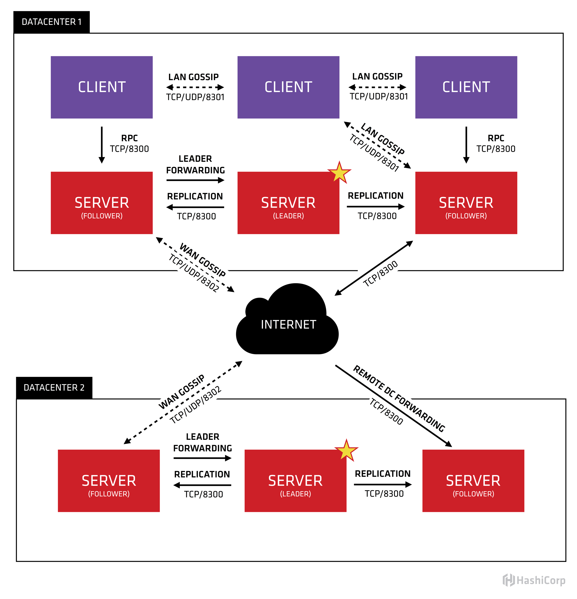
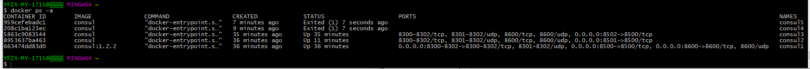
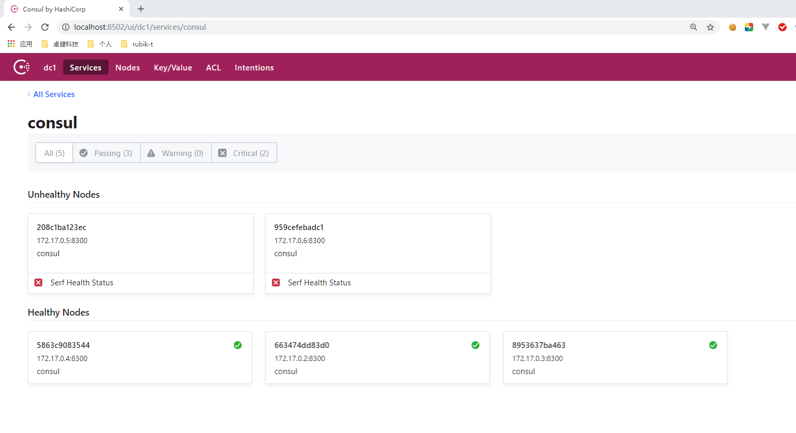
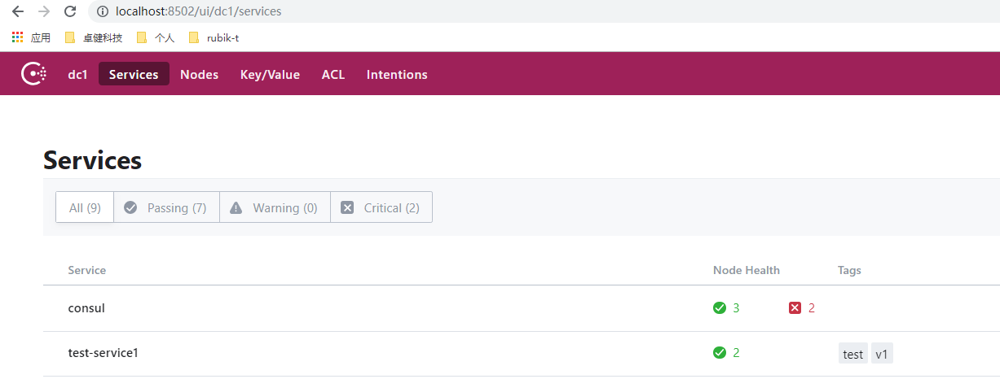
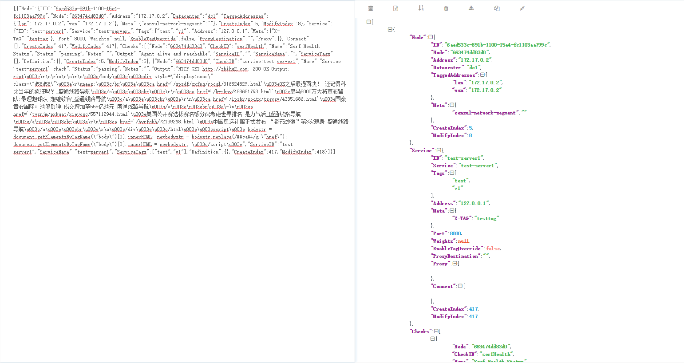

# docker上搭建consul集群全流程


 		[docker上搭建consul集群全流程](https://www.cnblogs.com/miaoying/p/10303067.html) 	

consul简介：

consul是提供服务发现、简单配置管理、分区部署的服务注册发现解决方案。
主要特性：服务发现\健康检查\基于Key-Value的配置\支持TLS安全通讯\支持多数据中心部署

consul的实例叫agent
agent有两种运行模式：server和client
每个数据中心至少要有一个server，一般推荐3-5个server（避免单点故障）
client模式agent是一个轻量级进程，执行健康检查，转发查询请求到server。
服务service是注册到consul的外部应用，比如spring web server

consul架构：



 

\1. 在docker上安装consul（默认安装最新版本）

```
docker pull consul
```

\2. 启动第一个consul服务：consul1

docker run --name consul1 -d -p 8500:8500 -p 8300:8300 -p 8301:8301 -p 8302:8302 -p 8600:8600 consul:1.2.2 agent -server -bootstrap-expect 2 -ui -bind=0.0.0.0 -client=0.0.0.0


```
docker run --name consul1 -d -p 8500:8500 -p 8300:8300 -p 8301:8301 -p 8302:8302 -p 8600:8600 consul:1.2.2 agent -server -bootstrap-expect 2 -ui -bind=0.0.0.0 -client=0.0.0.0
```


docker run -d --name consul server1 --net=host -e'CONSUL_LOCAL_CONFIG={"skip_leave_on_interrupt": true}' consul agent-server -bind=10.10.10.79 -bootstrap -expect=1  -client0.0.0.0 –ui


8500 http 端口，用于 http 接口和 web ui
8300 server rpc 端口，同一数据中心 consul server 之间通过该端口通信
8301 serf lan 端口，同一数据中心 consul client 通过该端口通信
8302 serf wan 端口，不同数据中心 consul server 通过该端口通信
8600 dns 端口，用于服务发现
-bbostrap-expect 2: 集群至少两台服务器，才能选举集群leader
-ui：运行 web 控制台
-bind： 监听网口，0.0.0.0 表示所有网口，如果不指定默认未127.0.0.1，则无法和容器通信
-client ： 限制某些网口可以访问

\3. 获取 consul server1 的 ip 地址

```
docker inspect --format '{{ .NetworkSettings.IPAddress }}' consul1
```

输出是：172.17.0.2

\4. 启动第二个consul服务：consul2， 并加入consul1（使用join命令）

```
docker run --name consul3 -d -p 8501:8500 consul agent -server -ui -bind=0.0.0.0 -client=0.0.0.0 -join 172.17.0.2
```

\5. 启动第三个consul服务：consul3，并加入consul1

```
docker run --name consul3 -d -p 8502:8500 consul agent -server -ui -bind=0.0.0.0 -client=0.0.0.0 -join 172.17.0.2
```

\6. 目前我启动了5个consul服务，然后stop掉了两个，详情如下图所示：



 

\7. 宿主机浏览器访问：http://localhost:8500 或者 http://localhost:8501 或者 http://localhost:8502

（由于我一开始启动了5个consul服务，然后stop掉了两个，所以我的控制台如下所示）



\8. 任意stop掉其中一个consul，只要剩余consul数目大于等于两个，宿主机就能正常访问对应的链接；

\9. 创建test.json文件，以脚本形式注册服务到consul：

test.json文件内容如下：

[](javascript:void(0);)

```
{
    "ID": "test-service1",
    "Name": "test-service1",
    "Tags": [
        "test",
        "v1"
    ],
    "Address": "127.0.0.1",
    "Port": 8000,
    "Meta": {
        "X-TAG": "testtag"
    },
    "EnableTagOverride": false,
    "Check": {
        "DeregisterCriticalServiceAfter": "90m",
        "HTTP": "http://zhihu.com",
        "Interval": "10s"
    }
}
```

[](javascript:void(0);)

通过 http 接口注册服务（端口可以是8500. 8501， 8502等能够正常访问consul的就行）：

```
curl -X PUT --data @test.json http://localhost:8500/v1/agent/service/register
```

控制台如下所示：



 

 \10. 宿主机浏览器访问以下链接可以看到所有通过健康检查的可用test-server1服务列表

（任意正常启动consul的端口皆可）：

```
http://localhost:8501/v1/health/service/test-server1?passing
```

 输出json格式的内容，如下所示：



其它应用程序可以通过这种方式轮询获取服务列表，这就是微服务能够动态知道其依赖微服务可用列表的原理。

\11. 解绑定：

```
curl -i -X PUT http://127.0.0.1:8501/v1/agent/service/deregister/test-server1
```

\12. 集群方式需要至少启动两个consul server，本机调试web应用时，为了方便可以用 -dev 参数方式仅启动一个consul server

```
docker run --name consul0 -d -p 8500:8500 -p 8300:8300 -p 8301:8301 -p 8302:8302 -p 8600:8600 consul:1.2.2 agent -dev -bind=0.0.0.0 -client=0.0.0.0
```

 


标签: [docker](https://www.cnblogs.com/miaoying/tag/docker/), [consul](https://www.cnblogs.com/miaoying/tag/consul/)