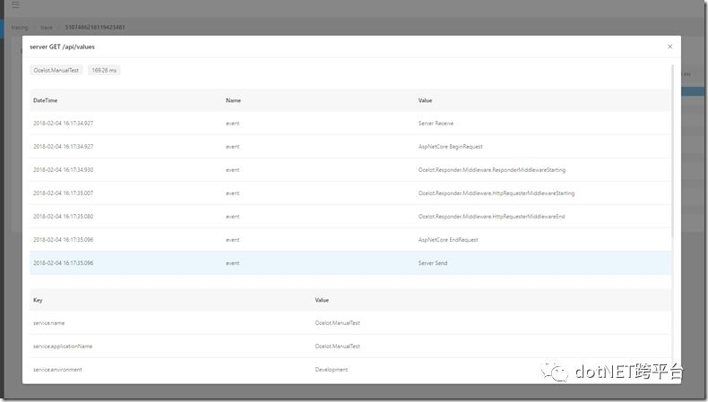
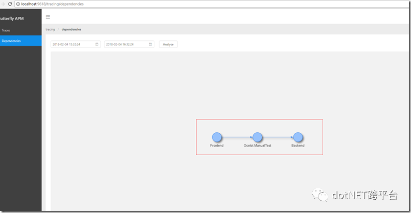

##                                                                             Ocelot 集成Butterfly 实现分布式跟踪                       

​                                                             原创：                                                                                                              张善友                                                                                                                                                      [                         dotNET跨平台                      ](javascript:void(0);)                                                                   *2018-02-05*                      

微服务，通常都是用复杂的、大规模分布式集群来实现的。微服务构建在不同的软件模块上，这些软件模块，有可能是由不同的团队开发、可能使用不同的编程语言来实现、有可能布在了几千台服务器，横跨多个不同的数据中心。因此，就需要一些可以帮助理解系统行为、用于分析性能问题的工具。

API网关Ocelot   作为微服务的一个重要组件，出现在系统边界上的一个面向API的、串行集中式的强管控服务，这里的边界是企业IT系统的边界，主要起到隔离外部访问与内部系统的作用。通过API网关对外发布的通常是OpenAPI,在它的后面有众多的分布式应用，如微服务、消息收发、分布式数据库、分布式缓存、分布式对象存储、跨域调用，这些组件共同构成了繁杂的分布式网络。

当应用A发出某个请求时，其背后可能有数十个甚至更多的服务被调用，可谓是“牵一发而动全身”。   如果将分布式系统比作高速公路网，每个前端的请求就相当于高速上行驶的车辆，而处理请求的应用就是高速上的收费站，在收费站上将车辆通行信息记录成日志，包括时间、车牌、站点、公路、价格等，如果将所有收费站上的日志整合在一起，便可以通过唯一的车牌号确定该车的完整通行记录；分布式调用系统跟踪和监控就是类比这种思想，对每一次请求进行跟踪，进而明确每个请求所经过的应用、耗时等信息。

Butterfly被设计为分布式追踪和APM的Server端，它将包含Collector，Storage，独立的Web  UI，并使用Open Tracing规范来设计追踪数据。目前仅根据规范实现了Open Tracing  API,后续还会兼容google的opencensus。这里顺便提下为什么我们不用zipkin  或是Jaeger，他们只做了tracing，Butterfly比他们多一点就是同时要做metrics和预警，就是要做立体化监控系统。目前Butterfly也是在起步阶段，还有非常多的功能需要开发，目前有两个事情的优先级比较高一个应用程序进程级别的metrics，一个是后端collector和es的性能优化，欢迎各位同学加入一起开发，我们相信通过不断的建设，我们.NET社区一样可以达到Java的高度。回想Ocelot   的发展历程，2016年才是到现在已经开发了2年时间，完成了3.0版本的开发，现在已经是一个日趋成熟的API网关，通过API网关连接后面的服务，像今天和大家分享的最近我业余时间在开发的分布式跟踪的支持，这项任务在一年前提出来，https://github.com/TomPallister/Ocelot/issues/19 这里有我们的讨论，现在集成Butterfly  来实现这个功能，让我们的微服务能够可运维。

Butterfly.Client.AspNetCore 为我们提供了在ASP.NET Core项目集成Butterfly的组件，使用很简单，只需要在`ConfigureServices` 注册Butterfly services

```
public void ConfigureServices(IServiceCollection services) {   //your other code 
  services.AddButterfly(option =>
  {
      option.CollectorUrl = "http://localhost:9618";
      option.Service = "my service";
  });
}
```

其中http://localhost:9618 是Butterfly的服务端，提供了UI，我们在浏览器通过http://localhost:9618 就可以访问到。

那么在API网关Ocelot 中集成Butterfly 有什么不一样呢？ 我们在Ocelot项目中加入上述代码后，我们已经可以在Butterfly UI上看到我们的追踪数据，只是数据没有连成一条链。那么我们做集成的工作主要就是以下2点：

一、将追踪数据串起来，让我们可以在Butterfly UI上直观的看到各个节点的数据

二、Ocelot 本身需要加入到系统跟踪的数据定义

Ocelot  集成Butterfly  实现分布式跟踪的代码目前还没有加入主干，可以在我的代码库的分支https://github.com/geffzhang/Ocelot/tree/Monitoring下看到，我们首先在Ocelot的路由配置中加入一个配置项，表示是否启用分布式追踪：

{
   "ReRoutes": [
     {
       "DownstreamPathTemplate": "/api/values",
       "DownstreamScheme": "http",
       "UpstreamPathTemplate": "/api/values",
       "UpstreamHttpMethod": [ "Get" ],
       "DownstreamHostAndPorts": [
         {
           "Host": "localhost",
           "Port": 5002
         }
       ],
       "HttpHandlerOptions": {
         "AllowAutoRedirect": true,
         "UseCookieContainer": true,
         "UseTracing": true
       }
     },

UseTracing 表示是否启用分布式追踪，默认为false，也就是不启用。 然后在Ocelot.DependencyInjection.IOcelotBuilder 加个接口方法：


方法的实现也非常简单：


主要就是加入Ocelot  本身需要加入到系统跟踪的数据定义，实现上主要使用DiagnosticSource，  官方的文档：https://github.com/dotnet/corefx/blob/master/src/System.Diagnostics.DiagnosticSource/src/DiagnosticSourceUsersGuide.md 。类似于asp.net  core 有个  Diagnostics中间件https://github.com/aspnet/Diagnostics，主要功能是用于报告和处理ASP.NET  Core中的异常和错误信息，以及诊断Entity Framework核心迁移错误。其中还有其他几项功能，欢迎页，错误代码页、如404  页等。以及一个还算不错的日志查看功能，这个功能也是很多人需要的功能，直接在线查看日志。


实现了Butterfly 的接口ITracingDiagnosticListener ，通过DI 注入后Butterfly 会帮我们注册好。

下面我们要把我们的分布式追踪数据串起来，OpenTracing（链接：opentracing.io）通过提供平台无关、厂商无关的API，使得开发人员能够方便的添加（或更换）追踪系统的实现。OpenTracing正在为全球的分布式追踪，提供统一的概念和数据标准。标准的中文版是我们的MVP吴晟翻译的，同时他也是OpenTracing的主要成员  ： https://wu-sheng.gitbooks.io/opentracing-io/content/。

在广义上，一个trace代表了一个事务或者流程在（分布式）系统中的执行过程。在OpenTracing标准中，trace是多个span组成的一个有向无环图（DAG），每一个span代表trace中被命名并计时的连续性的执行片段。


分布式追踪中的每个组件都包含自己的一个或者多个span。例如，在一个常规的RPC调用过程中，OpenTracing推荐在RPC的客户端和服务端，至少各有一个span，用于记录RPC调用的客户端和服务端信息。


一个父级的span会显示的并行或者串行启动多个子span。在OpenTracing标准中，甚至允许一个子span有个多父span（例如：并行写入的缓存，可能通过一次刷新操作写入动作）。

所以集成的关键点就在tracerId和spanId的关联关系的Id 处理上。

tracerid   代表是全局的id，类似于Ocelot的RequestId http://ocelot.readthedocs.io/en/latest/features/requestid.html，存放在http  header 里，它的key是ot-traceid，所以在Ocelot里面可以把全局的RequestId设置为ot-traceid 。



同时还需要处理spanid，使得下游的的组件的spanid是它上一级的spanid，也是存放在http  header 里，它的key是ot-spanId，我们在OcelotRequestTracer  以及OcelotHttpTracingHandler 需要处理spanid


上面我们说完了代码集成工作，我们来看看效果吧,我搭了一个Demo环境，服务前端—>Ocelot   –>服务后端。Butterfly为每个请求生成全局唯一的ID（Traceld），通过它将不同系统的“孤立的”调用信息关联在一起，还原出更多有价值的数据。



上图是一条API调用请求的调用链，在Span列可以看到请求中间过程所经过的一系列应用组件，可以看到最先经过请求端的HttpClient组件，后续调用Ocelot、HttpClient、backend等，形成调用树（树上的缩进表示嵌套关系），从调用树上很容易看到前端请求的完整处理过程。在上图所示的页面中也清晰地展示了每块应用处理请求得具体耗时，非常直观地进行定位；此外，点击具体的组件，可以看到这个组件中的日志记录


对于分布式调用跟踪系统而言，它并不仅仅提供了调用链这一功能，因为它对所有中间件的调用做埋点，所以中间件上的所有情况都可以监控的到。因此，在形成调用链的过程中也会形成一份详细的调用监控报表，它与其他监控的不同之处在于：该监控报表是带有上下钻取功能的报表。因为调用链是详细的底层统计，对上可以形成的报表维度是非常丰富的，在上图所示的调用报表里，不仅可以看到服务的情况，还可以下钻到它所调用服务的情况；另外从监控报表上还可以进行调用链的下钻，查看清晰的调用链信息。目前Butterfly这块功能也是需要继续开发的功能，欢迎各位同学一起加入开发。

还有链路分析，链路与调用链不同，链路是一个统计学的概念，而调用链是单体调用的过程。分析链路的拓扑形态分析：分析来源、去向，识别不合理来源；


上图是全局调用拓扑图，可以明显的看到不同的服务之间存在复杂的调用关系，也可以查看某个服务和其他服务之间的调用关系以及调用的频次； 通过该拓扑图，架构师可以清楚地观察到系统上的调用情况。

相关文章：

- [Ocelot——初识基于.Net Core的API网关](http://mp.weixin.qq.com/s?__biz=MzAwNTMxMzg1MA==&mid=2654069593&idx=1&sn=33b72a625951a2f8c7efee5c07b4cd3b&chksm=80dbc70cb7ac4e1a2fff82caf738702ceab0a3fc860a1e8d7e39e013c937fe5110ba31ee5c81&scene=21#wechat_redirect)
- [Ocelot API网关的实现剖析](http://mp.weixin.qq.com/s?__biz=MzAwNTMxMzg1MA==&mid=2654069421&idx=1&sn=83a964970183233b0c5051194ebe6c50&chksm=80dbc6f8b7ac4feefd167fefb50cf55126cabf59090d0f99852ca1c928abf0e53d603c0a73c6&scene=21#wechat_redirect)
- [微服务网关Ocelot](http://mp.weixin.qq.com/s?__biz=MzAwNTMxMzg1MA==&mid=2654068615&idx=1&sn=a404d45c1ed5edf235b8526215989167&chksm=80dbfbd2b7ac72c4c9df92fc97847c2299a4f917c6a1dfca161251b384d6c8393bb34b74c614&scene=21#wechat_redirect)
- [API网关Ocelot 使用Polly 处理部分失败问题](http://mp.weixin.qq.com/s?__biz=MzAwNTMxMzg1MA==&mid=2654068453&idx=1&sn=ef3a131f9b22e898f392c3c2bd37b1b2&chksm=80dbfab0b7ac73a6f3fbb329e016980228f8add2f8e2e44b087144f5815c4d9980ee24bf1fdc&scene=21#wechat_redirect)
- [谈谈微服务中的 API 网关（API Gateway）](http://mp.weixin.qq.com/s?__biz=MzAwNTMxMzg1MA==&mid=2654069619&idx=2&sn=6230cfc1e26e02c7f9cce30e90bbc910&chksm=80dbc726b7ac4e3013bbfb1b11c0e6829cc99335e790fd43519a725b192edd378bb0319d6964&scene=21#wechat_redirect)
- [Ocelot网关](http://mp.weixin.qq.com/s?__biz=MzAwNTMxMzg1MA==&mid=2654069624&idx=2&sn=560bddad7afa1e65e4a437b7a69ba2ca&chksm=80dbc72db7ac4e3b9efb82bf473089091e26028a736b4fbb0608d9797752a02fb256041d8d86&scene=21#wechat_redirect)
- [Ocelot统一权限验证](http://mp.weixin.qq.com/s?__biz=MzAwNTMxMzg1MA==&mid=2654069629&idx=1&sn=e968e3c7352bc2b54cfe0d14cc62a5a0&chksm=80dbc728b7ac4e3e8a33b90b8724e38328ac15f1240f08753b73b9a79916f399b314ac6f04ec&scene=21#wechat_redirect)
- [应用监控怎么做？](http://mp.weixin.qq.com/s?__biz=MzAwNTMxMzg1MA==&mid=2654069367&idx=4&sn=c5270d7edf1ab6f6c91ddb1549cc52dc&chksm=80dbc622b7ac4f34afdad584f7db49faf515adc958e964dd654f1c9c49dd3e66cce883b1d76a&scene=21#wechat_redirect)
- [ASP.NET Core之跨平台的实时性能监控](http://mp.weixin.qq.com/s?__biz=MzAwNTMxMzg1MA==&mid=2654068857&idx=2&sn=b9c17fb12bb1f0cd638515c018453e8d&chksm=80dbc42cb7ac4d3a6cc5bc412bc9c5868657fde88e95a72203b2c8796556c98fa22db13c8793&scene=21#wechat_redirect)
- [.Net Core 2.0+ InfluxDB+Grafana+App Metrics 实现跨平台的实时性能监控](http://mp.weixin.qq.com/s?__biz=MzAwNTMxMzg1MA==&mid=2654069598&idx=1&sn=9ad93c53cf610293328cb3941383cdd1&chksm=80dbc70bb7ac4e1d3ef2f106a4c8ff819f7e1a8f11efa55274544d4a459927d6b6fe13b63d26&scene=21#wechat_redirect)
- [应用程序的8个关键性能指标以及测量方法](http://mp.weixin.qq.com/s?__biz=MzAwNTMxMzg1MA==&mid=2654068857&idx=1&sn=bd663e8235fe44d3633578240ac7acb0&chksm=80dbc42cb7ac4d3a9bc9dca386efaa10da33ebe54feb3f53efe0c7270323ffaeb44be1971193&scene=21#wechat_redirect)
- [使用Metrics监控应用程序的性能](http://mp.weixin.qq.com/s?__biz=MzAwNTMxMzg1MA==&mid=207734854&idx=1&sn=45db16e84938b847c00e8d2497d732ce&scene=21#wechat_redirect)
- [下一个计划 : .NET/.NET Core应用性能管理](http://mp.weixin.qq.com/s?__biz=MzAwNTMxMzg1MA==&mid=2654069547&idx=1&sn=f4db57b60c884091b95cadbbb20104f4&chksm=80dbc77eb7ac4e6898ecddd91df18ca810159190374c01d1e13c04f909a3be12f8d7979ea48f&scene=21#wechat_redirect)
- [Ocelot监控](http://mp.weixin.qq.com/s?__biz=MzAwNTMxMzg1MA==&mid=2654069634&idx=1&sn=ea937385cff97e72bc84becc30a03f81&chksm=80dbc7d7b7ac4ec1fb382e2117990446fffcbf88f10d92512ed94340092cb9ec65fb241d4a96&scene=21#wechat_redirect)