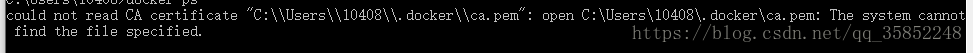
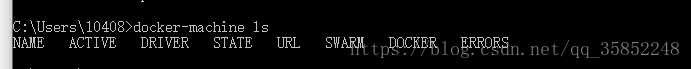
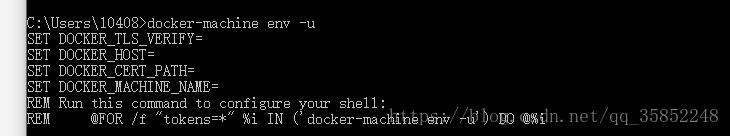
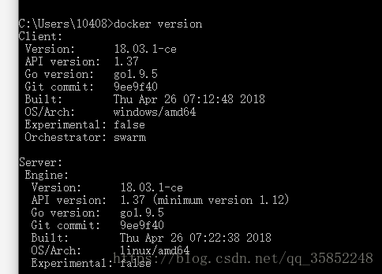

# docker for windows  could not read CA certificate

​       2018年07月05日 12:39:58     

​      [初上路的小码农](https://me.csdn.net/qq_35852248)           阅读数 3800                   

​                   

背景：


​    之前安装过 docker toolbox  和docker for windows


因为是新手小白，不懂。win10上安装docker for windows 需要开启虚拟化，而toolbox是自带的虚拟盒子，不需要开始虚拟化。以为两个可以同时使用，（刚好，同事误导我说 是不是因为安装顺序）所以全部卸载掉重新安装了。。。然后，问题就来了！


​    只安装docker for windows ，还是原来的安装包，同样的配方，不同的结果，愁死我了。


​    安装成功-->cmd --> docker version





不管是 docker ps  还是 其他的都是这样。CA证书找不到。


找了很多资料，，很多说的不一样。还是在github上找到的，都是英文的看着吃力，


[这里](https://github.com/docker/toolbox/issues/537)，，，[还有这里（这是mac的）](https://forums.docker.com/t/initial-install-of-docker-for-mac-could-not-read-ca-certificate/9170) 都可以找到解决办法


在windows上我是这样做的：


1，先删掉所有docker 的环境变量，好像是有四个，


2，看下 docker-machine ls  是否有default 或者其他 存在。。有则删除  docker-machine rm default


3，


全部删除掉，docker-machine env -u





4，复制最后面那个  

```html
 @FOR /f "tokens=*" %i IN ('docker-machine env -u') DO @%i
```

什么都看不到，，但是docker可以完美运行了。。。。





参考网上资料。。。

作下记录