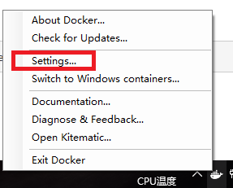
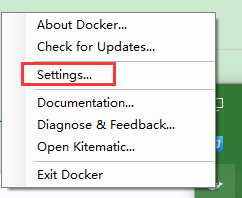
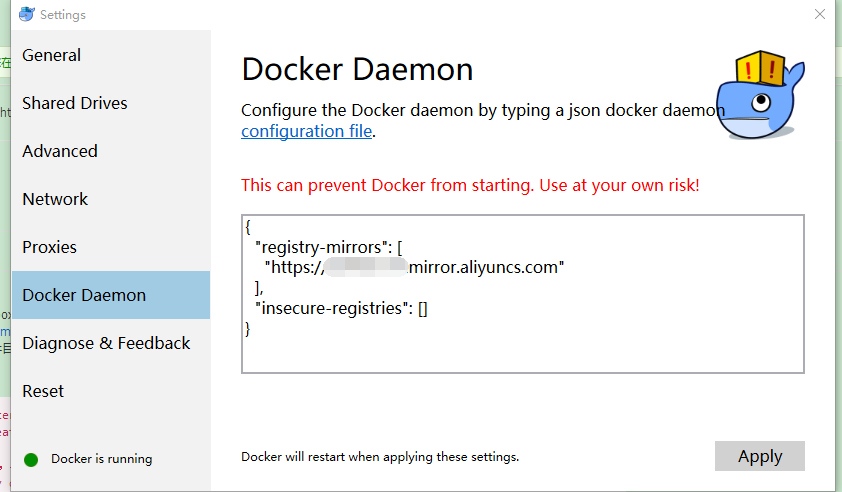

# [Docker使用阿里云docker镜像加速](https://www.cnblogs.com/zhxshseu/p/5970a5a763c8fe2b01cd2eb63a8622b2.html) 		 

https://www.cnblogs.com/atliwen/p/6102414.html

>  [Docker for  windows10 配置阿里云镜像](https://www.cnblogs.com/atliwen/p/6102414.html)
>
> https://www.cnblogs.com/atliwen/p/6102414.html

首先进入阿里云docker库首页 

https://dev.aliyun.com/

　　

到　https://cr.console.aliyun.com/   注册一个账户

　　列表中就有 加速器 

点击 

管理中心

点击 **加速器**

复制下面的加速地址

进入docker的 Settings

把basic 切换成 advanced，并在 registry-mirrors: 中填入刚刚复制的加速地址

应用后即可

　　启动  Docker 端  右键  选择配置

　　

　　在Docker Daemon 中填入 获取到的  加速器地址

　　

　　

　　linux 安装 Docker 配置阿里云镜像的 教材很多   可以百度   也是设置配置文件中   registry-mirrors 的值

 

　　关于 docker-machine  虚拟机  配置加速器的问题 

　　　　在镜像文件 config.json  文件中   RegistryMirror 节点 设置 加速器地址  

　　　　有时候不管用 

　　　　

　　　　docker-machine ssh default
　　　　sudo sed -i "s|EXTRA_ARGS='|EXTRA_ARGS='--registry-mirror=加速地址 |g" /var/lib/boot2docker/profile
　　　　exit
　　　　docker-machine restart default

---

---

##                                                 docker使用阿里云镜像仓库

​                                                                                              

看987432.cn

2019-03-26 10:42:18

浏览2732

- ​                             [云栖社区](https://yq.aliyun.com/tags/type_blog-tagid_1/)                         
- ​                             [docker](https://yq.aliyun.com/tags/type_blog-tagid_72/)                         
- ​                             [镜像](https://yq.aliyun.com/tags/type_blog-tagid_713/)                         
- ​                             [centos](https://yq.aliyun.com/tags/type_blog-tagid_1061/)                         
- ​                             [Registry](https://yq.aliyun.com/tags/type_blog-tagid_1861/)                         
- ​                             [Commit](https://yq.aliyun.com/tags/type_blog-tagid_2292/)                         
- ​                             [Bash](https://yq.aliyun.com/tags/type_blog-tagid_2850/)                         
- ​                             [阿里云镜像仓库](https://yq.aliyun.com/tags/type_blog-tagid_39168/)                         

1：阿里云docker仓库 [https://dev.aliyun.com/search.html](https://yq.aliyun.com/go/articleRenderRedirect?url=https://dev.aliyun.com/search.html)

2：进去注册帐号后，点击自己的管理中心。

3：在管理中心点击加速器，右边面板会有你的加速地址，右边面板下面有详细设置步骤。 
以下代码用于检测你有没有开启加速器
sudo  ps -ef | grep 
root     17825     1  0 16:50 ?        00:00:11 /usr/bin/dockerd --registry-mirror=[https://no1pfk8z.mirror.aliyuncs.com](https://yq.aliyun.com/go/articleRenderRedirect?url=https://no1pfk8z.mirror.aliyuncs.com) --registry-mirror=[https://no1pfk8z.mirror.aliyuncs.com](https://yq.aliyun.com/go/articleRenderRedirect?url=https://no1pfk8z.mirror.aliyuncs.com) --registry-mirror=[https://n42ocvxt.mirror.aliyuncs.com](https://yq.aliyun.com/go/articleRenderRedirect?url=https://n42ocvxt.mirror.aliyuncs.com) --raw-logs
1
2
有如上的信息输出代表你已经成功了

4：使用commit构建镜像，执行命令
docker pull centos:latest
 sudo docker run -it -p 80 --name willian centos /bin/bash
1
2
在bash安装所需要的运行的环境
sudo docker commit -a 'ss' willian willian/java8
1
将镜像提交到本地仓库

sudo docker images
1
这时可以看到你自己的镜像

$ sudo docker login --username=willian19960118 registry.cn-hangzhou.aliyuncs.com
1
2
给阿里云仓库打tag

$ sudo docker tag [ImageId] registry.cn-hangzhou.aliyuncs.com/willianevils/zhangweilun:[镜像版本号]
1
2
push

$ sudo docker push registry.cn-hangzhou.aliyuncs.com/willianevils/zhangweilun:[

​                             版权声明：本文内容由互联网用户自发贡献，版权归作者所有，本社区不拥有所有权，也不承担相关法律责任。如果您发现本社区中有涉嫌抄袭的内容，欢迎发送邮件至：[yqgroup@service.aliyun.com](mailto:yqgroup@service.aliyun.com)                             进行举报，并提供相关证据，一经查实，本社区将立刻删除涉嫌侵权内容。                         

 