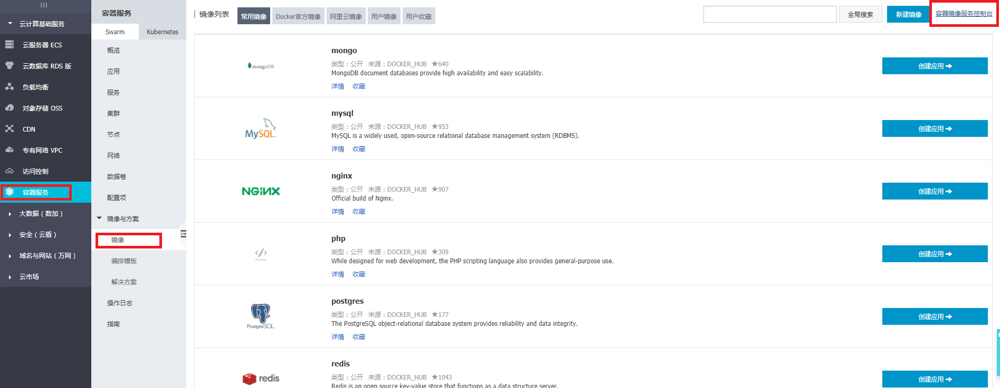
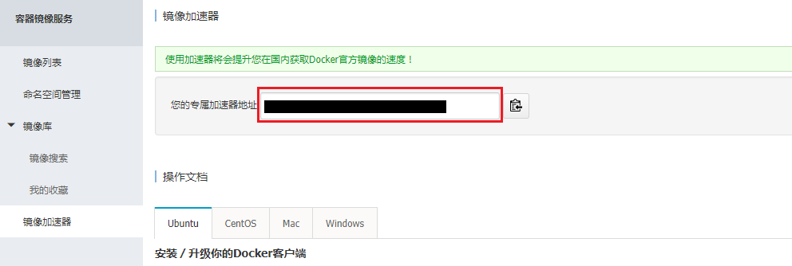

#  	[Windows 环境下 Docker 使用及配置](https://www.cnblogs.com/moashen/p/8067612.html)


## 我们可以使用以下两种方式在Windows环境下使用docker：

### 1. 直接安装：

```
Docker支持直接安装并运行在windows环境下，但对Windows的版本和xu虚拟化服务等有着一定的要求。
而hyper-v服务会对VM等虚拟机的正常服务造成影响，因此不建议此种方法（血泪教训）。
```

### 2. 使用Docker Toolbox：

```
除了可以避免方法1出现的问题外，还可以支持集群环境的搭建。
```

### 方法1安装过程较为简单，但要注意Hyper-V的支持是否开启，过程中可能会重启下面。下文主要对方法2做一些说明。

1. 因为Docker Toolbox是存放在Docker公司网站上，国内的用户下载非常慢，所以从阿里云提供的国内开源镜像站点上下载：
    <https://mirrors.aliyun.com/docker-toolbox/windows/docker-toolbox/>

2. 安装过程会安装VirtualBox虚拟机、Kitematic及Git。安装完成Toolbox后会有一个Docker Quickstart   Terminal的快捷方式，双击运行如果报错，注意是否已经需要关闭Hyper-V服务，使用Hyper-V时VirtualBox无法用64位的虚拟机。运行Docker  Quickstart  Terminal会在Virtualbox中创建一个叫做default的虚拟机，等待命令完成Docker虚拟机配置（运行至waiting for  an IP的命令时，可能会有点慢，耐心等待即可）。运行完成时，就可以在PowerShell中使用docker命令了。

3. 使用过程中Docker Toolbox与直装版不同的几点： (1) Docker Toolbox运行容器内的服务后默认使用default虚拟机所分到的ip， 而直装版使用的是本机ip。 (2) Docker Toolbox使用挂载命令时，将Windows的目录挂载到default虚拟机，然后使用 ssh 登录到 docker 宿主机，
    `$ docker-machine ssh default`
    然后再虚拟机中运行相关容器；直装版再获取相关目录挂载权限后即可挂载。

4. 镜像加速:
    在国内使用Docker Hub的话就特别慢，为此，我们可以给Docker配置国内的加速地址，以阿里云的镜像加速为例。到阿里云申请容器服务，开通后按下图位置找到加速服务的地址。
    _ _ _  **  _ _ _
    

   然后到PowerShell中去依次执行：
    `$ docker-machine ssh default       $ sudo sed -i  "s|EXTRA_ARGS='|EXTRA_ARGS='--registry-mirror={加速地址} |g"  /var/lib/boot2docker/profile       $ exit       $ docker-machine restart  default`
    现在我们就可以畅快的在Windows环境下使用docker啦。