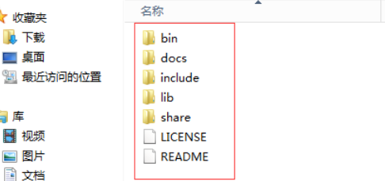
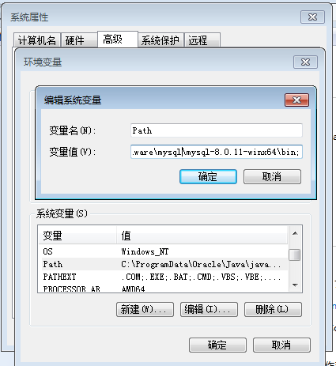
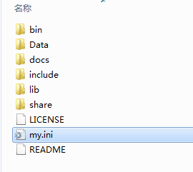
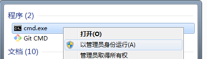
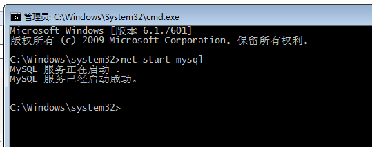
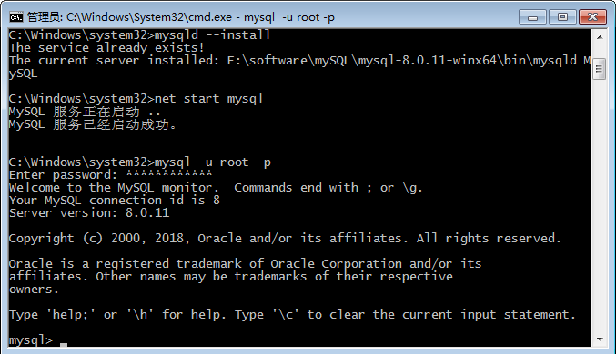

# [MySQL-mysql 8.0.11安装教程](https://www.cnblogs.com/laumians-notes/p/9069498.html)


网上的教程有很多，基本上大同小异。但是安装软件有时就可能因为一个细节安装失败。我也是综合了很多个教程才安装好的，所以本教程可能也不是普遍适合的。

安装环境：win7

1、下载zip安装包：

MySQL8.0 For Windows zip包下载地址：https://dev.mysql.com/downloads/file/?id=476233，进入页面后可以不登录。后点击底部“No thanks, just start my download.”即可开始下载。

2、安装

2.1 解压zip包到安装目录

我的解压在了E:\software\mysql\mysql-8.0.11-winx64

解压后的文件目录

2.2 配置环境变量



　　　　将解压文件夹下的bin路径添加到变量值中，前后以 ; 开头结尾

2.3 配置初始化的my.ini文件

 　　　　我们发现解压后的目录并没有my.ini文件，没关系可以自行创建。在安装根目录下添加 my.ini（新建文本文件，将文件类型改为.ini），写入基本配置：

[](javascript:void(0);)

```
[mysqld]
# 设置3306端口
port=3306
# 设置mysql的安装目录
basedir=E:\\software\\mysql\\mysql-8.0.11-winx64   # 切记此处一定要用双斜杠\\，单斜杠我这里会出错，不过看别人的教程，有的是单斜杠。自己尝试吧
# 设置mysql数据库的数据的存放目录
datadir=E:\\software\\mysql\\mysql-8.0.11-winx64\\Data   # 此处同上
# 允许最大连接数
max_connections=200
# 允许连接失败的次数。这是为了防止有人从该主机试图攻击数据库系统
max_connect_errors=10
# 服务端使用的字符集默认为UTF8
character-set-server=utf8
# 创建新表时将使用的默认存储引擎
default-storage-engine=INNODB
# 默认使用“mysql_native_password”插件认证
default_authentication_plugin=mysql_native_password
[mysql]
# 设置mysql客户端默认字符集
default-character-set=utf8
[client]
# 设置mysql客户端连接服务端时默认使用的端口
port=3306
default-character-set=utf8
```

[](javascript:void(0);)



注意：其中的data目录不需要创建，下一步初始化工作中会自动创建。

3、安装mysql

在安装时，必须以管理员身份运行cmd，否则在安装时会报错，会导致安装失败的情况



　　　　3.1 初始化数据库

在MySQL安装目录的 bin 目录下执行命令：

**mysqld --initialize --console**

执行完成后，会打印 root 用户的初始默认密码，比如：

[](javascript:void(0);)


```
C:\Users\Administrator>cd C:\Program Files\MySQL\bin

C:\Program Files\MySQL\bin>mysqld --initialize --console
2018-04-28T15:57:17.087519Z 0 [System] [MY-013169] [Server] C:\Program Files\MySQL\bin\mysqld.exe (mysqld 8.0.11) initializing of server in progress as process 4984
2018-04-28T15:57:24.859249Z 5 [Note] [MY-010454] [Server] A temporary password is generated for root@localhost: rI5rvf5x5G,E
2018-04-28T15:57:27.106660Z 0 [System] [MY-013170] [Server] C:\Program Files\MySQL\bin\mysqld.exe (mysqld 8.0.11) initializing of server has completed

C:\Program Files\MySQL\bin>
```


[](javascript:void(0);)

　　注意！执行输出结果里面有一段： [Note] [MY-010454] [Server] A temporary password is  generated for root@localhost:  rI5rvf5x5G,E 其中root@localhost:后面的“rI5rvf5x5G,E”就是初始密码（不含首位空格）。在没有更改密码前，需要记住这个密码，后续登录需要用到。

　　要是你手贱，关快了，或者没记住，那也没事，删掉初始化的 datadir 目录，再执行一遍初始化命令，又会重新生成的。当然，也可以使用安全工具，强制改密码，用什么方法，自己随意。

参考：https://dev.mysql.com/doc/refman/8.0/en/data-directory-initialization-mysqld.html

　　　　3.2 安装服务

在MySQL安装目录的 bin 目录下执行命令：

**mysqld --install [服务名]**

后面的服务名可以不写，默认的名字为 mysql。当然，如果你的电脑上需要安装多个MySQL服务，就可以用不同的名字区分了，比如 mysql5 和 mysql8。

安装完成之后，就可以通过命令**net start mysql**启动MySQL的服务了。通过命令**net stop mysql**停止服务。通过命令`**sc delete MySQL/mysqld -remove**卸载 MySQL 服务`



 4、更改密码

在MySQL安装目录的 bin 目录下执行命令：

**mysql -u root -p**
　　这时候会提示输入密码，记住了上面第3.1步安装时的密码，填入即可登录成功，进入MySQL命令模式。



在MySQL中执行命令：

**ALTER USER 'root'@'localhost' IDENTIFIED WITH mysql_native_password BY '新密码';**  

修改密码，注意命令尾的；一定要有，这是mysql的语法

 

 

 

 

到此，安装部署就完成了。官方说测试速度MySQL8比5快两倍。

 

 

 

　　可以用 命令查看一下默认安装的数据库：

 

show databases;

 

use mysql;

 

show tables;

 

[](javascript:void(0);)


```
mysql> show databases;
+--------------------+
| Database           |
+--------------------+
| information_schema |
| mysql              |
| performance_schema |
| sys                |
+--------------------+
4 rows in set (0.01 sec)

mysql>
```


[](javascript:void(0);)

 

 

 

看到默认初始化了mysql数据库，其中user表里面存储MySQL用户信息。我们可以看一下默认MySQL用户：

 

 select user,host,authentication_string from mysql.user;

 

[](javascript:void(0);)


```
mysql> select user,host,authentication_string from mysql.user;
+------------------+-----------+-------------------------------------------+
| user             | host      | authentication_string                     |
+------------------+-----------+-------------------------------------------+
| mysql.infoschema | localhost | *THISISNOTAVALIDPASSWORDTHATCANBEUSEDHERE |
| mysql.session    | localhost | *THISISNOTAVALIDPASSWORDTHATCANBEUSEDHERE |
| mysql.sys        | localhost | *THISISNOTAVALIDPASSWORDTHATCANBEUSEDHERE |
| root             | localhost | *27C237A977F4F44D3F551F1A673BE14DFD232961 |
+------------------+-----------+-------------------------------------------+
4 rows in set (0.00 sec)

mysql>
```


[](javascript:void(0);)

 

 

 

管理员root的host是localhost，代表仅限localhost登录访问。如果要允许开放其他ip登录，则需要添加新的host。如果要允许所有ip访问，可以直接修改成“**%**”

 

创建用户：

 

**CREATE USER 'xxh'@'%' IDENTIFIED WITH mysql_native_password BY 'xxh123!@#';**

 

\#(需要注意：mysql8.0加密方式修改了)
\#检查用户

 

**select user, host, plugin, authentication_string from user\G;**

 

授权远程数据库

 

\#授权所有权限 
**GRANT ALL PRIVILEGES ON \*.\* TO 'xxh'@'%'；**
\#授权基本的查询修改权限，按需求设置
**GRANT SELECT,INSERT,UPDATE,DELETE,CREATE,DROP,ALTER ON \*.\* TO 'xxh'@'%';**

 

查看用户权限
**show grants for 'xxh'@'%';**

 

 

 

示例：

 

 

 

[](javascript:void(0);)


```
mysql> use mysql;
Database changed
mysql> CREATE USER 'xxh'@'%' IDENTIFIED WITH mysql_native_password BY 'xxh123!@#'; #创建用户(注意：mysql8.0加密方式修改了)
Query OK, 0 rows affected (0.07 sec)
mysql> 
```


[](javascript:void(0);)

 

 

 

查看密码加密方式：

 

 

 

[](javascript:void(0);)


```
mysql> select user, host, plugin, authentication_string from user;
+------------------+-----------+-----------------------+-------------------------------------------+
| user             | host      | plugin                | authentication_string                     |
+------------------+-----------+-----------------------+-------------------------------------------+
| xxh              | %         | mysql_native_password | *70FD6FB4F675E08FF785A754755B5EBA6DA62851 |
| mysql.infoschema | localhost | mysql_native_password | *THISISNOTAVALIDPASSWORDTHATCANBEUSEDHERE |
| mysql.session    | localhost | mysql_native_password | *THISISNOTAVALIDPASSWORDTHATCANBEUSEDHERE |
| mysql.sys        | localhost | mysql_native_password | *THISISNOTAVALIDPASSWORDTHATCANBEUSEDHERE |
| root             | localhost | mysql_native_password | *27C237A977F4F44D3F551F1A673BE14DFD232961 |
+------------------+-----------+-----------------------+-------------------------------------------+
5 rows in set (0.00 sec)

mysql>
```


[](javascript:void(0);)

 

 

 

　　另外，如果需要新增账户，或者本机以外的其他人访问MySQL则还需要设置内置账户的host，具体可以参考：[MySQL创建用户与授权](https://www.cnblogs.com/sos-blue/p/6852945.html)

 

**参考自：http://www.cnblogs.com/xiongzaiqiren/p/8970203.html**


标签: [MySQL](https://www.cnblogs.com/laumians-notes/tag/MySQL/)