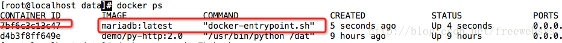

# docker（6）：使用dokcer 构建 mariadb 数据库

2016年12月09日 17:37:41

freewebsys

阅读数 8097

更多

​                 个人分类：                                   [docker                                  ](https://blog.csdn.net/freewebsys/article/category/3103827)               

​                   

​                                           版权声明：本文为博主原创文章，未经博主允许不得转载。博主地址：http://blog.csdn.net/freewebsys                     https://blog.csdn.net/freewebsys/article/details/53540615                 

本文的原文连接是:    <http://blog.csdn.net/freewebsys/article/details/53540615>   未经博主允许不得转载。  
 博主地址是：<http://blog.csdn.net/freewebsys>

# 1，关于mariadb

------

其实就是mysql的另外一个开源项目。不想被oracle控制的开源版本。 
 这里有个方便的做法，使用docker的官方的镜像。 
 自己弄镜像还需要安装，编译配置啥的。 
 这个特别的省事。只要下载安装就可以了。 
 项目地址： 
 [/mariadb/”>https://hub.docker.com/r//mariadb/](https://blog.csdn.net/freewebsys/article/details/"https://hub.docker.com/r/

# 2，下载使用

------

首先下载本地镜像，然后启动就行了。 
 1），参考文档 
 如果系统开启了SELinux 需要设置文件夹权限，否则mariadb启动不了。

```
mkdir -p /data/mysql/data
chcon -Rt svirt_sandbox_file_t /data/mysql/data
docker run -v /data/mysql/data:/var/lib/mysql -p 3306:3306 -e MYSQL_ROOT_PASSWORD=root --name mariadb -d mariadb:latest123
```

MYSQL_ROOT_PASSWORD 是设置root的密码。 
 然后使用docker ps查看： 
  
 启动成功，并且绑定了端口 3306 可以使用mysql了。

```
docker exec -it mariadb bash
root@XXXX:/# mysql -uroot -proot12
```

可以使用mysql了。

```
Welcome to the MariaDB monitor.  Commands end with ; or \g.
Your MariaDB connection id is 3
Server version: 10.1.19-MariaDB-1~jessie mariadb.org binary distribution

Copyright (c) 2000, 2016, Oracle, MariaDB Corporation Ab and others.

Type 'help;' or '\h' for help. Type '\c' to clear the current input statement.

MariaDB [(none)]> show databases;
+--------------------+
| Database           |
+--------------------+
| information_schema |
| mysql              |
| performance_schema |
+--------------------+
3 rows in set (0.00 sec)

MariaDB [(none)]> 12345678910111213141516171819
```

# 3，总结

------

本文的原文连接是:    <http://blog.csdn.net/freewebsys/article/details/53540615>   未经博主允许不得转载。  
 博主地址是：<http://blog.csdn.net/freewebsys>

使用一个最简单的办法安装了mariadb。并且将数据放到了，宿主的/data/mysql/data 目录下面了。 
 方便数据备份。数据迁移，同时暴露了3306端口对外。 
 使用docker还是非常的方便的，比起yum安装配置简单多了。 
 配置文件也可以通过目录映射的方式修改。 
 而且完全的拆分了服务，存储，接口。真的是一个集装箱了。