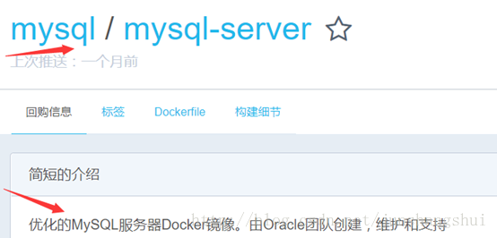

# 在Win版的Docker里安装mysql

​                                                   2018年03月03日 20:04:56           [junshangshui](https://me.csdn.net/junshangshui)           阅读数 2702                   

​                   

***一、下载mysql镜像***

打开官网https://hub.docker.com

搜索mysql，可下载这个mysql/mysql-server优化的镜像。

打开PowerShell，输入命令来下载指定版的mysql镜像。

docker pull mysql/mysql-server:5.7.21

也可用“docker pull mysql/mysql-server”命令来下载最新版本

***二、运行镜像的实例***

下载完镜像后，输入命令来运行镜像的实例。（同时设置了全局字符集为utf8mb4）

docker  run --name mysql01 -d -p 3306:3306 mysql/mysql-server:5.7.21  --character-set-server=utf8mb4 --collation-server=utf8mb4_general_ci

运行完成后输入docker ps命令来查看正在运行中的容器实例。当看到Status为healthy时表示已启动完毕。

***三、修改root账号的默认密码***

使用docker logs mysql01命令来查看此容器的日志。可以看到mysql01实例的root账号的默认密码是一串随机的字符串。

输入docker exec -it mysql01 bash命令进入容器

然后使用root账号和默认密码登录mysql01数据库实例。输入命令mysql –uroot -p

(先复制到记事本再复制一次，然后输入密码时只需点一下右键就OK了)

接着输入命令来修改root的密码（注意命令以英文的分号结束）

ALTER USER 'root'@'localhost' IDENTIFIED BY 'abc123456';

修改密码成功后，输入exit;命令退出mysql，再次输入exit;退出容器，回到windows。

***四、创建一个新的登录用户***
打开官网https://dev.mysql.com/doc 在搜索框输入user，再找到一个create user的文章。
我找的文章地址为https://dev.mysql.com/doc/refman/5.7/en/create-user.html
根据此文章的说明来创建新的登录用户。
应该接着第三步，不exit;退出
例如：CREATE  USER 'abc'@'%' IDENTIFIED BY 'abc123456' require none;  这个命令将创建一个名称为abc密码为abc123456的账号，其中的百分号表示此账号可通过外部登录到mysql，如果把百分号改为localhost则表示只能在本机登录mysql。“require  none”可以不写，默认就是它。有require X509, require SLL等 ，在官网文章中有详细说明。

这里我使用命令CREATE  USER 'abc'@'%' IDENTIFIED BY 'abc123456' require none;来创建一个用户。然后输入命令use  mysql;（类似sqlserver中的use master）切换到mysql系统库。

然后输入命令select user,host from user;来查看所有账号的情况。

创建完账户后需要设置它的权限
我找的官网文章地址是https://dev.mysql.com/doc/refman/5.7/en/adding-users.html

输入命令GRANT ALL PRIVILEGES ON *.* TO 'abc'@'%' WITH GRANT OPTION; 完成权限设置。

权限设置好后用桌面工具NavicatForMySql来连接docker中的mysql01。如下图

