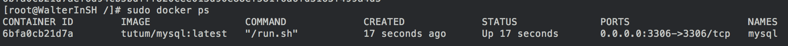
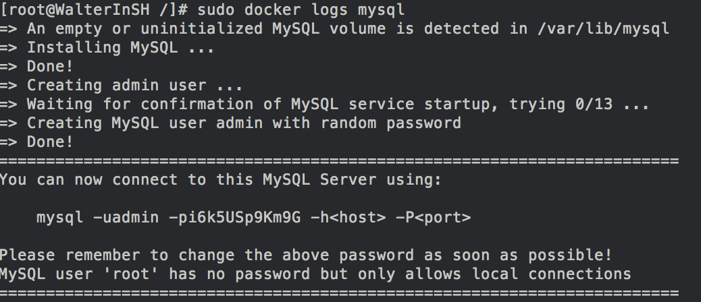

**原文链接：http://walterinsh.github.io/2015/01/17/use-mysql-with-docker.html**

 

本文简述如何使用Docker部署mysql,同时持久化数据.我们会用到[tutum-docker-mysql](https://github.com/tutumcloud/tutum-docker-mysql) 这个项目来搭建一个mysql,省去重头写Dockerfile的时间.

首先我们将tutum-docker-mysql跑起来.

```bash
docker run -d -p 3306:3306 --name mysql tutum/mysql
```

如果你本地没有tutum/mysql的image,docker会先下载它的image,这一步可能会用些时间.待执行完毕我们检查一下应该会有如下样子



tutum-docker-mysql会自动帮我们建一个随机的密码供我们访问,通过日志可以查看到.



我们通过日志上的密码登陆mysql

```bash
mysql -uadmin -pi6k5USp9Km9G -h127.0.0.1
```

理论上我们这个时候就登陆mysql成功了,你可以创建一个库,一个张表,然后退出.但是当这个container停止再重启后,你的数据就丢了. 如何使你的数据真的被保存下来呢?

解决方案就是:挂载一个本地文件到Container (Mount a local folder from the host on the container to store the database files).

首先我们停掉之前的Container

```bash
docker stop mysql
```

我们指定一个本地可以挂载的路径,重新启动tutum-docker-mysql.我们指定/home/walter/softwares/tutum-docker-mysql/data  挂到Container里的/var/lib/mysql目录(-v Bind mount a volume).  这样子我们就可以将数据持久化在主机(Host)的目录中了.

```bash
sudo docker run -d -p 3306:3306 -v /home/walter/softwares/tutum-docker-mysql/data:/var/lib/mysql -e MYSQL_PASS="mypass" tutum/mysql
```

我们在上面启动的时候顺便指定了创建密码为mypass,我们现在登陆一下mysql创建一些数据,看看会不会被保存下来

```bash
shell>mysql -uadmin -pmypass -h127.0.0.1


mysql>create database test;
```

退出mysql,重启Container,我们发下我们做的操作将会被保留下来.我们之后每一次启动这个mysql都可以使用下面的命令

```bash
docker run -d -p 127.0.0.1:3306:3306 -v /home/walter/softwares/tutum-docker-mysql/data:/var/lib/mysql tutum/mysql
```