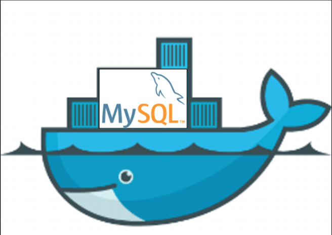

## 

##                                                 在docker中使用MySQL数据库

​                                                                                              

bboysoul

2018-04-20 21:47:44

浏览9038

- ​                             [linux](https://yq.aliyun.com/tags/type_blog-tagid_10/)                         
- ​                             [docker](https://yq.aliyun.com/tags/type_blog-tagid_72/)                         
- ​                             [mysql](https://yq.aliyun.com/tags/type_blog-tagid_389/)                         
- ​                             [Oracle](https://yq.aliyun.com/tags/type_blog-tagid_424/)                         
- ​                             [WordPress](https://yq.aliyun.com/tags/type_blog-tagid_566/)                         
- ​                             [数据库](https://yq.aliyun.com/tags/type_blog-tagid_611/)                         
- ​                             [镜像](https://yq.aliyun.com/tags/type_blog-tagid_713/)                         
- ​                             [容器](https://yq.aliyun.com/tags/type_blog-tagid_985/)                         
- ​                             [Server](https://yq.aliyun.com/tags/type_blog-tagid_1347/)                         
- ​                             [Bash](https://yq.aliyun.com/tags/type_blog-tagid_2850/)                         



### 概述

我是一直想把所有的程序都跑在docker里面，这样一方面是为了便于管理，另外一方面也可以增强自己对docker的理解，所以今天我就想学习一下最重要的数据库部分

### 让mysql数据库在docker下跑起来

首先就是pull镜像下来了
`docker pull mysql:5.6`
从上面看出，我是使用了5.6版本的mysql，实际上是5.6.40，在pull镜像的时候我推荐加上镜像的tag，少用latest标签
之后就是让他跑起来
`docker run --name mysql -e MYSQL_ROOT_PASSWORD="woyaoxuehuilinux" -d mysql:5.6`
解释一下上面的参数run就是运行docker镜像的命令，--name就是给容器取个名字叫mysql，-e就是设置容器里的环境变量，我们设置了mysql的密码环境变量，这个变量会传入容器里面来设置mysql的密码，-d就是把容器运行在后台，后面加的就是镜像的名字了

### pull一个wordpress镜像，让它连接mysql容器

在pull wordpress镜像之前，我们先做一个实验，首先我们先看一下当前mysql容器的ip，我们可以输入下面的命令查看mysql容器现在的ip
`sudo docker inspect 7c6a577b0d51`
输出可能有点多，那么我们就过滤一下，输入下面的命令
`sudo docker inspect 7c6a577b0d51 |grep IPAddress`

```
  ~ sudo docker inspect 7c6a577b0d51 |grep IPAddress
            "SecondaryIPAddresses": null,
            "IPAddress": "172.17.0.3",
                    "IPAddress": "172.17.0.3",
```

可以看到ip是172.17.0.3，如果我们把这个容器停止了删除了，再用这个镜像去生成一个容器，ip地址还会是这个吗？ip是肯定会变的，但是我们的应用是不允许数据库的ip变来变去的，不然就会连接不上了，所以我们怎么做才可以让数据库在变了ip的情况下还可以始终和应用连接着呢?docker其实完美提供了解决方案，首先我们pull下wordpress，作为我们的应用
`docker pull wordpress:4.9.5-php5.6-apache`
之后运行起来
`docker run --name wordpress --link mysql:mysql -p8080:80 -d wordpress:4.9.5-php5.6-apache`
解释一下参数--link,--link其实就是docker把两个容器之间建立连接，实际上就是修改容器中hosts文件来达到这种效果的，简单来说，我应用连接数据库ip可能会变，但是我的域名是不会变的把，那么我应用就使用数据库的域名来连接

```
root@e323ea2a7f99:/var/www/html# cat /etc/hosts 
127.0.0.1    localhost
::1    localhost ip6-localhost ip6-loopback
fe00::0    ip6-localnet
ff00::0    ip6-mcastprefix
ff02::1    ip6-allnodes
ff02::2    ip6-allrouters
172.17.0.3    mysql 81322690e4f7
172.17.0.4    e323ea2a7f99
```

如果你想退出docker容器那么输入ctrl+d，之后你就可以访问服务器的8080端口来访问wordpress了

### 如果容器挂了数据库不就没了？

如标题，我们的容器如果删了，那么我们的数据不就也没有了，那么有没有一种方法把容器中的数据存在容器外面，有，我们换一种方式来运行mysql容器
首先在本地新建一个文件夹用来存放mysql的数据文件
`mkdir /data`
之后用下面的命令来运行容器
`docker run --name mysql-data -v /data:/var/lib/mysql -e MYSQL_ROOT_PASSWORD="woyaoxuehuilinux" -d mysql:5.6`
-v的意思就是把容器中的目录和宿主机中的目录做映射，我们只要把容器中mysql的数据目录映射到本地，将来就算这个容器被删除了，那么数据也还是在本地对吧，同样的，我们新建一个wordpress容器连接上mysql容器，这样会在mysql数据库中新建一个wordpress数据库
`docker run --name wordpress-data --link mysql-data:mysql -p 8080:80 -d wordpress:4.9.5-php5.6-apache`
之后登录数据库检查一下数据库是不是创建成功

```
  ~ docker exec -it b3fdafa94f56 /bin/bash
root@b3fdafa94f56:/# mysql -uroot -p
Enter password: 
Welcome to the MySQL monitor.  Commands end with ; or \g.
Your MySQL connection id is 2
Server version: 5.6.39 MySQL Community Server (GPL)

Copyright (c) 2000, 2018, Oracle and/or its affiliates. All rights reserved.

Oracle is a registered trademark of Oracle Corporation and/or its
affiliates. Other names may be trademarks of their respective
owners.

Type 'help;' or '\h' for help. Type '\c' to clear the current input statement.

mysql> show databases;
+--------------------+
| Database           |
+--------------------+
| information_schema |
| mysql              |
| performance_schema |
| wordpress          |
+--------------------+
4 rows in set (0.00 sec)

mysql> 
```

没错创建成功了

```
  ~ ls /data 
auto.cnf  ib_logfile0  ib_logfile1  ibdata1  mysql  performance_schema  wordpress
```

宿主机中的/data目录也有wordpress这个目录
之后我们访问ip:8080来安装wordpress并且发布一篇文章
完成之后删除mysql-data这个容器
`docker stop mysql-data`
`docker rm mysql-data`
这个时候访问一下我们的wordpress网站，发现报错
`Error establishing a database connection`
说明数据库是彻底的挂了
接着我们重新生成容器
`docker run --name mysql-data -v /data:/var/lib/mysql -e MYSQL_ROOT_PASSWORD="woyaoxuehuilinux" -d mysql:5.6`
网站是不是又可以访问了呢？而且docker容器启动很快，如果即使发现就可以在几分钟的时间去完成应用的恢复

### 使用容器中的客户端去连接别的mysql数据库

有时候docker容器还有一个更好玩的地方，比如我有一天突然要远程连接一台远程的mysql服务器，但是我本地没有mysql的客户端怎么办？不怕，docker帮助你，首先我们要知道远程的MySQL服务器的ip，比如我选择的是容器中的mysql，ip是172.17.0.3

```
docker run -it --rm mysql:5.6 mysql -h172.17.0.3 -uroot -p 
  ~ docker run -it --rm mysql:5.6 mysql -h172.17.0.3 -uroot -p 
Enter password: 
Welcome to the MySQL monitor.  Commands end with ; or \g.
Your MySQL connection id is 8
Server version: 5.6.39 MySQL Community Server (GPL)

Copyright (c) 2000, 2018, Oracle and/or its affiliates. All rights reserved.

Oracle is a registered trademark of Oracle Corporation and/or its
affiliates. Other names may be trademarks of their respective
owners.

Type 'help;' or '\h' for help. Type '\c' to clear the current input statement.

mysql> show databases;
+--------------------+
| Database           |
+--------------------+
| information_schema |
| mysql              |
| performance_schema |
| wordpress          |
+--------------------+
4 rows in set (0.00 sec)

mysql> 
```

上面的--rm的意思就是当容器运行结束之后就自动删除 

还有一种连接方法，你可以想一下，两个都是容器，那么就没有一种更简单的方法去连接吗？，实际上真的有，我们上面说了--link我们可以这样做
`docker  run -it --link mysql-data:mysql --rm mysql:5.6 sh -c 'exec mysql  -h"$MYSQL_PORT_3306_TCP_ADDR" -P"$MYSQL_PORT_3306_TCP_PORT" -uroot  -p"$MYSQL_ENV_MYSQL_ROOT_PASSWORD"'`

你只要回车，连密码吗都可以不用输入，就是命令有点长，所以当你知道mysql密码的时候，推荐使用第一种，如果你不知道那么第二种比较方便

欢迎关注Bboysoul的博客[www.bboysoul.com](https://yq.aliyun.com/go/articleRenderRedirect?url=http://www.bboysoul.com/)
Have Fun

​                                  本文为云栖社区原创内容，未经允许不得转载，如需转载请发送邮件至yqeditor@list.alibaba-inc.com；如果您发现本社区中有涉嫌抄袭的内容，欢迎发送邮件至：yqgroup@service.aliyun.com                                 进行举报，并提供相关证据，一经查实，本社区将立刻删除涉嫌侵权内容。                             

